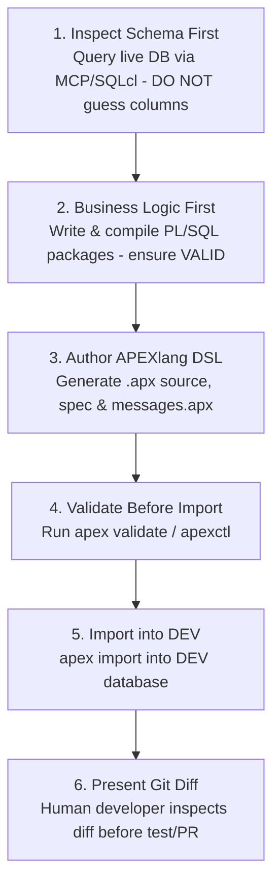

# Oracle APEXlang DSL: AI-Driven APEX Application Generation

This skill guides generating production-ready Oracle APEX applications, pages, shared components, and dynamic actions using Oracle's official **APEXlang** declarative Domain Specific Language (`.apx` files), SQLcl MCP Server integration, and the **AI Vibe-Coding Loop**.

> [!NOTE]
> **Official Oracle Documentation:**
> Refer to the canonical [Oracle APEX 26.1 APEXlang Reference Manual](https://docs.oracle.com/en/database/oracle/apex/26.1/apxln/) for authoritative grammar specifications, AST nodes, and CLI compiler flags.

---

## 1. The Modern APEX Vibe-Coding Architecture

```text
VS Code (Host Environment)
 ├── Antigravity AI / Claude Code extension     (AI Agent generating source & driving SQLcl)
 ├── Oracle SQL Developer extension             (Human DB browsing & connection manager)
 └── Git                                        (Version control, diff review & PRs)

SQLcl 26.1+
 ├── APEXlang compiler                          (apex validate / apex import / apex export)
 ├── SQLcl Projects                             (export / stage / release / gen-artifact)
 └── MCP Server (sql -mcp)                      (Controlled DB access restricted to DEV)
               │
               ▼
Oracle AI Database 23ai / 26ai (DEV)
 ├── Oracle APEX 26.1 Application Runtime
 └── ORDS 26.1+ (Serves app + REST APIs; REST-enabled schema required)
```

### 1.1 Why SQLcl & MCP is the Mandatory Canonical AI Driver (Rationale)

The pairing of **SQLcl and its Model Context Protocol (MCP) server (`sql -mcp`)** is the platform's mandatory architectural backbone for AI-driven development:

1. **Live Schema Grounding (Zero Hallucination Guarantee):**
   - Through `sql -mcp`, the AI agent queries live dictionary metadata (`USER_TAB_COLUMNS`, `USER_CONSTRAINTS`, `USER_PROCEDURES`) before drafting UI or PL/SQL code. The agent never guesses column names or types.
2. **Authoritative APEXlang Compiler & Parser:**
   - SQLcl 26.1+ is the canonical compiler for APEXlang (`apex validate`, `apex import`, `apex export`). The AI agent invokes validation tools via MCP to verify EBNF syntax before deploying to the database.
3. **Enterprise Security Sandbox (`SQLCL_RESTRICTION_LEVEL=1`):**
   - The MCP server isolates the AI agent's actions strictly to the DEV database schema, preventing unauthorized command execution on the host operating system.
4. **Clean Division of Responsibility:**
   - **AI Agent:** Generates declarative `.apx` DSL and PL/SQL packages, driving SQLcl via MCP.
   - **Human Developer:** Browses tables, views, and execution plans using **Oracle SQL Developer for VS Code**, reviewing clean Git diffs before production deployment.

---

## 2. Direct vs. Indirect Generation & "Low-Code as Code"

*(Inspired by Justin Miller, Kris Rice & Cristina Varas)*

Low-code development is transitioning from visual drag-and-drop Page Designer sessions into **"Low-Code as Code"** — a versionable, automatable, AI-assisted engineering workflow where full enterprise applications are built without dragging a single component.

> [!TIP]
> **The Intent-Driven Abstraction Engine ("Generate what you want to own, own what you generate"):**
> - **Direct Generation (Fragile):** LLM generates 10,000s of lines of raw imperative full-stack glue (React, Node, custom session managers). Every line of generated glue code must be owned and maintained by your team. Six months later, dependencies rot, security CVEs emerge, and framework churn forces expensive rewrites.
> - **Indirect Generation (APEXlang + APEX Engine):** LLM generates **10–50 lines of declarative intent** (`.apx` DSL). The battle-tested **Oracle APEX Implementation Engine** provides automatic session state protection, concurrency, authentication, accessibility, and UI rendering. Engine upgrades preserve application code without requiring a single line of refactoring.
> - **Governed Input vs. Governed Runtime (Kris Rice Principle):**
>   - **Parse-Time EBNF Guardrails:** The LLM emits declarative definitions constrained by a versioned EBNF grammar. Invalid syntax fails at parse time before touching the database.
>   - **Kernel-Level Security:** SQL injection is eliminated by automatic bind variables; Row-Level Security (RLS) and Virtual Private Database (VPD) policies reside in the database kernel and can never be bypassed by AI prompts.
> - **The "Edit–Validate–Import" Engineering Loop:**
>   1. **Edit:** Author/refactor `.apx` files in VS Code with AI.
>   2. **Validate:** Verify AST & schema compliance using `apex validate` / `apexctl` before touching the DB.
>   3. **Import:** Deploy into DEV via `apex import` in seconds with zero GUI drag-and-drop.
> - **Result:** 100x higher architectural correctness, 1000x higher human readability in Git diffs, and sustainable long-term enterprise lifecycle management (LCM).

---

## 3. The 6-Stage AI Vibe-Coding Loop

When designing, building, or modifying an APEX application, the AI agent must strictly follow the **6-Stage Vibe-Coding Loop**:



### Stage Rules & Invariants:
1. **"Inspect First" Rule:** Never hallucinate column names or table schemas. Query the live database first via MCP (`DESCRIBE <table_name>`, `DBA_TAB_COLUMNS`).
2. **"Business Logic First" Rule:** Compile and test PL/SQL packages (`.pks`/`.pkb`) in the database before building the UI. Check `USER_ERRORS` and assert status is `VALID`.
3. **"Declarative UI" Rule:** Express all UI in APEXlang DSL (`.apx` files) following the application spec (`.apexlang/application-spec.md`).
4. **"Validate Before Import" Rule:** Always run `node tools/apexctl.mjs apexlang validate --app-path <path>` (or `apex validate`) before sending code to the database. Fix all compiler diagnostics in code.
5. **"Safe Import to DEV":** Import the validated app into the local DEV database (`apex import` or `./scripts/internal/deploy-apex-apps.sh`).
6. **"Git Diff Review":** Hand a clean Git diff to the human developer for review and testing.

---

## 3. Directory Layout of an APEXlang Application

```text
applications/<app_name>/
├── .apexlang/
│   └── application-spec.md         # Generated composition and UX plan
├── application.apx                 # Application identity, auth, theme, parsing schema
├── pages/
│   ├── page-0001.apx               # Home / Dashboard page
│   ├── page-0010.apx               # Interactive Grid / Report
│   └── page-0011.apx               # Modal Form / Drawer
└── shared-components/
    ├── navigation.apx              # Top navigation menu entries
    ├── breadcrumbs.apx             # Breadcrumb tree and hierarchies
    ├── lists_of_values.apx         # Dynamic and static LOV definitions
    └── messages.apx                # Multi-language translation strings
```

---

## 4. Multi-Language Invariant (`messages.apx` + `&APP_TEXT$`)

> [!IMPORTANT]
> **Zero Hardcoded Text in Component Attributes:**
> Do NOT insert hardcoded language strings directly into button labels, region titles, or column headers. All user-facing strings must use `shared-components/messages.apx` and `&APP_TEXT$KEY.` substitution macros (supporting 🇬🇧 EN, 🇪🇪 ET, 🇫🇮 FI, 🇸🇪 SV, 🇱🇻 LV, 🇱🇹 LT).

### `shared-components/messages.apx`:
```apx
sharedComponents.messages {
  message APP_TITLE {
    en: "DevOps Command Center"
    et: "DevOps Juhtimiskeskus"
    fi: "DevOps-Ohjauskeskus"
    sv: "DevOps Kontrollcenter"
    lv: "DevOps Vadības Centrs"
    lt: "DevOps Valdymo Centras"
  }
  message BTN_CREATE_ORDER {
    en: "Create Order"
    et: "Lisa Uus Tellimus"
    fi: "Luo Uusi Tilaus"
    sv: "Skapa Ny Order"
    lv: "Izveidot Pasūtījumu"
    lt: "Sukurti Užsakymą"
  }
}
```

### Component Reference in `pages/page-0010.apx`:
```apx
page 10 {
  title: "&APP_TEXT$APP_TITLE."
  regions {
    region orders_grid {
      title: "&APP_TEXT$ORDERS_REGION_TITLE."
      type: "Interactive Grid"
      source: "SELECT * FROM orders_v"
      buttons {
        button btn_create {
          label: "&APP_TEXT$BTN_CREATE_ORDER."
          action: "Redirect to Page in this Application"
          target: page 11
        }
      }
    }
  }
}
```

---

## 5. UI Architecture & Master-Detail Contracts

1. **Breadcrumb Hierarchy:**
   - Every non-modal user page must have a matching breadcrumb entry wired to `shared-components/breadcrumbs.apx`.
   - Child pages launched from a management hub or contextual report must explicitly declare their parent:
     `appearance { parentEntry: @breadcrumb.orders_hub }`.
2. **Master-Detail Context Propagation:**
   - Parent row selection must populate a hidden page item (`P10_SELECTED_ORDER_ID`) and refresh child regions via a **Dynamic Action** (`action: "Refresh Region"`).
   - **Prohibited:** Never refresh master-detail child regions by redirecting/reloading the full page via URL.
3. **Form Dialogs & Drawers:**
   - Create and edit forms should default to **Modal Dialog** or **Drawer** (`pageMode: "Modal Dialog"`).
   - Dialog close event triggers a Dynamic Action on the parent page to refresh the grid:
     `event: "Dialog Closed" -> action: "Refresh Region"`.

---

## 6. Automated Validation & Deployment CLI

```bash
# 1. Format and lint APEXlang files:
node .agents/skills/apexlang/tools/apexctl.mjs apexlang format --app-path applications/devhub
node .agents/skills/apexlang/tools/apexctl.mjs apexlang validate --app-path applications/devhub

# 2. Deploy compiled APEX application to target database:
./scripts/internal/deploy-apex-apps.sh
```
