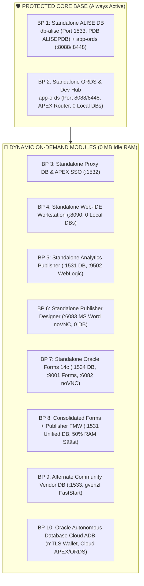

# Architecture Blueprints & Dynamic Port Topology Engine

This skill guides selecting, resolving, and orchestrating the **9 canonical architecture blueprints** (`config/blueprints/.env.<N>-*`), enforcing Core Base protection, resolving dynamic multi-database port topologies, and guaranteeing zero-database standalone component execution without memory leaks or static fallbacks.

---

## 1. The 9 Modular Building Blocks Architecture

The platform architecture is structured around **9 pure modular building blocks** that balance maximum resource efficiency (0 MB idle RAM) with enterprise isolation:



### Modular Matrix Overview (10 Canonical Blueprints):

| Blueprint | Name | Primary Profile YAML | Running Containers | Ports | Target Domain |
| :--- | :--- | :--- | :--- | :--- | :--- |
| **BP 0** | **Central SSO/ORDS Gateway** | `config/blueprints/.env.0-default-proxy-ords` | `db-proxy`, `app-ords` | `1532, 8088, 8448` | **Permanent Central Gateway.** Central ORDS, Azure SSO, and multi-DB routing. |
| **BP 1** | **Standalone ALISE DB** | `config/profiles/databases/db-oracle.yaml` | `db-alise` | `1533` | **Business DB Base.** Primary business schemas, PL/SQL, APEX. Uses central ORDS from BP 0. |
| **BP 2** | **Standalone Web Gateway** | `config/profiles/ords/ords-image.yaml` | `app-ords` | `8088, 8448` | **Protected Gateway Only.** Central APEX router & Dev Hub (0 local DBs). |
| **BP 3** | **Proxy DB & SSO** | `config/profiles/databases/db-oracle.yaml` | `db-proxy`, `app-ords` | `1532, 8088` | Isolated APEX Proxy, Azure Entra ID SSO gateway, public REST. |
| **BP 4** | **Web-IDE Workstation** | `config/profiles/web-ide/web-ide-standard.yaml` | `web-ide-dev` | `8090` | Browser VS Code Web IDE, Oracle SQL Developer (0 local DBs). |
| **BP 5** | **Analytics Publisher** | `config/profiles/databases/db-oracle.yaml` | `db-publisher`, `app-publisher` | `1531, 9502` | Analytics Publisher 2025 (Pixel-Perfect) & dedicated RCU DB. |
| **BP 6** | **Publisher Designer** | `docker/publisher-designer/Dockerfile` | `app-publisher-designer` | `6083` | MS Word + BI Publisher Desktop plugin via browser noVNC (0 DB). |
| **BP 7** | **Oracle Forms 14c** | `config/profiles/databases/db-oracle.yaml` | `db-forms`, `app-forms` | `1534, 9001, 6082`| Forms 14c Services, Builder GUI noVNC, and Forms RCU DB. |
| **BP 8** | **Consolidated FMW** | `config/profiles/databases/db-oracle.yaml` | `db-publisher`, `app-forms-publisher` | `1531, 9001, 9502` | Unified WebLogic domain saving 2.5 GB RAM. |
| **BP 9** | **Vendor FastStart DB** | `config/profiles/databases/db-gvenzl.yaml` | `db-alise` | `1533` | Pre-seeded community image for comparative benchmarking. |
| **BP 10** | **Cloud Autonomous DB** | `config/profiles/databases/db-adb.yaml` | (Remote ADB) | Cloud mTLS | Oracle Autonomous Database Cloud (ADB Serverless) with mTLS Wallet. |

---

## 2. Protected Core Base & Dynamic On-Demand Control

To prevent high RAM consumption and container proliferation, the platform operates on two operational tiers:

1. **Protected Core Base (`db-alise` + `app-ords`):**
   - Must remain active during regular development.
   - Accidental termination via `./scripts/module-toggle.sh stop alise` or `stop ords` is **strictly blocked** by the Core Protection contract.
2. **On-Demand Dynamic Modules (Modules 3–9):**
   - Started and stopped dynamically without restarting the platform.
   - When not in active use, idle memory consumption is **0 MB RAM**.
   - Controlled via CLI or Dev Hub 1-Click GUI:
     ```bash
     ./scripts/module-toggle.sh start web-ide
     ./scripts/module-toggle.sh stop web-ide
     ./scripts/module-toggle.sh start designer
     ./scripts/module-toggle.sh status
     ```

---

## 3. The Zero-Database Standalone Component Invariant

When running standalone application blueprints that do not define a database (e.g., **BP 2 Standalone ORDS** or **BP 4 Standalone Web-IDE**):

1. **Zero Database Discovery (Positive Profile Declarations):**
   - Blueprints declare only what they need (e.g. `PUBLISHER_DESIGNER_PROFILE=publisher-designer-standard` or `WEB_IDE_PROFILE=web-ide-standard`).
   - Declaring `MAIN_DB_PROFILE=NONE` or `DB_*=NONE` is **not required**. The absence of database profile declarations automatically instructs the engine that 0 databases are needed.
   - `get_active_db_instances` MUST return an empty list (`0` databases), and `load_db_profile` must set `DB_ENABLED=false`.
   - **PROHIBITED:** Falling back to a hardcoded database (e.g., `db-apex-proxy` or `db-oracle`). Never fabricate database instances when none are declared in `.env`.
2. **Step Skipping Invariant in `setup-all.sh`:**
   - **Step 4 (Database Healthcheck):** Skipped (`0s`).
   - **Step 4.5 (SEPS Wallet Configuration):** Database wallet generation skipped.
   - **Step 6 (APEX Engine Installation):** SKIPPED (`STATUS_SKIPPED`). No APEX installation is attempted because there is no target local database.
   - **Step 7 (Database Migrations):** SKIPPED (`STATUS_SKIPPED`).
3. **Application Lifecycle & Custom JIT Images:**
   - Only the declared application services (e.g., `app-ords`, `web-ide-dev`, or `app-publisher-designer`) are started.
   - For custom local images (`build_local: true`), orchestration checks `podman image exists` and compiles the Dockerfile Just-In-Time if the image is missing from the local store.

---

## 4. Environment Sanitization & Variable Leakage Prevention

When switching between blueprints (e.g. from `-tb 1` to `-tb 2` or via `-b <N>`):

1. **Mandatory Environment Reset (`sanitize_blueprint_environment`):**
   - Shell variables from previous blueprints MUST BE UNSET before sourcing the new `.env` file:
     ```bash
     unset DB_ALISE DB_PROXY DB_PUBLISHER DB_FORMS DB_CICD DB_LIS DB_INFRA
     unset MAIN_DB_PROFILE PROFILE_NAME PROFILE_DB_PORT PROFILE_DEFAULT_SERVICE
     unset PROFILE_APEX_ENABLED PROFILE_APEX_VERSION PROFILE_APEX_WORKSPACE
     unset PROFILE_CONTAINER_NAME PROFILE_CONTAINER_PORT PROFILE_CONTAINER_IMAGE
     unset ORDS_PROFILE WEB_IDE_PROFILE PUBLISHER_PROFILE FORMS_PROFILE
     unset PUBLISHER_DESIGNER_PROFILE FORMS_PUBLISHER_PROFILE
     unset SKIP_PUBLISHER SKIP_FORMS SKIP_WEB_IDE SKIP_ORDS SKIP_PUBLISHER_DESIGNER
     unset APEX_DB_HOST APEX_DB_PORT APEX_DB_SERVICE APEX_DB_SID APEX_DB_PDB
     ```
2. **Single Source of Truth Precedence:**
   - Values in `$WORKSPACE_DIR/.env` always override previous in-memory environment variables.
   - `generate-compose-override.sh` must parse `.env` strictly and generate `services: {}` when no databases or services are declared.

---

## 5. Dynamic Topology & Port Conflict Resolver (`resolve-topology.sh`)

When multiple databases or services run concurrently, ports are resolved dynamically without collision:

| Component | Default Host Port | Internal Container Port | Allocation Rules |
| :--- | :---: | :---: | :--- |
| **Proxy Database (`db-proxy`)** | `1532` | `1522` / `1521` | Standard 2-layer gateway DB. |
| **ALISE Database (`db-alise`)** | `1533` | `1521` | Business application DB (ALISEPDB). |
| **Publisher Dedicated DB (`db-publisher`)** | `1535` | `1521` | Analytics Publisher RCU DB. |
| **Forms Dedicated DB (`db-forms`)** | `1536` | `1521` | Forms 14c RCU DB. |
| **Unified FMW DB (`db-forms-publisher`)** | `1535` | `1521` | Shared RCU DB for Forms + Publisher. |
| **ORDS HTTP / HTTPS Gateway** | `8088` / `8448` | `8088` / `8448` | APEX, Database Actions, Dev Hub router. |
| **Dev Hub Local Bridge Server** | `8089` | Host Process | Lightweight HTTP bridge for 1-click container toggling. |
| **Web IDE Port** | `8090` / `8449` | `8443` | Browser-based VS Code IDE (`code-server`). |
| **Forms Runtime / Forms Builder noVNC** | `9001` / `6082` | `9001` / `6080` | Forms Servlet & HTML5 noVNC builder workstation. |
| **Publisher Web UI / Designer noVNC** | `9502` / `6083` | `9502` / `6080` | Pixel-Perfect `/xmlpserver` & MS Word Designer noVNC. |

---

## 6. CLI Execution Modes & Testing Commands

```bash
# 1. Idempotent Production/Dev Deployment (preserves data volumes):
./scripts/setup-all.sh -b 1
./scripts/setup-all.sh -b 2

# 2. Automated Clean-Slate Testing (-tb / --test-blueprints):
./scripts/setup-all.sh -tb 1
./scripts/setup-all.sh -tb 2

# 3. List Blueprint Catalog:
./scripts/setup-all.sh -lb

# 4. Inspect Blueprint Details & Planned Containers:
./scripts/blueprint-info.sh 2

# 5. Real-World Live Container Verification Suite:
./tests/test-containers-live.sh
```

---

## 7. Clean Blueprint & YAML Profile Single Source of Truth Principle (Rule 11)

1. **Ultra-Clean Blueprints (`config/blueprints/.env.*`):**
   - Blueprints only declare high-level profile references (`DB_ALISE=db-alise-oracle`, `ORDS_PROFILE=ords-image`).
   - Blueprints **MUST NEVER** contain database passwords, port numbers, usernames, or low-level container configurations.
2. **Domain Encapsulation in YAML Profiles (`config/profiles/**/*.yaml`):**
   - 100% of domain specifics, ports, PDB services, tablespaces, and user roles reside exclusively in YAML profiles.
3. **Zero Hardcoded Fallbacks in Code:**
   - Scripts dynamically query `get_active_db_instances` and `load_db_profile`.
   - Never inject synthetic database containers (`db-apex-proxy`) when a blueprint intentionally defines 0 databases.

---

## 8. Decoupled ORDS Architecture & Autonomous Database (ADB) Rules

1. **Decoupling DB & Web Server:**
   - In database profiles (`config/profiles/databases/*.yaml`), `ords.enabled: true` indicates that database-side ORDS schemas/objects should be prepared. It **does NOT** start an `app-ords` container.
   - The `app-ords` container is only provisioned when `ORDS_PROFILE` is declared in the blueprint (e.g. `ORDS_PROFILE=ords-image`).
2. **Permanent Central ORDS Gateway (`env0`):**
   - Blueprint 0 (`config/blueprints/.env.0-default-proxy-ords`) serves as the permanent central gateway.
   - When deploying standalone databases (BP 1, BP 9, etc.), if central ORDS (`app-ords`) is running, database connection pools (`<pool_name>.xml`) are automatically created and hot-reloaded into central ORDS.
3. **The 3 Canonical ORDS Profiles (`config/profiles/ords/`):**
   - `ords-image.yaml`: Prebuilt official Oracle container image (`container-registry.oracle.com/database/ords:latest`).
   - `ords-local-custom.yaml`: Host custom script installer using official zip packages unpacked in ephemeral container.
   - `ords-remote-custom.yaml`: Remote server install via SSH/automation.
4. **Oracle Autonomous Database (ADB) Invariant:**
   - In `db-adb.yaml`, `install_in_db: false` prevents destructive ORDS schema modifications in cloud environments where ORDS is managed by Oracle Cloud infrastructure.
   - When `verify_version_match: true`, the platform verifies version parity between the central ORDS container and cloud ADB before registering pools.
5. **No ORDS Server Guidance UX:**
   - If no ORDS server is configured or running, CLI tools (`scripts/setup-all.sh`, `scripts/check-urls.sh`) output clear yellow guidance instructing the developer how to spin up the central gateway:
     `./scripts/setup-all.sh --b 0` or add `ORDS_PROFILE=ords-image`.

---

## 9. Cross-Platform Dynamic Memory & Cgroups Resource Limiter Contract (Windows / macOS / Linux)

To safeguard developer workstations against total freezes and Out-Of-Memory (OOM) killer terminations:
1. **Dynamic Real-Time Available Memory Inspection:**
   - Memory must be inspected before launching or adding new blueprints, measuring live free RAM across platforms:
     - **Windows Native (PowerShell / CIM):** `powershell.exe -NoProfile -Command "(Get-CimInstance Win32_OperatingSystem).FreePhysicalMemory"`
     - **Linux & WSL2:** `/proc/meminfo` (`MemAvailable` and `MemTotal`)
     - **macOS:** `sysctl hw.memsize` and `vm_stat` (free + inactive memory pages)
     - **Running Containers:** `podman stats --no-stream --format "{{.MemUsage}}"` (cross-platform live memory consumption).
2. **The 2.0 GB Safety Buffer Threshold:**
   - If available RAM drops below **2048 MB (2.0 GB)** or is insufficient to accommodate the target blueprint's required memory budget, deployment MUST BE HALTED with `RES_INSUFFICIENT_RAM`.
   - Prevents unresponsive system locks during concurrent multi-database operations. Overridable only with `--force`.

---

## 10. Duplicate Blueprint Prevention Contract (`STATUS_ALREADY_ACTIVE`)

1. **Idempotent Active Detection:**
   - If a developer requests activation of a blueprint that is already running healthy (`podman ps`), the engine must NOT re-execute destructive initializations or spawn duplicate processes.
   - Outputs a clear green notification: `STATUS_ALREADY_ACTIVE`.
2. **Disambiguated Multi-Instance Scaling:**
   - If the developer legitimately requires running two parallel instances of the same service (e.g. two ALISE databases), they MUST create a distinct numbered blueprint (e.g. `config/blueprints/.env.12-second-alise`) with unique container names and decoupled port allocations.

---

## 11. Incremental Multi-Stack Composition & Env 0 Baseline Contract

1. **Always Start with Blueprint 0 (`.env.0-default-proxy-ords`):**
   - Blueprint 0 (`db-proxy` on 1532, `app-ords` on 8088/8448) is the permanent Core Base.
   - All incremental testing begins by establishing Blueprint 0 as the healthy baseline.
2. **Incremental Local Addition (BP 1 to BP 9):**
   - Adding a new blueprint (e.g., BP 1 `db-alise`, BP 4 `web-ide-dev`, BP 6 `app-publisher-designer`) MUST NOT tear down or stop previously running containers.
   - Total active containers must strictly equal the union of containers defined in the combined blueprints. Zero ghost containers allowed.
3. **Exclusion of Remote Cloud Blueprints (BP 10 & BP 11):**
   - The last two blueprints—**BP 10 (Cloud Autonomous Database)** and **BP 11 (Remote Publisher)**—are cloud/remote targets without local database containers.
   - They are explicitly excluded from local container addition and resource pressure tests.

---

## 12. Maximum 12-Hour Execution SLA & Timeout Contract

1. **Global Suite Timeout (43,200s / 12 Hours):**
   - End-to-end multi-blueprint verification runs must never run unbounded or leave orphaned background tasks.
   - A global timer of 12 hours is strictly enforced.
2. **Graceful Emergency Abort:**
   - If the 12-hour mark is reached, the suite executes an immediate graceful emergency stop: stops non-core dynamic containers, preserves Core Base (BP 0), and flushes all benchmarks and interim pass/fail results to `tests/reports/` and `metrics/`.

