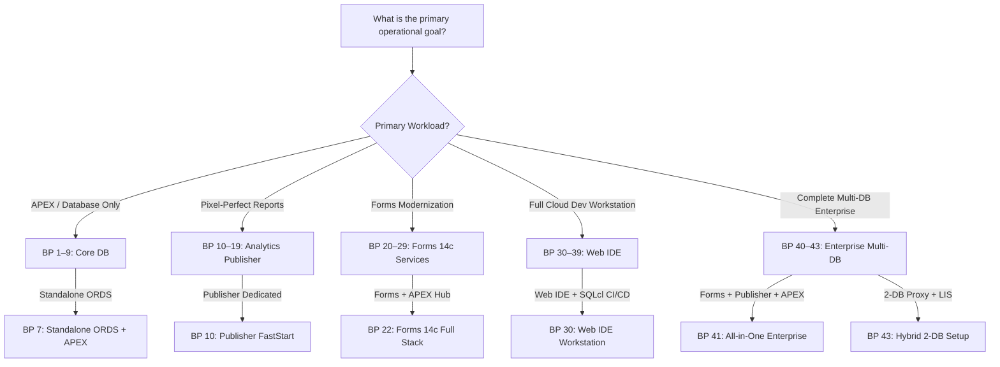

# Architecture Blueprints & Dynamic Port Topology Engine

This skill guides selecting, resolving, and orchestrating the **23 canonical architecture blueprints** (`config/blueprints/.env.<N>-*`) and resolving dynamic multi-database port topologies without collisions.

---

## 1. The 5-Series Blueprint Decision Matrix

| Series | Blueprints | Architecture Domain | Target Use Cases & Included Components |
| :---: | :---: | :--- | :--- |
| **1–9** | `1` – `9` | **Core Database & APEX** | Single-database and light developer setups (Oracle Free DB, Autonomous DB, ORDS, APEX Builder). |
| **10–19** | `10` – `19` | **Analytics Publisher** | Pixel-Perfect reporting, XML/PDF batch printing, RCU metadata database, and Publisher REST API. |
| **20–29** | `20` – `29` | **Oracle Forms 14c Services** | Oracle Forms 14.1.2 Runtime, HTML5 noVNC Forms Builder GUI (`6082`), and APEX migration bundles. |
| **30–39** | `30` – `39` | **Web IDE & CI/CD** | Containerized VS Code Web IDE, Oracle SQL Developer Extension, Antigravity AI, and offline GitHub Actions `act` runner. |
| **40–43** | `40` – `43` | **Enterprise Hybrid Multi-DB** | Multi-DB enterprise topologies (e.g. BP 41: All-in-One Enterprise, BP 43: Hybrid 2-DB Proxy + LIS). |

---

## 2. Decision Tree for Selecting a Blueprint



---

## 3. Dynamic Topology & Port Conflict Resolver (`resolve-topology.sh`)

When multiple databases or services are running, ports must be calculated dynamically without collisions:

| Component | Default Base Port | Offset Rules & Secondary DB Allocation |
| :--- | :---: | :--- |
| **Primary Database (`db-proxy`)** | `1532` | Standard container DB port (`1521` internal $\rightarrow$ `1532` host). |
| **Secondary Database (`db-lis`)** | `1533` | Incremented automatically if port `1532` is busy. |
| **Publisher / Forms Database** | `1534` | Incremented automatically if port `1533` is busy. |
| **Primary ORDS HTTPS / HTTP** | `8448` / `8088` | Main APEX / Database Actions gateway. |
| **Standalone ORDS HTTPS / HTTP** | `8445` / `8085` | Embedded standalone ORDS pool gateway. |
| **Analytics Publisher HTTP / HTTPS** | `9502` / `9503` | Pixel-Perfect UI (`/xmlpserver`) and REST API. |
| **Forms Runtime / WebLogic / noVNC** | `9001` / `7001` / `6082` | Forms Servlet, AdminServer, and HTML5 Web GUI. |
| **Web IDE Port** | `8090` | Browser-based VS Code IDE. |

---

## 4. CLI Execution Modes

1. **Idempotent Deployment (`-b <N>` / `--blueprint <N>`):**
   - Preserves existing data volumes (`oradata`).
   - Reconfigures containers and routes to the selected blueprint instantly:
     ```bash
     ./scripts/setup-all.sh -b 41
     ```
2. **Matrix Regression Testing (`-tb <LIST|all>` / `--test-blueprints`):**
   - Automatically cleans slate (`reset-all.sh -y`), deploys blueprint, validates endpoints, and collects timing benchmarks into `metrics/setup_benchmarks.json`:
     ```bash
     ./scripts/setup-all.sh -tb 7 10 30 41
     ```
3. **List Blueprint Catalog (`-l` / `--list-blueprints`):**
   - Outputs ASCII table of all 23 blueprints with component matrices without starting containers.
