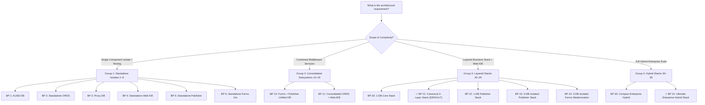

# Architecture Blueprints & Dynamic Port Topology Engine

This skill guides selecting, resolving, and orchestrating the **15 canonical architecture blueprints** (`config/blueprints/.env.<N>-*`) organized in **4 decade-based groups** and resolving dynamic multi-database port topologies without collisions.

---

## 1. The 4-Group Blueprint Decision Matrix

| Decade Group | Blueprints | Architecture Domain | Target Use Cases & Included Components |
| :---: | :---: | :--- | :--- |
| **Group 1 (1–9)** | `1` – `6` | **Standalone Isolates** | Isolated individual components (ALISE DB, ORDS & Dev Hub, Proxy DB, Web IDE, Analytics Publisher, Oracle Forms 14c) for pure component isolation, fast image builds, and isolated unit testing. |
| **Group 2 (10–19)** | `10` – `11` | **Consolidated Subsystems** | Combined components sharing resources (BP 10: Forms 14c + Publisher sharing 1 unified DB saving ~2.5 GB RAM; BP 11: Combined ORDS + Web-IDE). |
| **Group 3 (20–29)** | `20` – `24` | **Layered Enterprise Stacks** | Full layered stacks (BP 20: 1-DB Core; **BP 21: Canonical 2-Layer Default**; BP 22: 1-DB Publisher; BP 23: 3-DB Isolated Publisher Stack; BP 24: 3-DB Isolated Forms Modernization Stack). |
| **Group 4 (30–39)** | `30` – `31` | **Hybrid Enterprise Stacks** | Multi-subsystem hybrid stacks (BP 30: Compact Enterprise; **BP 31: Ultimate Enterprise Hybrid Stack**). |

---

## 2. Decision Tree for Selecting a Blueprint



---

## 3. Dynamic Topology & Port Conflict Resolver (`resolve-topology.sh`)

When multiple databases or services are running, ports must be calculated dynamically without collisions:

| Component | Default Host Port | Offset Rules & Secondary DB Allocation |
| :--- | :---: | :--- |
| **Proxy Database (`db-proxy`)** | `1532` | Standard 2-layer gateway DB port (`1521` internal $\rightarrow$ `1532` host). |
| **ALISE Database (`db-alise`)** | `1533` | Dedicated business application DB port. |
| **Publisher Database (`db-publisher`)** | `1531` | Dedicated or unified Forms & Publisher RCU infrastructure DB. |
| **Forms Database (`db-forms`)** | `1534` | Dedicated Forms RCU DB. |
| **ORDS HTTPS / HTTP Gateway** | `8448` / `8088` | Main APEX / Database Actions / Dev Hub gateway. |
| **Analytics Publisher HTTP** | `9502` | Pixel-Perfect Web UI (`/xmlpserver`) and REST API. |
| **Forms Runtime / WebLogic / noVNC** | `9001` / `7001` / `6082` | Forms Servlet runtime, WebLogic AdminServer, and HTML5 noVNC GUI. |
| **Web IDE Port** | `8090` | Browser-based VS Code IDE (`code-server`). |

---

## 4. CLI Execution Modes

1. **Idempotent Deployment (`-b <N>` / `--blueprint <N>`):**
   - Preserves existing database volumes (`oradata`).
   - Reconfigures containers and routes to the selected blueprint cleanly:
     ```bash
     ./scripts/setup-all.sh -b 21
     ./scripts/deploy-blueprint.sh -b 21
     ```
2. **Matrix Automated Testing (`-tb <LIST|all>` / `--test-blueprints`):**
   - Automatically cleans slate (`reset-all.sh -y`), deploys target blueprint, validates endpoints, and collects benchmarks:
     ```bash
     ./scripts/setup-all.sh -tb 21
     ```
3. **List Blueprint Catalog (`-lb` / `--list-blueprints`):**
   - Outputs formatted ASCII table of all 15 blueprints across 4 groups without starting containers:
     ```bash
     ./scripts/setup-all.sh -lb
     ```
4. **Inspect Blueprint Details (`-sb <N>` / `--show-blueprint <N>`):**
   - Displays container layout, memory requirements, and network topology for a specific blueprint:
     ```bash
     ./scripts/setup-all.sh -sb 21
     ```

