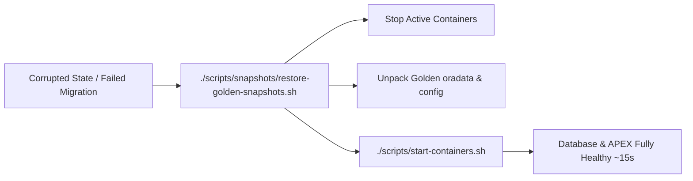

# Golden Snapshots & Instant Disaster Recovery (DR)

This skill guides creating, restoring, and managing **Golden Snapshots** for zero-data-loss, instant (~15-second) recovery of the entire Oracle Free DB, APEX, ORDS, and SEPS Wallet environment.

---

## 1. 🎯 When to Use & Negative Routing

### Positive Triggers (Activate Immediately):
- Reverting database, APEX, ORDS, and credentials to a clean state in ~15 seconds: `./scripts/snapshots/restore-golden-snapshots.sh`
- Creating a snapshot before major migration, schema update, or testing: `./scripts/snapshots/create-golden-snapshots.sh --tag <name>`
- Managing snapshots from Dev Hub Tab 8 or CLI (`clean-golden-snapshots.sh`)
- Discarding corrupted state without doing a 5-8 minute cold rebuild

### Negative Routing (Redirect to Specialized Skills):
| If the task is primarily about... | DO NOT handle here. Route immediately to: |
|:---|:---|
| Cold rebuild from zero (`reset-all.sh` + `setup-all.sh`) | `setup_orchestration` |
| Exporting SQLcl Liquibase changelogs or schema DDLs | `sqlcl_project` |
| Rotating SEPS wallet passwords directly in running DB | `wallet_security_rotation` |
| Container health status or FastStart images | `oracle_containers` |

---

## 2. Golden Snapshot Architecture

A Golden Snapshot captures the atomic state of:
1. **Database Volume:** Persistent database storage (`oradata` block-level directory).
2. **ORDS Configuration:** Active connection pools, URL mappings, and security settings (`config/ords_container/`).
3. **SEPS Wallet & Credentials:** `cwallet.sso`, `ewallet.p12`, and Podman secrets state.
4. **Local Certificates:** Root CA (`localCA.pem`) and SSL/TLS server certificates.

---

## 2. Database Consistency Contract

> [!IMPORTANT]
> **Transactional Consistency Before Snapshot:**
> To guarantee database consistency without block corruption:
> 1. **Hot Checkpoint:** Execute `ALTER SYSTEM CHECKPOINT;` to flush dirty buffers from SGA to disk before snapshotting.
> 2. **Or Clean Pause:** Briefly pause containers (`podman stop`) during file archival.

---

## 3. Snapshot Operations CLI & Developer Workflows

### When to use Variant A vs Variant B:
- **Variant A: Rapid Restore from Golden Snapshot (~15–45s)**
  - *Use Case:* Daily developer reset. Rolls back broken test tables, experimental data, corrupted APEX applications, or failed migrations to pristine baseline without re-running full 5-8 minute setup.
  - *Preservation:* Always uses pristine baseline (`bp_<N>_latest.tar.gz`).
- **Variant B: Deep Clean & Cold Rebuild from Scratch (~4–8 min)**
  - *Use Case:* Starting from 100% clean sheet, upgrading APEX version/patches, modifying underlying base Docker images, or generating a brand new golden baseline release for the engineering team.
  - *Impact:* Completely wipes all local volumes, Podman secrets, and certificates, running full Pass 1 cold setup.

```bash
# 1. Create a fresh Golden Baseline Snapshot:
./scripts/snapshots/create-golden-snapshots.sh
./scripts/snapshots/create-golden-snapshots.sh --check-age   # Skips if snapshot <= 30 days old
./scripts/snapshots/create-golden-snapshots.sh --force       # Forces snapshot creation

# 2. Create a Custom Developer Snapshot (preserves baseline):
./scripts/snapshots/create-golden-snapshots.sh --tag "before_crm_migration" --desc "Pre-migration checkpoint"

# 3. Setup orchestration with snapshot control:
./scripts/setup-all.sh -y                   # Skips snapshot creation if snapshot <= 30 days old
./scripts/setup-all.sh --force-snapshot     # Forces creation regardless of age (-fs / --create-snapshot)
./scripts/setup-all.sh --skip-snapshot      # Explicitly bypasses snapshot step

# 4. Variant A: Restore environment from baseline (~15s recovery):
./scripts/snapshots/restore-golden-snapshots.sh --force
./scripts/snapshots/restore-golden-snapshots.sh -b 21 --force

# 5. Restore specific custom snapshot:
./scripts/snapshots/restore-golden-snapshots.sh --file "custom_bp0_before_crm_migration_20260904_183000.tar.gz" --force
./scripts/snapshots/restore-golden-snapshots.sh --tag "before_crm_migration" --force

# 6. Variant B: Deep clean and rebuild from scratch:
./scripts/reset-all.sh -y && ./scripts/setup-all.sh -y

# 7. List existing snapshots:
ls -lh golden-snapshots/

# 8. Clean old snapshots:
./scripts/snapshots/clean-golden-snapshots.sh -y
```

---

## 3.1. Developer Hub UI Integration (Dev Hub & DR Cockpit)

In `docs/dev-hub.html`:
- **Tab 8 (Snapshots & DR Hub):**
  - Interactive table of all standard and custom snapshots (with badges, size, timestamps, APEX/DB version).
  - 1-click **Restore** (`[ ⏪ Restore ]`), **Copy CLI Command** (`[ 📋 ]`), and **Delete** (`[ 🗑️ ]`) for custom snapshots.
  - Form to create named custom snapshots on the fly.
  - Automated bridge integration (`/api/snapshots/list`, `/api/snapshots/restore`, `/api/snapshots/create`, `/api/snapshots/delete`).
- **Blueprint Modal (Architectural View):**
  - Displays dynamic **Clean Baseline & Disaster Recovery** card for database blueprints.
  - 1-click execution for **Variant A (Rapid Restore)** and **Variant B (Deep Reset)**.

---

## 4. Disaster Recovery Workflow (When Setup or Migration Fails)

If a complex schema migration, patch installation, or experimental blueprint breaks the database:



### Invariants:
- Restoring a Golden Snapshot preserves network port allocations.
- SEPS Wallet credentials automatically match the restored database passwords.
- No need to re-run full `setup-all.sh` from scratch.

---

## 5. 🩺 Diagnostic Signatures & 1-Line Remedies

| Symptom / Error | Root Cause | 1-Line Remedy |
|:---|:---|:---|
| Restore fails with `snapshot not found` | No baseline snapshot created yet for this blueprint | Run `./scripts/snapshots/create-golden-snapshots.sh --force` after healthy setup. |
| Container won't start after restore | File ownership/permission mismatch on `oradata` | Ensure rootless Podman user matches container UID (54321) or run `podman unshare chown -R 54321:54321 oradata/`. |
| Snapshot age check skips creation | Existing snapshot is <= 30 days old | Use `--force` flag to force snapshot replacement: `./scripts/snapshots/create-golden-snapshots.sh --force`. |
| Corrupted database blocks after snapshot | Snapshot taken without pausing container or checkpoint | Run `ALTER SYSTEM CHECKPOINT;` before creating snapshot archive. |

