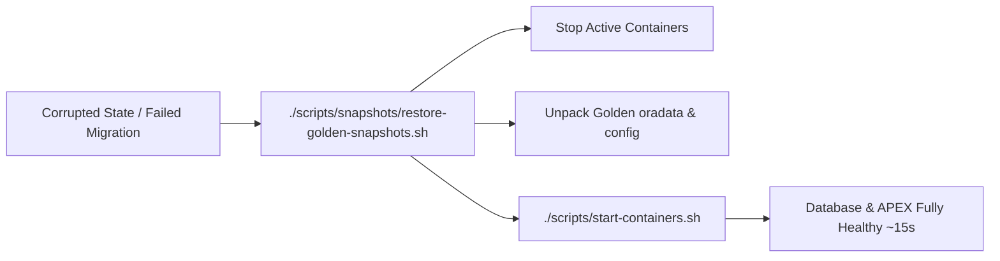

# Golden Snapshots & Instant Disaster Recovery (DR)

This skill guides creating, restoring, and managing **Golden Snapshots** for zero-data-loss, instant (~15-second) recovery of the entire Oracle Free DB, APEX, ORDS, and SEPS Wallet environment.

---

## 1. Golden Snapshot Architecture

A Golden Snapshot captures the atomic state of:
1. **Database Volume:** Persistent database storage (`oradata` block-level directory).
2. **ORDS Configuration:** Active connection pools, URL mappings, and security settings (`config/ords_container/`).
3. **SEPS Wallet & Credentials:** `cwallet.sso`, `ewallet.p12`, and Podman secrets state.
4. **Local Certificates:** Root CA (`localCA.pem`) and SSL/TLS server certificates.

---

## 2. Database Consistency Contract

> [!IMPORTANT]
> **Transactional Consistency Before Snapshot:**
> To guarantee database consistency without block corruption:
> 1. **Hot Checkpoint:** Execute `ALTER SYSTEM CHECKPOINT;` to flush dirty buffers from SGA to disk before snapshotting.
> 2. **Or Clean Pause:** Briefly pause containers (`podman stop`) during file archival.

---

## 3. Snapshot Operations CLI

```bash
# 1. Create a fresh Golden Snapshot:
./scripts/snapshots/create-golden-snapshots.sh

# 2. Restore environment from the latest Golden Snapshot (~15s recovery):
./scripts/snapshots/restore-golden-snapshots.sh

# 3. List existing snapshots:
ls -lh snapshots/golden/

# 4. Clean old snapshots:
./scripts/snapshots/clean-golden-snapshots.sh -y
```

---

## 4. Disaster Recovery Workflow (When Setup or Migration Fails)

If a complex schema migration, patch installation, or experimental blueprint breaks the database:



### Invariants:
- Restoring a Golden Snapshot preserves network port allocations.
- SEPS Wallet credentials automatically match the restored database passwords.
- No need to re-run full `setup-all.sh` from scratch.
