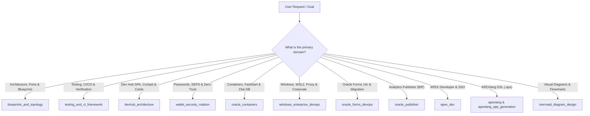

# 🧭 Oracle DevOps Platform — Master Codebase & Architecture Navigator

This skill is the **central orientation atlas and router (Tier 0)** for AI agents and developers. It maps every core directory, domain model, CLI command, and specialized skill across the platform so you never need to search blindly.

---

## 1. 🎯 When to Use & Negative Routing

### Positive Triggers (Activate Immediately):
- "Where is file X located?", "How is this project structured?", "Explain repo layout"
- "Which skill should I load for task Y?", "Master sitemap", "Codebase atlas"
- Starting a brand new multi-domain feature spanning multiple components.

### Negative Routing (Redirect to Specialized Skills):
| If the task is primarily about... | DO NOT handle here. Route immediately to: |
|:---|:---|
| Blueprints, PDB services, port allocations, or `podman-compose` overrides | `blueprints_and_topology` |
| Database container health, FastStart images, SGA/PGA or tablespaces | `oracle_containers` |
| Running `setup-all.sh`, `reset-all.sh`, or installer lifecycles | `setup_orchestration` |
| Passwords, `cwallet.sso`, `mkstore`, or passwordless `sql /@ALIAS` | `wallet_security_rotation` |
| Golden Snapshots, rapid ~15s recovery, or disaster recovery | `golden_snapshots_dr` |
| Running local CI, unit tests, or 6-language translation audits | `testing_and_ci_framework` |
| Windows NTFS, WSL2 networking, corporate PAC proxies, or WDAC | `windows_enterprise_devops` |
| Developer Hub UI, service cards, or SPA compilation | `devhub_architecture` |
| APEX developer provisioning, Azure Entra ID SSO, or AutoREST | `apex_dev` |
| Oracle Forms 14c noVNC, batch compile, or APEX modernization | `oracle_forms_devops` |
| Analytics Publisher (BIP), RTF/XSL-FO templates, or REST reports | `oracle_publisher` |

---

## 2. 🧠 Repository Mental Model & Directory Atlas

The repository (~70,000 maintainable SLOC across 524 source files) is structured into distinct, modular functional tiers:

```
oracle-free-db-in-prod/
├── scripts/                    # 🛠️ Tier 1: User CLI & Daily Developer Tools (26 scripts)
│   ├── internal/               # ⚙️ Tier 3: Automation engines, init SQL, generators, i18n (49 scripts)
│   │   ├── dev_hub/            # 🌐 Developer Hub SPA source assets, compiler & cards
│   │   │   ├── assets/         # HTML/JS/CSS source code, templates & i18n dictionaries
│   │   │   ├── cards.py        # Service card definitions for Cockpit
│   │   │   ├── compiler.py     # Static SPA compiler (inlines assets into docs/dev-hub.html)
│   │   │   ├── catalog.py      # Database & service catalog discovery
│   │   │   ├── testing.py      # Test suites and execution history engine
│   │   │   └── glossary.py     # 6-language architecture acronyms & glossary
│   │   ├── common.sh           # Shared shell helpers, logging & live timer
│   │   ├── dev-hub-bridge.py   # Background HTTP bridge daemon (:8089)
│   │   ├── generate-repo-report.py # Codebase statistics & maintainable SLOC engine
│   │   └── i18n.sh             # Terminal & CLI 6-language localization engine
│   ├── snapshots/              # 📸 Golden Snapshot management (create, restore, clean)
│   ├── certs/                  # 🔒 OS certificate trust scripts (Mac, Windows, Linux)
│   └── publisher/              # 📊 Analytics Publisher operations & report deployment
│
├── config/                     # 📐 Architecture Declarations (Single Source of Truth)
│   ├── blueprints/             # 12 Canonical Architecture Blueprints (.env.0 ... .env.11)
│   ├── profiles/               # Domain YAML configurations
│   │   ├── databases/          # 10 Database profiles (ports, memory, users, PDBs)
│   │   ├── ords/               # ORDS gateway profiles (pools, routing)
│   │   ├── web-ide/            # VS Code Web IDE profiles
│   │   └── publisher/          # Analytics Publisher profiles
│   └── enterprise.yaml.example # Corporate proxy, Artifactory mirrors & CA bundle
│
├── tests/                      # 🧪 155 Automated Tests & Verification Suites
│   ├── unit/                   # Fast isolation tests (portability, rules, parsers)
│   ├── reports/                # Markdown test execution reports & summaries
│   ├── test-local-ci.sh        # Local GitHub Actions runner & CI simulator
│   ├── test-multilingual-support.sh # 6-language i18n compliance verification (Rule 9)
│   ├── test-devhub-browser-blueprints.sh # Browser-based blueprint test suite
│   └── test-devhub-lifecycle-full.sh # Full lifecycle matrix stress tests
│
├── docker/                     # 🐳 Container Definitions & Custom Dockerfiles
│   ├── publisher-designer/     # BIP Desktop Designer container + noVNC
│   └── web-ide/                # Cloud-native VS Code Web IDE container
│
├── metrics/                    # 📊 Version-Controlled Metrics & Benchmarks (Rule 1)
│   ├── repo_statistics.json    # Machine-readable codebase metrics & SLOC
│   ├── repo_statistics.md      # Human-readable codebase health report
│   ├── test_execution_history.json # Historical test run results (pass/fail/duration)
│   └── setup_benchmarks.json   # Step timing benchmarks with second precision
│
├── applications/             # 📱 Business Applications & Reporting Packages
│   ├── f100/                   # APEX application split exports
│   └── publisher/              # 📊 Analytics Publisher GitOps reports & data models
│       └── Custom/             # 1:1 mirror of Publisher catalog (/Custom/<Domain>/<Report>/)
│
├── docs/                       # 📚 Canonical Technical Documentation & Backlog
│   ├── dev-hub.html            # Compiled Developer Hub SPA (DO NOT EDIT DIRECTLY!)
│   ├── backlog/                # Financial Enterprise Distributed Backlog (Jira stories)
│   └── et/, fi/, sv/, lv/, lt/ # Localized documentation mirrors (Rule 9)
│
└── .agents/                    # 🤖 AI Agent Customizations & Skills
    ├── AGENTS.md               # 14 Mandatory Platform Rules
    └── skills/                 # 18 Specialized Domain Skills
```

---

## 2. ⚡ "Task-to-Path" Fast Router (Cheat Codes)

| What You Want to Do | Exact Source Path to Edit or Inspect | Run Command / CLI |
|:---|:---|:---|
| **Add / Edit Database Settings** | `config/profiles/databases/<name>.yaml` | Automatically loaded via `./scripts/internal/load-profile.sh` |
| **Configure Architecture Topology** | `config/blueprints/.env.<N>` | `./scripts/setup-all.sh --blueprint <N>` |
| **Manage Passwords & Wallet** | `scripts/internal/create-wallet.sh` | `./scripts/get-password.sh <alias>` |
| **Edit Dev Hub UI / Cockpit** | `scripts/internal/dev_hub/assets/` & `cards.py` | `python3 -c "from scripts.internal.dev_hub.compiler import build_dev_hub; build_dev_hub()"` |
| **Modify Dev Hub Bridge API** | `scripts/internal/dev-hub-bridge.py` | `./scripts/internal/dev-hub-bridge.py &` |
| **Calculate Codebase Stats** | `scripts/internal/generate-repo-report.py` | `./scripts/report-repo-stats.sh` |
| **Create / Restore Snapshots** | `scripts/snapshots/` | `./scripts/snapshots/create-golden-snapshots.sh` (~15s) |
| **Run Automated Local CI** | `scripts/test-local-ci.sh` | `./scripts/test-local-ci.sh` |
| **Audit Multilingual Support** | `tests/test-multilingual-support.sh` | `./tests/test-multilingual-support.sh --all` |
| **Verify Filename Portability** | `tests/unit/test-filename-portability.sh` | `./tests/unit/test-filename-portability.sh` |
| **Corporate Artifactory Setup** | `config/enterprise.yaml.example` | `./scripts/onboard-enterprise.sh` |
| **Create Publisher Report** | `applications/publisher/Custom/` | `./scripts/publisher/create-report.sh <Path> "<Title>"` |
| **Deploy Publisher Report (GitOps)** | `scripts/publisher/deploy-template.sh` | `./scripts/publisher/deploy-template.sh <Path> [--render]` |
| **Rotate Publisher Passwords** | `scripts/rotate-password.sh` | `./scripts/rotate-password.sh publisher [dev|user|admin]` |

---

## 3. 🛡️ Artifact Lifecycle Boundary (Crucial Rule)

In this repository, you must strictly distinguish between **Source Code**, **Generated Artifacts**, and **External Enterprise Binaries**:

1. **🔴 NEVER EDIT DIRECTLY:**
   - `docs/dev-hub.html`: This is a **17,400+ line compiled artifact**. Always edit components under `scripts/internal/dev_hub/assets/` or `scripts/internal/dev_hub/*.py`, then run `python3 -c "from scripts.internal.dev_hub.compiler import build_dev_hub; build_dev_hub()"`.
2. **🟡 VERSIONED METRICS STORE:**
   - `metrics/`: Contains Git-tracked JSON benchmarks (`setup_benchmarks.json`, `repo_statistics.json`, `test_execution_history.json`). These are written deterministically by scripts, not manually crafted.
3. **🟢 LOCAL-ONLY RUNTIME LOGS:**
   - `install_logs/`: Kept in `.gitignore`. Full stdout/stderr streams go here. Clean with `./scripts/clean-logs.sh`.
4. **🏢 CORPORATE ARTIFACTORY & IN-CONTAINER UNZIP (Rule 4):**
   - APEX, ORDS, and Publisher archives containing 50,000+ files **must never be unzipped onto the host filesystem**. They are transferred as single archives or pulled from container mirrors (`container-registry.oracle.com` or corporate Artifactory) and unzipped in-container (`/tmp`).

---

## 4. 🔀 Skill Dispatcher & Decision Tree

When handling complex tasks, use this routing matrix to chain the right specialized skills:



### Skill Chaining Examples:
- **Adding a New Database Service:**
  1. `blueprints_and_topology`: Declare in `config/blueprints/.env.<N>` and define YAML in `config/profiles/databases/`.
  2. `wallet_security_rotation`: Register credentials in SEPS Wallet (`create-wallet.sh`).
  3. `devhub_architecture`: Add status card in `scripts/internal/dev_hub/cards.py` and recompile.
  4. `testing_and_ci_framework`: Verify connectivity and run portability audit.
- **Enterprise Corporate Onboarding:**
  1. `windows_enterprise_devops`: Configure WSL2 mirrored networking, corporate proxy (`company-registry.conf`), and CA bundles.
  2. `oracle_containers`: Override container image registries with internal Artifactory mirrors.

---

## 5. 🚫 Invariant Rules & Anti-Patterns Checklist

Before submitting code changes, ensure compliance with the repository's immutable rules:
- **Rule 1 (Timing & Metrics):** Any new installer/lifecycle step must write duration benchmarks to `metrics/`.
- **Rule 2 (Documentation):** Any new script or configuration must update `README.md` and localized docs in the same commit.
- **Rule 5 (Zero-Trust SEPS Wallet):** Never write plaintext passwords to disk (`.json`, `.txt`, `.env`). All secrets must be queried dynamically via `./scripts/get-password.sh <alias>`.
- **Rule 6 (SQLcl Exclusivity):** Always use SQLcl (`sql`), never legacy `sqlplus`.
- **Rule 9 (6-Language i18n):** Every user-facing script message or UI element must have translations in EN, ET, FI, SV, LV, LT.
- **Rule 11 (Clean Blueprints):** Blueprints only declare positive profile references; never use `SKIP_*` flags or hardcoded ports.
- **Rule 13 (Cross-Platform Portability):** No Windows-reserved characters (`:`, `*`, `?`, `<`, `>`, `|`) in filenames, no spaces, strictly kebab-case ASCII.

---

## 6. 🩺 Diagnostic Signatures & 1-Line Remedies

| Symptom / Error | Root Cause | 1-Line Remedy |
|:---|:---|:---|
| `git checkout` fails on Windows NTFS | Forbidden char (`:`, `*`, `?`, `<`) in filename | Run `./tests/unit/test-filename-portability.sh` to identify offenders. |
| `dev-hub.html` out of sync with code | Edited HTML directly instead of source assets | Run `python3 scripts/internal/generate_dev_hub.py` to recompile. |
| Missing translation in CLI / Dev Hub | Added key to `i18n.sh`/`i18n.js` in < 6 languages | Run `./tests/test-multilingual-support.sh --all` to find missing keys. |
| SEPS Wallet password lookup returns empty | Running container stopped or secret not created | Run `./scripts/check-wallet.sh` to test all aliases in memory. |
| Blueprint activation fails with OOM | Free RAM < 2048 MB threshold | Run `free -m` (Linux) or `vm_stat` (Mac); close idle apps or use `--force`. |

