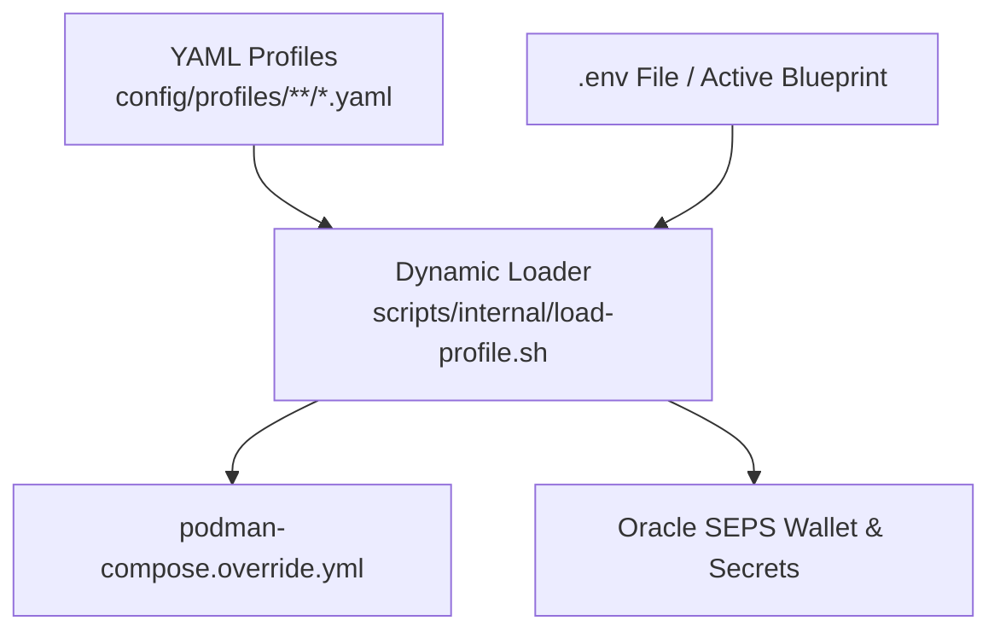

# Setup-All Orchestration: Architecture & Invariants

This skill defines the architectural rules for `scripts/setup-all.sh` and `scripts/reset-all.sh`.

---

## 1. Orchestration Layer Boundaries

`setup-all.sh` is strictly an **orchestrator**:
- **Responsibilities:** CLI parsing (`-b <N>`, `--lang <LANG>`), user confirmation, step delegation to `scripts/internal/*.sh`, duration tracking (`metrics/`), and logging (`install_logs/`).
- **Prohibited:** Business/installation logic, hardcoded passwords, hardcoded ports (e.g. `1521`), hardcoded container names, or static SIDs.

---

## 2. Single Source of Truth Precedence



### Dynamic Resolution Helpers:
- `get_active_db_instances`: Discovers container and service names (`db-proxy|db-proxy-oracle|DB_PROXY`).
- `get_required_secret_names`: Generates required secret keys dynamically.
- `load_db_profile`: Single-pass YAML profile parser.

---

## 3. Anti-Patterns & Correct Implementations

### ❌ 3.1 Hardcoded Fallback Passwords
```bash
# PROHIBITED:
[ -z "$adb_admin_pwd" ] && adb_admin_pwd="OraclePass2026Admin"

# CORRECT:
if [ -z "$adb_admin_pwd" ]; then
  "$SCRIPT_DIR/internal/generate-passwords.sh" --force
  adb_admin_pwd=$(podman secret inspect --showsecret apex_db_sys_password ...)
fi
```

### ❌ 3.2 Hardcoded Container Names & Ports
```bash
# PROHIBITED:
services:
  db-apex-proxy:
    image: ...
    ports: ["1521:1521"]

# CORRECT:
PROXY_SERVICE_KEY=$(get_active_db_instances | head -n 1 | cut -d'|' -f1)
cat <<EOF > "$OVERRIDE_FILE"
services:
  ${PROXY_SERVICE_KEY}:
    image: ${RESOLVED_DB_IMAGE}
    ports: ["${PROFILE_DB_PORT}:${PROFILE_CONTAINER_PORT}"]
EOF
```

---

## 4. Dual-Stream Terminal Progress (`print_step_progress`)

For operations exceeding 3–5 seconds:
- **Interactive TTY (`/dev/tty`):** In-place single-line updating (`printf "\r\033[K..."`).
- **Non-TTY / Log Pipes (`install_logs/`):** Outputs a clean newline summary periodically (default 60s), preventing log bloat.
- **Loop Exit:** Clears transient TTY line before printing the final status.

---

## 5. Step Addition Checklist

Before introducing a new step in `setup-all.sh`:
- [ ] Is execution delegated to `scripts/internal/*.sh`?
- [ ] Are all ports, SIDs, images, and credentials dynamically resolved from profiles?
- [ ] Is `run_with_live_timer` or `print_step_progress` used for long loops?
- [ ] Is execution duration recorded in `metrics/setup_benchmarks.json`?
- [ ] Is full stdout/stderr logged to `install_logs/<component>_<action>_<timestamp>.log`?
- [ ] Is `README.md` and localized docs updated per Rule 2 and Rule 9?
