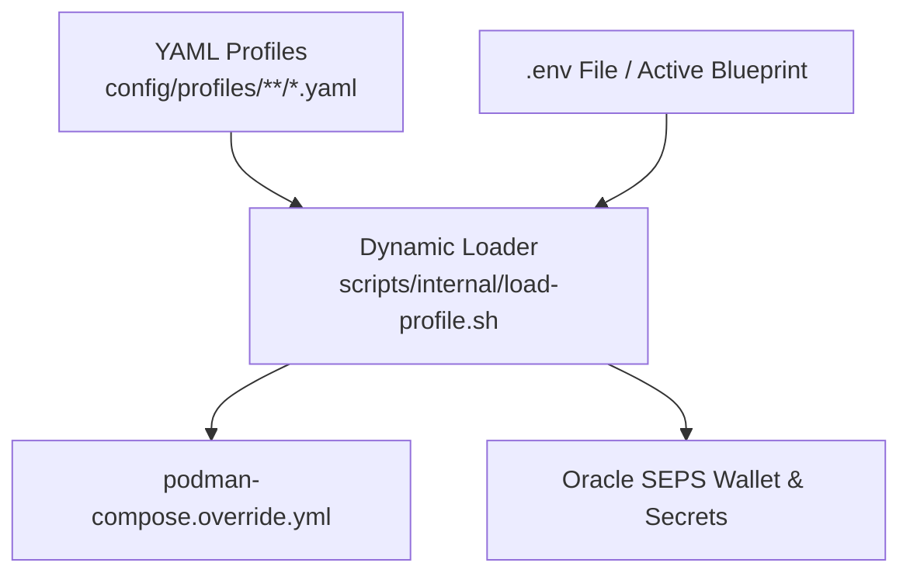

# Setup-All Orchestration: Architecture & Invariants

This skill defines the architectural rules for `scripts/setup-all.sh` and `scripts/reset-all.sh`.

---

## 1. Orchestration Layer Boundaries

`setup-all.sh` is strictly an **orchestrator**:
- **Responsibilities:** CLI parsing (`-b <N>`, `--lang <LANG>`), user confirmation, step delegation to `scripts/internal/*.sh`, duration tracking (`metrics/`), and logging (`install_logs/`).
- **Prohibited:** Business/installation logic, hardcoded passwords, hardcoded ports (e.g. `1521`), hardcoded container names, or static SIDs.

---

## 2. Single Source of Truth Precedence



### Dynamic Resolution Helpers:
- `get_active_db_instances`: Discovers container and service names (`db-proxy|db-proxy-oracle|DB_PROXY`).
- `get_required_secret_names`: Generates required secret keys dynamically.
- `load_db_profile`: Single-pass YAML profile parser.

---

## 3. Anti-Patterns & Correct Implementations

### ❌ 3.1 Hardcoded Fallback Passwords
```bash
# PROHIBITED:
[ -z "$adb_admin_pwd" ] && adb_admin_pwd="OraclePass2026Admin"

# CORRECT:
if [ -z "$adb_admin_pwd" ]; then
  "$SCRIPT_DIR/internal/generate-passwords.sh" --force
  adb_admin_pwd=$(podman secret inspect --showsecret apex_db_sys_password ...)
fi
```

### ❌ 3.2 Hardcoded Container Names & Ports
```bash
# PROHIBITED:
services:
  db-apex-proxy:
    image: ...
    ports: ["1521:1521"]

# CORRECT:
PROXY_SERVICE_KEY=$(get_active_db_instances | head -n 1 | cut -d'|' -f1)
cat <<EOF > "$OVERRIDE_FILE"
services:
  ${PROXY_SERVICE_KEY}:
    image: ${RESOLVED_DB_IMAGE}
    ports: ["${PROFILE_DB_PORT}:${PROFILE_CONTAINER_PORT}"]
EOF
```

---

## 4. Dual-Stream Terminal Progress (`print_step_progress`)

For operations exceeding 3–5 seconds:
- **Interactive TTY (`/dev/tty`):** In-place single-line updating (`printf "\r\033[K..."`).
- **Non-TTY / Log Pipes (`install_logs/`):** Outputs a clean newline summary periodically (default 60s), preventing log bloat.
- **Loop Exit:** Clears transient TTY line before printing the final status.

---

## 5. Step Addition Checklist

Before introducing a new step in `setup-all.sh`:
- [ ] Is execution delegated to `scripts/internal/*.sh`?
- [ ] Are all ports, SIDs, images, and credentials dynamically resolved from profiles?
- [ ] Is `run_with_live_timer` or `print_step_progress` used for long loops?
- [ ] Is execution duration recorded in `metrics/setup_benchmarks.json`?
- [ ] Is full stdout/stderr logged to `install_logs/<component>_<action>_<timestamp>.log`?
- [ ] Is `README.md` and localized docs updated per Rule 2 and Rule 9?

---

## 6. Universal Database Profiles & Dynamic Resolution Contracts

1. **3 Universal Database Engines:**
   - `db-oracle.yaml` (Official Oracle Free DB 23ai)
   - `db-gvenzl.yaml` (Community Gérald Venzl Free DB 23ai)
   - `db-adb.yaml` (Oracle Autonomous Database Cloud ADB)
2. **Role-based Parameter Derivation:**
   - Blueprints declare high-level engine references (`DB_ALISE=db-oracle`, `DB_PROXY=db-oracle`, `DB_PUBLISHER=db-oracle`, `DB_FORMS=db-oracle`).
   - The engine automatically resolves role-specific defaults:
     - `alise` $\rightarrow$ Port 1533, pool `alise`, workspace `ALISE_WORKSPACE`, wallet `DB_ALISE_...`
     - `proxy` $\rightarrow$ Port 1532, pool `proxy`, workspace `PROXY_WORKSPACE`, wallet `DB_PROXY_...`
     - `publisher` $\rightarrow$ Port 1531, pool `publisher`, workspace `PUBLISHER_WORKSPACE`, wallet `DB_PUBLISHER_...`
     - `forms` $\rightarrow$ Port 1534, pool `forms`, workspace `FORMS_WORKSPACE`, wallet `DB_FORMS_...`
3. **APEX `latest` + Patch Resolution Contract:**
   - If `version: latest` or omitted, dynamic resolver (`resolve_apex_latest`) queries `binaries/apex/` for the highest semver zip and automatically pairs the latest PSE bundle patch in `patches/apex/`.
4. **Decoupled ORDS Schema & Pool Lifecycle Contract:**
   - **DB Metadata Setup:** `ords.enabled: true` in DB YAML installs ORDS metadata in the database without starting `app-ords`.
   - **Version Resolution:** `resolve_target_ords_version` determines the target ORDS version: (1) Running `app-ords` container $\rightarrow$ (2) `binaries/ords/ords-*.zip` $\rightarrow$ (3) Official OCR container image.
   - **Central Gateway Hot-Reload:** If central ORDS (`app-ords` from `env0`) is running, setting up any database (e.g. `db-alise`) automatically registers `pool.xml` in `/etc/ords/config/databases/<pool_name>/` and reloads the central container.
   - **Oracle Cloud ADB (`db-adb.yaml`):** Managed cloud ORDS schemas must not be overridden (`install_in_db: false`). When `verify_version_match: true`, version parity between central ORDS and cloud ADB is validated.
   - **No ORDS Server Guidance:** When neither local nor central ORDS is active, scripts display clear yellow guidance (`ORDS_NOT_CONFIGURED_STATUS` / `ORDS_NOT_CONFIGURED_HINT`).

