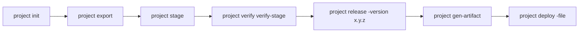

# SQLcl Projects: Database CI/CD, MCP Server & Liquibase Pipelines

This skill guides using Oracle SQLcl `project` commands (SQLcl 23.x/26.x), the **SQLcl MCP Server (`sql -mcp`)**, and Liquibase to version control schema DDLs, package deployment artifacts, and orchestrate Git-based CI/CD pipelines.

---

## 1. 🎯 When to Use & Negative Routing

### Positive Triggers (Activate Immediately):
- Running SQLcl project lifecycle: `project init`, `project export`, `project stage`, `project deploy`
- Managing Liquibase declarative changelogs and schema delta migrations
- Configuring or invoking the SQLcl Model Context Protocol (MCP) server (`sql -mcp`)
- Enforcing Rule 6 (exclusive SQLcl usage contract; prohibition of legacy `sqlplus`)
- Configuring terminal aesthetics via `login.sql` (`ansiconsole`, colored prompts)

### Negative Routing (Redirect to Specialized Skills):
| If the task is primarily about... | DO NOT handle here. Route immediately to: |
|:---|:---|
| Registering connections in VS Code Oracle SQL Developer extension | `vscode_sql_developer` |
| Authoring APEX declarative `.apx` DSL applications | `apexlang_app_generation` |
| Managing SEPS wallet credentials or `cwallet.sso` | `wallet_security_rotation` |
| Simulating local GitHub Actions CI run | `testing_and_ci_framework` |

---

## 2. Project Directory Structure

```text
project_root/
├── .dbtools/
│   ├── project.config.json    # Project settings & schema bindings
│   └── filters/
│       └── project.filters    # SQL predicates for export filtering
├── src/
│   ├── database/              # Exported DDL files (tables, packages, triggers)
│   └── apex/                  # APEX application source (.apx or f100.sql)
├── dist/                      # Staged Liquibase changelogs (dist/releases/next)
└── artifact/                  # Bundled release ZIP archives
```

---

## 2. Command Lifecycle & Production Boundaries



> [!IMPORTANT]
> **Production Deployment Boundary:**
> The AI agent works **exclusively in the DEV environment**. Promotion to TEST or PROD is executed strictly through versioned SQLcl Project artifacts (`project gen-artifact` $\rightarrow$ `project deploy`), gated behind human review and CI/CD approval pipelines.

1. **`project init -name my-app -schemas MY_SCHEMA -directory .`**: Initializes project.
2. **`project export`**: Dumps database DDL to `src/database/`.
3. **`project stage`**: Compiles delta Liquibase changelogs to `dist/releases/next`.
4. **`project verify verify-stage`**: Validates changelog syntax against target database.
5. **`project release -version 1.0.0`**: Freezes staged changes into version folder.
6. **`project gen-artifact -version 1.0.0`**: Bundles release into `artifact/my-app-1.0.0.zip`.
7. **`project deploy -file artifact/my-app-1.0.0.zip`**: Applies changes to target database in CI/CD.

---

## 3. SQLcl MCP Server (`sql -mcp`)

SQLcl 26.x provides a built-in MCP server that enables AI agents to query metadata, compile packages, and validate APEX applications safely:

### Configuration (`.mcp.json` / Claude Code / Antigravity):
```json
{
  "mcpServers": {
    "sqlcl": {
      "command": "sql",
      "args": ["-mcp", "-conn", "apex-dev"],
      "env": {
        "SQLCL_RESTRICTION_LEVEL": "1"
      }
    }
  }
}
```
- **Restriction Level 1:** Allows SQL/PLSQL execution, compilation, and APEX validations while strictly preventing unauthorized access to the host operating system.

---

## 4. ORDS REST-Enabled Schema Invariant

> [!IMPORTANT]
> **REST-Enabled Schema Prerequisite:**
> For SQLcl and APEXlang imports to succeed, the workspace's parsing schema MUST be REST-enabled via ORDS:
```sql
BEGIN
  ORDS.ENABLE_SCHEMA(
      p_enabled             => TRUE,
      p_schema              => 'PROXY_SCHEMA',
      p_url_mapping_type    => 'BASE_PATH',
      p_url_mapping_pattern => 'proxy',
      p_auto_rest_auth      => FALSE
  );
  COMMIT;
END;
/
```

---

## 5. Liquibase Rules & Export Filters

### `.dbtools/filters/project.filters`:
```sql
object_name not like 'TEMP_%'
and not (object_type = 'TABLE' and object_name like 'BIN$%')
and object_name in ('APP_CONFIG', 'OUTBOUND_REQUEST_LOG', 'KAFKA_MESSAGE_QUEUE')
```

### Idempotent Changelogs:
- For packages, views, and procedures: specify `runOnChange:true`.
- For DDL migrations: specify `failOnError:true`.

---

## 6. Offline CI/CD Simulation (`test-local-ci.sh`)

```bash
# 1. Dry-run syntax and workflow verification:
./scripts/test-local-ci.sh --dry-run

# 2. Complete local deployment simulation against local database:
./scripts/test-local-ci.sh

# 3. Execute via Nektos 'act' CLI:
act -W .github/workflows/deploy-apex.yml
```

---

## 7. Interactive Terminal Formatting & Prompt Customization (`login.sql`)

*(Matt Mulvaney Terminal Standards)*

For interactive developer sessions, configure `login.sql` to enhance terminal aesthetics and protect sensitive parameters:

```sql
-- ANSI formatted output
set sqlformat ansiconsole

-- Protect credentials in history buffer
set history filter show,history,clear,secret,pass,connect

-- Context-aware colored prompt: USER @ TNS_ALIAS >
set sqlprompt "@|bold,green _USER|@@@|bold,cyan _CONNECT_IDENTIFIER|@@|bold,magenta  > |@"
```

---

## 8. Mandatory SQLcl Exclusive Execution Rule (Prohibition of Legacy SQL*Plus)

To guarantee consistent behavior across local containers, remote hosts, and cloud Autonomous Databases (ADB), all database execution scripts must adhere to the **Exclusive SQLcl Usage Contract**:

1. **Strict Prohibition of SQL\*Plus:** Direct invocation of legacy `sqlplus` is prohibited in automation scripts. SQLcl (`sql`) is the sole authorized database client.
2. **Multi-Tier Execution Resolution:**
   - **Tier 1 (In-Container Execution):** In containerized Oracle Free databases (`db-proxy`, `db-alise`, `db-publisher`, `db-forms`), execute via the official embedded binary:
     ```bash
     podman exec -i "$target_container" /opt/oracle/product/*/dbhomeFree/sqlcl/bin/sql -s / as sysdba
     ```
   - **Tier 2 (Host CLI Execution):** On the host, invoke `./scripts/sqlcl.sh /@DB_${c_upper}_SYS as sysdba` with automatic SEPS Wallet credential resolution.
   - **Tier 3 (Ephemeral Container Fallback):** In locked-down environments, run via ephemeral container with `--rm`:
     ```bash
     podman run --rm -i --network=host container-registry.oracle.com/database/sqlcl:latest -s /@DB_${c_upper}_SYS as sysdba
     ```
3. **Mandatory Script Safety Invariants:**
   - Always include `WHENEVER SQLERROR EXIT FAILURE ROLLBACK;` at the beginning of scripted SQL files.
   - Never pipe SQL outputs to `/dev/null 2>&1`; always tee or redirect to `$WORKSPACE_DIR/install_logs/*.log` to preserve failure diagnostics and prevent silent errors.

---

## 9. 🩺 Diagnostic Signatures & 1-Line Remedies

| Symptom / Error | Root Cause | 1-Line Remedy |
|:---|:---|:---|
| `Liquibase Validation Failed: Validation Failed: 1 changes have validation failures` | Changeset modified after execution without runOnChange | Add `runOnChange:true` to changeset or run `lb clear-checksums` in DEV. |
| SQLcl launch fails with `UnsupportedClassVersionError` | Local `JAVA_HOME` pointing to Java 11/17 instead of Java 21+ | Run `unset JAVA_HOME` before invoking SQLcl; allow wrapper to use bundled JRE. |
| MCP server (`sql -mcp`) fails to connect | Missing wallet alias or restriction level violation | Check wallet connection via `./scripts/check-wallet.sh` and set `SQLCL_RESTRICTION_LEVEL=1`. |
| Script hangs during SQL execution | Uncommitted transaction holding lock or missing semicolon | Verify SQL terminates with `;` or `/` and check locks via `V$LOCKED_OBJECT`. |


