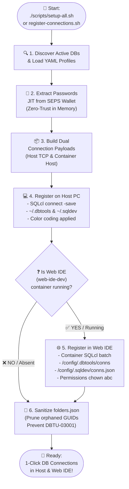

# VS Code Oracle SQL Developer: Automated Registration, MCP & Keychain

This skill provides guidelines for configuring and registering Oracle database connections, OS Keychain encrypted passwords, SQLcl MCP Server integration, and multi-database folder structures for the **VS Code Oracle SQL Developer Extension**.

---

## 1. 🎯 When to Use & Negative Routing

### Positive Triggers (Activate Immediately):
- Registering or syncing database connections in VS Code Oracle SQL Developer (`register-connections.sh`)
- Managing OS Keychain credentials and `~/.dbtools/connections/` tree
- Resolving `DBTU-03001: Invalid connection` or corrupted `folders.json`
- Configuring VS Code Integrated Terminal profiles for SQLcl

### Negative Routing (Redirect to Specialized Skills):
| If the task is primarily about... | DO NOT handle here. Route immediately to: |
|:---|:---|
| SQLcl project commands, Liquibase pipelines, or AST changelogs | `sqlcl_project` |
| SEPS Wallet storage, `cwallet.sso`, or password rotation | `wallet_security_rotation` |
| Browser-based Web IDE (Blueprint 8) container | `blueprints_and_topology` |
| Database container health or container logs | `oracle_containers` |

---

## 2. Architecture & Mechanism

Modern VS Code Oracle SQL Developer extensions manage connections via embedded SQLcl:
*   **Disk Path:** `~/.dbtools/connections/<GUID>/dbtools.properties`
*   **Folder Structure:** `~/.dbtools/connection_folders/folders.json`
*   **Embedded SQLcl:** `$HOME/.vscode/extensions/oracle.sql-developer-*/dbtools/sqlcl/bin/sql`
*   **MCP Server:** Built-in Model Context Protocol server exposing database metadata to AI agents.

❌ **Prohibited:** Manually writing `.properties` or `folders.json` files corrupts GUID references and password encryption.
✅ **Correct:** Register connections using SQLcl `connect -save` and `connmgr`.

---

## 2. Native Registration Workflow (SQLcl Commands)

```sql
-- 1. Reset and create target folder
connmgr delete -folder /<folder_name> -force
connmgr add -folder /<folder_name>

-- 2. Connect, encrypt, and persist password in OS Keychain (-savepwd -replace)
connect -save "1. Sys" -savepwd -replace sys/YourPassword@localhost:1532/FREEPDB1 as sysdba
connmgr move -conn "1. Sys" /<folder_name>

connect -save "2. APEX_PROXY_SCHEMA" -savepwd -replace APEX_PROXY_SCHEMA/YourPassword@localhost:1532/FREEPDB1
connmgr move -conn "2. APEX_PROXY_SCHEMA" /<folder_name>

-- 3. Verify
connmgr list -folder /<folder_name>
```

---

## 3. Preventing `DBTU-03001` & Sanitizing `folders.json`

### Root Cause (`DBTU-03001`):
If `~/.dbtools/connection_folders/folders.json` contains orphaned connection IDs whose corresponding `~/.dbtools/connections/<GUID>/` folders no longer exist on disk, VS Code raises `DBTU-03001` on startup and hides all connection folders.

### Automated Sanitization Pattern:
Always prune orphaned GUIDs after modifying connections:

```bash
FOLDERS_FILE="$HOME/.dbtools/connection_folders/folders.json"
DBTOOLS_CONNS_DIR="$HOME/.dbtools/connections"

if [ -f "$FOLDERS_FILE" ] && command -v jq &>/dev/null; then
  valid_ids=($(find "$DBTOOLS_CONNS_DIR" -mindepth 1 -maxdepth 1 -type d -exec basename {} \; 2>/dev/null || true))
  VALID_IDS_JSON=$(printf '%s\n' "${valid_ids[@]}" | jq -R . | jq -s .)

  jq --argjson valid "$VALID_IDS_JSON" '
    .folders = [
      .folders[]? |
      .connections = [ .connections[]? | select(. as $c | $valid | index($c)) ]
    ] |
    .folders = [ .folders[]? | select((.connections | length) > 0) ]
  ' "$FOLDERS_FILE" > "${FOLDERS_FILE}.tmp" 2>/dev/null && mv "${FOLDERS_FILE}.tmp" "$FOLDERS_FILE" 2>/dev/null || true
fi
```

---

## 4. Multi-Folder Synchronization & Dual Registration (Host PC & Web IDE)

To support multi-database topologies (`db-publisher`, `db-proxy`, `db-lis`):
1. **GUID Properties:** `$HOME/.dbtools/connections/<GUID>/dbtools.properties` generates dedicated GUIDs with ports and UI colors (`color=#HEX`).
2. **Folder Mapping:** `$HOME/.dbtools/connection_folders/folders.json` binds GUIDs to database folder names.
3. **Dual Host & Web IDE Sync:** `register-connections.sh` simultaneously registers connections for both the Host PC (`~/.dbtools`, `~/.sqldev`) and the containerized Web IDE (`/config/.dbtools`, `/config/.sqldev`) using embedded Linux SQLcl.
4. **Order Independence:** Web IDE can start before or after databases. Whenever databases start or restart, connections propagate dynamically.

### Dual Registration Architecture



Run registration CLI on demand:
```bash
./scripts/register-connections.sh
```

---

## 5. Enhanced SQLcl Terminal in VS Code & Quality-of-Life Formatting

*(Inspired by Matt Mulvaney & Community Best Practices)*

The native SQLcl terminal opened by VS Code extensions often starts in `$HOME` rather than the active workspace, lacks colorized prompts, and misses SEPS Wallet parameters.

### 5.1 Custom VS Code Terminal Profile (`.vscode/settings.json`)
Configure a dedicated SQLcl terminal profile that launches `scripts/sqlcl.sh` inside the workspace root:

```json
{
  "terminal.integrated.profiles.osx": {
    "SQLcl": null,
    "🚀 SQLcl (SEPS Wallet)": {
      "path": "/bin/zsh",
      "args": ["-c", "${workspaceFolder}/scripts/sqlcl.sh /@DB_PROXY_DEV"],
      "icon": "database",
      "color": "terminal.ansiBlue",
      "overrideName": true
    }
  },
  "terminal.integrated.profiles.linux": {
    "SQLcl": null,
    "🚀 SQLcl (SEPS Wallet)": {
      "path": "/bin/bash",
      "args": ["-c", "${workspaceFolder}/scripts/sqlcl.sh /@DB_PROXY_DEV"],
      "icon": "database",
      "color": "terminal.ansiBlue",
      "overrideName": true
    }
  }
}
```

### 5.2 Quality-of-Life Startup Profile (`login.sql`)
Place a `login.sql` in the workspace or `$SQLPATH` to enforce modern formatting, history masking, and colored prompts:

```sql
-- Enhanced ANSI table formatting
set sqlformat ansiconsole

-- Mask sensitive commands and passwords from history buffer
set history filter show,history,clear,secret,pass,connect

-- Colorized contextual SQL prompt: USER @ TNS_ALIAS >
set sqlprompt "@|bold,green _USER|@@@|bold,cyan _CONNECT_IDENTIFIER|@@|bold,magenta  > |@"
```

---

## 6. Stability Contracts

1. **Resolution Order:** Always resolve SQLcl from the latest VS Code extension (`find "$HOME/.vscode/extensions" ... | sort -rV | head -n 1`).
2. **Environment Isolation:** Run `unset JAVA_HOME` before SQLcl invocation.
3. **Binary Password Fallback:** Guard `mkstore` output against binary bytes (`[[ "$PWD_VAL" == *"?"* ]]`).
4. **Multi-Shell Registration:** Configure `TNS_ADMIN` and `alias sql` across `~/.zshrc`, `~/.zshenv`, `~/.bashrc`, `~/.bash_profile`.

---

## 7. 🩺 Diagnostic Signatures & 1-Line Remedies

| Symptom / Error | Root Cause | 1-Line Remedy |
|:---|:---|:---|
| `DBTU-03001: Invalid connection definition` | Missing GUID, unencrypted plaintext password, or bad port in `.properties` | Re-run `./scripts/register-connections.sh` to cleanly overwrite connection metadata. |
| VS Code prompts for password on every connect | Password not stored in OS Keychain during registration | Ensure `-savepwd -replace` flags are passed during `connect -save` in SQLcl. |
| Connection folder missing in VS Code tree | `folders.json` contains orphan GUIDs or syntax error | Run `scripts/register-connections.sh` to sanitize `~/.dbtools/connection_folders/folders.json`. |
| SQLcl launch fails in VS Code terminal | Java version conflict (Java 11/17 vs 21+) | Run `unset JAVA_HOME` before launching SQLcl from terminal. |

