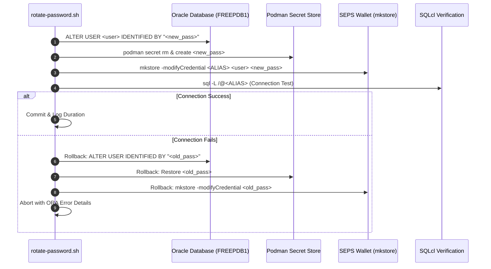

# Oracle SEPS Wallet & Zero-Downtime Credential Rotation

This skill guides working with **Oracle Secure External Password Store (SEPS)** auto-login Wallets (`cwallet.sso`), `sqlnet.ora` routing, and automated zero-downtime password rotation across databases, Podman secret stores, and CLI tools.

---

## 1. SEPS Wallet Configuration Architecture

The SEPS Wallet enables passwordless database authentication (`sql /@ALIAS`) with strong encryption:

```text
config/tns_admin/
├── cwallet.sso            # Auto-login encrypted credential store (SEPS)
├── ewallet.p12            # PKCS#12 Master Wallet (protected by master wallet password)
├── sqlnet.ora             # Client routing and wallet location declaration
└── tnsnames.ora           # TNS descriptor resolution
```

### `sqlnet.ora` Mandatory Parameters:
```text
WALLET_LOCATION =
  (SOURCE =
    (METHOD = FILE)
    (METHOD_DATA =
      (DIRECTORY = /workspace/config/tns_admin)
    )
  )

SQLNET.WALLET_OVERRIDE = TRUE
SSL_CLIENT_AUTHENTICATION = FALSE
```

### `tnsnames.ora` Service Descriptor:
```text
DB_PROXY =
  (DESCRIPTION =
    (ADDRESS = (PROTOCOL = TCP)(HOST = localhost)(PORT = 1532))
    (CONNECT_DATA =
      (SERVER = DEDICATED)
      (SERVICE_NAME = FREEPDB1)
    )
  )
```

---

## 2. Dynamic Credential Helpers & Zero-Trust Architecture

1. **Read Password / Copy to Clipboard (Just-In-Time In-Memory):**
   ```bash
   ./scripts/get-password.sh <ALIAS>
   ./scripts/get-password.sh DB_PROXY_DEV -c    # Copies password to OS clipboard
   ```
2. **Diagnose & Validate All Wallet Connections:**
   ```bash
   ./scripts/check-wallet.sh
   ```
3. **Passwordless SQLcl Connect:**
   ```bash
   ./scripts/sqlcl.sh /@DB_PROXY_DEV
   ./scripts/sqlcl.sh /@DB_PROXY_SYS as sysdba
   ```
4. **Strict Zero-Trust In-Memory Lifecycle Contract (Web UI & CLI):**
   - **Encryption at Rest (Mandatory):** Secrets must reside strictly in encrypted form inside the Oracle SEPS Auto-Login Wallet (`cwallet.sso` / `ewallet.p12` with AES-256) or Podman secret tmpfs.
   - **Zero Plaintext Files on Disk:** Passwords MUST NEVER be persisted to disk in unencrypted format (no `.json`, `.txt`, `.env`, or `.cache` files), regardless of file permissions (`chmod 0600` is NOT an exemption).
   - **Just-In-Time In-Memory Decryption:** Passwords may only be decrypted dynamically in memory at runtime directly from `cwallet.sso` via `mkstore` / `get-password.sh` and destroyed immediately after process completion.
   - **Zero Synthetic Fallbacks:** Synthetic fallback passwords (such as SHA hashes or dummy values) are strictly prohibited. Every credential must be dynamically verified against the database SEPS Wallet.

---

## 3. Atomic Zero-Downtime Password Rotation (`rotate-password.sh`)

When rotating credentials (e.g. `rotate-password.sh db-proxy dev`), execution must follow an **atomic 5-stage pipeline with automated rollback on failure**:



### Rotation CLI Commands:
```bash
# Rotate single user on specific database instance:
./scripts/rotate-password.sh db-proxy dev

# Rotate APEX Administrator credentials:
./scripts/rotate-password.sh db-proxy apex_admin

# Rotate all accounts across all active database instances:
./scripts/rotate-password.sh all
```

---

## 4. Wallet Creation & Credential Provisioning (`create-wallet.sh`)

Adding credentials via Oracle `mkstore` CLI:
```bash
# 1. Create auto-login wallet:
mkstore -wrl "$WALLET_DIR" -create

# 2. Add credential entry:
mkstore -wrl "$WALLET_DIR" -createCredential "$ALIAS" "$USERNAME" "$PASSWORD"

# 3. Update existing credential entry:
mkstore -wrl "$WALLET_DIR" -modifyCredential "$ALIAS" "$USERNAME" "$NEW_PASSWORD"

# 4. List registered aliases:
mkstore -wrl "$WALLET_DIR" -listCredential
```

---

## 5. Binary Password Fallback Contract

If `mkstore` returns binary/corrupted characters (`[[ "$PWD_VAL" == *"?"* ]]`), scripts must automatically fall back to querying the credential directly from the Podman secret store:
```bash
if [[ "$WALLET_PWD" == *"?"* ]] || [ -z "$WALLET_PWD" ]; then
  SECRET_VAL=$(podman secret inspect --showsecret "${SECRET_NAME}" 2>/dev/null || true)
fi
```
