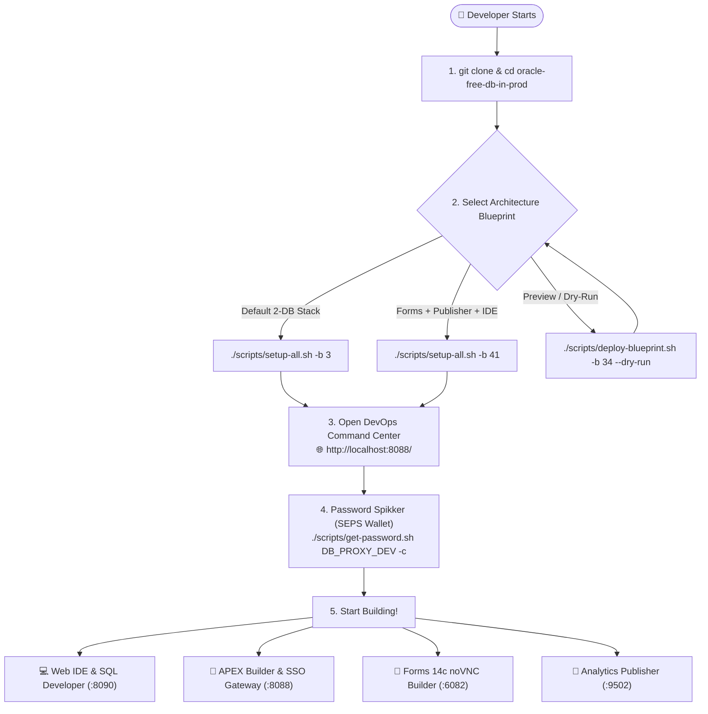
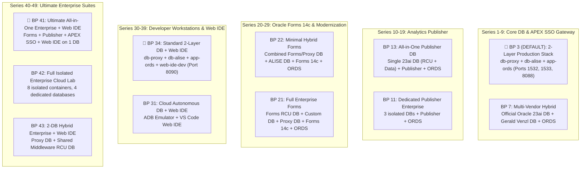

[ 🇬🇧 English ](README.md) | [ 🇪🇪 Eesti ](docs/et/README.md) | [ 🇫🇮 Suomi ](docs/fi/README.md) | [ 🇸🇪 Svenska ](docs/sv/README.md) | [ 🇱🇻 Latviešu ](docs/lv/README.md) | [ 🇱🇹 Lietuvių ](docs/lt/README.md)

# Oracle DevOps Platform

> **Production-ready, zero license cost (0 €), and 100% passwordless (SEPS Wallet) Oracle 23ai, APEX SSO Gateway, Forms 14c, Publisher, and Web IDE development & DevOps platform.**

---

## ⚡ 60-Second Quickstart

```bash
# 1. Clone the repository and enter the directory
git clone https://github.com/allanlahe/oracle-free-db-in-prod.git && cd oracle-free-db-in-prod

# 2. Launch the Default 2-Layer Production Stack (Blueprint 3)
./scripts/setup-all.sh -b 3

# 3. View passwords, URLs, and clipboard helper (or open Dev Hub at http://localhost:8088/)
./scripts/get-password.sh
```

---

## 🗺️ New Developer Onboarding Journey



---

## ⚡ Setup-All 10-Phase Lifecycle Architecture

```mermaid
flowchart LR
    P1["1. Images Pull"] --> P2["2. ORDS Download"]
    P2 --> P3["3. APEX Packages"]
    P3 --> P4["4. Start Containers"]
    P4 --> P5["5. Wait DB Healthy"]
    P5 --> P6["6. Install APEX"]
    P6 --> P7["7. Init Schemas & SEPS"]
    P7 --> P8["8. Deploy APEX Apps"]
    P8 --> P9["9. Init Middleware & Services"]
    P9 --> P10["10. Golden Snapshot (~15s DR)"]
```



---

## 🌐 Dev Hub (`http://localhost:8088/`) — Single Pane of Glass

Developers don't need to memorize dozens of individual ports. The **Dev Hub** acts as a unified landing portal providing:
- **1-Click Service Links:** Instant access to APEX Builder, Database Actions (SDW), Forms 14c runtime, HTML5 noVNC Forms Builder, and Analytics Publisher.
- **1-Click Password Copier:** Single click copies decrypted passwords directly to the system clipboard (ready to paste with `Cmd+V` / `Ctrl+V`).
- **Live Health Diagnostics:** Real-time latency checks every 6 seconds.
- **Integrated Markdown Reader:** Search and read documentation directly inside the browser.
- **Blueprint Deployment & Lifecycle Manager:** Deploy, switch, and monitor curated blueprints via Web UI and `./scripts/deploy-blueprint.sh`.

---

## 🔑 Where is My Password? (SEPS Wallet Credential Spikker)

All passwords are automatically generated with high-entropy cryptographic security and stored securely in **Oracle SEPS (Secure External Password Store) Wallets** and Podman Secret Store.

```bash
# View full password matrix table:
./scripts/get-password.sh

# Copy developer password directly to clipboard:
./scripts/get-password.sh DB_PROXY_DEV -c

# Copy APEX workspace administrator password:
./scripts/get-password.sh DB_PROXY_APEX_ADMIN -c

# Connect to database via SQLcl with ZERO passwords typed:
sql /@DB_PROXY_DEV
```

---

## 🎯 3 Stakeholder Perspectives & Architectural Value

| Perspective | Key Benefits & Daily Experience | Architectural Enabler |
| :--- | :--- | :--- |
| **👤 End-User & Business** | • **Zero Client Installation:** Modern browser UX via HTML5 & APEX Universal Theme.<br/>• **Single Sign-On (SSO):** One login session across APEX and legacy Forms services.<br/>• **Pixel-Perfect Reports:** Automated PDF/Excel document generation. | • ORDS Multi-Pool Gateway<br/>• APEX Reverse Proxy SSO for Forms<br/>• Analytics Publisher REST API |
| **💻 Developer** | • **~15s FastStart Recovery:** Instant state resets via Golden Snapshots.<br/>• **Passwordless SQL:** Instant connection via `./scripts/sqlcl.sh` and SEPS Wallet.<br/>• **Zero-Install Web IDE:** In-browser VS Code with Oracle SQL Developer & AI assistants. | • Podman FastStart Snapshots<br/>• SEPS Oracle Wallet Auto-Sync<br/>• `code-server` Web IDE Container |
| **🛡️ Auditor & Architect** | • **0 € Enterprise Software Cost:** Oracle 23ai Free DB in production.<br/>• **Zero-Trust Network Isolation:** DB instances never expose raw SQL to public interfaces.<br/>• **Governed Execution:** EBNF declarative contracts, AST security analysis, and VPD. | • JSON-Relational Duality<br/>• 2-Layer Network Topology<br/>• Oracle Virtual Private Database (VPD) |

---

## 🔄 Oracle APEX & Forms 14c Integration Focus

Rather than just a low-code builder, **Oracle APEX 26.1** in this architecture is positioned as:
1. **Forms Modernization Bridge:** Gradual screen-by-screen modernization of Oracle Forms 14c applications into responsive modern web apps using [Oracle APEXlang DSL](https://docs.oracle.com/en/database/oracle/apex/26.1/apxln/).
2. **Enterprise SSO Reverse Proxy for Forms:** APEX handles modern identity providers (Azure Entra ID, SAML, OAuth2) and securely brokers authenticated sessions to Forms 14c without expensive WebLogic OAM/OIF infrastructure.

---

## 📋 11 Curated Architecture Blueprints



### 🚀 Blueprint Deployment & Lifecycle Management (`./scripts/deploy-blueprint.sh`)

```bash
# 1. Check current active blueprint and container health:
./scripts/deploy-blueprint.sh --status

# 2. Deploy Blueprint 3 (DEFAULT 2-Layer Production Stack):
./scripts/deploy-blueprint.sh -b 3

# 3. Deploy Blueprint 41 (Ultimate All-in-One Enterprise):
./scripts/deploy-blueprint.sh -b 41

# 4. Preview / Simulate configuration (Dry-Run):
./scripts/deploy-blueprint.sh -b 34 --dry-run

# 5. List all 11 curated blueprints in ASCII table:
./scripts/deploy-blueprint.sh --list
```

---

## 🚀 Quickstart CLI Cheat-Sheet

```bash
# 1. Start desired blueprint:
./scripts/setup-all.sh -b 3

# 2. View credentials & services matrix table (or copy password via -c):
./scripts/get-password.sh
./scripts/get-password.sh DB_PROXY_DEV -c

# 3. Rotate credentials securely (zero downtime):
./scripts/rotate-password.sh db-proxy dev
./scripts/rotate-password.sh all

# 4. Test active web service endpoints & wallet connections:
./scripts/check-urls.sh
./scripts/check-wallet.sh

# 5. Run automated end-to-end browser & UI login test:
./scripts/test-browser-login.sh

# 6. Run multi-language (i18n) verification suite (Rule 9: EN, ET, FI, SV, LV, LT):
./tests/test-multilingual-support.sh

# 7. Create or restore Golden Snapshots (instant ~15s recovery):
./scripts/snapshots/create-golden-snapshots.sh
./scripts/snapshots/restore-golden-snapshots.sh

# 8. Clean logs, temporary files, and old snapshots:
./scripts/clean-logs.sh -y
./scripts/snapshots/clean-golden-snapshots.sh -y

# 9. Reset environment to clean slate:
./scripts/reset-all.sh -y
```

---

## 📑 Dedicated User Guides

- 🚀 **[docs/forms-to-apex-migration-guide.md](docs/forms-to-apex-migration-guide.md):** **Oracle Forms to APEX Modernization & Migration Guide** — Business case, TCO comparison, 5-stage automated migration workflow, PL/SQL extraction, and AI vibe-coding with [Oracle APEXlang DSL](https://docs.oracle.com/en/database/oracle/apex/26.1/apxln/).
- 📐 **[docs/forms-setup.md](docs/forms-setup.md):** Oracle Forms 14c Guide — Port map (9001/7001/6082), test form access (`frmservlet?form=test.fmx`), adding forms to `forms_apps/`, compiling, and APEX migration.
- 📑 **[docs/publisher-setup.md](docs/publisher-setup.md):** Analytics Publisher Guide — Port 9502 (`/xmlpserver`), RCU metadata DB, `PUBLISHER_READER` Wallet account, JDBC data source wiring, and report deployment.
- 💻 **[docs/web-ide-artifactory.md](docs/web-ide-artifactory.md):** Web IDE Guide — VS Code extensions (Oracle SQL Developer, Antigravity AI, GitHub Actions), host connection sync, and offline GitHub Actions testing (`act`).
- 🌐 **[docs/dev-hub.html](docs/dev-hub.html):** **Developer & DevOps Command Center** — Served on **`http://localhost:8088/`** and **`https://localhost:8448/`** (ORDS) as well as **`http://localhost:6082/vnc.html`** (Forms). Features live latency polling, interactive Mermaid architecture diagrams, 11 Blueprints Explorer, in-browser Markdown Documentation Reader, collapsible SEPS Wallet credentials matrix, and DevOps Command Dispatcher in 6 languages.
- 📊 **[config/blueprints/README.md](config/blueprints/README.md):** Full technical matrix for all 11 curated architecture blueprints.
- 📖 **[Oracle APEX 26.1 APEXlang Reference Manual](https://docs.oracle.com/en/database/oracle/apex/26.1/apxln/):** Official Oracle specification for declarative `.apx` grammar, compiler AST nodes, and CLI commands.
- 📜 **[Official APEXlang EBNF Grammar (`apexlang.ebnf`)](https://docs.oracle.com/en/database/oracle/apex/26.1/apxln/apexlang.ebnf):** Machine-readable formal EBNF specification for grammar-constrained decoding (GBNF) and AST security scanners.

