[ 🇬🇧 English ](README.md) | [ 🇪🇪 Eesti ](docs/et/README.md) | [ 🇫🇮 Suomi ](docs/fi/README.md) | [ 🇸🇪 Svenska ](docs/sv/README.md) | [ 🇱🇻 Latviešu ](docs/lv/README.md) | [ 🇱🇹 Lietuvių ](docs/lt/README.md)

# Oracle DevOps Platform

> **Production-ready, zero license cost (0 €), and 100% passwordless (SEPS Wallet) Oracle 23ai, APEX SSO Gateway, Forms 14c, Publisher, and Web IDE development & DevOps platform.**

---

## ⚡ 60-Second Quickstart

```bash
# 1. Clone the repository and enter the directory
git clone https://github.com/allanlahe/oracle-free-db-in-prod.git && cd oracle-free-db-in-prod

# 2. Launch the Default 2-Layer Production Stack (Blueprint 21)
./scripts/setup-all.sh -b 21

# 3. View passwords, URLs, and clipboard helper (or open Dev Hub at http://localhost:8088/)
./scripts/get-password.sh
```

---

## 🗺️ New Developer Onboarding Journey


---

## ⚡ Setup-All 10-Phase Lifecycle Architecture

```mermaid
flowchart LR
    P1["1. Pull Images"] --> P2["2. Fetch ORDS"]
    P2 --> P3["3. APEX Packages"]
    P3 --> P4["4. Start Containers"]
    P4 --> P5["5. Wait DB Healthy"]
    P5 --> P6["6. Install APEX"]
    P6 --> P7["7. Schemas & SEPS Init"]
    P7 --> P8["8. Deploy APEX Apps"]
    P8 --> P9["9. Middleware & Services"]
    P9 --> P10["10. Golden Snapshot (~15s DR)"]
```



---

## 🌐 Dev Hub (`http://localhost:8088/`) — Single Pane of Glass

Developers do not need to memorize dozens of individual ports. The **Dev Hub** acts as the unified cockpit:
- **1-Click Service Portals:** Direct access to APEX Builder, Database Actions (SDW), Forms 14c runtime, HTML5 noVNC Forms Builder, and Analytics Publisher.
- **1-Click Password Copying:** Single click copies decrypted password to clipboard (ready to Paste with `Cmd+V` / `Ctrl+V`).
- **Real-Time Health Diagnostics:** Automatic 6-second heartbeat checking HTTP status codes across all services.
- **Embedded Markdown Documentation Browser:** In-browser navigation for all project guides and architecture diagrams.
- **Blueprint Deployment & Switching:** Switch between curated blueprints seamlessly without data loss.

---

## 🔑 Where is My Password? (SEPS Wallet Cheat Sheet)

All credentials are cryptographically generated and stored securely in the **Oracle SEPS (Secure External Password Store) Auto-Login Wallet** and Podman Secret Store.

```bash
# View complete credential matrix table:
./scripts/get-password.sh

# Copy developer password directly to clipboard:
./scripts/get-password.sh DB_PROXY_DEV -c

# Copy APEX Instance Admin password:
./scripts/get-password.sh DB_PROXY_APEX_ADMIN -c

# Connect to database via SQLcl WITHOUT entering passwords:
sql /@DB_PROXY_DEV
```

---

## 🎯 3-Stakeholder Perspectives & Value Delivery

| Stakeholder | Key Benefits & Daily Experience | Technical Enabler |
| :--- | :--- | :--- |
| **👩‍💻 Developers** | Zero-configuration instant setup, passwordless SQLcl connections (`sql /@DB_PROXY_DEV`), 1-click login helper, and browser-based Web IDE (`:8090`). | Oracle SEPS Wallet auto-login (`cwallet.sso`), automated VS Code connection provisioning, and instant snapshot recovery. |
| **🛡️ Security & Architects** | Zero-Trust compliance, zero plaintext passwords on disk, automated TLS certificates, and 2-layer reverse proxy network isolation. | AES-256 encrypted SEPS Wallet in memory, Podman secrets, and dual-DB architecture (`db-proxy` vs `db-alise`). |
| **⚙️ DevOps & QA Admins** | 15 curated architecture blueprints, reproducible CI/CD pipelines, single-command lifecycle, and 15-second snapshot recovery. | `setup-all.sh`, `deploy-blueprint.sh`, and `scripts/snapshots/restore-golden-snapshots.sh`. |

---

## 🏗️ 15 Curated Architecture Blueprints (4 Groups)

Oracle Free DB in Prod organizes its topologies into **4 logical decade groups**:

```mermaid
graph TD
  subgraph Group 1: Standalone Isolates (1–9)
    BP1["BP 1: Standalone ALISE DB<br/>db-alise + app-ords (Port 1533)"]
    BP2["BP 2: Standalone ORDS & Dev Hub<br/>app-ords (Ports 8088/8448)"]
    BP3["BP 3: Standalone Proxy DB & APEX SSO<br/>db-proxy + app-ords (Port 1532)"]
    BP4["BP 4: Standalone Web-IDE Workstation<br/>web-ide-dev (Port 8090)"]
    BP5["BP 5: Standalone Analytics Publisher<br/>db-publisher + app-publisher (Ports 1531, 9502)"]
    BP6["BP 6: Standalone Oracle Forms 14c<br/>db-forms + app-forms (Ports 1534, 9001, 6082)"]
  end

  subgraph Group 2: Combined Subsystems (10–19)
    BP10["BP 10: Forms + Publisher Unified DB<br/>db-publisher + app-forms + app-publisher"]
    BP11["BP 11: Consolidated ORDS & Web-IDE<br/>app-ords + web-ide-dev"]
  end

  subgraph Group 3: Layered Stacks (20–29)
    BP20["BP 20: 1-DB Core Application Stack<br/>db-alise + app-ords + web-ide-dev"]
    BP21["🌟 BP 21 (PLATFORM DEFAULT): Canonical 2-Layer Stack<br/>db-proxy + db-alise + app-ords + web-ide-dev"]
    BP22["BP 22: 1-DB Compact Reporting Stack<br/>db-alise + app-publisher + app-ords + web-ide-dev"]
    BP23["BP 23: Full Isolated Reporting Stack (3 DBs)<br/>db-publisher + db-proxy + db-alise + Publisher + ORDS + Web-IDE"]
    BP24["BP 24: Full Isolated Forms Stack (3 DBs)<br/>db-forms + db-proxy + db-alise + Forms + ORDS + Web-IDE"]
  end

  subgraph Group 4: Hybrid Stacks (30–39)
    BP30["BP 30: Compact Enterprise Hybrid Stack<br/>db-publisher + db-alise + Forms + Pub + ORDS + Web-IDE"]
    BP31["🌟 BP 31: Ultimate Enterprise Hybrid Stack<br/>db-publisher + db-proxy + db-alise + Forms + Pub + ORDS + Web-IDE"]
  end
```

### 🚀 Blueprint Deployment & Lifecycle Management (`./scripts/deploy-blueprint.sh`)

```bash
# 1. Check current active blueprint and container health:
./scripts/deploy-blueprint.sh --status

# 2. Deploy Blueprint 21 (DEFAULT 2-Layer Production Stack with Web IDE):
./scripts/deploy-blueprint.sh -b 21

# 3. Deploy Blueprint 31 (Ultimate Enterprise Hybrid Stack):
./scripts/deploy-blueprint.sh -b 31

# 4. Preview / Simulate configuration (Dry-Run):
./scripts/deploy-blueprint.sh -b 21 --dry-run

# 5. List all 15 curated blueprints in ASCII table:
./scripts/setup-all.sh -lb
```

---

## ⚡ Accelerated ~15s 2nd-Run Recovery & Automated Version Verification

Oracle Free DB in Prod incorporates an **intelligent multi-tier Golden Snapshot & Skip Engine** (`scripts/internal/snapshot-resolver.sh`) that drops subsequent startup times from **~6–12 minutes down to ~15 seconds**:

1. **Automated Version Verification & Drift Detection (`.meta.json`):**
   - Every Golden Snapshot includes a machine-readable `.meta.json` contract recording APEX, Oracle DB, ORDS, and middleware versions.
   - Before restoring, the engine strictly verifies version compatibility. If an outdated snapshot is detected, it logs a clear `VERSION MISMATCH` warning, performs a clean build from scratch, and automatically generates an updated snapshot upon completion.
2. **Cross-Blueprint Profile Caching & Skip Matrix:**
   - Because identical database profiles are shared across blueprints, switching blueprints keeps the database intact and only launches the missing stateless container in **~3 seconds**.
3. **Dedicated vs. Consolidated Topologies:**
   - **Consolidated Stacks (BP 10, BP 22, BP 30, BP 31):** Single or combined infrastructure DB (`db-publisher`), unified RCU schemas, and optimized memory footprint (~4–6 GB RAM).
   - **Fully Isolated Stacks (BP 23, BP 24):** Independent databases (`db-forms`, `db-publisher`), modular snapshots, and high isolation *(requires $\ge 12\text{ GB}$ RAM)*.

---

## 🚀 Quickstart CLI Cheat-Sheet

```bash
# 1. Start desired blueprint:
./scripts/setup-all.sh -b 3

# 2. View credentials & services matrix table (or copy password via -c):
./scripts/get-password.sh
./scripts/get-password.sh DB_PROXY_DEV -c

# 3. Rotate credentials securely (zero downtime):
./scripts/rotate-password.sh db-proxy dev
./scripts/rotate-password.sh all

# 4. Test active web service endpoints & wallet connections:
./scripts/check-urls.sh
./scripts/check-wallet.sh

# 5. Run automated end-to-end browser & UI login test:
./scripts/test-browser-login.sh

# 6. Run multi-language (i18n) verification suite (Rule 9: EN, ET, FI, SV, LV, LT):
./tests/test-multilingual-support.sh

# 7. Create or restore Golden Snapshots (instant ~15s recovery):
./scripts/snapshots/create-golden-snapshots.sh
./scripts/snapshots/restore-golden-snapshots.sh

# 8. Clean logs, temporary files, and old snapshots:
./scripts/clean-logs.sh -y
./scripts/snapshots/clean-golden-snapshots.sh -y

# 9. Reset environment to clean slate:
./scripts/reset-all.sh -y
```

---

## 📑 Dedicated User Guides

- 🚀 **[docs/forms-to-apex-migration-guide.md](docs/forms-to-apex-migration-guide.md):** **Oracle Forms to APEX Modernization & Migration Guide** — Business case, TCO comparison, 5-stage automated migration workflow, PL/SQL extraction, and AI vibe-coding with [Oracle APEXlang DSL](https://docs.oracle.com/en/database/oracle/apex/26.1/apxln/).
- 📐 **[docs/forms-setup.md](docs/forms-setup.md):** Oracle Forms 14c Guide — Port map (9001/7001/6082), test form access (`frmservlet?form=test.fmx`), adding forms to `forms_apps/`, compiling, and APEX migration.
- 📑 **[docs/publisher-setup.md](docs/publisher-setup.md):** Analytics Publisher Guide — Port 9502 (`/xmlpserver`), RCU metadata DB, `PUBLISHER_READER` Wallet account, JDBC data source wiring, and report deployment.
- 💻 **[docs/web-ide-artifactory.md](docs/web-ide-artifactory.md):** Web IDE Guide — VS Code extensions (Oracle SQL Developer, Antigravity AI, GitHub Actions), host connection sync, and offline GitHub Actions testing (`act`).
- 🌐 **[docs/dev-hub.html](docs/dev-hub.html):** **Developer & DevOps Command Center** — Served on **`http://localhost:8088/`** and **`https://localhost:8448/`** (ORDS) as well as **`http://localhost:6082/vnc.html`** (Forms). Features live latency polling, interactive Mermaid architecture diagrams, 11 Blueprints Explorer, in-browser Markdown Documentation Reader, collapsible SEPS Wallet credentials matrix, and DevOps Command Dispatcher in 6 languages.
- 📊 **[config/blueprints/README.md](config/blueprints/README.md):** Full technical matrix for all 11 curated architecture blueprints.
- 📖 **[Oracle APEX 26.1 APEXlang Reference Manual](https://docs.oracle.com/en/database/oracle/apex/26.1/apxln/):** Official Oracle specification for declarative `.apx` grammar, compiler AST nodes, and CLI commands.
- 📜 **[Official APEXlang EBNF Grammar (`apexlang.ebnf`)](https://docs.oracle.com/en/database/oracle/apex/26.1/apxln/apexlang.ebnf):** Machine-readable formal EBNF specification for grammar-constrained decoding (GBNF) and AST security scanners.

