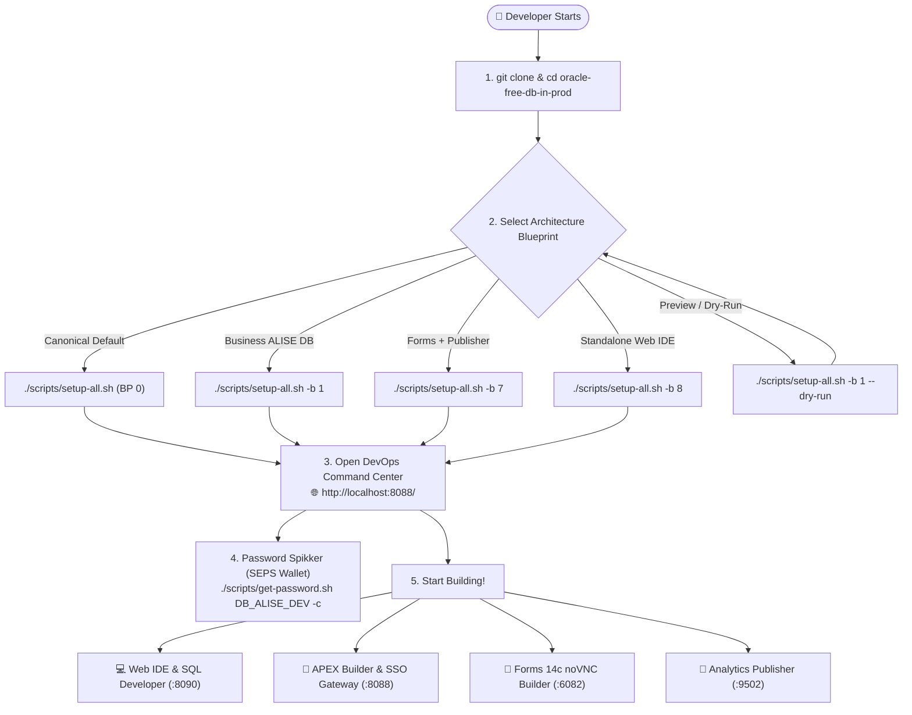
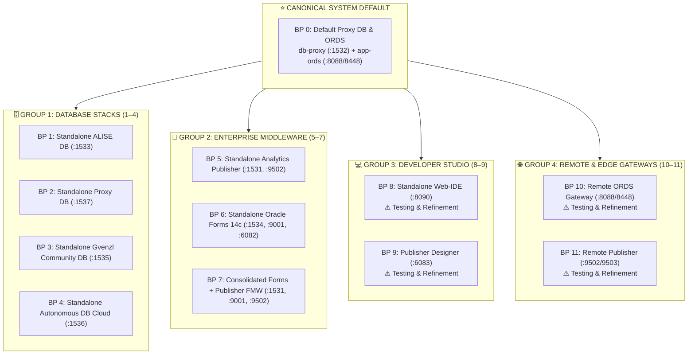

[ 🇬🇧 English ](README.md) | [ 🇪🇪 Eesti ](docs/et/README.md) | [ 🇫🇮 Suomi ](docs/fi/README.md) | [ 🇸🇪 Svenska ](docs/sv/README.md) | [ 🇱🇻 Latviešu ](docs/lv/README.md) | [ 🇱🇹 Lietuvių ](docs/lt/README.md)

# Oracle DevOps Platform

> **Production-ready, zero license cost (0 €), and 100% passwordless (SEPS Wallet) Oracle 23ai, APEX SSO Gateway, Forms 14c, Publisher, and Web IDE development & DevOps platform.**

---

## ⚡ 60-Second Quickstart

```bash
# 1. Clone the repository and enter the directory
git clone https://github.com/allanlahe/oracle-free-db-in-prod.git && cd oracle-free-db-in-prod

# 2. Launch the Canonical System Default (Blueprint 0: Default Proxy DB & ORDS Gateway)
./scripts/setup-all.sh

# Or launch the dedicated business application database (Blueprint 1: Standalone ALISE DB)
./scripts/setup-all.sh -b 1

# 3. View passwords, URLs, and clipboard helper (or open Dev Hub at http://localhost:8088/)
./scripts/get-password.sh
```

---

## 🗺️ New Developer Onboarding Journey



---

## 🏗️ Architecture Blueprints (12 Canonical Modular Building Blocks)

Oracle Free DB in Prod organizes its architecture into **12 canonical modular architecture blueprints (0 .. 11)** grouped into 4 distinct enterprise tiers:



---

## 🧩 Clean Blueprint & YAML Profile Single Source of Truth (Rule 11)

To guarantee total architectural decoupling and eliminate hardcoded configurations:

1. **Ultra-Clean Blueprints (`config/blueprints/.env.*`):**
   - Blueprints only declare high-level positive profile references for services that are needed:
     ```bash
     DB_ALISE=db-alise-oracle
     ORDS_PROFILE=ords-standard
     WEB_IDE_PROFILE=web-ide-standard
     ```
   - **Zero Negative Declarations:** Blueprints never contain `SKIP_*` variables, ports, or passwords.
   - Blueprints define *which containers are created*.

2. **Domain Encapsulation in YAML Profiles (`config/profiles/**/*.yaml`):**
   - 100% of domain specifics live in YAML profiles (`config/profiles/databases/*.yaml`, `config/profiles/web-ide/*.yaml`, `config/profiles/publisher/*.yaml`):
     - Container images, memory limits, host ports (`db_port`, `http_port`).
     - Default service names (`default_service: FREEPDB1`).
     - Tablespaces, quotas, roles, and user definitions.
     - **Inter-Database Relationships:** ORDS connection pools and cross-database connections are declared in YAML.

3. **User Extensibility: Adding Custom Blueprints 1-by-1:**
   - Any developer or AI can create a new blueprint anytime by adding a simple file:
     ```bash
     config/blueprints/.env.<ID>-<custom-name>
     ```
   - The orchestration engine (`setup-all.sh`, `deploy-blueprint.sh`, and Dev-Hub) automatically discovers the new blueprint dynamically without requiring any code changes!

---

## 🌐 Dev Hub (`http://localhost:8088/`) — Asynchronous Command Center (Rule 12)

The **Dev Hub** acts as the unified cockpit for managing services and blueprints:

- **Asynchronous Task Management:** Setup, activation, and restart operations execute in the background (`ACTIVE_TASKS`) via `dev-hub-bridge.py`.
- **Zero Browser Timeouts:** The 300s browser fetch timeout is completely eliminated.
- **Live Terminal Log Streaming:** Real-time log tails (`/api/task/status?task=...`) are streamed directly to the modal interface.
- **Multi-Tiered Card Lifecycle:**
  - ⏳ **`status-installing` (Pulsing Amber):** Setup or rebuild actively running.
  - 🟡 **`status-init` (Yellow):** Container running, database healthcheck initializing.
  - 🟢 **`status-online` (Green):** Database healthy, SEPS Wallet connected, and web endpoints responsive.
- **Delayed Verified `.active_blueprint` Confirmation:** The active blueprint marker is persisted strictly after 100% of PDB initializations, SEPS Wallet tests, and URL checks succeed.
- **1-Click Password Copying:** Decrypts passwords dynamically in-memory from Oracle Wallet straight to clipboard.

---

## 🔑 Where is My Password? (SEPS Wallet Cheat Sheet)

All credentials are cryptographically generated and stored securely in the **Oracle SEPS (Secure External Password Store) Auto-Login Wallet** and Podman Secret Store.

```bash
# View complete credential matrix table:
./scripts/get-password.sh

# Copy developer password directly to clipboard:
./scripts/get-password.sh DB_ALISE_DEV -c

# Copy APEX Instance Admin password:
./scripts/get-password.sh DB_PROXY_APEX_ADMIN -c

# Connect to database via SQLcl WITHOUT entering passwords:
sql /@DB_ALISE_DEV
```

---

## 🎯 3-Stakeholder Perspectives & Value Delivery

| Stakeholder | Key Benefits & Daily Experience | Technical Enabler |
| :--- | :--- | :--- |
| **👩‍💻 Developers** | Zero-configuration instant setup, passwordless SQLcl connections (`sql /@DB_ALISE_DEV`), 1-click login helper, and browser-based Web IDE (`:8090`). | Oracle SEPS Wallet auto-login (`cwallet.sso`), automated VS Code connection provisioning, and instant snapshot recovery. |
| **🛡️ Security & Architects** | Zero-Trust compliance, zero plaintext passwords on disk, automated TLS certificates, and 2-layer reverse proxy network isolation. | AES-256 encrypted SEPS Wallet in memory, Podman secrets, and dual-DB architecture (`db-proxy` vs `db-alise`). |
| **⚙️ DevOps & QA Admins** | 12 curated architecture blueprints, reproducible CI/CD pipelines, single-command lifecycle, and 15-second snapshot recovery. | `setup-all.sh`, `deploy-blueprint.sh`, and `scripts/snapshots/restore-golden-snapshots.sh`. |

---

## ⚡ Accelerated ~15s Recovery & Automated Version Verification

Oracle Free DB in Prod incorporates an **intelligent multi-tier Golden Snapshot Engine** that drops subsequent startup times from **~6–8 minutes down to ~15 seconds**:

1. **Automated Version Verification & Drift Detection (`.meta.json`):**
   - Every Golden Snapshot includes a machine-readable `.meta.json` contract recording APEX, Oracle DB, ORDS, and middleware versions.
   - If a version mismatch is detected, the engine rebuilds cleanly and refreshes the snapshot automatically.
2. **Instant Restoration:**
   ```bash
   # Restore baseline golden snapshot in ~15-30s:
   ./scripts/snapshots/restore-golden-snapshots.sh --force
   ```

---

## 🚀 Quickstart CLI Cheat-Sheet

```bash
# 1. Start canonical default blueprint (BP 0) or specific blueprint:
./scripts/setup-all.sh
./scripts/setup-all.sh -b 1
./scripts/setup-all.sh -b 7

# 2. View credentials & services matrix table (or copy password via -c):
./scripts/get-password.sh
./scripts/get-password.sh DB_ALISE_DEV -c

# 3. Test active web service endpoints & wallet connections:
./scripts/check-urls.sh
./scripts/check-wallet.sh

# 4. Run automated end-to-end browser & UI login test:
./scripts/test-browser-login.sh

# 5. Run multi-language (i18n) verification suite (Rule 9: EN, ET, FI, SV, LV, LT):
./tests/test-multilingual-support.sh

# 6. Golden Snapshot lifecycle (Rapid restore ~15s vs full rebuild):
./scripts/snapshots/create-golden-snapshots.sh                    # Standard baseline snapshot
./scripts/snapshots/restore-golden-snapshots.sh --force           # Rapid restore (~15–45s)
./scripts/reset-all.sh -y && ./scripts/setup-all.sh -y            # Deep clean & cold rebuild

# 7. Clean logs (filter by age) and old snapshots:
./scripts/clean-logs.sh --older-than-hours=20 -y                  # Clean logs older than 20h
./scripts/clean-logs.sh -y                                        # Clean all logs
./scripts/snapshots/clean-golden-snapshots.sh -y
```

---

## 🧭 Oracle APEX DevHub Application & APEXlang (TO-BE Roadmap)

> [!NOTE]
> **TO-BE Roadmap:** In addition to the standalone HTML Dev Hub (`docs/dev-hub.html`), a declarative in-DB **Oracle APEX Application (App 101: DevHub)** built with [Oracle APEXlang DSL](https://docs.oracle.com/en/database/oracle/apex/26.1/apxln/) is planned for future release in [`applications/`](applications/README.md). All underlying infrastructure, APEXlang compilers, and deployment pipelines are established:

- **Zero-Footprint In-DB Documentation:** Documentation is never duplicated or stored in database tables as CLOBs. A lightweight local REST Documentation Bridge (`scripts/internal/dev-hub-bridge.py` on port 8089) streams localized markdown directly from Git into Oracle APEX.
- **Automated CI/CD Pipeline:** Dedicated GitHub Actions workflow [`.github/workflows/deploy-devhub-apexlang.yml`](.github/workflows/deploy-devhub-apexlang.yml) with offline local emulation via `./scripts/test-local-ci.sh deploy-devhub-apexlang.yml --dry-run`.
- **Unit Test Suite:** Run `./tests/unit/test-apex-devhub.sh` to automatically verify schema health, PL/SQL compilation, REST markdown retrieval, and 6-language i18n coverage.

---

## 📑 Dedicated User Guides

- 🛡️ **[docs/security.md](docs/security.md) | [docs/et/security.md](docs/et/security.md):** **Security & SSO Architecture Guide** — Zero-Trust credential storage, Azure Entra-ID SSO, 5-tier TLS architecture, and least-privilege roles.
- 🏗️ **[docs/db-profiles-and-topology.md](docs/db-profiles-and-topology.md):** **Database Profiles & Topology Guide** — Clean blueprint references, YAML profile definitions, and dynamic port topology.
- 🚀 **[docs/forms-to-apex-migration-guide.md](docs/forms-to-apex-migration-guide.md):** **Oracle Forms to APEX Modernization & Migration Guide** — Automated 5-stage migration workflow, PL/SQL extraction, and APEXlang DSL vibe-coding.
- 📐 **[docs/forms-setup.md](docs/forms-setup.md):** Oracle Forms 14c Guide — Port map (9001/7001/6082), test form access (`frmservlet?form=test.fmx`), and compilation.
- 📑 **[docs/publisher-setup.md](docs/publisher-setup.md):** Analytics Publisher Guide — Port 9502 (`/xmlpserver`), RCU metadata DB, and report deployment.
- 💻 **[docs/web-ide-artifactory.md](docs/web-ide-artifactory.md):** Web IDE Guide — VS Code extensions, host connection sync, and offline GitHub Actions testing (`act`).
- 🌐 **[docs/ords-profiles-lifecycle.md](docs/ords-profiles-lifecycle.md):** ORDS Profiles & Decoupled Lifecycle Guide — Web gateway decoupling and multi-database pool routing.
- ☁️ **[docs/remote-multicloud-setup-guide.md](docs/remote-multicloud-setup-guide.md):** Remote Multi-Cloud Enterprise Setup Guide (Azure VM + OCI Autonomous Database).
- 🌐 **[docs/dev-hub.html](docs/dev-hub.html):** Developer & DevOps Command Center in 6 languages.
- 📊 **[config/blueprints/README.md](config/blueprints/README.md):** Full technical matrix for all 12 canonical architecture blueprints.
