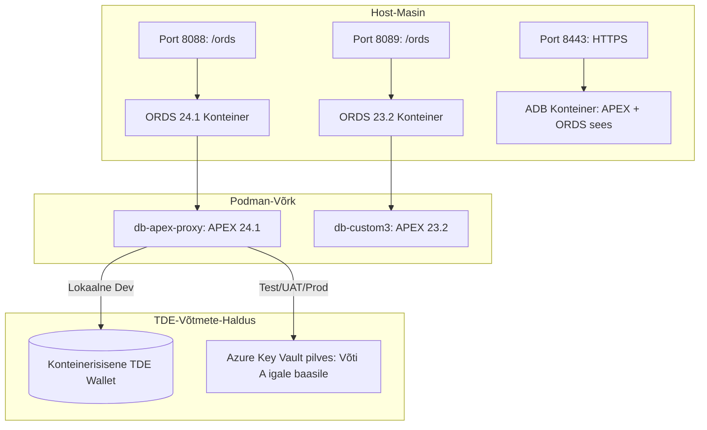

# Oracle DevOps Platform

**Miks me seda teeme ja millist kasu me saame?**


Tänapäeva enterprise-arenduses põrkutakse tihti kahe suure probleemi otsa: **litsentsikulud** ja **turvariskid**. Ärikriitiliste andmebaaside (nt tootmises jooksvad suured Oracle Enterprise andmebaasid) otsene eksponeerimine välisliidestele või arendajate kohalikele masinatele on tohutu turvarisk. Samas vajavad Forms/OAS konfiguratsioonid ja APEX-i vaherakendused stabiilset, turvalist ning kuluefektiivset andmebaasikeskkonda.

Antud lahendus lahendab need mured ühe korraga, pakkudes **litsentsitasudeta, toodangukõlblikku ja isoleeritud proxy-andmebaasi infrastruktuuri**:
*   💰 **Massiivne kulusääst (0 € litsentsitasu):** Kasutame ära tasuta Oracle Database Free (23ai) tipptehnoloogiat (JSON-Relational Duality, Kafka, APEX 26), säästes tuhandeid eurosid enterprise-litsentsidelt kohtades, kus ei vajata hiiglaslikke andmemahtusid.
*   🚀 **Maksimaalne turvalisus (Isoleeritud Proxy):** `db-apex-proxy` toimib turvapuhvrina välismaailma ja sinu sisevõrgu vahel. Äriandmed ja tundlikud ühendused on kaitstud, kuna proxy-l puuduvad DB-lingid otse sisebaasidesse.
*   🔒 **Paroolivaba ja leketevaba arendus:** Oracle Wallet (SEPS) ja Podman Secrets välistavad paroolide lekke failidesse või logidesse. Arendajad ja CI/CD logivad sisse paroolivabalt, tagades täieliku vastavuse rangetele korporatiivsetele turvastandarditele.
*   ⚡ **Sekunditega taastatav ja standardiseeritud (GitOps & Snapshots):** Skriptidega saab keskkonna sekunditega nullist püsti panna või varukoopiast algseisu taastada. See tagab, et arendaja, test- ja toodangukeskkonnad on alati 100% sünkroonis.

---

## Lahenduse Peamised Eelised (Key Benefits)

*   💰 **Tasuta tipptehnoloogia (Free Enterprise Features):** Oracle Database Free tasuta litsentsi ja tippfunktsionaalsuste kasutamine. <small>JSON-Relational Duality, natiivne JSON/CLOB andmetöötlus, Kafka integratsioon ja APEX/ORDS veebiplatvorm.</small>
*   🚀 **Ühe-käsu automaatne paigaldus (One-Command Setup):** Kogu infrastruktuur seadistatakse käsu `./scripts/setup-all.sh` abil. <small>Konteinerid, andmebaasid, APEX, ORDS, SSL/TLS, andmeskeemid ja APEX rakendused paigaldatakse automaatselt, kohandudes vastavalt `.env` failis määratud keskkonnale.</small>
*   ⚡ **Kiire taastamine (Golden Snapshot & GitOps):**
    *   **Hetktõmmis (Golden Snapshot):** Volumi varundamine ja taastamine sekunditega. <small>Võimaldab rikke või testimise korral sekunditega keskkonna algseisu taastada.</small>
    *   **IaC / GitOps taastamine:** Kogu keskkonna loogika on koodina Gitis. <small>Võimaldab keskkonna igal ajal uuesti üles ehitada täpselt valitud koodiversiooni põhjal.</small>
*   🛡️ **Range turvalisus ja paroolivaba sisselogimine (Security & SSO):**
    *   **Oracle Wallet & SEPS (Secure External Password Store):** Täielik paroolivaba autentimine läbi auto-login walleti (`cwallet.sso`). <small>Süsteemsed paroolid on krüpteeritud ja ei leki kunagi kettale, logidesse ega keskkonnamuutujatesse.</small>
    *   **SQL Developer for VS Code:** Automaatne profiilide registreerimine. <small>Arendaja saab andmebaasi sisse logida ühe klikiga ja ilma parooli käsitsi trükkimata.</small>
    *   **Transporditurve (TLS/TCPS):** Krüpteeritud TCPS liiklus pordil 2484. <small>Usaldusahel on lahendatud läbi walletisse integreeritud juursertifikaadi (`localCA.pem`), kaitstes pealtkuulamise eest.</small>
    *   **SSO ja MFA integratsioon:** Ühekordne sisselogimine läbi Azure Entra-ID (OIDC) APEX-is ja ORDS-is.
    *   **Saladuste turvalisus:** Toodanguparoolid laetakse CI/CD ajal mällu otse Azure Key Vaultist.
    *   **Vähimate õiguste printsiip:** SYS rolli asemel on lokaalsetel arendajatel piiratud `DB_DEVELOPER_ROLE`.
*   📊 **Automaatne monitooring ja logimine (Metrics & Logging):** Paigaldusaegade salvestamine. <small>Iga paigalduse ajakulu salvestatakse faili `metrics/setup_benchmarks.json` ning käivituslogid kausta `install_logs/`.</small>
*   🧹 **Kettamahu monitooring ja öine puhastus (DB Alerts & Maintenance):**
    *   **Mahu monitooring:** Slack/Teams teavitused (Webhook) andmebaasi 12 GB limiidi täitumisel (vaikimisi 85% peal).
    *   **Igaöine hooldus:** Recyclebini, auditilogide ja statistika ajaloo automaatne puhastamine (säilitusaeg 14 päeva).

> [!TIP]
> **Turvanõuanne (Security Tip):**
> Kõik süsteemsed paroolid on $\color{orange}{\text{krüpteeritud}}$ kohalikus Walletis ning andmebaasi sisselogimine on arendajale $\color{green}{\text{paroolivaba (SEPS)}}$.

---

## Arhitektuuri Ülevaade

Lahendus pakub eraldiseisvaid, ajutisi (ephemeral) Oracle Database keskkondi. See on spetsiaalselt disainitud kasutamiseks nii toodangus kui ka **lokaalse arenduskeskkonnana arendaja arvutis**, toetades paralleelselt mitut erinevat APEX ja ORDS versiooni ning Autonomous Database (ADB) režiimi:

1.  **`db-publisher` (Port 1531):** Oracle Analytics Serveri (OAS / Analytics Publisher) ja **Oracle Forms** rakenduste vajalike seadistuste, konfiguratsioonide ning metaandmete hoidmise andmebaas.
2.  **`db-apex-proxy` (Port 1532):** APEX rakenduse ja väljuvate ühenduste (REST API, Kafka) turvaline vahendusandmebaas (proxy). Turvakaalutlustel on see täielikult isoleeritud ning sellel puudub otsene andmebaasiühendus (DB link) ettevõtte sisese äriandmebaasiga.
3.  **ORDS (Port 8088 / HTTPS 8448):** REST liides ja APEX-i staatiliste ressursside vahendaja. Lokaalselt arendaja arvutis käivitatakse ORDS automaatselt konteinerina.
4.  **Mitme versiooni paralleelne tugi (Variant 1):** Skriptid suudavad igale lisatud andmebaasile (nt `db-custom3` pordil 1533) käivitada oma isoleeritud ORDS konteineri (nt `oracle-ords-custom3` pordil 8089) eraldi APEX versiooni staatiliste piltidega.
5.  **Autonomous Database (ADB) tugi:** `APEX_DB_TYPE=ADB` korral käivitatakse ametlik `adb-free:latest` pilt (sisseehitatud APEX ja ORDS-iga), tehes veebiliidese kättesaadavaks otse pordi `8443` HTTPS kaudu.



---

### Konteinerite Pildid ja Litsentsid
Projekt toetab ja kasutab Oracle'i ametlikke ning kogukonna poolt pakutavaid andmebaasi konteinereid:
*   **Ametlik Oracle Container Registry (OCR):** `container-registry.oracle.com/database/free:latest`
*   **Gvenzl kogukonna pildid:** `docker.io/gvenzl/oracle-free` (vt [Docker Hub hoidlat](https://hub.docker.com/r/gvenzl/oracle-free)), mis on optimeeritud kiiremaks käivituseks (faststart/slim versioonid).

Mõlemad andmebaasi pildid põhinevad tasuta **Oracle Free litsentsil**, mis lubab täielikku ja tasuta kasutamist nii arenduses kui ka toodangus (litsentsitingimused on kättesaadavad [Oracle Free License lehel](https://www.oracle.com/downloads/licenses/oracle-free-license.html)).

---

## Tarkvaralised Nõuded (Requirements)

Andmebaasi skeemide ja APEX rakenduste automaatseks paigaldamiseks on vajalik **SQLcl** utiliit.
*   **Soovituslik lähenemine:** Ava projekt **VS Code** kaudu, kuhu on paigaldatud laiendus **[Oracle SQL Developer for VS Code](https://marketplace.visualstudio.com/items?itemName=Oracle.sql-developer)**. See sisaldab sisseehitatud SQLcl-i, mille käivitusskript `./scripts/setup-all.sh` automaatselt tuvastab.
*   **Automaatne konteineri fallback:** Kui skript ei leia kohalikku SQLcl-i, käivitatakse kõik migratsioonid ja APEX importimised automaatselt ajutise **SQLcl konteineri** (`SQLCL_CONTAINER_IMAGE`) abil.

---

## Kiire Lokaalne Alustamine (Quick Start)

### 1. Kopeeri ja seadista keskkonnamuutujad
Kopeeri näidisfailist kohalik konfiguratsioonifail `.env`:
```bash
cp .env.example .env
```

> [!IMPORTANT]
> **Enne paigalduse käivitamist:**
> Ava loodud fail **[.env](.env)** ja seadista vajalikud konteinerite profiilid (nt `PROXY_DB=proxy-adb-oracle`, `PUBLISHER_DB=appinfra-standard-gvenzl`, `LIS_DB=proxy-standard-gvenzl`).
> 
> * Määra iga konteineri nimi ja selle YAML profiil lihtsa paari abil: `<NIMI>_DB=<profiili_nimi>`.
> * Oracle Walleti parool genereeritakse ja salvestatakse turvaliselt faili `config/secrets/wallet_password.txt` (mida `.gitignore` tõttu ei lisata kunagi Giti).
> 
> Üksikasjaliku parameetrite selgituse ja juhendi kaugserverite (Remote DB) seadistamiseks leiad dokumendist **[docs/components-and-remote-db.md](docs/components-and-remote-db.md)**.

### 2. Paigalda ja käivita keskkond
Kasuta keskkonna loomiseks ja käivitamiseks meie mugavaid shell-skripte (mis teevad kogu compose-i ja orkestreerimise sinu eest automaatselt ära):

*   🚀 **Esmakordne täispaigaldus** (loo konteinerid, andmebaasid, ORDS, APEX ja paigalda patchid):
    ```bash
    ./scripts/setup-all.sh
    ```
*   💻 **Igapäevane käivitamine** (ärata juba olemasolevad konteinerid ellu ilma uuesti paigaldamata):
    ```bash
    ./scripts/start-containers.sh
    ```
*   🔄 **Lokaalne offline CI/CD tarne testimine** (SQLcl Projects & GitHub Actions lokaalne simulaator):
    ```bash
    ./scripts/test-local-ci.sh
    ```
    *Detailne CI/CD seadistusjuhend: [docs/github-actions-cicd.md](docs/github-actions-cicd.md).*
*   🗑️ **Keskkonna peatamine ja kustutamine** (vabasta kettaruum või alusta puhtalt lehelt):
    ```bash
    ./scripts/reset-all.sh all
    ```


---

## APEX Testimise ja Sisselogimise Aadressid

*   **APEX Tööruum (Workspace):** `https://localhost:8443/ords/apex` (ADB režiim: port `8443` | Standard DB režiim: port `8448`)
*   **APEX Administraator (Admin):** `https://localhost:8443/ords/apex_admin`
*   **Tööruum (Workspace):** `PROXY_WORKSPACE`
*   **Admin Kasutaja:** `ADMIN`
*   **Admin Parool:** Salvestatakse turvaliselt **SEPS Walletisse** (loe käsurealt: `./scripts/internal/view-wallet-credential.sh ADMIN`).

---

## 📂 Dokumentatsiooni Register (Documentation Index)

Kogu detailne teave ja juhendid on jaotatud teemakohastesse failidesse. Kasuta allolevat tabelit kiireks navigeerimiseks:

| Dokument | Kirjeldus |
| :--- | :--- |
| 🔌 **[connections/README.md](connections/README.md)** | VS Code SQL Developer ühenduste importimine ja SSL/TLS seadistused. |
| 🗄️ **[docs/db-profiles-and-topology.md](docs/db-profiles-and-topology.md)** | Dünaamiliste YAML Profiilide (`config/profiles/databases/` & `config/profiles/web-ide/`) juhend. |
| 💻 **[docs/web-ide-artifactory.md](docs/web-ide-artifactory.md)** | Konteineriseeritud Web IDE (`code-server`), VS Code laiendused ja GitHub Actions lokaalne testimine (`act`). |
| 🪟 **[docs/windows-enterprise-setup.md](docs/windows-enterprise-setup.md)** | Windows Enterprise (Zero Trust) turvatud Podman liivakast Web IDE jaoks. |
| 🛡️ **[docs/turvalisus.md](docs/turvalisus.md)** | Paroolihaldus, andmebaasi rollid (`DB_DEVELOPER_ROLE`) ja Azure Entra-ID (SSO). |
| 🔑 **[docs/oracle-wallet-architecture-plan.md](docs/oracle-wallet-architecture-plan.md)** | Oracle Walleti (SEPS & TLS) arhitektuur ja tehniline realiseerimise plaan. |
| ⚙️ **[scripts/README.md](scripts/README.md)** | Kõikide käsurea skriptide ja abiskriptide detailne kasutusjuhend. |
| 🧪 **[tests/README.md](tests/README.md)** | Automaattestide käivitamise ja testimiskava peamine juhend. |
| 📊 **[tests/test-report.md](tests/test-report.md)** | Viimase E2E ja HTTPS testi läbiviimise tulemuste aruanne. |
| 📈 **[docs/oracle-free-db-monitoring.md](docs/oracle-free-db-monitoring.md)** | Andmebaasi kettamahu monitooring, Scheduler Jobid ja auditilogide hooldus. |
| 📉 **[docs/oracle-free-db-initial-state.md](docs/oracle-free-db-initial-state.md)** | Andmebaasi kettamahu ja tablespace-ide mõõdetud algseis pärast paigaldust. |
| 📦 **[docs/apex-apps-deployment.md](docs/apex-apps-deployment.md)** | APEX rakenduste automaatne järjestikuline importimine kaustast `binaries/`. |
| 🌐 **[docs/standalone-ords.md](docs/standalone-ords.md)** | Eraldiseisva standalone ORDS-i paigaldusjuhend Linux serverisse. |
| 🗃️ **[docs/artifactory-setup.md](docs/artifactory-setup.md)** | Sisevõrgu Artifactory hoidla seadistamine tarkvara allalaadimiseks. |
| 🩹 **[patches/README.md](patches/README.md)** | APEX-i bundle patchide ja one-off patchide paigaldamise juhend. |
| 🔌 **[docs/components-and-remote-db.md](docs/components-and-remote-db.md)** | Komponentide eraldi käivitamise ja kaug-andmebaaside (Remote DB) seadistamise juhend. |
| 📊 **[docs/setup-all-workflow.md](docs/setup-all-workflow.md)** | Paigaldusprotsessi voodiagramm ja arhitektuursed sammud (SQLcl fallback, idempotentsus). |
| 🔮 **[docs/future-plans.md](docs/future-plans.md)** | Tulevaste laienduste, CI/CD, Web-IDE ja Analytics Publisheri analüüs ning plaanid. |

> [!NOTE]
> **Arendusvahend ja Tehisintellekt (AI & Tooling)**
>
> Selle projekti koodibaasi täiendused, seadistused ja automaatse testimise kava on loodud ja valideeritud kasutades järgmiseid tööriistu:
> *   **Arenduskeskkond / Agent:** [Antigravity IDE](https://github.com/google-deepmind) (Google DeepMindi *Advanced Agentic Coding* tiimi arendatud agentne paariprogrammeerimise abiline).
> *   **LLM mudel:** Peamiselt **Gemini 3.5 Flash (High)** ja **Gemini 3.6 Flash (High)** tehisintellekti mudel.