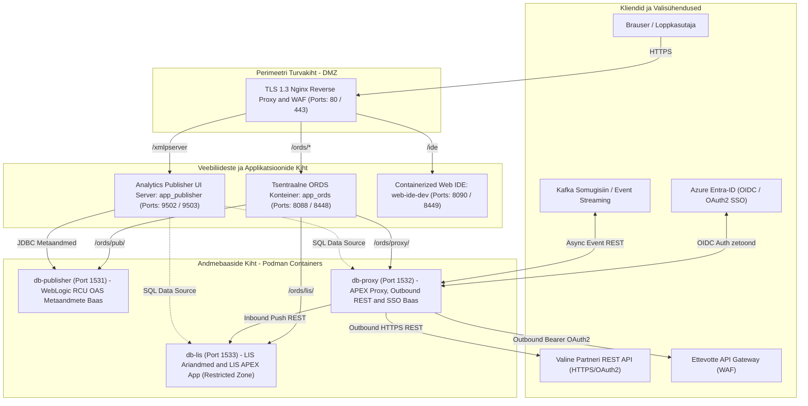
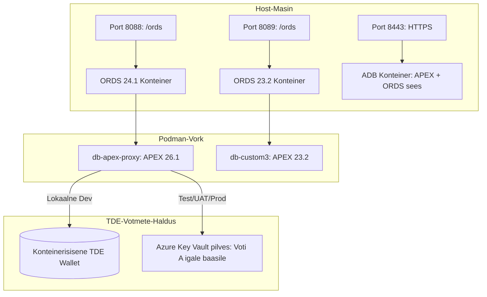

# Oracle DevOps Platform

**Miks me seda teeme ja millist kasu me saame?**


Tänapäeva enterprise-arenduses põrkutakse tihti kahe suure probleemi otsa: **litsentsikulud** ja **turvariskid**. Ärikriitiliste andmebaaside (nt tootmises jooksvad suured Oracle Enterprise andmebaasid) otsene eksponeerimine välisliidestele või arendajate kohalikele masinatele on tohutu turvarisk. Samas vajavad Forms/OAS konfiguratsioonid ja APEX-i vaherakendused stabiilset, turvalist ning kuluefektiivset andmebaasikeskkonda.

Antud lahendus lahendab need mured ühe korraga, pakkudes **litsentsitasudeta, toodangukõlblikku ja isoleeritud proxy-andmebaasi infrastruktuuri**:
*   💰 **Massiivne kulusääst (0 € litsentsitasu):** Kasutame ära tasuta Oracle Database Free (23ai) tipptehnoloogiat (JSON-Relational Duality, Kafka, APEX 26), säästes tuhandeid eurosid enterprise-litsentsidelt kohtades, kus ei vajata hiiglaslikke andmemahtusid.
*   🚀 **Maksimaalne turvalisus (Isoleeritud Proxy):** `db-apex-proxy` toimib turvapuhvrina välismaailma ja sinu sisevõrgu vahel. Äriandmed ja tundlikud ühendused on kaitstud, kuna proxy-l puuduvad DB-lingid otse sisebaasidesse.
*   🔒 **Paroolivaba ja leketevaba arendus:** Oracle Wallet (SEPS) ja Podman Secrets välistavad paroolide lekke failidesse või logidesse. Arendajad ja CI/CD logivad sisse paroolivabalt, tagades täieliku vastavuse rangetele korporatiivsetele turvastandarditele.
*   ⚡ **Sekunditega taastatav ja standardiseeritud (GitOps & Snapshots):** Skriptidega saab keskkonna sekunditega nullist püsti panna või varukoopiast algseisu taastada. See tagab, et arendaja, test- ja toodangukeskkonnad on alati 100% sünkroonis.

---

## Lahenduse Peamised Eelised (Key Benefits)

*   💰 **Tasuta tipptehnoloogia (Free Enterprise Features):** Oracle Database Free tasuta litsentsi ja tippfunktsionaalsuste kasutamine. <small>JSON-Relational Duality, natiivne JSON/CLOB andmetöötlus, Kafka integratsioon ja APEX/ORDS veebiplatvorm.</small>
*   🚀 **Ühe-käsu automaatne paigaldus (One-Command Setup):** Kogu infrastruktuur seadistatakse käsu `./scripts/setup-all.sh` abil. <small>Konteinerid, andmebaasid, APEX, ORDS, SSL/TLS, andmeskeemid ja APEX rakendused paigaldatakse automaatselt, kohandudes vastavalt `.env` failis määratud keskkonnale.</small>
*   ⚡ **Kiire taastamine (Golden Snapshot & GitOps):**
    *   **Hetktõmmis (Golden Snapshot):** Volumi varundamine ja taastamine sekunditega. <small>Võimaldab rikke või testimise korral sekunditega keskkonna algseisu taastada.</small>
    *   **IaC / GitOps taastamine:** Kogu keskkonna loogika on koodina Gitis. <small>Võimaldab keskkonna igal ajal uuesti üles ehitada täpselt valitud koodiversiooni põhjal.</small>
*   🛡️ **Range turvalisus ja paroolivaba sisselogimine (Security & SSO):**
    *   **Oracle Wallet & SEPS (Secure External Password Store):** Täielik paroolivaba autentimine läbi auto-login walleti (`cwallet.sso`). <small>Süsteemsed paroolid on krüpteeritud ja ei leki kunagi kettale, logidesse ega keskkonnamuutujatesse.</small>
    *   **SQL Developer for VS Code:** Automaatne profiilide registreerimine. <small>Arendaja saab andmebaasi sisse logida ühe klikiga ja ilma parooli käsitsi trükkimata.</small>
    *   **Transporditurve (TLS/TCPS):** Krüpteeritud TCPS liiklus pordil 2484. <small>Usaldusahel on lahendatud läbi walletisse integreeritud juursertifikaadi (`localCA.pem`), kaitstes pealtkuulamise eest.</small>
    *   **SSO ja MFA integratsioon:** Ühekordne sisselogimine läbi Azure Entra-ID (OIDC) APEX-is ja ORDS-is.
    *   **Saladuste turvalisus:** Toodanguparoolid laetakse CI/CD ajal mällu otse Azure Key Vaultist.
    *   **Vähimate õiguste printsiip:** SYS rolli asemel on lokaalsetel arendajatel piiratud `DB_DEVELOPER_ROLE`.
*   📊 **Automaatne monitooring ja logimine (Metrics & Logging):** Paigaldusaegade salvestamine. <small>Iga paigalduse ajakulu salvestatakse faili `metrics/setup_benchmarks.json` ning käivituslogid kausta `install_logs/`.</small>
*   🛡️ **Automaatne logide saniteerimine (Log Sanitization):** Logivoo automaatne filtreerimine. <small>Skript `scripts/internal/sanitize-logs.sh` asendab logidest (`install_logs/*.log`) kõik `ACCESS_TOKEN`, `token=...` ja paroolid maskiga `***MASKED***` (ajutiselt väljalülitatav erandkorras keskkonnamuutujaga `DEBUG_LOG_UNSANITIZED=true`).</small>
*   🧹 **Kettamahu monitooring ja öine puhastus (DB Alerts & Maintenance):**
    *   **Mahu monitooring:** Slack/Teams teavitused (Webhook) andmebaasi 12 GB limiidi täitumisel (vaikimisi 85% peal).
    *   **Igaöine hooldus:** Recyclebini, auditilogide ja statistika ajaloo automaatne puhastamine (säilitusaeg 14 päeva).

> [!TIP]
> **Turvanõuanne (Security Tip):**
> Kõik süsteemsed paroolid on **krüpteeritud** kohalikus Walletis ning andmebaasi sisselogimine on arendajale **paroolivaba (SEPS)**.

---

## LIS Süsteemi Üldine Põhiarhitektuur (Primary Enterprise Architecture)

Süsteem pakub **4-kihilist ettevõttetaseme arhitektuuri** LIS (Laboratory Information System) ja sellega seotud veebirakenduste toodangukõlblikuks, isoleeritud ning paroolivabaks käitamiseks:

| Rakendus / Teenus | Konteineri Nimi | Võrgutsoon / Asukoht | Pordid & URL-id | Seotud Andmebaas | Võrgu Ligipääs & ACL Reeglid |
| :--- | :--- | :--- | :--- | :--- | :--- |
| **🧪 LIS Ärirakendus** *(Labori APEX App & PL/SQL)* | `db-lis` | **Ärivõrk** *(Restricted DB Zone)* | `https://localhost:8448/ords/lis/` (Port 1533) | **`db-lis`** *(LIS Äribaas)* | 🚫 **0 Väljuvat päringut internetti.** Saab sissetulevaid andmeid Proxy'lt (Inbound Push REST / DB-Link). |
| **🛡️ APEX Proxy & SSO Rakendus** *(OIDC / REST Proxy)* | `db-proxy` | **DMZ / Proxy Võrk** *(Edge Zone)* | `https://localhost:8448/ords/proxy/` (Port 1532) | **`db-proxy`** *(Proxy DB)* | 🌐 **Outbound HTTP/HTTPS aktiivne.** Suhtleb väliste API-de, Azure Entra-ID ja Kafkaga. |
| **📊 Analytics Publisher UI** *(Pixel Perfect Reports)* | `app_publisher` | **Rakenduste Võrk** *(App Zone)* | `http://localhost:9502/xmlpserver` | **`db-publisher`** *(Metadata DB)* | 🔗 Pärib metaandmeid `db-publisher`-ist ja aruannete andmeid `db-lis` / `db-proxy` baasist. |
| **⚡ Tsentraalne ORDS Server** *(Multi-Pool ORDS)* | `app_ords` | **Rakenduste Võrk** *(App Zone)* | `https://localhost:8448/ords/` (Port 8088/8448) | Kolm andmebaasi (`db-proxy`, `db-lis`, `db-publisher`) | 🔀 Suunab ruute: `/ords/proxy/`, `/ords/lis/`, `/ords/pub/`. |

### 📐 LIS Põhiarhitektuuri Näidisdiagramm (Mermaid Topology)



---

## Arhitektuuri Ülevaade

Lahendus pakub eraldiseisvaid, ajutisi (ephemeral) Oracle Database keskkondi. See on spetsiaalselt disainitud kasutamiseks nii toodangus kui ka **lokaalse arenduskeskkonnana arendaja arvutis**, toetades paralleelselt mitut erinevat APEX ja ORDS versiooni ning Autonomous Database (ADB) režiimi:

1.  **`db-publisher` (Port 1531):** Oracle Analytics Serveri (OAS / Analytics Publisher) ja **Oracle Forms** rakenduste vajalike seadistuste, konfiguratsioonide ning metaandmete hoidmise andmebaas.
2.  **`db-apex-proxy` (Port 1532):** APEX rakenduse ja väljuvate ühenduste (REST API, Kafka, Azure Entra ID) turvaline vahendusandmebaas (proxy). Turvakaalutlustel on see täielikult isoleeritud.
3.  **`db-lis` (Port 1533):** Ärilabori (LIS) andmetabelite, PL/SQL äriloogika ja LIS APEX rakenduse andmebaas ilma väljuva interneti ligipääsuta.
4.  **`app_ords` (Port 8088 / HTTPS 8448):** Tsentraalne Multi-Pool ORDS teenus.
5.  **`app_publisher` (Port 9502 / HTTPS 9503):** Analytics Publisheri veebiliides (`/xmlpserver`).



---

### Konteinerite Pildid ja Litsentsid

1. **Andmebaasi Konteinerid (Oracle Free):**
   - **Ametlik Oracle Container Registry (OCR):** `container-registry.oracle.com/database/free:latest`
   - **Gvenzl kogukonna pildid:** `docker.io/gvenzl/oracle-free` (vt [Docker Hub hoidlat](https://hub.docker.com/r/gvenzl/oracle-free)), mis on optimeeritud kiiremaks käivituseks.
   - Mõlemad andmebaasi pildid põhinevad tasuta **Oracle Free litsentsil**, mis lubab tasuta kasutamist nii arenduses kui ka toodangus (litsentsitingimused: [Oracle Free License](https://www.oracle.com/downloads/licenses/oracle-free-license.html)).

2. **⚠️ Oluline Litsentsihoiatus (Oracle Analytics Publisher License Disclaimer):**

> [!WARNING]
> **Analytics Publisheri Kasutamine ja Litsentsireeglid:**
> * **Vajab ametlikku Oracle litsentsi:** Oracle Analytics Publisheri (Pixel Perfect / Oracle Analytics Server) paigaldamine ja kasutamine toodangus või ettevõtte sisekeskkonnas nõuab kehtiva Oracle ärilitsentsi olemasolu (nt *Oracle Analytics Publisher*, *Oracle Business Intelligence Publisher* või *Oracle Analytics Server Administrator*).
> * **Skriptid ei anna kasutusluba:** Antud repositooriumi automaatskriptid ja konteinerimallid on infrastruktuuri tööriistad ning **ei anna ega asenda tarkvara kasutusõigust/litsentsi**. Nõuetekohane litsents peab olema soetatud enne tarkvara paigaldamist.
> * **POC ja Õppeotstarbeline Kasutus:** Prooviprojektide (POC), õppimise ja toote sobivuse hindamise raames võib tarkvara kasutada piiratud kujul vastavalt ametlikele [Oracle Technology Network (OTN) License Agreement](https://www.oracle.com/downloads/licenses/standard-license.html) tingimustele. OTN litsents lubab tarkvara allalaadimist ja kasutamist üksnes prototüüpimiseks, õppimiseks ja testimiseks, kuid **keelab kommettsiaalse ja toodangulise kasutamise ilma soetatud litsentsita**.

---

## Tarkvaralised Nõuded (Requirements)

Andmebaasi skeemide ja APEX rakenduste automaatseks paigaldamiseks on vajalik **SQLcl** utiliit.
*   **Soovituslik lähenemine:** Ava projekt **VS Code** kaudu, kuhu on paigaldatud laiendus **[Oracle SQL Developer for VS Code](https://marketplace.visualstudio.com/items?itemName=Oracle.sql-developer)**. See sisaldab sisseehitatud SQLcl-i, mille käivitusskript `./scripts/setup-all.sh` automaatselt tuvastab.
*   **Automaatne konteineri fallback:** Kui skript ei leia kohalikku SQLcl-i, käivitatakse kõik migratsioonid ja APEX importimised automaatselt ajutise **SQLcl konteineri** (`SQLCL_CONTAINER_IMAGE`) abil.

---

---

## 🌐 Kaug-Linux (Remote Linux Server) Paigaldus ja Paigaldusrežiimid

Lahendus toetab paigaldamist nii kohalikus arendusarvutis kui ka **Kaug-Linux serveris (Oracle Linux 8/9, RHEL, Ubuntu)** nii konteineritena kui ka ilma konteinerita (Natiivne Linux režiim).

### 1. Natiivse ja Konteinerrežiimi Lülitid Peaskriptis (`setup-all.sh`)

Saad peaskripti `./scripts/setup-all.sh` abil kontrollida Publisheri ja ORDS-i paigaldusviisi:

```bash
# A. Standardne konteineripõhine paigaldus (Vaikimisi):
./scripts/setup-all.sh -y

# B. Analytics Publisheri Natiivne Linux paigaldus (Ilma konteinerita):
PUBLISHER_INSTALL_MODE=native ./scripts/setup-all.sh -y

# C. ORDS-i Standalone Natiivne Linux paigaldus (Ilma konteinerita):
ORDS_INSTALL_MODE=standalone ./scripts/setup-all.sh -y

# D. Välise Ettevõtte ORDS-i kasutus (Lokaalset ORDS teenust ei käivitata):
./scripts/setup-all.sh --no-ords
```
*(Need parameetrid saab püsivalt määrata failis `.env`: `PUBLISHER_INSTALL_MODE=native`, `ORDS_INSTALL_MODE=standalone`)*

### 2. Aruannete Paigaldusallikad ja Prioriteedid (`deploy-publisher-reports.sh`)

Äriaruannete ja trükiste paigaldamisel kontrollib skript [`./scripts/internal/deploy-publisher-reports.sh`](scripts/internal/deploy-publisher-reports.sh) allikaid automaatses prioriteedijärjekorras:

1. 🥇 **Artifactory Ehituspakett (`PUBLISHER_REPORTS_ARTIFACTORY_URL`):** *(Kõrgeim prioriteet)*  
   Kui määratud, laadib skript Artifactory'st alla ametliku valmisehitatud arhiivi (`.zip` / `.tar.gz`). Toodangukeskkondades (Production / Staging) on see eelisolik, tagades CI/CD poolt verifitseeritud paketi paigalduse.
2. 🥈 **Decoupled Git Repositoorium (`PUBLISHER_REPORTS_GIT_URL`):**  
   Kui Artifactory URL-i pole määratud, tõmbab skript uued koodifailid otse disainerite eraldiseisvast Giti hoidlast.
3. 🥉 **Lokaalne Arenduskaust (`publisher-reports/`):**  
   Kui kummagi võrguallika muutujaid pole määratud, võetakse aruanded kohalikust kaustast.

### 3. Kaug-Linux Serveri Haldusskriptid (`scripts/internal/`)

Publisheri ja WebLogic teenuste kiireks haldamiseks kaug-serveris:
* 🔍 **[`./scripts/publisher/status-publisher.sh`](scripts/publisher/status-publisher.sh):** Kontrollib AdminServeri, Publisher UI (9502) ja DB ühenduse olekut.
* 🔄 **[`./scripts/publisher/restart-publisher.sh`](scripts/publisher/restart-publisher.sh):** Taaskäivitab WebLogic teenused puhtalt ilma konteinerit taaskäivitamata.
* 💾 **[`./scripts/publisher/backup-publisher-catalog.sh`](scripts/publisher/backup-publisher-catalog.sh):** Pakib ja varundab Publisheri aruannete mallid arhiivi `backups/publisher_catalog_*.tar.gz`.
* 🔌 **[`./scripts/internal/test-publisher-ds.sh`](scripts/internal/test-publisher-ds.sh):** Kontrollib Publisher API ja target andmebaasi ühendust.
* 🚀 **[`./scripts/publisher/deploy-publisher-reports.sh`](scripts/publisher/deploy-publisher-reports.sh):** Sünkroniseerib ja paigaldab aruanded (Artifactory, Git või lokaalne kaust).

---

### 1. Vali ja aktiveeri arhitektuurne kavand (Blueprint)
Aktiveeri 13 ametlikust blueprintist sobivaim (vaikimisi Blueprint 3: Proxy DB + LIS DB + APEX + ORDS):
```bash
# Aktiveeri 2-kihiline tootmiskavand:
./scripts/setup-all.sh -b 3

# Või kopeeri käsitsi failist:
cp config/blueprints/.env.3-db-lis-apex-ords-with-proxy .env
```

> [!IMPORTANT]
> **Arhitektuursed Blueprintid (`config/blueprints/`):**
> Kõik 13 valmis toetatud konfiguratsiooni asuvad kaustas [`config/blueprints/`](config/blueprints/). Nimekirja kuvamiseks ilma käivitamata kasuta: `./scripts/setup-all.sh -l`.

### 2. Arendaja ja Administraatori Igapäevased Tööriistad
*   🔑 **Paroolide lugemine Walletist:** `./scripts/get-password.sh <ALIAS>` (nt `DB_PROXY_DEV`, `DB_PROXY_APEX_ADMIN`)
*   🌐 **Veebiteenuste tervisekontroll:** `./scripts/check-urls.sh` (kontrollib kõigi basseinide ja URL-ide vastuseid)
*   🔑 **SEPS Walleti ühenduste test:** `./scripts/check-wallet.sh` (paroolivabade TNS ühenduste diagnostika)
*   💾 **SQLcl käsurida:** `./scripts/sqlcl.sh /@DB_PROXY_DEV` (paroolivaba CLI konsool)
*   👤 **Arendajakonto loomine:** `./scripts/create-developer.sh` (loob personaalse DEV kasutaja)
*   🔌 **VS Code ühendused:** `./scripts/register-connections.sh` (sünkroniseerib SQL Developer laienduse)
*   💻 **Igapäevane käivitamine:** `./scripts/start-containers.sh` (äratab seisatud konteinerid ilma uuesti paigaldamata)
*   🔄 **Lokaalne CI/CD testimine:** `./scripts/test-local-ci.sh` (GitHub Actions lokaalne simulaator)
*   🗑️ **Keskkonna puhastamine:** `./scripts/reset-all.sh -y` (vabastab kettaruumi või alustab nullist)

> [!TIP]
> **🏢 Range Turvapoliitikaga Ettevõttekeskkond (Zero-Root / No Sudo):**
> Kui arendajal puuduvad masinas `sudo` / `root` administraatoriõigused operatsioonisüsteemi sertifikaadihoidla muutmiseks:
> 1. **Puhas HTTP režiim (0 hoiatusi):** Kasuta otse HTTP porti `http://localhost:8088/ords/` (brauserid nagu Chrome/Edge käsitlevad `localhost` HTTP-d vaikimisi turvalisena ega nõua sertifikaate).
> 2. **Brauseri Localhost SSL lipu lubamine:** Ava brauseris `chrome://flags/#allow-insecure-localhost` (või `edge://flags/#allow-insecure-localhost`) -> vali **Enabled**.
> 3. **Chrome/Edge ühekliki möödapääs:** Kui avad `https://localhost:8448/ords/`, trüki lehel olles klaviatuuril pimesi sõna **`thisisunsafe`**.
> 4. **Windows tavakasutaja hoidla:** Windowsis töötab `certutil -user -addstore Root config\certs\localCA.pem` 100% tavakasutaja õigustes ilma administraatori loata.

> [!TIP]
> **Pre-flight Kettamahu & Ressursside Kaitse (Resource Guard):**
> `setup-all.sh` teostab käivitamisel eellennukontrolli (`check-prerequisites.sh`), kontrollides vaba RAM-i ja Podman VM vaba kettamahtu. Kui vaba ruumi on alla 15 GB, kuvatakse hoiatus koos soovitusega `podman system prune -a`.


---

## 🏗️ Keskkonna 18 Ametlikku Arhitektuurset Kavandit (Environment Blueprints)

Süsteem sisaldab **18 ametlikku arhitektuurset kavandit (Blueprints)** kaustas [`config/blueprints/`](config/blueprints/), mis katavad kõik võimalikud tootmis- ja arenduskombinatsioonid (erinevad andmebaasi pildid nagu official Oracle DB 23ai, Gerald Venzl Community DB, Autonomous ADB emulator; brauseripõhine VS Code Web IDE; Oracle Forms 14c ja Analytics Publisher).

### 🚀 Käivitamine Käsuliinilt (Terminal):

```bash
# 1. TOODANG & ARENDUS (Säilitab andmed, No-Reset):
./scripts/setup-all.sh -b 3           # Aktiveeri soovitatud 2-kihiline tootmiskavand
./scripts/setup-all.sh --blueprint 18 # Aktiveeri Forms + Embedded ORDS tootmiskavand
./scripts/setup-all.sh -l             # Kuva kõigi 18 blueprinti tabel ilma käivitamata

# 2. AUTOMAATTESTIMINE & CI/CD (Puhas algseis, koos reset-all -y):
./scripts/setup-all.sh -tb 3          # Testi üksikut blueprinti puhtalt lehelt
./scripts/setup-all.sh -tb 1,5,8,18   # Testi valitud blueprintide jada
./scripts/setup-all.sh -tb all        # Testi KÕIKI 18 blueprinti järjest
```

| Nr | Blueprinti Fail | Käivitatavad Konteinerid | Peamine Eesmärk ja Arhitektuur |
| :--- | :--- | :--- | :--- |
| **1** | `.env.1-only-db-lis` | `db-lis` | Ainult LIS Andmebaas ilma veebiteenusteta. |
| **2** | `.env.2-db-lis-with-apex-ords` | `db-lis`, `app-ords` | LIS Baas + APEX 26.1 + ORDS üheskoos (Monoliit). |
| **3** | `.env.3-db-lis-apex-ords-with-proxy` | `db-proxy`, `db-lis`, `app-ords` | **🌟 VAIKIMISI:** 2-Kihiline turvaline võrgutopoloogia (Proxy + LIS). |
| **4** | `.env.4-only-app-publisher` | `db-publisher` | Eraldiseisev Analytics Publisheri metaandmete andmebaas. |
| **5** | `.env.5-only-ords` | `app-ords` | Standalone ORDS Gateway kaug- ja pilveandmebaasidele. |
| **6** | `.env.6-ords-with-apex` | `db-proxy`, `app-ords` | Proxy andmebaas + APEX + ORDS gateway. |
| **7** | `.env.7-all-services-together` | `db-publisher`, `db-proxy`, `db-lis`, `app-ords`, `app-publisher` | Täielik 4-Kihiline Ettevõtte Tootmiskeskkond. |
| **8** | `.env.8-gvenzl-dev-light` | `db-lis-gvenzl` | Kergekaaluline Gerald Venzl DB CI/CD testideks. |
| **9** | `.env.9-dev-workstation-with-web-ide` | `db-lis`, `app-ords`, `web-ide-dev` | **Zero-Install Arendaja Töōkoht** (VS Code Brauseris). |
| **10** | `.env.10-hybrid-multi-vendor-db` | `db-proxy-oracle`, `db-lis-gvenzl`, `app-ords` | Mitme eri andmebaasi pildi (Oracle + Gvenzl) klaster. |
| **11** | `.env.11-cloud-adb-with-web-ide` | `db-proxy-adb`, `app-ords`, `web-ide-dev` | Pilve Autonomous DB emuleerimine + Web IDE. |
| **12** | `.env.12-publisher-gvenzl-with-web-ide` | `db-publisher-gvenzl`, `app-publisher`, `web-ide-dev` | Pixel-Perfect aruandlus kergel Gvenzl DB-l. |
| **13** | `.env.13-full-enterprise-sandbox-web-ide` | 3 DB-d, `app-ords`, `app-publisher`, `web-ide-dev` | **Täielik ettevõtte pilvelabor (5 konteinerit).** |
| **14** | `.env.14-forms-with-dedicated-db` | `db-forms`, `app-forms` | **Oracle Forms 14c (14.1.2)** eraldiseisval andmebaasil. |
| **15** | `.env.15-forms-full-enterprise` | `db-forms`, `db-lis`, `db-proxy`, `app-forms`, `app-ords` | **Täielik Enterprise Forms Stack:** Forms + Forms RCU DB + Custom DB + APEX Proxy DB + ORDS. |
| **16** | `.env.16-forms-minimal-hybrid` | `db-proxy`, `db-lis`, `app-forms`, `app-ords` | **Minimaalne Hübriid:** Forms + Kombineeritud Forms/APEX Proxy DB + Custom DB + ORDS. |
| **17** | `.env.17-forms-all-in-one-db` | `db-proxy`, `app-forms`, `app-ords` | **All-in-One DB Katsevariant:** Forms + Kõik skeemid ühes Free DB-s + ORDS. |
| **18** | `.env.18-forms-with-embedded-ords` | `db-proxy`, `app-forms` | **Forms + Sisseehitatud ORDS Jetty:** Kõik-ühes rakendusserver (Forms 9001 + ORDS 8088 ühes `app-forms` konteineris) + DB. |

👉 Täielik kasutusjuhend ja detailne maatriks: [`config/blueprints/README.md`](config/blueprints/README.md) ja [`tests/README.md`](tests/README.md).

---

## 🌐 Veebirakenduste ja Liideste Aadressid (Web Services & Portals)

| Rakendus / Teenus | Sihtkoha URL | Autentimise / Kasutaja Info | Parooli Pärimine (SEPS Wallet) |
| :--- | :--- | :--- | :--- |
| 🛠 **APEX App Builder** | `https://localhost:8448/ords/<pool>/r/apex/workspace-sign-in/oracle-apex-sign-in`<br>*(või `http://localhost:8088/ords/<pool>/r/apex/workspace-sign-in/oracle-apex-sign-in`)* | Workspace: `DEV_WS` / Kasutaja: `DEV` | `./scripts/get-password.sh DB_<PREFIX>_DEV` |
| ⚙️ **APEX Instance Admin** | `https://localhost:8448/ords/<pool>/apex_admin`<br>*(või `http://localhost:8088/ords/<pool>/apex_admin`)* | Workspace: `INTERNAL` / Kasutaja: `ADMIN` | `./scripts/get-password.sh DB_<PREFIX>_APEX_ADMIN` |
| 📊 **ORDS Database Actions** | `https://localhost:8448/ords/<pool>/_/landing`<br>*(või `http://localhost:8088/ords/<pool>/`)* | Kasutaja: `ADMIN` / DB Skeem | `./scripts/get-password.sh DB_<PREFIX>_DEV` |
| 🌐 **ORDS Root REST API** | `https://localhost:8448/ords/<pool>/` | HTTP 200 / 302 | N/A |
| 📑 **Analytics Publisher UI** | `http://localhost:9502/xmlpserver` | Kasutaja: `Administrator` | `./scripts/get-password.sh DB_PUBLISHER_DEV` |
| 📐 **Forms Runtime** | `http://localhost:9001/forms/frmservlet` | Forms 14c Runtime teenus | N/A |
| 📄 **Forms Test Form** | `http://localhost:9001/forms/frmservlet?form=test.fmx` | Forms 14c testvorm (`test.fmx`) | N/A |
| 📐 **Forms Builder Web GUI** | `http://localhost:6082/vnc.html` | Forms 14c Builder (Zero-Install HTML5) | N/A |
| ⚙️ **Forms WebLogic Admin** | `http://localhost:7001/console` | Kasutaja: `weblogic` | `./scripts/get-password.sh DB_FORMS_DEV` |
| 💻 **Cloud Web IDE (VS Code)** | `http://localhost:8090/` | Zero-Install Dev Workspace | N/A |

---

## 📂 Dokumentatsiooni Register (Documentation Index)

Kogu detailne teave ja juhendid on jaotatud teemakohastesse failidesse. Kasuta allolevat tabelit kiireks navigeerimiseks:

| Dokumentatsiooni Fail / Viide | Kirjeldus |
| :--- | :--- |
| 🔒 **[scripts/certs/README.md](scripts/certs/README.md)** | Adaptiivne TLS/HTTPS ja 0-Admin sertifikaatide usaldamise juhend (Mac & Win). |
| 🔌 **[connections/README.md](connections/README.md)** | VS Code SQL Developer ühenduste importimine ja SSL/TLS seadistused. |
| 🗄️ **[docs/db-profiles-and-topology.md](docs/db-profiles-and-topology.md)** | Dünaamiliste YAML Profiilide (`config/profiles/databases/` & `config/profiles/web-ide/`) juhend. |
| 💻 **[docs/web-ide-artifactory.md](docs/web-ide-artifactory.md)** | Konteineriseeritud Web IDE (`code-server`), VS Code laiendused ja GitHub Actions lokaalne testimine (`act`). |
| 🪟 **[docs/windows-enterprise-setup.md](docs/windows-enterprise-setup.md)** | Windows Enterprise (Zero Trust) turvatud Podman liivakast Web IDE jaoks. |
| 🛡️ **[docs/turvalisus.md](docs/turvalisus.md)** | Paroolihaldus, andmebaasi rollid (`DB_DEVELOPER_ROLE`) ja Azure Entra-ID (SSO). |
| 🔑 **[docs/oracle-wallet-architecture-plan.md](docs/oracle-wallet-architecture-plan.md)** | Oracle Walleti (SEPS & TLS) arhitektuur ja tehniline realiseerimise plaan. |
| ⚙️ **[scripts/README.md](scripts/README.md)** | Kõikide käsurea skriptide ja abiskriptide detailne kasutusjuhend. |
| 🧪 **[tests/README.md](tests/README.md)** | Automaattestide käivitamise ja testimiskava peamine juhend. |
| 📊 **[tests/reports/scenario_benchmark_matrix.md](tests/reports/scenario_benchmark_matrix.md)** | 13 keskkonna stsenaariumi automaattestide võrdlusmaatriks. |
| 📈 **[docs/oracle-free-db-monitoring.md](docs/oracle-free-db-monitoring.md)** | Andmebaasi kettamahu monitooring, Scheduler Jobid ja auditilogide hooldus. |
| 📉 **[docs/oracle-free-db-initial-state.md](docs/oracle-free-db-initial-state.md)** | Andmebaasi kettamahu ja tablespace-ide mõõdetud algseis pärast paigaldust. |
| 📦 **[binaries/README.md](binaries/README.md)** | Kohalike tarkvarapakettide (`apex/`, `ords/`, `extensions/`, `forms/`, `publisher/`) kataloog. |
| 📦 **[docs/apex-apps-deployment.md](docs/apex-apps-deployment.md)** | APEX rakenduste automaatne järjestikuline importimine kaustast `binaries/apex_apps/`. |
| 🌐 **[docs/standalone-ords.md](docs/standalone-ords.md)** | Eraldiseisva standalone ORDS-i paigaldusjuhend Linux serverisse. |
| 🔌 **[docs/external-ords-publisher-setup.md](docs/external-ords-publisher-setup.md)** | Välise/olemasoleva ORDS serveri ja Publisher DB ühendusbasseini (pool) seadistus. |
| 📐 **[docs/forms-setup.md](docs/forms-setup.md)** | **Oracle Forms 14c (14.1.2)** paigaldus-, haldus- ja testvormide kasutusjuhend. |
| 🗃️ **[docs/artifactory-setup.md](docs/artifactory-setup.md)** | Sisevõrgu Artifactory hoidla seadistamine tarkvara allalaadimiseks. |
| 🩹 **[patches/README.md](patches/README.md)** | APEX-i bundle patchide ja one-off patchide paigaldamise juhend. |
| ☁️ **[docs/cloud-remote-deployment.md](docs/cloud-remote-deployment.md)** | Kaugpaigaldus OCI Always Free, Azure Free pilveserveritesse ning GitHub Actions CI/CD. |
| 🔌 **[docs/components-and-remote-db.md](docs/components-and-remote-db.md)** | Komponentide eraldi käivitamise ja kaug-andmebaaside (Remote DB) seadistamise juhend. |
| 📊 **[docs/setup-all-workflow.md](docs/setup-all-workflow.md)** | Paigaldusprotsessi voodiagramm ja arhitektuursed sammud (SQLcl fallback, idempotentsus). |
| 📋 **[backlog/README.md](backlog/README.md)** | **Arenduse ja arhitektuuri modulaarne Backlog** (`todo/` ja `done/` ülesanded). |
| 🔮 **[docs/future-plans.md](docs/future-plans.md)** | Tulevaste laienduste, CI/CD, Web-IDE ja Analytics Publisheri analüüs ning plaanid. |

> [!NOTE]
> **Arendusvahend ja Tehisintellekt (AI & Tooling)**
>
> Selle projekti koodibaasi täiendused, seadistused ja automaatse testimise kava on loodud ja valideeritud kasutades järgmiseid tööriistu:
> *   **Arenduskeskkond / Agent:** [Antigravity IDE](https://github.com/google-deepmind) (Google DeepMindi *Advanced Agentic Coding* tiimi arendatud agentne paariprogrammeerimise abiline).
> *   **LLM mudel:** Peamiselt **Gemini 3.5 Flash (High)** ja **Gemini 3.6 Flash (High)** tehisintellekti mudel.