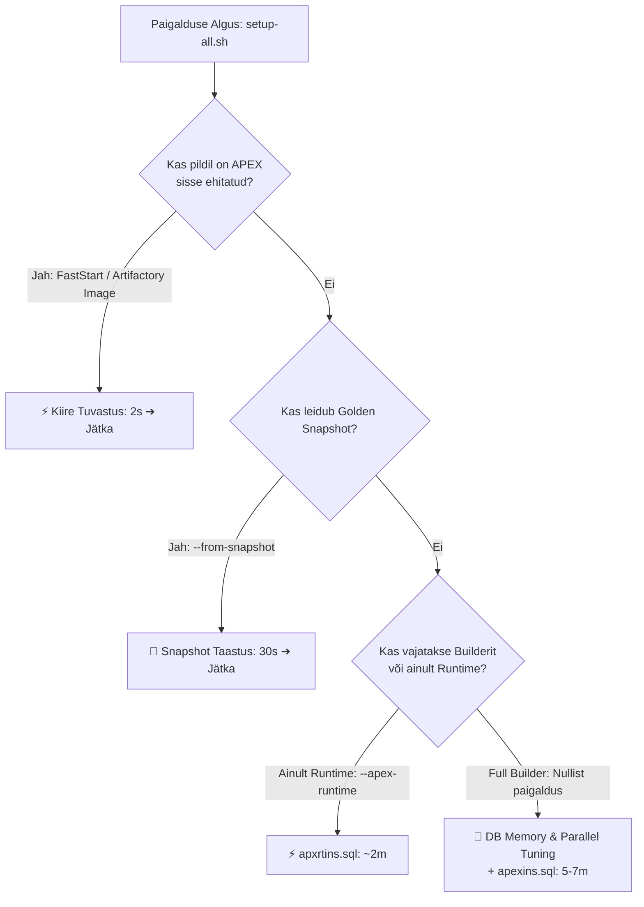

# [TASK-018]: Paigalduse Ajakulu Optimeerimine (APEX DB Kiirendus 15m ➔ 1–2m)

**Staatus:** `DONE`  
**Prioriteet:** `HIGH`  
**Valdkond:** `Performance` | `Architecture`  
**Seotud Blueprintid / Profiilid:** Kõik APEX-iga blueprintid (1–13)  
**Dokumentatsioon:** [docs/artifactory-setup.md](../../docs/artifactory-setup.md), [scripts/README.md](../../scripts/README.md)  

---

## 1. Probleemi Kirjeldus ja Kontekst
Täiesti puhta Oracle 23ai Free DB konteineri peale APEX-i mootori (`@apexins.sql`) paigaldamine nõuab tuhandete PL/SQL pakettide, vaadete ja tüüpide kompileerimist, mis võttis arendaja masinas või CI/CD serveris **10–15 minutit**.

---

## 2. Realiseeritud 4-Sambaline Kiirendusarhitektuur

### 🌟 Sammas 1: FastStart & Ettevõtte Sise-Artifactory Konteineripildid (~1–2 min)
- Loodud utiliit [`scripts/publish-image-to-artifactory.sh`](../../scripts/publish-image-to-artifactory.sh), mis tagib ja laeb valmis FastStart/APEX pildid sise-Artifactorysse ning seadistab `.env` faili `REGISTRY_PREFIX`.
- Kui andmebaas käivitub eelkonfigureeritud pildilt, tuvastab `install-apex.sh` koheselt `VALID` staatuse ja jätab kompileerimise vahele (**2 sekundit**).

### 🌟 Sammas 2: Golden Snapshot Automaatne Kiirtaastus (`--from-snapshot` / ~30s)
- `setup-all.sh --from-snapshot` taastab andmemahu arhiivist enne konteinerite käivitust $\rightarrow$ andmebaas on püsti **30 sekundiga**.

### 🌟 Sammas 3: DB Mälu ja PL/SQL Kompilaatori Tuunimine (15m ➔ 5–7m)
- Nullist paigaldamisel aktiveerib `install-apex.sh` ajutise mälu- ja kompilaatorituuningu (`pga_aggregate_target=2G`, `sga_target=3G`, `plsql_optimize_level=2`).

### 🌟 Sammas 4: APEX Runtime-Only Režiim (`--apex-runtime` / ~2 min)
- `setup-all.sh --apex-runtime` paigaldab ainult käitusmootori (`@apxrtins.sql`), saavutades valmisoleku **~2 minutiga**.

---

## 3. Verifitseerimine ja Automaattestid
- **Ühiktest:** [`tests/unit/test-apex-speedup-and-artifactory.sh`](../../tests/unit/test-apex-speedup-and-artifactory.sh) (PASS).
- **Testikomplekt:** Kõik 60 ühiktesti läbitud edukalt (`All 60 unit tests OK`).
