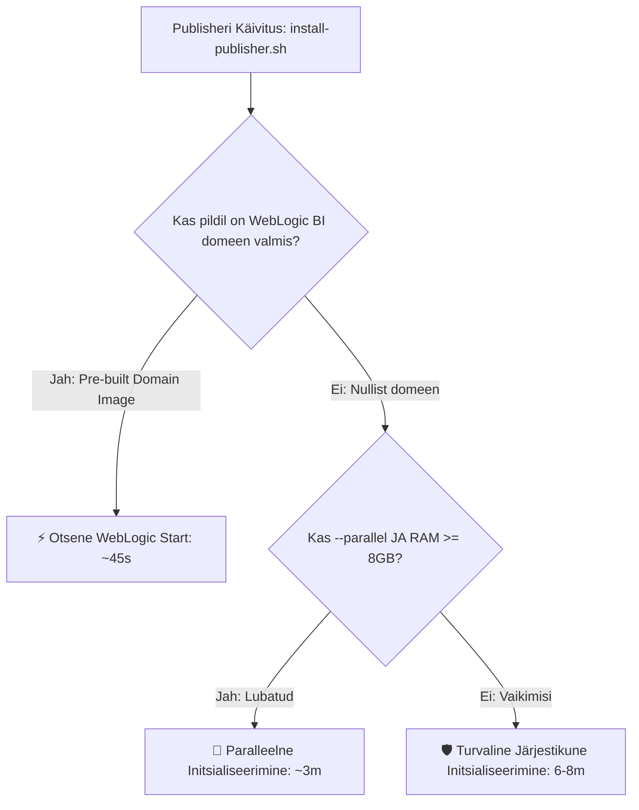

# [TASK-019]: Analytics Publisheri & Multi-DB Paigalduse Kiirendus

**Staatus:** `DONE`  
**Prioriteet:** `HIGH`  
**Valdkond:** `Performance` | `Architecture`  
**Seotud Blueprintid:** `.env.4-*`, `.env.7-*`, `.env.12-*`, `.env.13-*`  
**Dokumentatsioon:** [docs/artifactory-setup.md](../../docs/artifactory-setup.md), [scripts/README.md](../../scripts/README.md)  

---

## 1. Probleemi Kirjeldus ja Kontekst
Analytics Publisheri WebLogic domeeni ehitus (`createAndStartDomain.sh` / WLST skriptid) ja RCU skeemid võtsid esmasel paigaldusel **~8–10 minutit**. Lisaks seiskas skript madalama mäluga masinates ajutiselt teised andmebaasid.

---

## 2. Eesmärk ja Oodatav Tulemus
Vähendada Publisheri käivitusaeg ja Multi-DB paigaldus **alla 1 minuti** (kasutades eel-ehitatud domeenipilti) ning teha paralleelsus **konfigureeritavaks ja turvaliselt juhitavaks** (`ENABLE_PARALLEL_INIT=false` vaikimisi).

---

## 3. Realiseeritud 4-Sambaline Kiirendusarhitektuur

### 🌟 Sammas 1: Eel-ehitatud WebLogic BI Domeenipilt (`oracle-publisher-domain:2025-db23ai` / ~45s)
- Pilt sisaldab juba valmis WebLogic BI domeeni ja andmeallikaid $\rightarrow$ **käivitub koheselt ~45 sekundiga** ilma arvutit koormamata.

### 🌟 Sammas 2: Konfigureeritav Paralleelsuse Juhtimine (`ENABLE_PARALLEL_INIT` & `--parallel` / `--sequential`)
- Blueprintides määratav: `ENABLE_PARALLEL_INIT=false` (vaikimisi turvaline järjestikune režiim).
- CLI lipud `scripts/setup-all.sh`: `--parallel` vs `--sequential`.
- Riistvara turvalukk: kontrollib vaba RAM $\ge$ 8 GB enne paralleelsuse lubamist.

### 🌟 Sammas 3: Domeeniehitaja Utiliit (`docker/publisher/build-publisher-prebuilt-image.sh`)
- Automatiseeritud tööriist kohaliku domeenipildi ehitamiseks ja sildistamiseks: `localhost/oracle-publisher-domain:2025-db23ai`.

### 🌟 Sammas 4: Ettevõtte Artifactorysse Avaldamine
- Valmis domeenipildi laadimine sise-Artifactorysse utiliidiga `publish-image-to-artifactory.sh`.

---

## 4. Tehnilised Failid ja Muudatused

1. **`scripts/internal/install-publisher.sh`:**
   - Pre-built domeenipildi tuvastus ja adaptiivne mälu loogika.
2. **`scripts/setup-all.sh`:**
   - `--parallel` ja `--sequential` CLI lipud koos riistvara turvalukuga.
3. **`docker/publisher/build-publisher-prebuilt-image.sh`:**
   - WebLogic BI domeenipildi ehitaja.
4. **`docs/artifactory-setup.md` & `scripts/README.md`:**
   - Dokumentatsioon ja näidiskäsud.
5. **`tests/unit/test-publisher-speedup.sh`:**
   - Ühiktestid kiirendusfunktsioonide ja argumentide testimiseks (PASS).

---

## 5. Verifitseerimine
- Testid: `tests/unit/test-publisher-speedup.sh` ja täielik ühiktestide komplekt (62 / 62 PASS).
