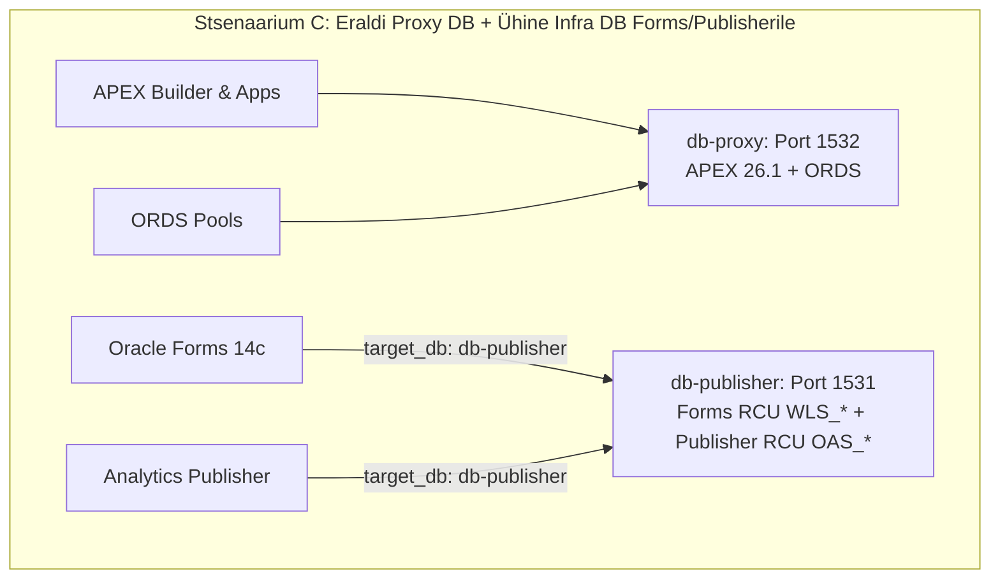

# Paroolide ja Saladuste Haldussüsteemi Standardiseerimise Plaan (Deterministic Credential Matrix)

## 1. Probleemi Kirjeldus ja Hetkeolukord

Praeguses koodibaasis on paroolide pärimisel ja talletamisel tekkinud olukord, kus skriptid kasutavad pikki ja ettearvamatuid tagavaraväärtuste ahelaid (*fallback chains*), näiteks:
```bash
# Näide praegusest ebakindlast mustrist:
SYS_PWD=$(podman exec "$TARGET_PUB_DB" cat /run/secrets/oracle_pwd \
  || podman secret inspect --showsecret publisher_db_sys_password \
  || podman secret inspect --showsecret proxy_db_sys_password \
  || podman secret inspect --showsecret apex_db_sys_password \
  || "$SCRIPT_DIR/get-password.sh" "DB_PUBLISHER_SYS" \
  || "$SCRIPT_DIR/get-password.sh" "DB_DEV" ...)
```

### Selle tagajärjed:
1. **Ettearvamatus:** Kui mingi parool puudub või andmebaasid on ühendatud (nt Blueprint 41, kus kõik jookseb `db-proxy` peal), võib skript võtta vale andmebaasi parooli või vaikeparooli.
2. **Koodi dubleerimine:** Igas abiskriptis (`apply-profile-users.sh`, `init-publisher-rcu.sh`, `install-publisher.sh`, `install-forms.sh`, `create-developer.sh`) on kirjutatud oma suvaline pärimise loogika.
3. **Puhastuse ja genereerimise ebasümmeetria:** `generate-passwords.sh` genereerib fikseeritud nimekirja saladusi, mis ei pruugi 100% kattuda aktiivsete YAML profiilide ja blueprintidega.

---

## 2. Kavandatav Deterministlik Paroolide Süsteem (Deterministic Credential Matrix)

Kehtestame range 3-kihilise reeglistiku ja standardse mustri:

```mermaid
graph TD
    A[Aktiivne Andmebaasi Instants $TARGET_DB] --> B[Konteineri Lühinimi $C_SHORT nt: proxy, alise, publisher]
    B --> C[Podman Secret: ${C_SHORT}_db_sys_password]
    B --> D[Oracle SEPS Wallet: DB_${C_UPPER}_SYS]
    B --> E[Konteineri sees: /run/secrets/oracle_pwd]
    
    F[Keskne Credential Helper: get_db_secret $TARGET_DB $ROLE] --> G{Kust päritakse?}
    G -->|1. Konteinerist| E
    G -->|2. Podman Secretist| C
    G -->|3. Walletist| D
    G -->|Kui puudub| H[❌ Selge ja kohene viga FAIL-FAST, ilma teiste DB-de poole pöördumata]
```

### 2.2. Profiilipõhine Siht-Andmebaasi Resolutsioon (Service-to-Database Mapping)

Platvorm toetab kõiki 3 peamist ettevõtte arhitektuurimudelit:



#### Toetatud Arhitektuurimudelid:
1. **Mudel A: All-in-One (Kõik ühes DB-s, nt Blueprint 41):**
   - `DB_PROXY=db-proxy-oracle`, `DB_PUBLISHER=NONE`, `DB_FORMS=NONE`
   - Kõik teenused (APEX, ORDS, Publisher, Forms) jagavad andmebaasi `db-proxy` (parool: `proxy_db_sys_password` / `DB_PROXY_SYS`).
2. **Mudel B: Eraldi Proxy/APEX DB + Ühine Infra DB Forms & Publisherile (Tüüpiline Enterprise):**
   - `DB_PROXY=db-proxy-oracle` (APEX + ORDS jaoks)
   - `DB_PUBLISHER=appinfra-standard-gvenzl` (Infra DB, kus asuvad nii Formsi kui Publisheri RCU skeemid)
   - `DB_FORMS=NONE` (Formsi profiil määrab sihtbaasiks: `target_database: "db-publisher"`)
   - Resolutsioon:
     - APEX ja ORDS kasutavad `db-proxy` ja parooli `proxy_db_sys_password` (`DB_PROXY_SYS`).
     - Forms ja Publisher ühenduvad mõlemad `db-publisher` külge ja kasutavad parooli `publisher_db_sys_password` (`DB_PUBLISHER_SYS`).
3. **Mudel C: Täielikult Isoleeritud (Igal teenusel oma eraldi DB, nt Blueprint 42):**
   - `DB_PROXY=...`, `DB_PUBLISHER=...`, `DB_FORMS=...`, `DB_ALISE=...`
   - Igal teenusel on oma eraldi andmebaas ja oma unikaalne parool.

#### Kuidas resolutsioonimootor (`credential-helper.sh`) selle lahendab:
```bash
# Teenuse siht-andmebaasi lahendamine (resolutsioon):
resolve_service_target_db() {
  local service="$1" # "publisher", "forms", "apex", "ords"
  
  # 1. Kontrollitakse kas teenuse profiilis on määratud otsene sihtbaas (nt target_database: "db-publisher")
  # 2. Kontrollitakse kas teenusel on oma eraldi DB (nt DB_PUBLISHER või DB_FORMS)
  # 3. Kui ei, kontrollitakse kas eksisteerib jagatud infra andmebaas (db-publisher)
  # 4. Kui ei, suunatakse primaarsele andmebaasile (db-proxy)
}

# Parooli pärimine täpselt lahendatud andmebaasi järgi:
TARGET_DB=$(resolve_service_target_db "forms")      # Tagastab "db-publisher"
TARGET_PWD=$(get_db_sys_password "$TARGET_DB")     # Pärib TÄPSELT "publisher_db_sys_password"
```

---

### 2.3. Standardiseeritud Nimetuste Muster (Naming Convention)

Iga andmebaasi ja teenuse kohta kehtib ühtne maatriks:

| Rolli Tase | Podman Secret Muster | SEPS Walleti Alias Muster | Konteineri Sisefail |
| :--- | :--- | :--- | :--- |
| **Andmebaasi Juur / SYSDBA** | `${c_short}_db_sys_password` | `DB_${C_UPPER}_SYS` | `/run/secrets/oracle_pwd` |
| **DBA Administraator** | `${c_short}_dba_admin_password` | `DB_${C_UPPER}_DBA_ADMIN` | `/run/secrets/dba_admin_pwd` |
| **Arendaja (Developer)** | `${c_short}_dev_password` | `DB_${C_UPPER}_DEV` | `/run/secrets/dev_pwd` |
| **Vaataja (Viewer / Read-Only)** | `${c_short}_viewer_password` | `DB_${C_UPPER}_VIEWER` | `/run/secrets/viewer_pwd` |
| **Rakenduse Skeem (App Runtime)** | `${c_short}_app_password` | `DB_${C_UPPER}_APP` | `/run/secrets/app_pwd` |
| **APEX Skeem / Proxy** | `${c_short}_schema_password` | `DB_${C_UPPER}_SCHEMA` | `/run/secrets/apex_schema_pwd` |
| **APEX Instance Admin (Veeb)** | `apex_admin_password` | `DB_${C_UPPER}_APEX_ADMIN` | `/run/secrets/apex_admin_pwd` |
| **ORDS Listener / Pool** | `ords_listener_password` | `DB_${C_UPPER}_ORDS_LISTENER` | `/run/secrets/ords_listener_pwd` |
| **WebLogic / Publisher Admin** | `publisher_admin_password` | `PUBLISHER_WEBLOGIC_ADMIN` | `/run/secrets/publisher_admin_pwd` |
| **WebLogic / Forms Admin** | `forms_admin_password` | `FORMS_WEBLOGIC_ADMIN` | `/run/secrets/forms_admin_pwd` |

> [!IMPORTANT]
> **Range Reegel (Zero Cross-DB Fallback):**
> Kui küsitakse `db-proxy` SYS parooli, päritakse AINULT `proxy_db_sys_password` / `DB_PROXY_SYS`. Keelatud on pöörduda `publisher_db_sys_password` või `apex_db_sys_password` poole. Kui parooli ei leita, peatub skript selge veateatega (*fail-fast*).

---

## 3. Kavandatavad Muudatused Failide Kaupa

### 1. Keskne Saladuste Pärimise Mootor
#### [NEW] [scripts/internal/credential-helper.sh](../../scripts/internal/credential-helper.sh)
- Luuakse ühtne teek kõigile skriptidele:
  - `get_db_sys_password "$container_or_db"`
  - `get_db_user_password "$container_or_db" "$role"` (kus role: `sys`, `dba_admin`, `dev`, `viewer`, `app`, `schema`)
  - `get_service_admin_password "$service"` (kus service: `apex_admin`, `ords_listener`, `publisher_admin`, `forms_admin`)
- Tagab range valideerimise ja selge veateate ilma suvaliste rist-pärimisteta.

### 2. Paroolide Genereerimise Mootor
#### [MODIFY] [scripts/internal/generate-passwords.sh](../../scripts/internal/generate-passwords.sh)
- Genereerib saladused **dünaamiliselt kõigile aktiivsetele andmebaasidele** (`get_active_db_instances`), mitte fikseeritud kõvakodeeritud nimede järgi.
- Iga aktiivne DB saab oma täiskomplekti (`${c_short}_db_sys_password`, `${c_short}_dba_admin_password`, `${c_short}_dev_password`, `${c_short}_viewer_password`, `${c_short}_app_password`, `${c_short}_schema_password`).
- Teenused saavad oma kindlad saladused (`apex_admin_password`, `ords_listener_password`, `publisher_admin_password`, `forms_admin_password`).

### 3. SEPS Walleti Loomise Mootor
#### [MODIFY] [scripts/internal/create-wallet.sh](../../scripts/internal/create-wallet.sh)
- Kasutab uut keskset `credential-helper.sh` loogikat ja registreerib SEPS Walletisse täpselt samad aliased vastavalt deterministlikule maatriksile.

### 4. Kasutaja Paroolide Vaatamise CLI
#### [MODIFY] [scripts/get-password.sh](../../scripts/get-password.sh) ja [view-wallet-credential.sh](../../scripts/internal/view-wallet-credential.sh)
- Toetab uusi standardseid aliaseid ja kuvab arusaadava spikri aktiivsete andmebaaside lõikes.

### 5. Teenuste ja Andmebaasi Paigaldusskriptide Puhastamine Tagavaraahelatest
#### [MODIFY] [scripts/internal/apply-profile-users.sh](../../scripts/internal/apply-profile-users.sh)
#### [MODIFY] [scripts/internal/install-publisher.sh](../../scripts/internal/install-publisher.sh)
#### [MODIFY] [scripts/internal/init-publisher-rcu.sh](../../scripts/internal/init-publisher-rcu.sh)
#### [MODIFY] [scripts/internal/init-publisher-ords.sh](../../scripts/internal/init-publisher-ords.sh)
#### [MODIFY] [scripts/internal/install-forms.sh](../../scripts/internal/install-forms.sh)
- Eemaldatakse pikad `|| podman secret ... || cat /run/secrets ... || get-password.sh ...` ahelad ja asendatakse puhta üherealise väljakutsega:  
  `SYS_PWD=$(get_db_sys_password "$TARGET_DB")`

### 6. Uus Blueprint 43 (2-Database Hybrid Enterprise)
#### [NEW] [config/blueprints/.env.43-proxy-ords-apex-with-shared-forms-publisher-db-web-ide](../../config/blueprints/.env.43-proxy-ords-apex-with-shared-forms-publisher-db-web-ide)
- **Stsenaarium 43:** Eraldi Proxy/APEX/ORDS DB (`db-proxy`) + Ühine Middleware Infra DB (`db-publisher`) Forms 14c ja Analytics Publisheri jaoks koos Web IDE-ga.
- Konfiguratsioon:
  ```env
  DB_FORMS=NONE
  DB_PUBLISHER=appinfra-standard-gvenzl
  DB_PROXY=db-proxy-oracle
  DB_ALISE=NONE
  SKIP_ORDS=false
  SKIP_FORMS=false
  SKIP_PUBLISHER=false
  SKIP_WEB_IDE=false
  ```

#### [MODIFY] [config/blueprints/README.md](../../config/blueprints/README.md) ja [config/blueprints/README.et.md](../../config/blueprints/README.et.md)
- Registreeritakse Blueprint 43 kataloogi tabelis ja lisatakse käivituskäsud kõigis keeleversioonides.

---

## 5. Verifitseerimisplaan

### Automaattestid
1. `tests/unit/test-credentials-matrix.sh` — Uus test, mis kontrollib:
   - Iga aktiivse andmebaasi saladuse olemasolu ja struktuuri.
   - Zero-cross-fallback valideerimist (katse küsida olematu DB parooli peab andma veakoodi, mitte tagastama teise DB parooli).
2. Terviklik testikomplekt:
   - `bash tests/unit/test-cli-blueprint-params.sh`
   - `bash tests/unit/test-i18n-translations.sh`
   - `bash tests/unit/test-vscode-wallet-connections.sh`

### Reaalne Paigalduse Testimine
- `./scripts/setup-all.sh -tb 41` (All-in-One: Kõik 1 andmebaasis `db-proxy`)
- `./scripts/setup-all.sh -tb 43` (2-DB Hybrid: `db-proxy` APEX/ORDS-ile + `db-publisher` Forms/Publisherile)
- Kontrollida `./scripts/check-urls.sh` ja `./scripts/check-wallet.sh`.
