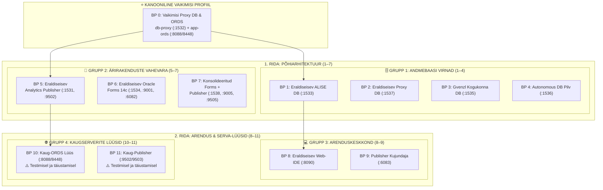

[ 🇬🇧 English ](README.md) | [ 🇪🇪 Eesti ](README.et.md) | [ 🇫🇮 Suomi ](README.fi.md) | [ 🇸🇪 Svenska ](README.sv.md) | [ 🇱🇻 Latviešu ](README.lv.md) | [ 🇱🇹 Lietuvių ](README.lt.md)

# 🏗️ Arhitektuursete kavandite (blueprintide) kataloog (0 .. 11)

See kataloog sisaldab **12 kanoonilist modulaarset arhitektuurset kavandit (blueprints)**, mis katavad kogu ettevõtte taseme platvormi:



---

## 🚀 Käsurea käsud & kasutamine

```bash
# 1. Käivita vaikimisi Blueprint 0 (Proxy DB + ORDS ilma lisaparameetriteta):
./scripts/setup-all.sh

# 2. Paigalda konkreetne blueprint (nt Blueprint 1, 5, 8, 10):
./scripts/setup-all.sh -b 1
./scripts/setup-all.sh -b 5

# 3. Interaktiivne menüü:
./scripts/setup-all.sh -i

# 4. Kuivkäivitus (kontrollib pordid ja profiilid ilma konteinereid muutmata):
./scripts/setup-all.sh --dry-run
./tests/test-all-blueprints-live.sh --all --dry-run

# 5. Detailne vaatlus:
./scripts/internal/blueprint-info.sh -s 0
./scripts/internal/blueprint-info.sh --list
```

---

## 📊 12 Blueprinti maatriks

| ID | Blueprinti Nimi & Fail | Andmebaasi Profiil & Port | Teenuste Profiilid & Pordid | Konteinerid | Otstarve ja Kirjeldus |
| :---: | :--- | :--- | :--- | :--- | :--- |
| **0** | [`.env.0-default-proxy-ords`](.env.0-default-proxy-ords) *(VAIKIMISI)* | `db-proxy-oracle.yaml` (:1532) | `ords-image.yaml` (:8088/8448) | `db-proxy`, `app-ords` | **Kanooniline vaikekäivitus.** Püsiv keskne SSO lüüs & mitme andmebaasi ORDS ruuter. |
| **1** | [`.env.1-standalone-alise-db`](.env.1-standalone-alise-db) | `db-alise-oracle.yaml` (:1533) | *(Registreerub keskses ORDS-is kui aktiivne)* | `db-alise` | Peamine ärirakenduste andmebaas, PL/SQL tuumik, APEX 26.1 metaandmed. 0 MB veebi RAM-i. |
| **2** | [`.env.2-standalone-proxy-db`](.env.2-standalone-proxy-db) | `db-proxy-standalone.yaml` (:1537) | *(Registreerub keskses ORDS-is kui aktiivne)* | `db-proxy-standalone` | Eraldiseisev Proxy DB ja SSO lüüs unikaalsel pordil 1537. |
| **3** | [`.env.3-standalone-gvenzl-db`](.env.3-standalone-gvenzl-db) | `db-gvenzl.yaml` (:1535) | *(Registreerub keskses ORDS-is kui aktiivne)* | `db-gvenzl` | Gerald Venzl kogukonnatõmmis jõudlustestideks ja võrdlusteks. |
| **4** | [`.env.4-standalone-autonomous-db`](.env.4-standalone-autonomous-db) | `db-adb.yaml` (:1536) | `ords-image.yaml` (:8088/8448) | `db-adb`, `app-ords` | Oracle Autonomous Database pilvesimulatsioon mTLS rahakoti, versioonikontrolli ja Dev Hubiga. |
| **5** | [`.env.5-standalone-publisher`](.env.5-standalone-publisher) | `db-publisher-oracle.yaml` (:1531) | `publisher-standard.yaml` (:9502) | `db-publisher`, `app-publisher` | Eraldiseisev Analytics Publisher 2025 ja spetsiaalne RCU repositooriumi DB. |
| **6** | [`.env.6-standalone-forms`](.env.6-standalone-forms) | `db-forms-oracle.yaml` (:1534) | `forms-standard.yaml` (:9001, :6082) | `db-forms`, `app-forms` | Eraldiseisev Oracle Forms 14c ja noVNC graafiline Forms Builder. |
| **7** | [`.env.7-consolidated-forms-publisher`](.env.7-consolidated-forms-publisher) | `db-publisher-oracle.yaml` (:1531) | `forms-publisher-unified.yaml` (:9001/9502/6082) | `db-publisher`, `app-forms-publisher` | Konsolideeritud Forms 14c ja Publisher ühises WebLogic domeenis. |
| **8** | [`.env.8-standalone-web-ide`](.env.8-standalone-web-ide) | - *(Zero DB)* | `web-ide-standard.yaml` (:8090/8450/8091) | `web-ide-dev` | Iseseisev Web-IDE arendustöökoht: VS Code server, SQLcl ja eelkonfigureeritud arendustööriistad. |
| **9** | [`.env.9-standalone-publisher-designer`](.env.9-standalone-publisher-designer) | - *(Zero DB)* | `publisher-designer-standard.yaml` (:6083 noVNC) | `app-publisher-designer` | HTML5 noVNC töölaua konteiner MS Wordi ja BIP Template Builder RTF mallide kujundamiseks (`setup-word-designer.sh`). |
| **10** | [`.env.10-remote-ords`](.env.10-remote-ords) | `MAIN_DB_PROFILE=NONE` | `ords-standalone.yaml` (:8088/8448) | `app-ords` | **⚠️ Testimisel ja täiustamisel:** Eraldiseisev ORDS konteiner käivitub. Kauge pilve ADB ja ettevõtte lüüsi suunamine on arenduses. |
| **11** | [`.env.11-remote-publisher`](.env.11-remote-publisher) | `MAIN_DB_PROFILE=NONE` | `publisher-standard.yaml` (:9502/9503) | `app-publisher` | **⚠️ Testimisel ja täiustamisel:** Analytics Publisher konteiner käivitub. Kaugete andmebaaside aruandlus on arenduses. |

---

## 🧩 Puhas blueprintide & YAML profiilide arhitektuur (reegel 11)

### 1. Vastutusalade lahususe printsiip
- **Blueprintid (`config/blueprints/.env.*`):** Deklareerivad ainult kõrgetasemelisi positiivseid viiteid YAML profiilidele. Need määravad, *millised konteinerid luuakse*. Nad ei sisalda kunagi porte, paroole ega negatiivseid `SKIP_*` muutujaid.
- **YAML Profiilid (`config/profiles/**/*.yaml`):** Sisaldavad 100% domeenispetsiifikast: konteinerite tõmmised, mälulimiidid, pordid (`db_port`, `http_port`), PDB vaiketeenused, tabeliruumid, kvoodid, kasutajarollid ja andmebaasidevahelised seosed.

### 2. Kuidas lisada kohandatud blueprinti (1-haaval)
Iga arendaja või AI saab luua uue blueprinti igal ajal ilma koodi või skripte muutmata:
1. Loo uus fail: `config/blueprints/.env.<ID>-<nimi>` (nt `.env.12-custom-analytics-workstation`):
   ```bash
   # Kohandatud Blueprint 12: Analytics Workstation
   DB_ALISE=db-alise-oracle
   ORDS_PROFILE=ords-standard
   PUBLISHER_PROFILE=publisher-standard
   WEB_IDE_PROFILE=web-ide-standard
   ```
2. Käivita või testi uut blueprinti koheselt:
   ```bash
   ./scripts/setup-all.sh -b 12
   ./scripts/setup-all.sh -b 12 --dry-run
   ```
   Orkestreerimismootor tuvastab faili dünaamiliselt, laeb viidatud YAML profiilid, arvutab pordid ja seadistab SEPS Walleti automaatselt.

