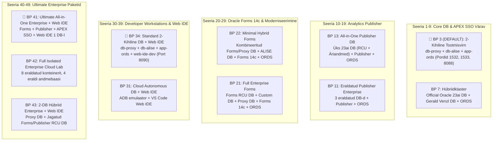
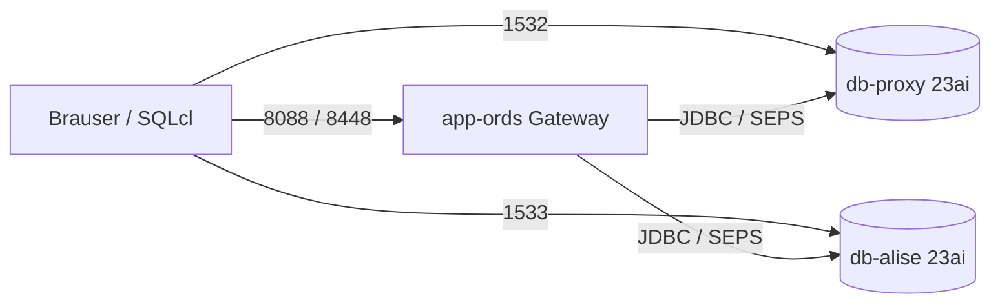
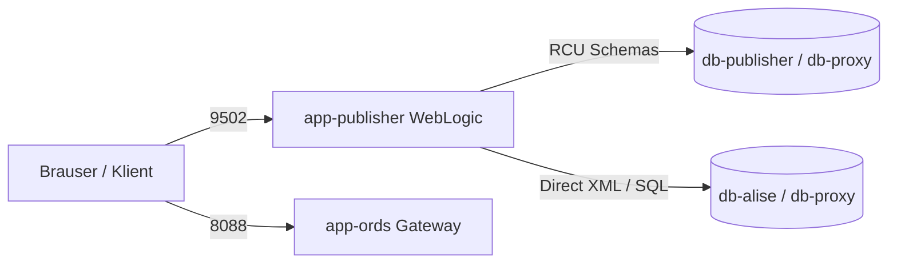
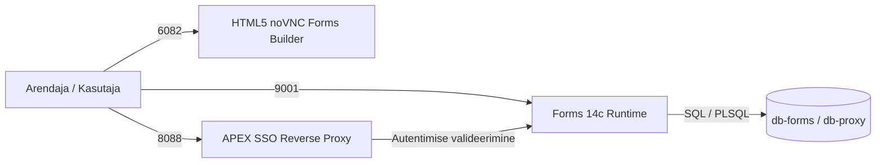
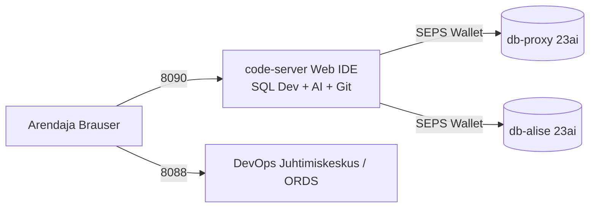
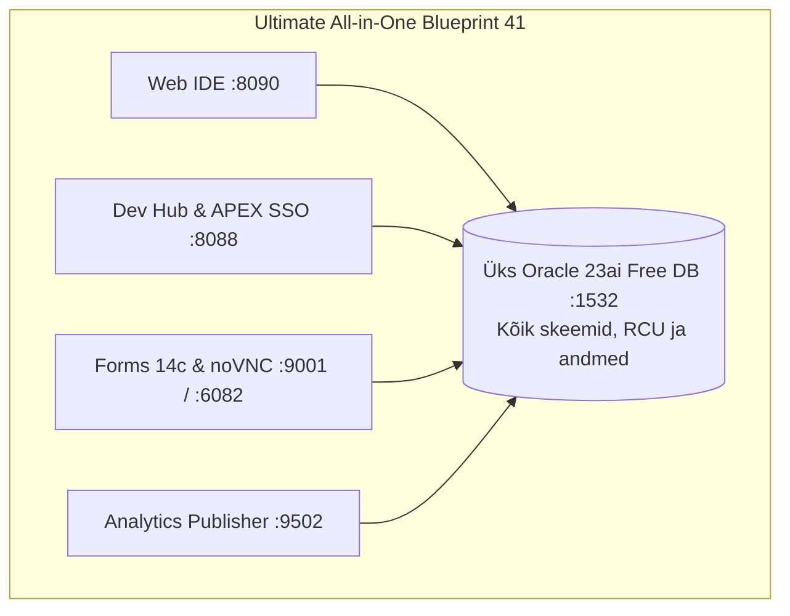

[ 🇬🇧 English ](README.md) | [ 🇪🇪 Eesti ](README.et.md) | [ 🇫🇮 Suomi ](README.fi.md) | [ 🇸🇪 Svenska ](../../docs/sv/README.md) | [ 🇱🇻 Latviešu ](../../docs/lv/README.md) | [ 🇱🇹 Lietuvių ](../../docs/lt/README.md)

# 🏗️ Keskkondade Arhitektuursed Kavandid (11 Kureeritud Mudelit)

Käesolev kataloog on **keskkonna 11 kureeritud ja kanoonilise arhitektuurse kavandi (Blueprints)** keskne tõeallikas.

Iga blueprint (`.env.<N>-*`) defineerib tervikliku taristumudeli alates 2-kihilisest arendusbaasist kuni 8-konteinerilise täisisoleeritud pilvelaborini.

---

## 🚀 Blueprintide Haldamise & Juurutamise Käsud

Kasuta spetsiaalset juhtskripti **`./scripts/deploy-blueprint.sh`** (või `./scripts/setup-all.sh -b <N>`):

```bash
# 1. Kontrolli aktiivset blueprinti ja teenuste tervist:
./scripts/deploy-blueprint.sh --status

# 2. Juuruta või lülitu Blueprint 3 peale (VAIKIMISI 2-kihiline tootmislahendus):
./scripts/deploy-blueprint.sh -b 3

# 3. Juuruta Blueprint 41 (Kõik-Ühes: Forms 14c + Publisher + APEX SSO + Web IDE ühel 23ai DB-l):
./scripts/deploy-blueprint.sh -b 41

# 4. Dry-run simulatsioon (eelvaade ilma konteinereid muutmata):
./scripts/deploy-blueprint.sh -b 42 --dry-run

# 5. Kuva 11 blueprinti tabel vormindatud kujul:
./scripts/setup-all.sh -lb

# 6. Käivita 2-faasiline automaatne maatrikskontroll (Külmstart + Soestart):
./scripts/internal/run_blueprint_matrix_test.sh
```

---

## 📊 Kanooniline 11 Blueprinti Arhitektuurimaatriks



---

### 🔹 Seeria 1–9: Core Andmebaas & APEX SSO Värava Arhitektuurid
| Nr | Faili Nimi | Käivitatavad Konteinerid | Pordid | Otstarve ja Arhitektuurne Kirjeldus |
| :--- | :--- | :--- | :--- | :--- |
| **3** | `.env.3-db-alise-apex-ords-with-proxy` | `db-proxy`, `db-alise`, `app-ords` | `1532`, `1533`, `8088`, `8448` | **🌟 VAIKIMISI TOOTMISLAHENDUS:** 2-kihiline turvaline võrgutopoloogia (eraldatud Proxy DB ja ALISE DB) koos APEXi ja ORDS-iga. |
| **7** | `.env.7-hybrid-multi-vendor-db` | `db-proxy`, `db-alise`, `app-ords` | `1532`, `1533`, `8088`, `8448` | **Hübriidne Klaster:** Oracle DB 23ai ametlik pilt (Proxy) ja Gerald Venzl pilt (ALISE) koos töötamas. |



---

### 🔹 Seeria 10–19: Analytics Publisher Arhitektuurid (Pixel-Perfect Aruandlus)
| Nr | Faili Nimi | Käivitatavad Konteinerid | Pordid | Otstarve ja Arhitektuurne Kirjeldus |
| :--- | :--- | :--- | :--- | :--- |
| **11** | `.env.11-publisher-full-enterprise` | `db-publisher`, `db-alise`, `db-proxy`, `app-ords`, `app-publisher` | `1531-1533`, `8088`, `9502` | **Täisisoleeritud Publisher Stack:** Kõik 3 andmebaasi (Publisher RCU, ALISE, Proxy), ORDS ja Publisher koos. |
| **13** | `.env.13-publisher-all-in-one-db` | `db-proxy`, `app-ords`, `app-publisher` | `1532`, `8088`, `9502` | **Kõik-ühes Publisher DB:** Kõik RCU skeemid ja äriandmed ühes Free DB-s (`db-proxy`) + ORDS + Publisher. |



---

### 🔹 Seeria 20–29: Oracle Forms 14c Arhitektuurid (Forms & Moderniseerimine)
| Nr | Faili Nimi | Käivitatavad Konteinerid | Pordid | Otstarve ja Arhitektuurne Kirjeldus |
| :--- | :--- | :--- | :--- | :--- |
| **21** | `.env.21-forms-full-enterprise` | `db-forms`, `db-alise`, `db-proxy`, `app-forms`, `app-ords` | `1531-1534`, `8088`, `9001`, `6082` | **Täielik Enterprise Forms Stack:** Eraldi Forms RCU DB + Custom DB + APEX Proxy DB + Forms 14c + ORDS. |
| **22** | `.env.22-forms-minimal-hybrid` | `db-proxy`, `db-alise`, `app-forms`, `app-ords` | `1531`, `1532`, `8088`, `9001`, `6082` | **Minimaalne Forms Hübriid:** Kombineeritud Forms/Proxy DB + ALISE DB + ORDS + Forms teenused (HTML5 noVNC). |



---

### 🔹 Seeria 30–39: Zero-Install Arendaja Tööjaamad & Pilvelaborid (Web IDE)
| Nr | Faili Nimi | Käivitatavad Konteinerid | Pordid | Otstarve ja Arhitektuurne Kirjeldus |
| :--- | :--- | :--- | :--- | :--- |
| **31** | `.env.31-cloud-adb-with-web-ide` | `db-proxy`, `app-ords`, `web-ide-dev` | `1532`, `8088`, `8090` | **Pilve ADB Emulaator + Web IDE:** Autonomous Database emulaator koos brauseripõhise VS Code Web IDE-ga. |
| **34** | `.env.34-proxy-alise-apex-ords-with-web-ide` | `db-proxy`, `db-alise`, `app-ords`, `web-ide-dev` | `1532`, `1533`, `8088`, `8090` | **🌟 2-Kihiline Ettevõtte Stäkk + Web IDE:** Meie soovitatud 2-kihiline tootmislahendus koos brauseri VS Code Web IDE-ga. |



---

### 🔹 Seeria 40–49: Ultimate Enterprise Kõik-Ühes & Pilvelaborid
| Nr | Faili Nimi | Käivitatavad Konteinerid | Pordid | Otstarve ja Arhitektuurne Kirjeldus |
| :--- | :--- | :--- | :--- | :--- |
| **41** | `.env.41-ultimate-all-in-one-enterprise-with-web-ide` | `db-proxy`, `app-forms`, `app-publisher`, `app-ords`, `web-ide-dev` | `1532`, `8088`, `9502`, `9001`, `8090`, `6082` | **🌟 Ultimate Enterprise Kõik-Ühes:** Forms 14c + Publisher + APEX SSO + ORDS + Web IDE ühel 23ai DB-l (`db-proxy`). |
| **42** | `.env.42-ultimate-full-enterprise-isolated-with-web-ide` | `db-forms`, `db-publisher`, `db-proxy`, `db-alise`, `app-forms`, `app-publisher`, `app-ords`, `web-ide-dev` | Kõik pordid | **Täielikult Isoleeritud Pilvelabor:** Forms ja Publisher eraldi konteinerites ja eraldi andmebaasidel koos Web IDE-ga. |
| **43** | `.env.43-proxy-ords-apex-with-shared-forms-publisher-db-web-ide` | `db-proxy`, `db-publisher`, `app-forms`, `app-publisher`, `app-ords`, `web-ide-dev` | `1531`, `1532`, `8088`, `9502`, `9001`, `8090`, `6082` | **2-Andmebaasi Hübriid Enterprise:** APEX/ORDS Proxy DB + Ühine Middleware Infra DB (`db-publisher`) Forms ja Publisher RCU jaoks. |



---

## 🔒 Turvalisus ja Käsitsi Kopeerimine

Kui soovid blueprinti käsitsi aktiveerida ilma skriptita:
```bash
cp config/blueprints/.env.3-db-alise-apex-ords-with-proxy .env
```
Kõik kohalikud muudatused tehakse faili `.env`, mis on `.gitignore` failis ning jääb ainult lokaalseks.