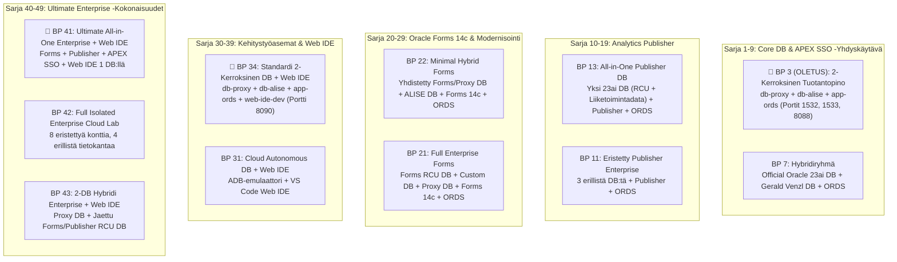
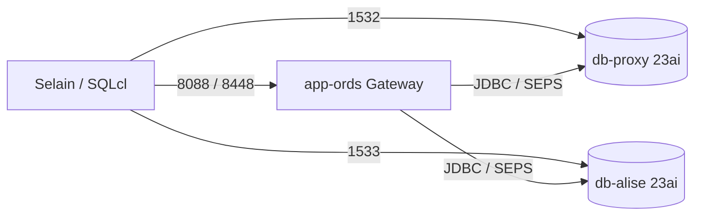
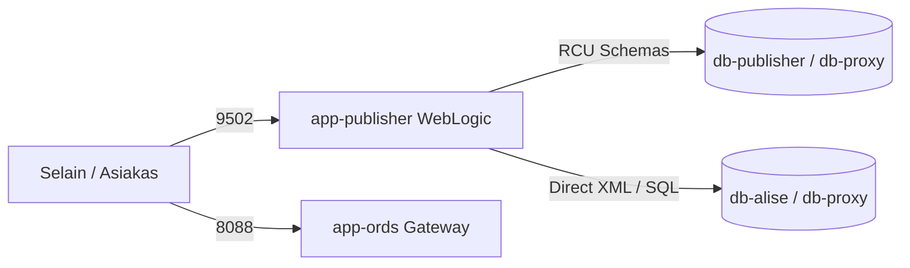
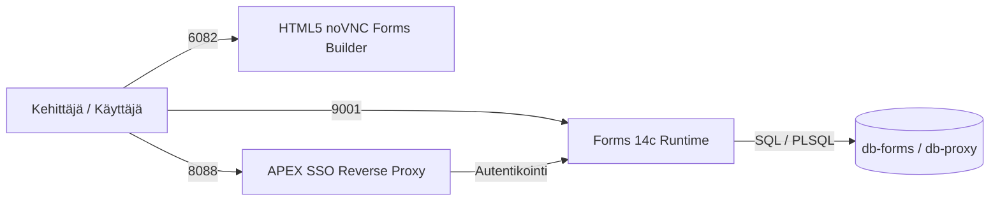
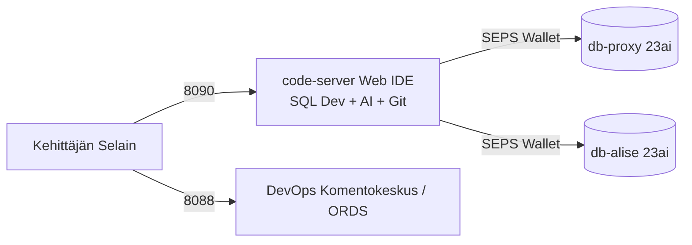
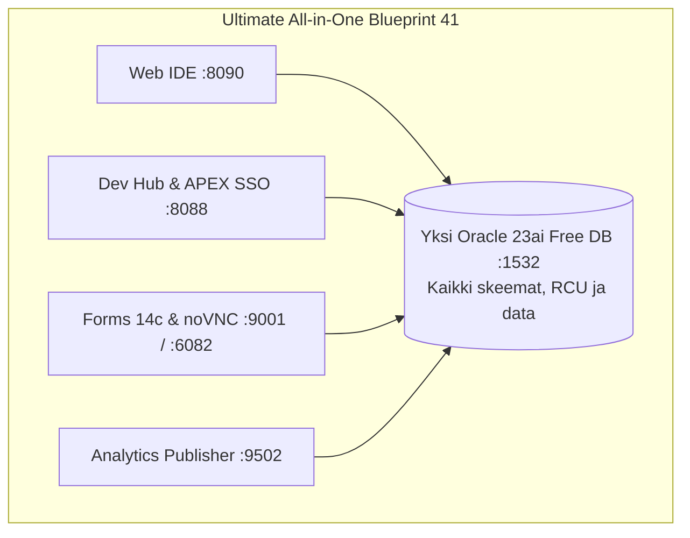

[ 🇬🇧 English ](README.md) | [ 🇪🇪 Eesti ](README.et.md) | [ 🇫🇮 Suomi ](README.fi.md) | [ 🇸🇪 Svenska ](../../docs/sv/README.md) | [ 🇱🇻 Latviešu ](../../docs/lv/README.md) | [ 🇱🇹 Lietuvių ](../../docs/lt/README.md)

# 🏗️ Ympäristön Arkkitehtuurisuunnitelmat (11 Kuratoitua Mallia)

Tämä luettelo on **ympäristön 11 kuratoidun ja kanonisen arkkitehtuurisuunnitelman (Blueprints)** keskitetty tietolähde.

Jokainen blueprint (`.env.<N>-*`) määrittää kokonaisvaltaisen infrastruktuurimallin 2-kerroksisesta kehitystietokannasta täydelliseen 8-konttiseen eristettyyn yrityspilvilaboratorioon.

---

## 🚀 Blueprintien Hallinta- ja Käyttöönottokomennot

Käytä orkestrointityökalua **`./scripts/deploy-blueprint.sh`** (tai `./scripts/setup-all.sh -b <N>`):

```bash
# 1. Tarkista aktiivinen blueprint ja palveluiden tila:
./scripts/deploy-blueprint.sh --status --lang fi

# 2. Ota käyttöön Blueprint 3 (OLETUS 2-kerroksinen tuotantoratkaisu):
./scripts/deploy-blueprint.sh -b 3 --lang fi

# 3. Ota käyttöön Blueprint 41 (Kaikki-Yhdessä: Forms 14c + Publisher + APEX SSO + Web IDE yhdellä 23ai DB:llä):
./scripts/deploy-blueprint.sh -b 41 --lang fi

# 4. Dry-run simulointi (esikatselu ilman konttimuutoksia):
./scripts/deploy-blueprint.sh -b 42 --dry-run

# 5. Näytä 11 blueprintin taulukko:
./scripts/setup-all.sh -lb --lang fi

# 6. Suorita 2-vaiheinen automaattinen matriisitestaus:
./scripts/internal/run_blueprint_matrix_test.sh
```

---

## 📊 Kanoninen 11 Blueprintin Arkkitehtuurimatriisi



---

### 🔹 Sarja 1–9: Core Tietokanta & APEX SSO -Yhdyskäytävä
| Nro | Tiedostonimi | Kontit | Portit | Tarkoitus ja Arkkitehtuuri |
| :--- | :--- | :--- | :--- | :--- |
| **3** | `.env.3-db-alise-apex-ords-with-proxy` | `db-proxy`, `db-alise`, `app-ords` | `1532`, `1533`, `8088`, `8448` | **🌟 OLETUS TUOTANTORATKAISU:** 2-kerroksinen turvallinen topologia (Proxy DB ja ALISE DB) APEXilla ja ORDSilla. |
| **7** | `.env.7-hybrid-multi-vendor-db` | `db-proxy`, `db-alise`, `app-ords` | `1532`, `1533`, `8088`, `8448` | **Hybridiryhmä:** Virallinen Oracle 23ai -kuva ja Gerald Venzl -kuva yhdessä. |



---

### 🔹 Sarja 10–19: Analytics Publisher (Pixel-Perfect Raportointi)
| Nro | Tiedostonimi | Kontit | Portit | Tarkoitus ja Arkkitehtuuri |
| :--- | :--- | :--- | :--- | :--- |
| **11** | `.env.11-publisher-full-enterprise` | `db-publisher`, `db-alise`, `db-proxy`, `app-ords`, `app-publisher` | `1531-1533`, `8088`, `9502` | **Täysin Eristetty Publisher Stack:** Kaikki 3 tietokantaa, ORDS ja Publisher yhdessä. |
| **13** | `.env.13-publisher-all-in-one-db` | `db-proxy`, `app-ords`, `app-publisher` | `1532`, `8088`, `9502` | **All-in-One Publisher DB:** Kaikki RCU-skeemat ja data yhdessä Free DB:ssä (`db-proxy`). |



---

### 🔹 Sarja 20–29: Oracle Forms 14c (Palvelut & Modernisointi)
| Nro | Tiedostonimi | Kontit | Portit | Tarkoitus ja Arkkitehtuuri |
| :--- | :--- | :--- | :--- | :--- |
| **21** | `.env.21-forms-full-enterprise` | `db-forms`, `db-alise`, `db-proxy`, `app-forms`, `app-ords` | `1531-1534`, `8088`, `9001`, `6082` | **Täysi Enterprise Forms Stack:** Erillinen Forms RCU DB + Custom DB + APEX Proxy DB + Forms 14c + ORDS. |
| **22** | `.env.22-forms-minimal-hybrid` | `db-proxy`, `db-alise`, `app-forms`, `app-ords` | `1531`, `1532`, `8088`, `9001`, `6082` | **Minimaalinen Forms Hybridi:** Yhdistetty Forms/Proxy DB + ALISE DB + ORDS + Forms (HTML5 noVNC). |



---

### 🔹 Sarja 30–39: Kehitystyöasemat & Pilvilaboratoriot (Web IDE)
| Nro | Tiedostonimi | Kontit | Portit | Tarkoitus ja Arkkitehtuuri |
| :--- | :--- | :--- | :--- | :--- |
| **31** | `.env.31-cloud-adb-with-web-ide` | `db-proxy`, `app-ords`, `web-ide-dev` | `1532`, `8088`, `8090` | **Cloud ADB -Emulaattori + Web IDE:** Autonomous Database -emulaattori ja selainpohjainen VS Code. |
| **34** | `.env.34-proxy-alise-apex-ords-with-web-ide` | `db-proxy`, `db-alise`, `app-ords`, `web-ide-dev` | `1532`, `1533`, `8088`, `8090` | **🌟 2-Kerroksinen Yrityspino + Web IDE:** Suositeltu 2-kerroksinen ratkaisu selainpohjaisella Web IDE:llä. |



---

### 🔹 Sarja 40–49: Ultimate Enterprise Kaikki-Yhdessä & Pilvilaboratoriot
| Nro | Tiedostonimi | Kontit | Portit | Tarkoitus ja Arkkitehtuuri |
| :--- | :--- | :--- | :--- | :--- |
| **41** | `.env.41-ultimate-all-in-one-enterprise-with-web-ide` | `db-proxy`, `app-forms`, `app-publisher`, `app-ords`, `web-ide-dev` | `1532`, `8088`, `9502`, `9001`, `8090`, `6082` | **🌟 Ultimate Kaikki-Yhdessä:** Forms 14c + Publisher + APEX SSO + ORDS + Web IDE yhdellä 23ai DB:llä (`db-proxy`). |
| **42** | `.env.42-ultimate-full-enterprise-isolated-with-web-ide` | `db-forms`, `db-publisher`, `db-proxy`, `db-alise`, `app-forms`, `app-publisher`, `app-ords`, `web-ide-dev` | Kaikki portit | **Täysin Eristetty Pilvilaboratorio:** Forms ja Publisher erillisissä konteissa ja tietokannoissa. |
| **43** | `.env.43-proxy-ords-apex-with-shared-forms-publisher-db-web-ide` | `db-proxy`, `db-publisher`, `app-forms`, `app-publisher`, `app-ords`, `web-ide-dev` | `1531`, `1532`, `8088`, `9502`, `9001`, `8090`, `6082` | **2-Tietokannan Hybridi:** APEX/ORDS Proxy DB + Jaettu Middleware DB (`db-publisher`) Forms ja Publisher RCU:lle. |


