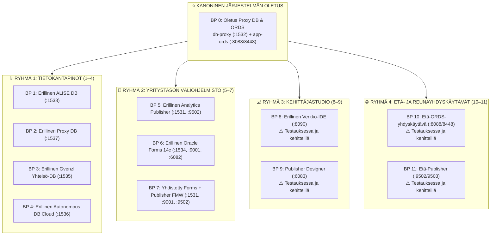

[ 🇬🇧 English ](README.md) | [ 🇪🇪 Eesti ](README.et.md) | [ 🇫🇮 Suomi ](README.fi.md) | [ 🇸🇪 Svenska ](README.sv.md) | [ 🇱🇻 Latviešu ](README.lv.md) | [ 🇱🇹 Lietuvių ](README.lt.md)

# 🏗️ Arkkitehtuurimallien (Blueprints) Luettelo (0 .. 11)

Tämä hakemisto sisältää **12 kanonista modulaarista arkkitehtuurimallia**, jotka kattavat koko yritystason alustan:



---

## 🚀 CLI-Komennot & Blueprinttien Hallinta

```bash
# 1. Käynnistä oletusmallilla Blueprint 0 (Oletus Proxy DB + ORDS, ilman lisälippuja):
./scripts/setup-all.sh

# 2. Ota käyttöön mikä tahansa malli (esim. Blueprint 1, 5, 8, 10):
./scripts/setup-all.sh -b 1
./scripts/setup-all.sh -b 5

# 3. Interaktiivinen valinta:
./scripts/setup-all.sh -i

# 4. Dry-run -simulointi (tarkistaa portit ja profiilit koskematta säilöihin):
./scripts/setup-all.sh --dry-run
./tests/test-all-blueprints-live.sh --all --dry-run

# 5. Tarkastele mallin yksityiskohtia:
./scripts/internal/blueprint-info.sh -s 0
./scripts/internal/blueprint-info.sh --list
```

---

## 📊 12 Arkkitehtuurimallin Matriisi

| ID | Blueprint Nimi & Tiedosto | Tietokantaprofiili & Portti | Palveluprofiilit & Portit | Kontit | Kuvaus |
| :---: | :--- | :--- | :--- | :--- | :--- |
| **0** | [`.env.0-default-proxy-ords`](.env.0-default-proxy-ords) *(OLETUS)* | `db-proxy-oracle.yaml` (:1532) | `ords-image.yaml` (:8088/8448) | `db-proxy`, `app-ords` | **Kanoninen järjestelmän oletus.** Keskitetty SSO-yhdyskäytävä ja ORDS-reititin. |
| **1** | [`.env.1-standalone-alise-db`](.env.1-standalone-alise-db) | `db-alise-oracle.yaml` (:1533) | *(Automaattinen rekisteröinti ORDS:ään)* | `db-alise` | Ensisijainen liiketoimintatietokanta, PL/SQL-ydin, APEX 26.1 -metatiedot. |
| **2** | [`.env.2-standalone-proxy-db`](.env.2-standalone-proxy-db) | `db-proxy-standalone.yaml` (:1537) | *(Automaattinen rekisteröinti ORDS:ään)* | `db-proxy-standalone` | Erillinen Proxy DB ja SSO-yhdyskäytävä omassa portissaan 1537. |
| **3** | [`.env.3-standalone-gvenzl-db`](.env.3-standalone-gvenzl-db) | `db-gvenzl.yaml` (:1535) | *(Automaattinen rekisteröinti ORDS:ään)* | `db-gvenzl` | Vaihtoehtoinen Gerald Venzl -yhteisökuva suorituskykyvertailuun. |
| **4** | [`.env.4-standalone-autonomous-db`](.env.4-standalone-autonomous-db) | `db-adb.yaml` (:1536) | `ords-image.yaml` (:8088/8448) | `db-adb`, `app-ords` | Oracle Autonomous Database Cloud mTLS-lompakolla ja Dev Hubilla. |
| **5** | [`.env.5-standalone-publisher`](.env.5-standalone-publisher) | `db-publisher-oracle.yaml` (:1531) | `publisher-standard.yaml` (:9502) | `db-publisher`, `app-publisher` | Erillinen Analytics Publisher 2025 ja oma RCU-tietokanta. |
| **6** | [`.env.6-standalone-forms`](.env.6-standalone-forms) | `db-forms-oracle.yaml` (:1534) | `forms-standard.yaml` (:9001, :6082) | `db-forms`, `app-forms` | Erillinen Oracle Forms 14c ja HTML5 noVNC Forms Builder. |
| **7** | [`.env.7-consolidated-forms-publisher`](.env.7-consolidated-forms-publisher) | `db-publisher-oracle.yaml` (:1531) | `forms-publisher-unified.yaml` (:9001/9502/6082) | `db-publisher`, `app-forms-publisher` | Yhdistetty WebLogic-säilö, joka ajaa sekä Forms 14c:tä että Publisheria. |
| **8** | [`.env.8-standalone-web-ide`](.env.8-standalone-web-ide) | - *(Zero DB)* | `web-ide-standard.yaml` (:8090/8449/8091) | `web-ide-dev` | **⚠️ Testauksessa ja kehitteillä:** VS Code -palvelin ja SQL Developer toimivat. Artifactory-peilikonfiguraatio kehityksessä. |
| **9** | [`.env.9-standalone-publisher-designer`](.env.9-standalone-publisher-designer) | - *(Zero DB)* | `publisher-designer-standard.yaml` (:6083 noVNC) | `app-publisher-designer` | **⚠️ Testauksessa ja kehitteillä:** noVNC-työpöytäsäilö käynnistyy. MS Word ja BIP Template Builder -integraatio työn alla. |
| **10** | [`.env.10-remote-ords`](.env.10-remote-ords) | `MAIN_DB_PROFILE=NONE` | `ords-standalone.yaml` (:8088/8448) | `app-ords` | **⚠️ Testauksessa ja kehitteillä:** Reunatason ORDS käynnistyy. Reititys pilvi-ADB:hen kehitteillä. |
| **11** | [`.env.11-remote-publisher`](.env.11-remote-publisher) | `MAIN_DB_PROFILE=NONE` | `publisher-standard.yaml` (:9502/9503) | `app-publisher` | **⚠️ Testauksessa ja kehitteillä:** Publisher käynnistyy. Raportointi etätietokantoihin kehitteillä. |

---

## 🧩 Selkeä Blueprint- ja YAML-Profiiliarkkitehtuuri (Rule 11)

### 1. Vastuiden Erottaminen
- **Blueprintit (`config/blueprints/.env.*`):** Ilmoittavat vain korkean tason positiivisia viitteitä YAML-profiileihin. Ne määrittävät *mitä säilöjä luodaan*. Ne eivät koskaan sisällä kovakoodattuja portteja, salasanoja tai negatiivisia `SKIP_*`-lippuja.
- **YAML-Profiilit (`config/profiles/**/*.yaml`):** Sisältävät 100% toimialuekohtaisista määrityksistä: säilökuvat, muistirajat, portit, oletus-PDB:t, taulutilat, kiintiöt ja käyttäjämääritykset.

### 2. Kuinka Lisätä Oma Blueprint (1-kerrallaan)
Kehittäjä tai tekoäly voi luoda uuden blueprintin milloin tahansa muuttamatta komentosarjoja:
1. Luo uusi tiedosto: `config/blueprints/.env.<ID>-<nimi>` (esim. `.env.12-custom-analytics-workstation`):
   ```bash
   # Mukautettu Blueprint 12: Analytics Workstation
   DB_ALISE=db-alise-oracle
   ORDS_PROFILE=ords-standard
   PUBLISHER_PROFILE=publisher-standard
   WEB_IDE_PROFILE=web-ide-standard
   ```
2. Käynnistä tai testaa uusi malli heti:
   ```bash
   ./scripts/setup-all.sh -b 12
   ./scripts/setup-all.sh -b 12 --dry-run
   ```
   Orkestrointimoottori tunnistaa tiedoston automaattisesti, ratkaisee profiilit, kartoittaa portit ja määrittää SEPS Walletin.
