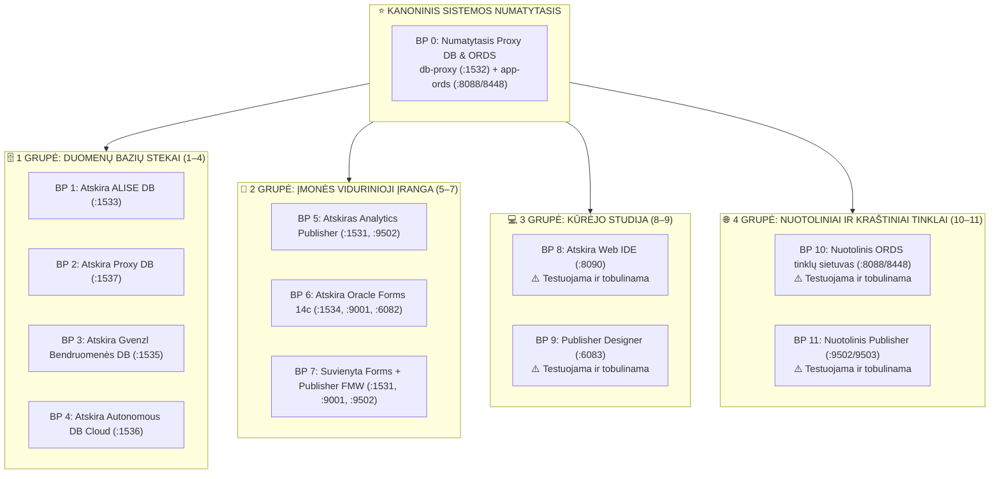

[ 🇬🇧 English ](README.md) | [ 🇪🇪 Eesti ](README.et.md) | [ 🇫🇮 Suomi ](README.fi.md) | [ 🇸🇪 Svenska ](README.sv.md) | [ 🇱🇻 Latviešu ](README.lv.md) | [ 🇱🇹 Lietuvių ](README.lt.md)

# 🏗️ Architektūros Projektų (Blueprints) Katalogas (0 .. 11)

Šiame kataloge aprašomi **12 kanoninių modulinių architektūros projektų**, apimančių visą platformą:



---

## 🚀 CLI Komandos ir Projektų Valdymas

```bash
# 1. Paleisti su numatytuoju Blueprint 0 (Numatytasis Proxy DB + ORDS, be papildomų vėliavėlių):
./scripts/setup-all.sh

# 2. Įdiegti bet kurį konkretų projektą (pvz., Blueprint 1, 5, 8, 10):
./scripts/setup-all.sh -b 1
./scripts/setup-all.sh -b 5

# 3. Interaktyvus projekto pasirinkimas:
./scripts/setup-all.sh -i

# 4. Dry-run modeliavimas (patikrina prievadus ir profilius neliečiant konteinerių):
./scripts/setup-all.sh --dry-run
./tests/test-all-blueprints-live.sh --all --dry-run

# 5. Peržiūrėti projekto detales:
./scripts/internal/blueprint-info.sh -s 0
./scripts/internal/blueprint-info.sh --list
```

---

## 📊 12 Architektūros Projektų Matrica

| ID | Projekto Pavadinimas & Failas | Duomenų Bazės Profilis & Prievadas | Paslaugų Profiliai & Prievadai | Konteineriai | Aprašymas |
| :---: | :--- | :--- | :--- | :--- | :--- |
| **0** | [`.env.0-default-proxy-ords`](.env.0-default-proxy-ords) *(NUMATYTASIS)* | `db-proxy-oracle.yaml` (:1532) | `ords-image.yaml` (:8088/8448) | `db-proxy`, `app-ords` | **Kanoninis sistemos numatytasis.** Centrinis SSO šliuzas ir ORDS maršrutizatorius. |
| **1** | [`.env.1-standalone-alise-db`](.env.1-standalone-alise-db) | `db-alise-oracle.yaml` (:1533) | *(Automatinis registravimas centriniame ORDS)* | `db-alise` | Pirminė verslo duomenų bazė, PL/SQL branduolys, APEX 26.1 metaduomenys. |
| **2** | [`.env.2-standalone-proxy-db`](.env.2-standalone-proxy-db) | `db-proxy-standalone.yaml` (:1537) | *(Automatinis registravimas centriniame ORDS)* | `db-proxy-standalone` | Atskira Proxy DB ir SSO šliuzas specialiame prievade 1537. |
| **3** | [`.env.3-standalone-gvenzl-db`](.env.3-standalone-gvenzl-db) | `db-gvenzl.yaml` (:1535) | *(Automatinis registravimas centriniame ORDS)* | `db-gvenzl` | Alternatyvus Gerald Venzl bendruomenės atvaizdas našumo palyginimui. |
| **4** | [`.env.4-standalone-autonomous-db`](.env.4-standalone-autonomous-db) | `db-adb.yaml` (:1536) | `ords-image.yaml` (:8088/8448) | `db-adb`, `app-ords` | Oracle Autonomous Database Cloud su mTLS pinigine ir Dev Hub. |
| **5** | [`.env.5-standalone-publisher`](.env.5-standalone-publisher) | `db-publisher-oracle.yaml` (:1531) | `publisher-standard.yaml` (:9502) | `db-publisher`, `app-publisher` | Atskiras Analytics Publisher 2025 ir speciali RCU saugyklos DB. |
| **6** | [`.env.6-standalone-forms`](.env.6-standalone-forms) | `db-forms-oracle.yaml` (:1534) | `forms-standard.yaml` (:9001, :6082) | `db-forms`, `app-forms` | Atskira Oracle Forms 14c ir HTML5 noVNC Forms Builder. |
| **7** | [`.env.7-consolidated-forms-publisher`](.env.7-consolidated-forms-publisher) | `db-publisher-oracle.yaml` (:1531) | `forms-publisher-unified.yaml` (:9001/9502/6082) | `db-publisher`, `app-forms-publisher` | Vieningas WebLogic konteineris, vykdantis ir Forms 14c, ir Publisher. |
| **8** | [`.env.8-standalone-web-ide`](.env.8-standalone-web-ide) | - *(Zero DB)* | `web-ide-standard.yaml` (:8090/8449/8091) | `web-ide-dev` | **⚠️ Testuojama ir tobulinama:** VS Code serveris ir SQL Developer veikia. Artifactory veidrodžio konfigūracija kuriama. |
| **9** | [`.env.9-standalone-publisher-designer`](.env.9-standalone-publisher-designer) | - *(Zero DB)* | `publisher-designer-standard.yaml` (:6083 noVNC) | `app-publisher-designer` | **⚠️ Testuojama ir tobulinama:** noVNC darbalaukio konteineris pasileidžia. MS Word ir BIP Add-in integracija vyksta. |
| **10** | [`.env.10-remote-ords`](.env.10-remote-ords) | `MAIN_DB_PROFILE=NONE` | `ords-standalone.yaml` (:8088/8448) | `app-ords` | **⚠️ Testuojama ir tobulinama:** Atskiras ORDS konteineris pasileidžia. Nuotolinis maršrutizavimas į debesį kuriamas. |
| **11** | [`.env.11-remote-publisher`](.env.11-remote-publisher) | `MAIN_DB_PROFILE=NONE` | `publisher-standard.yaml` (:9502/9503) | `app-publisher` | **⚠️ Testuojama ir tobulinama:** Publisher pasileidžia. Ataskaitų teikimas prieš išorines duomenų bazes kuriamas. |

---

## 🧩 Švari Projektų ir YAML Profilių Architektūra (Rule 11)

### 1. Atsakomybių Atskyrimas
- **Projektai (`config/blueprints/.env.*`):** Deklaruoja tik aukšto lygio teigiamas nuorodas į YAML profilius. Jie apibrėžia *kokie konteineriai sukuriami*. Jokiu būdu neturi fiksuotų prievadų, slaptažodžių ar neigiamų `SKIP_*` vėliavėlių.
- **YAML Profiliai (`config/profiles/**/*.yaml`):** Apima 100% domenui būdingų detalių: konteinerių atvaizdus, atminties limitus, prievadus, numatytąsias PDB, lentelių erdves ir vartotojų aprašus.

### 2. Kaip Pridėti Pasirinktinį Projektą (1 po 1)
Kiekvienas gali sukurti naują projektą be scenarijaus kodo keitimo:
1. Sukurkite naują failą: `config/blueprints/.env.<ID>-<pavadinimas>` (pvz., `.env.12-custom-analytics-workstation`):
   ```bash
   # Pasirinktinis Projektas 12: Analytics Workstation
   DB_ALISE=db-alise-oracle
   ORDS_PROFILE=ords-standard
   PUBLISHER_PROFILE=publisher-standard
   WEB_IDE_PROFILE=web-ide-standard
   ```
2. Paleiskite arba testuokite naują projektą iš karto:
   ```bash
   ./scripts/setup-all.sh -b 12
   ./scripts/setup-all.sh -b 12 --dry-run
   ```
   Orkestravimo variklis automatiškai aptinka failą, nuskaito profilius, priskiria prievadus ir sukonfigūruoja SEPS piniginę.
