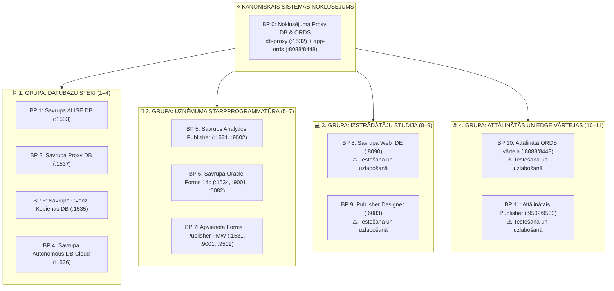

[ 🇬🇧 English ](README.md) | [ 🇪🇪 Eesti ](README.et.md) | [ 🇫🇮 Suomi ](README.fi.md) | [ 🇸🇪 Svenska ](README.sv.md) | [ 🇱🇻 Latviešu ](README.lv.md) | [ 🇱🇹 Lietuvių ](README.lt.md)

# 🏗️ Arhitektūras projektējumu (Blueprints) katalogs (0 .. 11)

Šis direktorijs definē **12 kanoniskos modulāros arhitektūras projektējumus**, kas aptver visu platformu:



---

## 🚀 CLI komandas & projektējumu pārvaldība

```bash
# 1. Palaist ar noklusējuma modeli Blueprint 0 (Noklusējuma Proxy DB + ORDS, bez papildu karodziņiem):
./scripts/setup-all.sh

# 2. Ieviest konkrētu modeli (piemēram, Blueprint 1, 5, 8, 10):
./scripts/setup-all.sh -b 1
./scripts/setup-all.sh -b 5

# 3. Interaktīva modeļa izvēle:
./scripts/setup-all.sh -i

# 4. Dry-run simulācija (pārbauda portus un profilus, nemainot konteinerus):
./scripts/setup-all.sh --dry-run
./tests/test-all-blueprints-live.sh --all --dry-run

# 5. Apskatīt modeļa detaļas:
./scripts/internal/blueprint-info.sh -s 0
./scripts/internal/blueprint-info.sh --list
```

---

## 📊 12 Arhitektūras projektējumu matrica

| ID | Projektējuma Nosaukums & Fails | Datubāzes Profils & Ports | Servisa Profili & Porti | Konteineri | Apraksts |
| :---: | :--- | :--- | :--- | :--- | :--- |
| **0** | [`.env.0-default-proxy-ords`](.env.0-default-proxy-ords) *(NOKLUSĒJUMS)* | `db-proxy-oracle.yaml` (:1532) | `ords-image.yaml` (:8088/8448) | `db-proxy`, `app-ords` | **Kanoniskais sistēmas noklusējums.** Centrālā SSO vārteja un ORDS maršrutētājs. |
| **1** | [`.env.1-standalone-alise-db`](.env.1-standalone-alise-db) | `db-alise-oracle.yaml` (:1533) | *(Automātiska reģistrācija centrālajā ORDS)* | `db-alise` | Primārā biznesa datubāze, PL/SQL kodols, APEX 26.1 metadati. |
| **2** | [`.env.2-standalone-proxy-db`](.env.2-standalone-proxy-db) | `db-proxy-standalone.yaml` (:1537) | *(Automātiska reģistrācija centrālajā ORDS)* | `db-proxy-standalone` | Savrupa Proxy DB un SSO vārteja atsevišķā portā 1537. |
| **3** | [`.env.3-standalone-gvenzl-db`](.env.3-standalone-gvenzl-db) | `db-gvenzl.yaml` (:1535) | *(Automātiska reģistrācija centrālajā ORDS)* | `db-gvenzl` | Alternatīvs Gerald Venzl kopienas attēls veiktspējas salīdzināšanai. |
| **4** | [`.env.4-standalone-autonomous-db`](.env.4-standalone-autonomous-db) | `db-adb.yaml` (:1536) | `ords-image.yaml` (:8088/8448) | `db-adb`, `app-ords` | Oracle Autonomous Database Cloud ar mTLS maku un Dev Hub atbalstu. |
| **5** | [`.env.5-standalone-publisher`](.env.5-standalone-publisher) | `db-publisher-oracle.yaml` (:1531) | `publisher-standard.yaml` (:9502) | `db-publisher`, `app-publisher` | Savrups Analytics Publisher 2025 un veltīta RCU repozitorija DB. |
| **6** | [`.env.6-standalone-forms`](.env.6-standalone-forms) | `db-forms-oracle.yaml` (:1534) | `forms-standard.yaml` (:9001, :6082) | `db-forms`, `app-forms` | Savrupa Oracle Forms 14c un HTML5 noVNC Forms Builder. |
| **7** | [`.env.7-consolidated-forms-publisher`](.env.7-consolidated-forms-publisher) | `db-publisher-oracle.yaml` (:1531) | `forms-publisher-unified.yaml` (:9001/9502/6082) | `db-publisher`, `app-forms-publisher` | Apvienots WebLogic konteiners, kurā darbojas gan Forms 14c, gan Publisher. |
| **8** | [`.env.8-standalone-web-ide`](.env.8-standalone-web-ide) | - *(Zero DB)* | `web-ide-standard.yaml` (:8090/8449/8091) | `web-ide-dev` | **⚠️ Testēšanā un uzlabošanā:** VS Code serveris un SQL Developer darbojas. Artifactory konfigurācija izstrādē. |
| **9** | [`.env.9-standalone-publisher-designer`](.env.9-standalone-publisher-designer) | - *(Zero DB)* | `publisher-designer-standard.yaml` (:6083 noVNC) | `app-publisher-designer` | **⚠️ Testēšanā un uzlabošanā:** noVNC darbvirsmas konteiners startējas. MS Word un BIP Add-in integrācija procesā. |
| **10** | [`.env.10-remote-ords`](.env.10-remote-ords) | `MAIN_DB_PROFILE=NONE` | `ords-standalone.yaml` (:8088/8448) | `app-ords` | **⚠️ Testēšanā un uzlabošanā:** Savrups ORDS startējas. Attālinātā maršrutēšana uz mākoni izstrādē. |
| **11** | [`.env.11-remote-publisher`](.env.11-remote-publisher) | `MAIN_DB_PROFILE=NONE` | `publisher-standard.yaml` (:9502/9503) | `app-publisher` | **⚠️ Testēšanā un uzlabošanā:** Publisher startējas. Atskaites pret attālinātām datubāzēm izstrādē. |

---

## 🧩 Tīra projektējumu un YAML profilu arhitektūra (rule 11)

### 1. Atbildības sadale
- **Projektējumi (`config/blueprints/.env.*`):** Deklarē tikai augsta līmeņa pozitīvas atsauces uz YAML profiliem. Tie nosaka *kādi konteineri tiek izveidoti*. Nekad nesatur fiksētus portus, paroles vai negatīvus `SKIP_*` karodziņus.
- **YAML Profili (`config/profiles/**/*.yaml`):** Satur 100% no domēna detaļām: konteineru attēlus, atmiņas ierobežojumus, portus, noklusējuma PDB, tabultelpas un lietotāju definīcijas.

### 2. Kā pievienot pielāgotu projektējumu (1 pa 1)
Jebkurš var izveidot jaunu modeli bez skriptu koda modifikācijas:
1. Izveidojiet jaunu failu: `config/blueprints/.env.<ID>-<nosaukums>` (piem., `.env.12-custom-analytics-workstation`):
   ```bash
   # Pielāgots Modelis 12: Analytics Workstation
   DB_ALISE=db-alise-oracle
   ORDS_PROFILE=ords-standard
   PUBLISHER_PROFILE=publisher-standard
   WEB_IDE_PROFILE=web-ide-standard
   ```
2. Palaidiet vai testējiet jauno modeli:
   ```bash
   ./scripts/setup-all.sh -b 12
   ./scripts/setup-all.sh -b 12 --dry-run
   ```
   Orķestrēšanas dzinējs automātiski atpazīst failu, nolasa profilus, piešķir portus un nokonfigurē SEPS maku.
