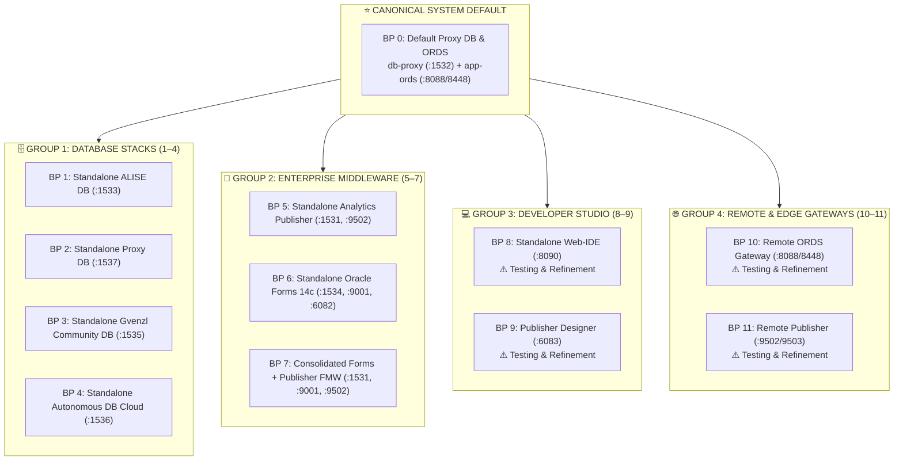

[ 🇬🇧 English ](README.md) | [ 🇪🇪 Eesti ](README.et.md) | [ 🇫🇮 Suomi ](README.fi.md) | [ 🇸🇪 Svenska ](README.sv.md) | [ 🇱🇻 Latviešu ](README.lv.md) | [ 🇱🇹 Lietuvių ](README.lt.md)

# 🏗️ Architecture Blueprints Catalog (0 .. 11)

This directory defines the **12 canonical modular architecture blueprints** representing the complete enterprise stack:



---

## 🚀 CLI Commands & Blueprint Management

```bash
# 1. Launch with default Blueprint 0 (Default Proxy DB + ORDS, no flags needed):
./scripts/setup-all.sh

# 2. Deploy any specific blueprint (e.g. Blueprint 1, 5, 8, 10):
./scripts/setup-all.sh -b 1
./scripts/setup-all.sh -b 5

# 3. Interactive Blueprint selection:
./scripts/setup-all.sh -i

# 4. Dry-run simulation (verifies ports & profiles without modifying containers):
./scripts/setup-all.sh --dry-run
./tests/test-all-blueprints-live.sh --all --dry-run

# 5. Inspect blueprint details:
./scripts/internal/blueprint-info.sh -s 0
./scripts/internal/blueprint-info.sh --list
```

---

## 📊 12 Architecture Blueprints Matrix

| ID | Blueprint Name & File | Database Profile & Port | Service Profiles & Ports | Running Containers | Description |
| :---: | :--- | :--- | :--- | :--- | :--- |
| **0** | [`.env.0-default-proxy-ords`](.env.0-default-proxy-ords) *(DEFAULT)* | `db-proxy-oracle.yaml` (:1532) | `ords-image.yaml` (:8088/8448) | `db-proxy`, `app-ords` | **Canonical system default.** Permanent central SSO gateway & multi-DB ORDS router. |
| **1** | [`.env.1-standalone-alise-db`](.env.1-standalone-alise-db) | `db-alise-oracle.yaml` (:1533) | *(Auto-registers in Central ORDS if active)* | `db-alise` | Primary business database, PL/SQL core, APEX 26.1 metadata. Zero web container RAM. |
| **2** | [`.env.2-standalone-proxy-db`](.env.2-standalone-proxy-db) | `db-proxy-standalone.yaml` (:1537) | *(Auto-registers in Central ORDS if active)* | `db-proxy-standalone` | Standalone APEX Proxy DB & SSO gateway on dedicated port 1537. |
| **3** | [`.env.3-standalone-gvenzl-db`](.env.3-standalone-gvenzl-db) | `db-gvenzl.yaml` (:1535) | *(Auto-registers in Central ORDS if active)* | `db-gvenzl` | Alternate Gerald Venzl community engine for benchmarking. |
| **4** | [`.env.4-standalone-autonomous-db`](.env.4-standalone-autonomous-db) | `db-adb.yaml` (:1536) | `ords-image.yaml` (:8088/8448) | `db-adb`, `app-ords` | Oracle Autonomous Database Cloud with mTLS wallet, version check & Dev Hub. |
| **5** | [`.env.5-standalone-publisher`](.env.5-standalone-publisher) | `db-publisher-oracle.yaml` (:1531) | `publisher-standard.yaml` (:9502) | `db-publisher`, `app-publisher` | Standalone Analytics Publisher 2025 & dedicated RCU repository DB. |
| **6** | [`.env.6-standalone-forms`](.env.6-standalone-forms) | `db-forms-oracle.yaml` (:1534) | `forms-standard.yaml` (:9001, :6082) | `db-forms`, `app-forms` | Standalone Oracle Forms 14c Services & HTML5 noVNC Forms Builder. |
| **7** | [`.env.7-consolidated-forms-publisher`](.env.7-consolidated-forms-publisher) | `db-publisher-oracle.yaml` (:1531) | `forms-publisher-unified.yaml` (:9001/9502/6082) | `db-publisher`, `app-forms-publisher` | Unified WebLogic container running both Forms 14c & Publisher. |
| **8** | [`.env.8-standalone-web-ide`](.env.8-standalone-web-ide) | - *(Zero DB)* | `web-ide-standard.yaml` (:8090/8449/8091) | `web-ide-dev` | **⚠️ Testing & Refinement:** VS Code server & SQL Developer operational. Artifactory mirror configuration under active enhancement. |
| **9** | [`.env.9-standalone-publisher-designer`](.env.9-standalone-publisher-designer) | - *(Zero DB)* | `publisher-designer-standard.yaml` (:6083 noVNC) | `app-publisher-designer` | **⚠️ Testing & Refinement:** HTML5 noVNC desktop container boots. MS Word & BIP Template Builder Add-in integration in progress. |
| **10** | [`.env.10-remote-ords`](.env.10-remote-ords) | `MAIN_DB_PROFILE=NONE` | `ords-standalone.yaml` (:8088/8448) | `app-ords` | **⚠️ Testing & Refinement:** Edge ORDS container boots. Remote cloud ADB & enterprise routing under active development. |
| **11** | [`.env.11-remote-publisher`](.env.11-remote-publisher) | `MAIN_DB_PROFILE=NONE` | `publisher-standard.yaml` (:9502/9503) | `app-publisher` | **⚠️ Testing & Refinement:** Analytics Publisher container boots. Remote enterprise database reporting under active development. |

---

## 🧩 Clean Blueprint & YAML Profile Architecture (Rule 11)

### 1. Separation of Concerns
- **Blueprints (`config/blueprints/.env.*`):** Only declare high-level positive references to YAML profiles. They define *which containers are created*. They never contain hardcoded ports, passwords, or negative `SKIP_*` flags.
- **YAML Profiles (`config/profiles/**/*.yaml`):** Contain 100% of domain specifics: container images, memory limits, ports (`db_port`, `http_port`), default services/PDBs, tablespaces, quotas, user definitions, and cross-database links.

### 2. How to Add a Custom Blueprint (1-by-1)
Any developer or AI can create a new blueprint at any time without modifying any shell scripts or engine code:
1. Create a new file: `config/blueprints/.env.<ID>-<name>` (e.g. `.env.12-custom-analytics-workstation`):
   ```bash
   # Custom Blueprint 12: Analytics Workstation
   DB_ALISE=db-alise-oracle
   ORDS_PROFILE=ords-standard
   PUBLISHER_PROFILE=publisher-standard
   WEB_IDE_PROFILE=web-ide-standard
   ```
2. Launch or test your new blueprint immediately:
   ```bash
   ./scripts/setup-all.sh -b 12
   ./scripts/setup-all.sh -b 12 --dry-run
   ```
   The orchestration engine automatically discovers the file, resolves the referenced YAML profiles, detects active containers, maps ports, and configures the SEPS Wallet.

