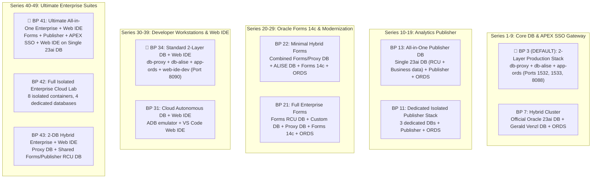
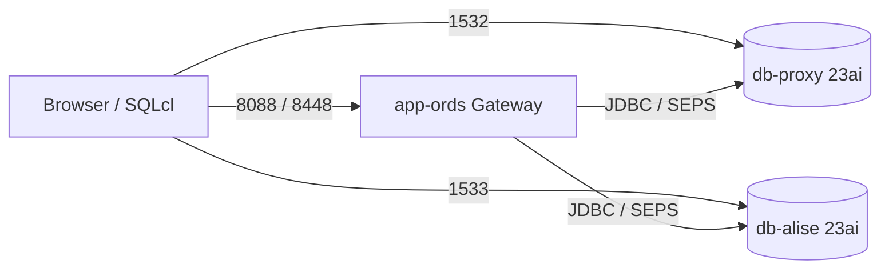
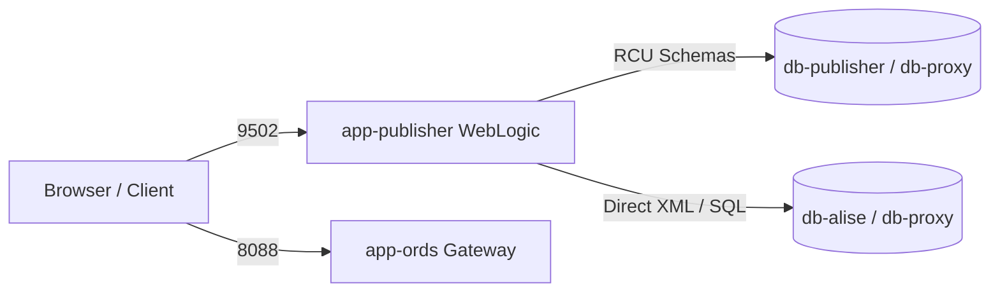
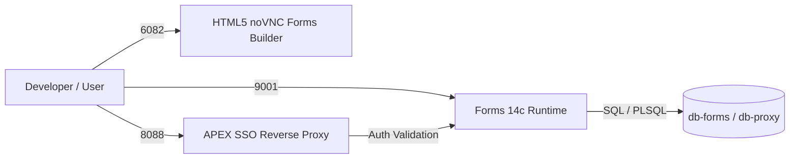
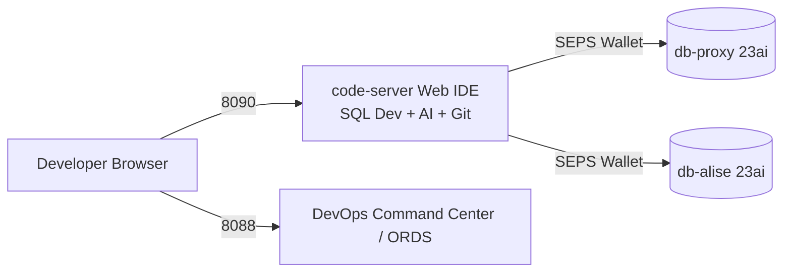
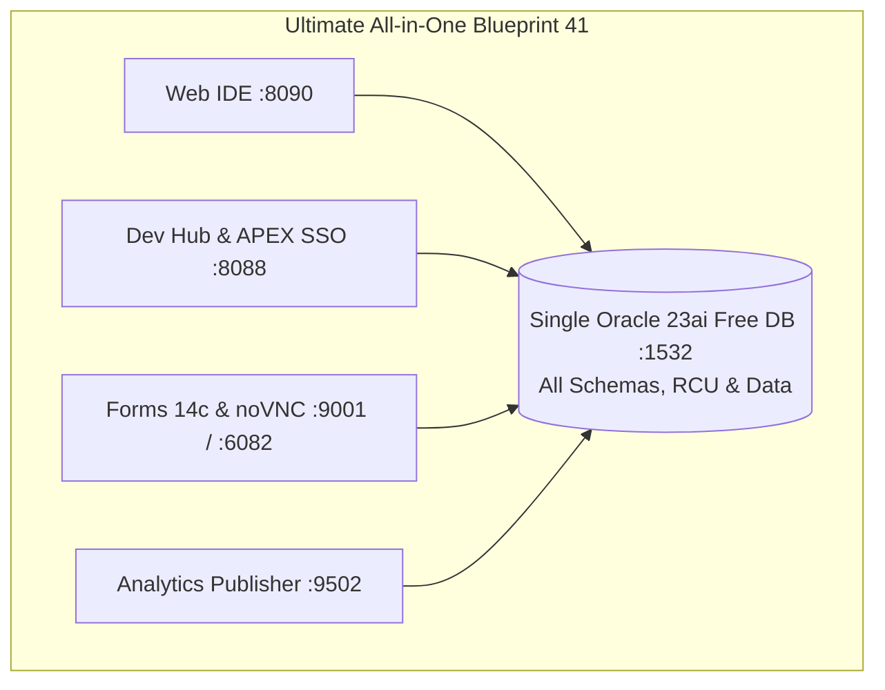

[ 🇬🇧 English ](README.md) | [ 🇪🇪 Eesti ](README.et.md) | [ 🇫🇮 Suomi ](README.fi.md) | [ 🇸🇪 Svenska ](../../docs/sv/README.md) | [ 🇱🇻 Latviešu ](../../docs/lv/README.md) | [ 🇱🇹 Lietuvių ](../../docs/lt/README.md)

# 🏗️ Architecture Blueprints (11 Curated Enterprise Models)

This directory serves as the **central and canonical single source of truth for the 11 curated architecture blueprints**.

Each blueprint (`.env.<N>-*`) defines a complete infrastructure model ranging from a lightweight 2-layer developer database to an 8-container fully isolated enterprise cloud lab.

---

## 🚀 Blueprint Management & Deployment CLI Commands

Use the dedicated orchestration script **`./scripts/deploy-blueprint.sh`** (or `./scripts/setup-all.sh -b <N>`):

```bash
# 1. Check current active blueprint and container health:
./scripts/deploy-blueprint.sh --status

# 2. Deploy or switch to Blueprint 3 (DEFAULT 2-layer production stack):
./scripts/deploy-blueprint.sh -b 3

# 3. Deploy Blueprint 41 (Ultimate All-in-One Enterprise with Forms + Publisher + APEX + Web IDE):
./scripts/deploy-blueprint.sh -b 41

# 4. Dry-run simulation (preview actions without modifying containers):
./scripts/deploy-blueprint.sh -b 42 --dry-run

# 5. List all available curated blueprints in a formatted ASCII table:
./scripts/setup-all.sh -lb

# 6. Run automated 2-pass matrix verification (Cold setup + Warm recovery):
./scripts/internal/run_blueprint_matrix_test.sh
```

---

## 📊 Canonical 11-Blueprint Architecture Matrix



---

### 🔹 Series 1–9: Core Database & APEX SSO Gateway Architectures
| No | File Name | Active Containers | Ports | Purpose & Description |
| :--- | :--- | :--- | :--- | :--- |
| **3** | `.env.3-db-alise-apex-ords-with-proxy` | `db-proxy`, `db-alise`, `app-ords` | `1532`, `1533`, `8088`, `8448` | **🌟 DEFAULT PRODUCTION STACK:** 2-layer secure network topology (isolated Proxy DB and ALISE DB) with APEX and ORDS. |
| **7** | `.env.7-hybrid-multi-vendor-db` | `db-proxy`, `db-alise`, `app-ords` | `1532`, `1533`, `8088`, `8448` | **Hybrid Cluster:** Official Oracle 23ai image (Proxy) and Gerald Venzl image (ALISE) co-existing. |



---

### 🔹 Series 10–19: Analytics Publisher Architectures (Pixel-Perfect Reporting)
| No | File Name | Active Containers | Ports | Purpose & Description |
| :--- | :--- | :--- | :--- | :--- |
| **11** | `.env.11-publisher-full-enterprise` | `db-publisher`, `db-alise`, `db-proxy`, `app-ords`, `app-publisher` | `1531-1533`, `8088`, `9502` | **Fully Isolated Publisher Stack:** All 3 databases (Publisher RCU, ALISE, Proxy), ORDS, and Publisher co-located. |
| **13** | `.env.13-publisher-all-in-one-db` | `db-proxy`, `app-ords`, `app-publisher` | `1532`, `8088`, `9502` | **All-in-One Publisher DB:** All RCU schemas and business data combined inside one Free DB (`db-proxy`). |



---

### 🔹 Series 20–29: Oracle Forms 14c Architectures (Forms Services & Modernization)
| No | File Name | Active Containers | Ports | Purpose & Description |
| :--- | :--- | :--- | :--- | :--- |
| **21** | `.env.21-forms-full-enterprise` | `db-forms`, `db-alise`, `db-proxy`, `app-forms`, `app-ords` | `1531-1534`, `8088`, `9001`, `6082` | **Full Enterprise Forms Stack:** Dedicated Forms RCU DB + Custom DB + APEX Proxy DB + Forms 14c + ORDS. |
| **22** | `.env.22-forms-minimal-hybrid` | `db-proxy`, `db-alise`, `app-forms`, `app-ords` | `1531`, `1532`, `8088`, `9001`, `6082` | **Minimal Forms Hybrid:** Combined Forms/Proxy DB + ALISE DB + ORDS + Forms Services (HTML5 noVNC). |



---

### 🔹 Series 30–39: Zero-Install Developer Workstations & Cloud Labs (Web IDE)
| No | File Name | Active Containers | Ports | Purpose & Description |
| :--- | :--- | :--- | :--- | :--- |
| **31** | `.env.31-cloud-adb-with-web-ide` | `db-proxy`, `app-ords`, `web-ide-dev` | `1532`, `8088`, `8090` | **Cloud ADB Emulator + Web IDE:** Autonomous Database emulator with browser VS Code Web IDE & tools. |
| **34** | `.env.34-proxy-alise-apex-ords-with-web-ide` | `db-proxy`, `db-alise`, `app-ords`, `web-ide-dev` | `1532`, `1533`, `8088`, `8090` | **🌟 2-Layer Enterprise Stack + Web IDE:** Recommended 2-layer production stack with browser VS Code Web IDE. |



---

### 🔹 Series 40–49: Ultimate Enterprise All-in-One & Cloud Labs
| No | File Name | Active Containers | Ports | Purpose & Description |
| :--- | :--- | :--- | :--- | :--- |
| **41** | `.env.41-ultimate-all-in-one-enterprise-with-web-ide` | `db-proxy`, `app-forms`, `app-publisher`, `app-ords`, `web-ide-dev` | `1532`, `8088`, `9502`, `9001`, `8090`, `6082` | **🌟 Ultimate All-in-One Enterprise:** Forms 14c + Publisher + APEX SSO + ORDS + Web IDE on single 23ai DB (`db-proxy`). |
| **42** | `.env.42-ultimate-full-enterprise-isolated-with-web-ide` | `db-forms`, `db-publisher`, `db-proxy`, `db-alise`, `app-forms`, `app-publisher`, `app-ords`, `web-ide-dev` | All ports | **Fully Isolated Cloud Lab:** Forms and Publisher in dedicated containers on isolated databases with Web IDE. |
| **43** | `.env.43-proxy-ords-apex-with-shared-forms-publisher-db-web-ide` | `db-proxy`, `db-publisher`, `app-forms`, `app-publisher`, `app-ords`, `web-ide-dev` | `1531`, `1532`, `8088`, `9502`, `9001`, `8090`, `6082` | **2-Database Hybrid Enterprise:** APEX/ORDS Proxy DB + Shared Middleware Infra DB (`db-publisher`) for Forms & Publisher RCU. |


