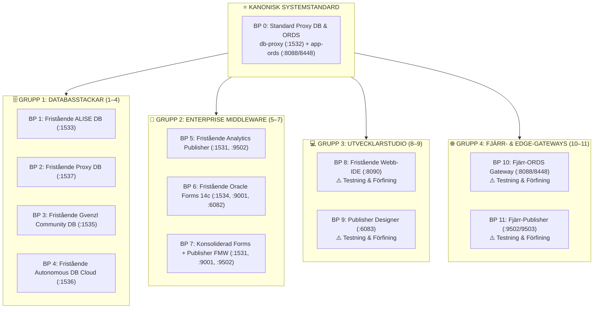

[ 🇬🇧 English ](README.md) | [ 🇪🇪 Eesti ](README.et.md) | [ 🇫🇮 Suomi ](README.fi.md) | [ 🇸🇪 Svenska ](README.sv.md) | [ 🇱🇻 Latviešu ](README.lv.md) | [ 🇱🇹 Lietuvių ](README.lt.md)

# 🏗️ Katalog över Arkitekturritningar (Blueprints 0 .. 11)

Denna katalog definierar de **12 kanoniska modulära arkitekturritningarna** som representerar hela plattformen:



---

## 🚀 CLI-Kommandon & Hantering av Ritningar

```bash
# 1. Starta med standardritning Blueprint 0 (Standard Proxy DB + ORDS, inga flaggor krävs):
./scripts/setup-all.sh

# 2. Driftsätt valfri ritning (t.ex. Blueprint 1, 5, 8, 10):
./scripts/setup-all.sh -b 1
./scripts/setup-all.sh -b 5

# 3. Interaktivt val av ritning:
./scripts/setup-all.sh -i

# 4. Dry-run simulering (verifierar portar & profiler utan att ändra containrar):
./scripts/setup-all.sh --dry-run
./tests/test-all-blueprints-live.sh --all --dry-run

# 5. Granska detaljer för en ritning:
./scripts/internal/blueprint-info.sh -s 0
./scripts/internal/blueprint-info.sh --list
```

---

## 📊 Matris över 12 Arkitekturritningar

| ID | Ritningens Namn & Fil | Databasprofil & Port | Tjänsteprofiler & Portar | Containrar | Beskrivning |
| :---: | :--- | :--- | :--- | :--- | :--- |
| **0** | [`.env.0-default-proxy-ords`](.env.0-default-proxy-ords) *(STANDARD)* | `db-proxy-oracle.yaml` (:1532) | `ords-image.yaml` (:8088/8448) | `db-proxy`, `app-ords` | **Kanonisk systemstandard.** Central SSO-gateway & ORDS-router. |
| **1** | [`.env.1-standalone-alise-db`](.env.1-standalone-alise-db) | `db-alise-oracle.yaml` (:1533) | *(Registreras i central ORDS om aktiv)* | `db-alise` | Primär verksamhetsdatabas, PL/SQL-kärna, APEX 26.1-metadata. |
| **2** | [`.env.2-standalone-proxy-db`](.env.2-standalone-proxy-db) | `db-proxy-standalone.yaml` (:1537) | *(Registreras i central ORDS om aktiv)* | `db-proxy-standalone` | Fristående Proxy DB och SSO-gateway på dedikerad port 1537. |
| **3** | [`.env.3-standalone-gvenzl-db`](.env.3-standalone-gvenzl-db) | `db-gvenzl.yaml` (:1535) | *(Registreras i central ORDS om aktiv)* | `db-gvenzl` | Alternativ Gerald Venzl community-avbildning för prestandajämförelser. |
| **4** | [`.env.4-standalone-autonomous-db`](.env.4-standalone-autonomous-db) | `db-adb.yaml` (:1536) | `ords-image.yaml` (:8088/8448) | `db-adb`, `app-ords` | Oracle Autonomous Database Cloud med mTLS-plånbok och Dev Hub. |
| **5** | [`.env.5-standalone-publisher`](.env.5-standalone-publisher) | `db-publisher-oracle.yaml` (:1531) | `publisher-standard.yaml` (:9502) | `db-publisher`, `app-publisher` | Fristående Analytics Publisher 2025 och dedikerad RCU-databas. |
| **6** | [`.env.6-standalone-forms`](.env.6-standalone-forms) | `db-forms-oracle.yaml` (:1534) | `forms-standard.yaml` (:9001, :6082) | `db-forms`, `app-forms` | Fristående Oracle Forms 14c och HTML5 noVNC Forms Builder. |
| **7** | [`.env.7-consolidated-forms-publisher`](.env.7-consolidated-forms-publisher) | `db-publisher-oracle.yaml` (:1531) | `forms-publisher-unified.yaml` (:9001/9502/6082) | `db-publisher`, `app-forms-publisher` | Enhetlig WebLogic-container som kör både Forms 14c och Publisher. |
| **8** | [`.env.8-standalone-web-ide`](.env.8-standalone-web-ide) | - *(Zero DB)* | `web-ide-standard.yaml` (:8090/8449/8091) | `web-ide-dev` | **⚠️ Testning & Förfining:** VS Code-server och SQL Developer fungerar. Artifactory-spegel under utveckling. |
| **9** | [`.env.9-standalone-publisher-designer`](.env.9-standalone-publisher-designer) | - *(Zero DB)* | `publisher-designer-standard.yaml` (:6083 noVNC) | `app-publisher-designer` | **⚠️ Testning & Förfining:** noVNC-skrivbordscontainer startar. Word och BIP Add-in integreras. |
| **10** | [`.env.10-remote-ords`](.env.10-remote-ords) | `MAIN_DB_PROFILE=NONE` | `ords-standalone.yaml` (:8088/8448) | `app-ords` | **⚠️ Testning & Förfining:** Fristående ORDS startar. Fjärranslutning till moln-ADB under utveckling. |
| **11** | [`.env.11-remote-publisher`](.env.11-remote-publisher) | `MAIN_DB_PROFILE=NONE` | `publisher-standard.yaml` (:9502/9503) | `app-publisher` | **⚠️ Testning & Förfining:** Publisher startar. Rapportering mot externa databaser under utveckling. |

---

## 🧩 Ren Ritnings- och YAML-Profilarkitektur (Rule 11)

### 1. Tydlig Ansvarsfördelning
- **Ritningar (`config/blueprints/.env.*`):** Deklarerar endast övergripande positiva referenser till YAML-profiler. De definierar *vilka containrar som skapas*. Inga hårdkodade portar, lösenord eller negativa `SKIP_*`-flaggor.
- **YAML-Profiler (`config/profiles/**/*.yaml`):** Innehåller 100% av domänspecifika inställningar: containeravbildningar, minnesgränser, portar, standard-PDB:er, tabellutrymmen och användardefinitioner.

### 2. Hur Man Lägger Till en Anpassad Ritning (1-för-1)
Vem som helst kan skapa en ny ritning utan att ändra skriptkoden:
1. Skapa en ny fil: `config/blueprints/.env.<ID>-<namn>` (t.ex. `.env.12-custom-analytics-workstation`):
   ```bash
   # Anpassad Ritning 12: Analytics Workstation
   DB_ALISE=db-alise-oracle
   ORDS_PROFILE=ords-standard
   PUBLISHER_PROFILE=publisher-standard
   WEB_IDE_PROFILE=web-ide-standard
   ```
2. Starta eller testa den nya ritningen direkt:
   ```bash
   ./scripts/setup-all.sh -b 12
   ./scripts/setup-all.sh -b 12 --dry-run
   ```
   Orkestreringsmotorn upptäcker filen automatiskt, läser in profilerna, mappar portar och konfigurerar SEPS Wallet.
