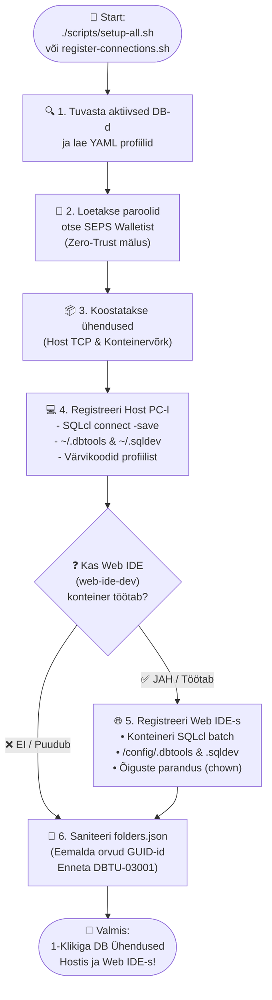

[ 🇬🇧 English ](README.md) | [ 🇪🇪 Eesti ](README.et.md) | [ 🇫🇮 Suomi ](README.fi.md) | [ 🇸🇪 Svenska ](README.sv.md) | [ 🇱🇻 Latviešu ](README.lv.md) | [ 🇱🇹 Lietuvių ](README.lt.md)

[ 🇬🇧 English ](README.md) | [ 🇪🇪 Eesti ](README.et.md) | [ 🇫🇮 Suomi ](README.fi.md) | [ 🇸🇪 Svenska ](README.sv.md) | [ 🇱🇻 Latviešu ](README.lv.md) | [ 🇱🇹 Lietuvių ](README.lt.md) -->

# 🔌 Andmebaasiühenduste ja VS Code seadistamise juhend

See juhend kirjeldab andmebaasiühenduste automaatset ja käsitsi registreerimist **Oracle SQL Developer for VS Code** laienduses (nii lokaalsel hostil kui Web IDE konteineris) ning paroolivaba ühendumist Oracle Walleti (SEPS) kaudu.

---

## 🔄 Automaatne kahetasandiline registreerimine (host PC & web IDE)

Kogu platvorm kasutab automatiseeritud ühenduste registreerimise mootorit (`scripts/register-connections.sh`), mis loob ja sünkroonib andmebaasiühendused korraga nii Teie **lokaalses VS Code-is (Host PC)** kui ka **Konteineriseeritud Web IDE-s (`web-ide-dev`)**:

### 📊 Ühenduste registreerimise protsessiskeem



### Käivitamine käsurealt:

```bash
./scripts/register-connections.sh
```

- **Host PC:** Registreerib ühendused failidesse `~/.dbtools/connections/` ja `~/.sqldev/connections.json` (hosti pordid `localhost:1532`, `localhost:1533` jne).
- **Web IDE:** Kui `web-ide-dev` on aktiivne, loob ühendused konteineri siseselt (`db-proxy:1521`, `db-alise:1521` jne) ja salvestab paroolid otse konteineri hoidlasse.
- **Järjekorravaba (Order-Independent):** Web IDE võib käivituda enne või pärast andmebaase. Ühendused sünkroonitakse automaatselt iga uue baasi käivitamisel või käsitsi skripti käivitamisel.

### Automaatne käivitamine projekti avamisel (`.vscode/tasks.json`)

Et ühendused tekitataks automaatselt iga kord, kui projekti kaust VS Code-is avatakse, on loodud task failis **`.vscode/tasks.json`**:

```json
{
  "version": "2.0.0",
  "tasks": [
    {
      "label": "Auto-Register Oracle Connections",
      "type": "shell",
      "command": "./scripts/register-connections.sh",
      "runOptions": {
        "runOn": "folderOpen"
      },
      "presentation": {
        "reveal": "silent"
      },
      "problemMatcher": []
    }
  ]
}
```

---

## 📥 Kuidas importida ühendused VS Code SQL developer UI-sse

Oracle SQL Developer Extension for VS Code laienduses saab ühendused korraga sisse importida failist **`sqldev-connections.json`**:

### Samm-sammuline juhend:
1. Ava VS Code-is vasakult külgribalt **Oracle SQL Developer** vahekaart (Oracle logo).
2. **Database Connections** paneeli päises vajuta nuppudele **`...`** (More Actions) või teosta paremklõps ja vali **`Import Connections`**.
3. Avanenud faili sirvimise aknas navigeeri selle projekti kausta:
   `connections/sqldev-connections.json`
4. Vali fail `sqldev-connections.json` ja vajuta **Import**.
5. Kõik ühendused ilmuvad koheselt teie **Database Connections** nimekirja!

---

## 🔑 Kuidas lisada käsitsi (käsitsi sisestamisel)

Kui soovid lisada ühenduse käsitsi `+` nupuga (nt DBeaver, IntelliJ, Basic-ühendus), saad jooksvad paroolid turvaliselt teada abiskriptiga:
*   **APEX Admin (ADMIN) parool:**
    ```bash
    ./scripts/get-password.sh APEX_ADMIN
    ```
*   **APEX Proxy SYS parool:**
    ```bash
    ./scripts/get-password.sh DB_PROXY_SYS
    ```
*   **Publisher SYS parool:**
    ```bash
    ./scripts/get-password.sh DB_PUBLISHER_SYS
    ```
*   **Arendaja USER_DEVELOPER parool:**
    ```bash
    ./scripts/get-password.sh DB_PROXY_DEV
    ```
*   **LIS SYS parool:**
    ```bash
    ./scripts/get-password.sh DB_ALISE_SYS
    ```
*   **LIS Arendaja USER_DEVELOPER parool:**
    ```bash
    ./scripts/get-password.sh DB_ALISE_DEV
    ```

---

## 🔐 Paroolivaba ühendus Oracle Wallet (SEPS) abil

Kohalikus arenduskeskkonnas on andmebaasi ja kliendi vaheline autentimine täielikult turvatud **Oracle Walleti** ja **SEPS (Secure External Password Store)** abil. See võimaldab teha andmebaasi ühendusi ilma plaintext paroolide sisestamiseta või koodi/skripti sisse kirjutamiseta.

### Eeltingimused host-masinas:
1. `TNS_ADMIN` keskkonnamuutuja peab viitama hoidlas olevale `config/tns_admin` kataloogile:
   ```bash
   export TNS_ADMIN=$(pwd)/config/tns_admin
   ```

### 🔌 Ühendamine SQLcl abil (host-masinast)
Kui `TNS_ADMIN` on seadistatud, saad andmebaasi sisse logida paroolivabalt kasutades järgmisi aliaseid:

*   **APEX Proxy DB:**
    ```bash
    sql /@DB_PROXY_SYS as sysdba
    sql /@DB_PROXY_DEV
    ```
*   **LIS Äribaas DB:**
    ```bash
    sql /@DB_ALISE_SYS as sysdba
    sql /@DB_ALISE_DEV
    ```
*   **Publisher DB:**
    ```bash
    sql /@DB_PUBLISHER_SYS as sysdba
    ```

---

## 🔒 Windows host ja korporatiivvõrgu SSL/TLS sertifikaatide usaldamine

Kui arendad Windows masinas (WSL2 kaudu) ja soovid, et lokaalne HTTPS (ORDS-i isesekreeritud sertifikaat) oleks sinu veebibrauseris (Edge/Chrome/Chrome-headless) usaldatud ilma SSL-i hoiatusteta:

### 1. ORDS-i lokaalse sertifikaadi usaldamine windowsis:
```cmd
certutil -user -addstore TrustedPeople ssl/cert.crt
```

### 2. Podman VM-i (WSL) seadistamine sisevõrgu CA usaldamiseks:
```bash
podman machine ssh sudo cp /mnt/c/tee/ca.crt /etc/pki/ca-trust/source/anchors/
podman machine ssh sudo update-ca-trust
```
