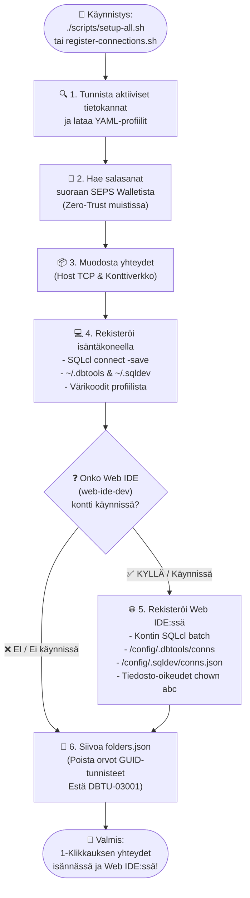

<!-- [ 🇬🇧 English ](README.md) | [ 🇪🇪 Eesti ](README.et.md) | [ 🇫🇮 Suomi ](README.fi.md) | [ 🇸🇪 Svenska ](README.sv.md) | [ 🇱🇻 Latviešu ](README.lv.md) | [ 🇱🇹 Lietuvių ](README.lt.md) -->

# 🔌 Tietokantayhteyksien ja VS Coden Asennusopas

Tämä opas kuvaa Oracle-tietokantayhteyksien automaattista ja manuaalista rekisteröintiä **Oracle SQL Developer for VS Code** -laajennukselle (sekä paikallisella isäntäkoneella että konttipohjaisessa Web IDE:ssä) ja salasanatonta yhdistämistä Oracle Walletin (SEPS) avulla.

---

## 🔄 Kaksitasoinen Automaattinen Rekisteröinti (Host PC & Web IDE)

Koko alusta käyttää keskitettyä yhteyksien rekisteröintimoottoria (`scripts/register-connections.sh`), joka luo ja synkronoi tietokantayhteydet samanaikaisesti **paikalliseen VS Codeen (Host PC)** ja **konttipohjaiseen Web IDE:hen (`web-ide-dev`)**:

### 📊 Yhteyksien Rekisteröinnin Prosessikaavio



### Komentorivikäyttö:

```bash
./scripts/register-connections.sh
```

- **Host PC:** Rekisteröi yhteydet hakemistoihin `~/.dbtools/connections/` ja `~/.sqldev/connections.json` (isäntäportit `localhost:1532`, `localhost:1533` jne.).
- **Web IDE:** Kun `web-ide-dev` on aktiivinen, luo yhteydet kontin sisällä (`db-proxy:1521`, `db-alise:1521` jne.) ja tallentaa salasanat kontin säilöön.
- **Järjestyksestä riippumaton:** Web IDE voi käynnistyä ennen tai jälkeen tietokantojen. Yhteydet synkronoidaan automaattisesti.

---

## 🔐 Salasanaton Yhdistäminen Oracle Walletin (SEPS) Avulla

Paikallisessa kehitysympäristössä todennus suojataan **Oracle Walletin (SEPS)** avulla ilman selkokielisiä salasanoja.

### Isäntäkoneen asetukset:
```bash
export TNS_ADMIN=$(pwd)/config/tns_admin
```

### 🔌 Yhdistäminen SQLcl:llä:
```bash
# Kehittäjänä
sql /@DB_PROXY_DEV

# SYSDBA-oikeuksilla
sql /@DB_PROXY_SYS as sysdba
```
