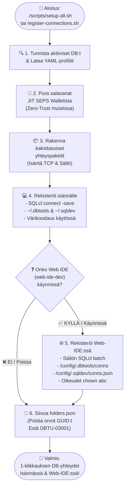

[ 🇬🇧 English ](README.md) | [ 🇪🇪 Eesti ](README.et.md) | [ 🇫🇮 Suomi ](README.fi.md) | [ 🇸🇪 Svenska ](README.sv.md) | [ 🇱🇻 Latviešu ](README.lv.md) | [ 🇱🇹 Lietuvių ](README.lt.md)

# 🔌 Tietokantayhteydet ja VS coden asetusopas

Tämä opas kuvaa Oracle-tietokantayhteyksien automaattisen ja manuaalisen rekisteröinnin **Oracle SQL Developer for VS Code** -laajennukselle (sekä paikallisella isäntäkoneella että säilöidyssä Web-IDE:ssä) ja salasanattomat yhteydet Oracle SEPS Walletin kautta.

---

## 🔄 Kaksitasoinen automaattinen rekisteröinti (host PC & web IDE)

Koko alusta käyttää keskitettyä yhteyksien rekisteröintimoottoria (`scripts/register-connections.sh`), joka luo ja synkronoi tietokantayhteydet samanaikaisesti **paikalliseen VS Codeen (Host PC)** ja **Säilöityyn Web-IDE:hen (`web-ide-dev`)**:

### 📊 Yhteyksien rekisteröintiprosessin työnkulkukaavio



### CLI-käynnistys:

```bash
./scripts/register-connections.sh
```

- **Isäntäkone (Host PC):** Rekisteröi yhteydet hakemistoihin `~/.dbtools/connections/` ja `~/.sqldev/connections.json` (isännän portit `localhost:1532`, `localhost:1533` jne.).
- **Web-IDE:** Jos `web-ide-dev` on aktiivinen, luo yhteydet säilön sisälle (`db-proxy:1521`, `db-alise:1521` jne.) ja tallentaa salasanat säilön salausvarastoon.
- **Järjestyksestä Riippumaton:** Web-IDE voi käynnistyä ennen tietokantoja tai niiden jälkeen. Yhteydet synkronoidaan aina automaattisesti.

---

## 📥 Yhteyksien manuaalinen tuonti VS Code SQL developer UI:Ssa

Yhteydet voidaan tuoda suoraan tiedostosta **`connections/sqldev-connections.json`**:

1. Avaa VS Code ja siirry vasemman sivupalkin **Oracle SQL Developer** -välilehdelle.
2. Napsauta **Database Connections** -paneelin otsikossa **`...`** (Lisää toimintoja) tai napsauta hiiren kakkospainikkeella ja valitse **`Import Connections`**.
3. Valitse tiedostonvalitsimesta:
   `connections/sqldev-connections.json`
4. Napsauta **Import**. Kaikki yhteydet tulevat heti näkyviin!

---

## 🔑 Salasanojen haku käyttäjille ja ylläpitäjille

Jos haluat määrittää yhteydet manuaalisesti DBeaver- tai IntelliJ-työkaluissa:
* **APEX Admin (INTERNAL):** `./scripts/get-password.sh APEX_ADMIN`
* **Proxy SYS:** `./scripts/get-password.sh DB_PROXY_SYS`
* **Kehittäjä (USER_DEVELOPER):** `./scripts/get-password.sh DB_PROXY_DEV`
* **ALISE Business DB SYS:** `./scripts/get-password.sh DB_ALISE_SYS`
* **ALISE Kehittäjä:** `./scripts/get-password.sh DB_ALISE_DEV`
* **Analytics Publisher:** `./scripts/get-password.sh DB_PUBLISHER_DEV`

---

## 🔐 Salasanattomat yhteydet Oracle walletin kautta (SEPS)

Paikallisessa kehityksessä todennus on suojattu **Oracle Wallet (SEPS)** -lompakolla ilman selkokielisiä salasanoja tiedostoissa.

### Isäntäympäristön asetus:
```bash
export TNS_ADMIN=$(pwd)/config/tns_admin
```

### Pikayhteys SQLcl:N kautta:
```bash
# Kirjaudu kehittäjänä:
sql /@DB_PROXY_DEV

# Kirjaudu SYSDBA:na:
sql /@DB_PROXY_SYS as sysdba
```

---

## 🔒 Windows & SSL/TLS-sertifikaattien luottamus

Jos kehität Windowsilla (WSL2) ja haluat poistaa selaimen SSL-varoitukset:

```cmd
certutil -user -addstore TrustedPeople ssl/cert.crt
```

Podman-virtuaalikoneen asetus yrityksen CA:n luottamiseksi:
```bash
podman machine ssh sudo cp /mnt/c/path/ca.crt /etc/pki/ca-trust/source/anchors/
podman machine ssh sudo update-ca-trust
```
