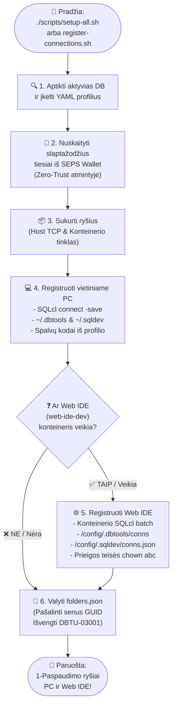

<!-- [ 🇬🇧 English ](README.md) | [ 🇪🇪 Eesti ](README.et.md) | [ 🇫🇮 Suomi ](README.fi.md) | [ 🇸🇪 Svenska ](README.sv.md) | [ 🇱🇻 Latviešu ](README.lv.md) | [ 🇱🇹 Lietuvių ](README.lt.md) -->

# 🔌 Duomenų Bazių Ryšių ir VS Code Sąrankos Vadovas

Šis vadovas aprašo automatizuotą ir rankinį duomenų bazių ryšių registravimą **Oracle SQL Developer for VS Code** plėtiniui (vietiniame kompiuteryje ir Web IDE konteineryje) bei jungimąsi be slaptažodžių per Oracle Wallet (SEPS).

---

## 🔄 Dviejų Lygių Automatinis Registravimas (Host PC & Web IDE)

Visa platforma naudoja centralizuotą ryšių registravimo variklį (`scripts/register-connections.sh`), kuris vienu metu sukuria ir sinchronizuoja ryšius jūsų **vietinėje VS Code (Host PC)** ir **Web IDE konteineryje (`web-ide-dev`)**:

### 📊 Ryšių Registravimo Proceso Schema



### Paleidimas per CLI:

```bash
./scripts/register-connections.sh
```
