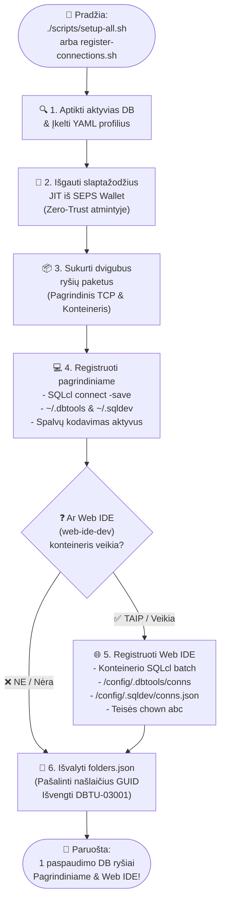

[ 🇬🇧 English ](README.md) | [ 🇪🇪 Eesti ](README.et.md) | [ 🇫🇮 Suomi ](README.fi.md) | [ 🇸🇪 Svenska ](README.sv.md) | [ 🇱🇻 Latviešu ](README.lv.md) | [ 🇱🇹 Lietuvių ](README.lt.md)

# 🔌 Duomenų bazių ryšiai ir VS Code sąrankos vadovas

Šiame vadove aprašoma automatinė ir rankinė Oracle duomenų bazių ryšių registracija, skirta **Oracle SQL Developer for VS Code** (tiek vietiniame pagrindiniame kompiuteryje, tiek konteinerizuotoje Web IDE), taip pat ryšiai be slaptažodžio per Oracle SEPS Wallet.

---

## 🔄 Dviejų lygių automatizuota registracija (host PC & web IDE)

Visa platforma naudoja centralizuotą ryšių registravimo variklį (`scripts/register-connections.sh`), kuris vienu metu sukuria ir sinchronizuoja ryšius jūsų **vietiniame VS Code (Host PC)** ir **Konteinerizuotoje Web IDE (`web-ide-dev`)**:

### 📊 Ryšių registracijos proceso eigos diagrama



### CLI iškvietimas:

```bash
./scripts/register-connections.sh
```

- **Pagrindinis kompiuteris (Host PC):** Užregistruoja ryšius `~/.dbtools/connections/` ir `~/.sqldev/connections.json` (prievadai `localhost:1532`, `localhost:1533` ir kt.).
- **Web IDE:** Jei `web-ide-dev` yra aktyvus, sukuria ryšius konteineryje (`db-proxy:1521`, `db-alise:1521` ir kt.) ir išsaugo slaptažodžius saugioje saugykloje.
- **Nepriklausoma nuo Eiliškumo:** Web IDE gali pasileisti prieš arba po duomenų bazių. Ryšiai visada sinchronizuojami automatiškai.

---

## 📥 Rankinis ryšių importavimas VS Code SQL developer UI

Ryšius galima importuoti tiesiogiai iš failo **`connections/sqldev-connections.json`**:

1. Atidarykite VS Code ir kairėje juostoje pasirinkite skirtuką **Oracle SQL Developer**.
2. Skydelyje **Database Connections** spustelėkite **`...`** (Daugiau veiksmų) arba spustelėkite dešiniuoju pelės mygtuku ir pasirinkite **`Import Connections`**.
3. Failų parinkiklyje pasirinkite:
   `connections/sqldev-connections.json`
4. Spustelėkite **Import**. Visi ryšiai pasirodys akimirksniu!

---

## 🔑 Slaptažodžių gavimas kūrėjams ir administratoriams

Jei norite rankiniu būdu konfigūruoti ryšius tokiuose įrankiuose kaip DBeaver ar IntelliJ:
* **APEX Admin (INTERNAL):** `./scripts/get-password.sh APEX_ADMIN`
* **Proxy SYS:** `./scripts/get-password.sh DB_PROXY_SYS`
* **Kūrėjas (USER_DEVELOPER):** `./scripts/get-password.sh DB_PROXY_DEV`
* **ALISE Business DB SYS:** `./scripts/get-password.sh DB_ALISE_SYS`
* **ALISE Kūrėjas:** `./scripts/get-password.sh DB_ALISE_DEV`
* **Analytics Publisher:** `./scripts/get-password.sh DB_PUBLISHER_DEV`

---

## 🔐 Ryšiai be slaptažodžio per Oracle Wallet (SEPS)

Vietiniame kūrime autentifikavimas yra apsaugotas **Oracle Wallet (SEPS)** be atviro teksto slaptažodžių diske.

### Pagrindinės aplinkos konfigūracija:
```bash
export TNS_ADMIN=$(pwd)/config/tns_admin
```

### Greitas prisijungimas per SQLcl:
```bash
# Prisijungti kaip kūrėjas:
sql /@DB_PROXY_DEV

# Prisijungti kaip SYSDBA:
sql /@DB_PROXY_SYS as sysdba
```

---

## 🔒 Windows & SSL/TLS sertifikatų pasitikėjimas

Kuriant Windows (WSL2) aplinkoje, norint pašalinti naršyklės saugumo įspėjimus:

```cmd
certutil -user -addstore TrustedPeople ssl/cert.crt
```

Konfigūruoti Podman VM pasitikėti įmonės CA:
```bash
podman machine ssh sudo cp /mnt/c/path/ca.crt /etc/pki/ca-trust/source/anchors/
podman machine ssh sudo update-ca-trust
```
