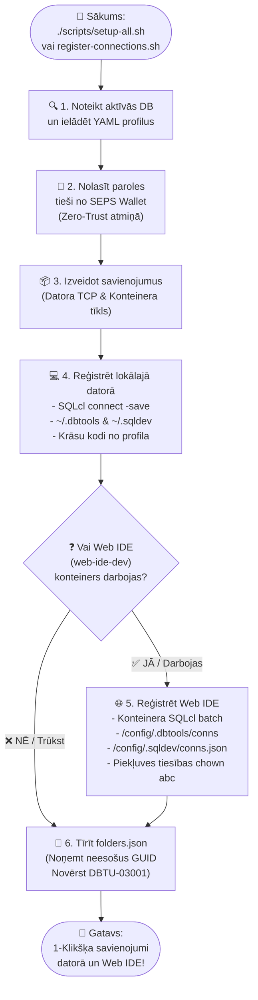

<!-- [ 🇬🇧 English ](README.md) | [ 🇪🇪 Eesti ](README.et.md) | [ 🇫🇮 Suomi ](README.fi.md) | [ 🇸🇪 Svenska ](README.sv.md) | [ 🇱🇻 Latviešu ](README.lv.md) | [ 🇱🇹 Lietuvių ](README.lt.md) -->

# 🔌 Datu Bāzu Savienojumu un VS Code Konfigurācijas Rokasgrāmata

Šī rokasgrāmata apraksta Oracle datubāzu savienojumu automātisku un manuālu reģistrāciju paplašinājumam **Oracle SQL Developer for VS Code** (gan lokālajā datorā, gan Web IDE konteinerā), kā arī bezparoļu savienojumus ar Oracle Wallet (SEPS).

---

## 🔄 Divlīmeņu Automātiskā Reģistrācija (Host PC & Web IDE)

Visa platforma izmanto centralizētu savienojumu reģistrācijas dzinēju (`scripts/register-connections.sh`), kas vienlaikus izveido un sinhronizē savienojumus jūsu **lokālajā VS Code (Host PC)** un **Web IDE konteinerā (`web-ide-dev`)**:

### 📊 Savienojumu Reģistrācijas Procesa Shēma



### Palaišana no komandrindas:

```bash
./scripts/register-connections.sh
```
