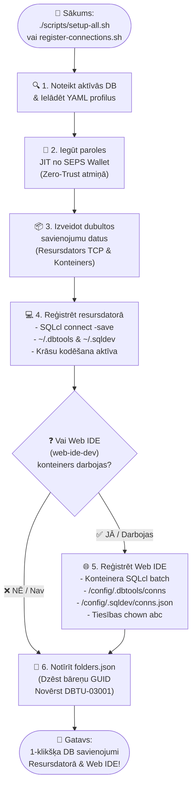

[ 🇬🇧 English ](README.md) | [ 🇪🇪 Eesti ](README.et.md) | [ 🇫🇮 Suomi ](README.fi.md) | [ 🇸🇪 Svenska ](README.sv.md) | [ 🇱🇻 Latviešu ](README.lv.md) | [ 🇱🇹 Lietuvių ](README.lt.md)

# 🔌 Datubāzes savienojumi un VS Code iestatīšanas rokasgrāmata

Šī rokasgrāmata apraksta automātisku un manuālu Oracle datubāzes savienojumu reģistrāciju paplašinājumam **Oracle SQL Developer for VS Code** (gan lokālajā resursdatorā, gan konteinerizētajā Web IDE), kā arī bezparoles savienojumus, izmantojot Oracle SEPS Wallet.

---

## 🔄 Divlīmeņu automatizēta reģistrācija (host PC & web IDE)

Visa platforma izmanto centralizētu savienojumu reģistrācijas dzinēju (`scripts/register-connections.sh`), kas vienlaikus izveido un sinhronizē datubāzes savienojumus **lokālajā VS Code (Host PC)** un **Konteinerizētajā Web IDE (`web-ide-dev`)**:

### 📊 Savienojumu reģistrācijas procesu shēma



### CLI izsaukšana:

```bash
./scripts/register-connections.sh
```

- **Resursdators (Host PC):** Reģistrē savienojumus mapēs `~/.dbtools/connections/` un `~/.sqldev/connections.json` (resursdatora porti `localhost:1532`, `localhost:1533` utt.).
- **Web IDE:** Ja `web-ide-dev` ir aktīvs, izveido savienojumus konteinerā (`db-proxy:1521`, `db-alise:1521` utt.) un saglabā paroles drošā glabātuvē.
- **Neatkarīgs no Secības:** Web IDE var startēt pirms vai pēc datubāzēm. Savienojumi vienmēr tiek automātiski sinhronizēti.

---

## 📥 Savienojumu manuāla importēšana VS Code SQL developer UI

Savienojumus var importēt tieši no faila **`connections/sqldev-connections.json`**:

1. Atveriet VS Code un kreisajā panelī izvēlieties cilni **Oracle SQL Developer**.
2. Panelī **Database Connections** noklikšķiniet uz **`...`** (Papildu darbības) vai ar labo peles pogu izvēlieties **`Import Connections`**.
3. Failu atlasē izvēlieties:
   `connections/sqldev-connections.json`
4. Noklikšķiniet uz **Import**. Visi savienojumi uzreiz būs redzami!

---

## 🔑 Paroļu nolasīšana izstrādātājiem un administratoriem

Ja vēlaties konfigurēt savienojumus manuāli tādās programmās kā DBeaver vai IntelliJ:
* **APEX Admin (INTERNAL):** `./scripts/get-password.sh APEX_ADMIN`
* **Proxy SYS:** `./scripts/get-password.sh DB_PROXY_SYS`
* **Izstrādātājs (USER_DEVELOPER):** `./scripts/get-password.sh DB_PROXY_DEV`
* **ALISE Business DB SYS:** `./scripts/get-password.sh DB_ALISE_SYS`
* **ALISE Izstrādātājs:** `./scripts/get-password.sh DB_ALISE_DEV`
* **Analytics Publisher:** `./scripts/get-password.sh DB_PUBLISHER_DEV`

---

## 🔐 Bezparoles savienojumi caur Oracle Wallet (SEPS)

Lokālajā izstrādē autentifikācija tiek aizsargāta ar **Oracle Wallet (SEPS)** bez atklāta teksta parolēm uz diska.

### Resursdatora vides iestatīšana:
```bash
export TNS_ADMIN=$(pwd)/config/tns_admin
```

### Ātrais savienojums caur SQLcl:
```bash
# Pieslēgties kā izstrādātājam:
sql /@DB_PROXY_DEV

# Pieslēgties kā SYSDBA:
sql /@DB_PROXY_SYS as sysdba
```

---

## 🔒 Windows & SSL/TLS sertifikātu uzticamība

Izstrādājot operētājsistēmā Windows (WSL2), lai novērstu pārlūkprogrammas drošības brīdinājumus:

```cmd
certutil -user -addstore TrustedPeople ssl/cert.crt
```

Konfigurēt Podman VM, lai tā uzticētos uzņēmuma CA:
```bash
podman machine ssh sudo cp /mnt/c/path/ca.crt /etc/pki/ca-trust/source/anchors/
podman machine ssh sudo update-ca-trust
```
