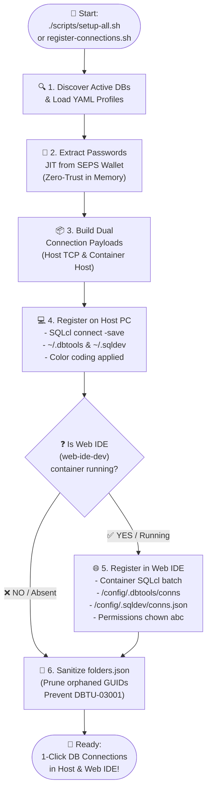

[ 🇬🇧 English ](README.md) | [ 🇪🇪 Eesti ](README.et.md) | [ 🇫🇮 Suomi ](README.fi.md) | [ 🇸🇪 Svenska ](README.sv.md) | [ 🇱🇻 Latviešu ](README.lv.md) | [ 🇱🇹 Lietuvių ](README.lt.md)

# 🔌 Database Connections and VS Code Setup Guide

This guide describes automatic and manual registration of Oracle database connections for **Oracle SQL Developer for VS Code** (on both the local Host PC and the containerized Web IDE), as well as passwordless connection handling via Oracle Wallet (SEPS).

---

## 🔄 Dual-Level Automated Registration (Host PC & Web IDE)

The entire platform uses the centralized connection registration engine (`scripts/register-connections.sh`), creating and synchronizing database connections simultaneously in your **local VS Code (Host PC)** and **Containerized Web IDE (`web-ide-dev`)**:

### 📊 Connection Registration Process Flow



### CLI Invocation:

```bash
./scripts/register-connections.sh
```

- **Host PC:** Registers connections in `~/.dbtools/connections/` and `~/.sqldev/connections.json` (host exposed ports `localhost:1532`, `localhost:1533`, etc.).
- **Web IDE:** If `web-ide-dev` is active, creates connections inside the container (`db-proxy:1521`, `db-alise:1521`, etc.) and stores passwords in container storage.
- **Order-Independent:** Web IDE can start before or after databases. Connections are automatically synchronized whenever new databases start or via CLI.

### Automated Workspace Registration (`.vscode/tasks.json`)

To auto-register connections whenever the project is opened in VS Code:

```json
{
  "version": "2.0.0",
  "tasks": [
    {
      "label": "Auto-Register Oracle Connections",
      "type": "shell",
      "command": "./scripts/register-connections.sh",
      "runOptions": {
        "runOn": "folderOpen"
      },
      "presentation": {
        "reveal": "silent"
      },
      "problemMatcher": []
    }
  ]
}
```

---

## 📥 How to Import Connections into VS Code SQL Developer UI

Connections can be imported directly via **`sqldev-connections.json`**:

### Step-by-Step Guide:
1. Open VS Code and navigate to the **Oracle SQL Developer** tab on the left activity bar.
2. In the **Database Connections** panel header, click **`...`** (More Actions) or right-click and choose **`Import Connections`**.
3. In the file picker, select:
   `connections/sqldev-connections.json`
4. Click **Import**.
5. All connections appear immediately in your **Database Connections** view!

---

## 🔑 Manual Credential Retrieval

If you wish to configure connections manually in tools like DBeaver or IntelliJ:
*   **APEX Admin (ADMIN):**
    ```bash
    ./scripts/get-password.sh APEX_ADMIN
    ```
*   **APEX Proxy SYS:**
    ```bash
    ./scripts/get-password.sh DB_PROXY_SYS
    ```
*   **Publisher SYS:**
    ```bash
    ./scripts/get-password.sh DB_PUBLISHER_SYS
    ```
*   **Developer USER_DEVELOPER:**
    ```bash
    ./scripts/get-password.sh DB_PROXY_DEV
    ```
*   **ALISE Business DB SYS:**
    ```bash
    ./scripts/get-password.sh DB_ALISE_SYS
    ```
*   **ALISE Developer USER_DEVELOPER:**
    ```bash
    ./scripts/get-password.sh DB_ALISE_DEV
    ```

---

## 🔐 Passwordless Connection via Oracle Wallet (SEPS)

In local development, authentication is secured using **Oracle Wallet (SEPS)** without plaintext credentials in code.

### Host Environment Setup:
1. Set `TNS_ADMIN` to the repository's `config/tns_admin` folder:
   ```bash
   export TNS_ADMIN=$(pwd)/config/tns_admin
   ```

### 🔌 Quick Connect via SQLcl (Host CLI):
```bash
# Connect as Developer
sql /@DB_PROXY_DEV

# Connect as SYSDBA
sql /@DB_PROXY_SYS as sysdba
```

---

## 🔒 Windows Host & Corporate Network SSL/TLS Certificate Trust

If developing on Windows (via WSL2) and configuring local HTTPS without browser SSL warnings:

### 1. Trust Local Certificate on Windows:
```cmd
certutil -user -addstore TrustedPeople ssl/cert.crt
```

### 2. Configure Podman VM to Trust Corporate CA:
```bash
podman machine ssh sudo cp /mnt/c/path/ca.crt /etc/pki/ca-trust/source/anchors/
podman machine ssh sudo update-ca-trust
```
