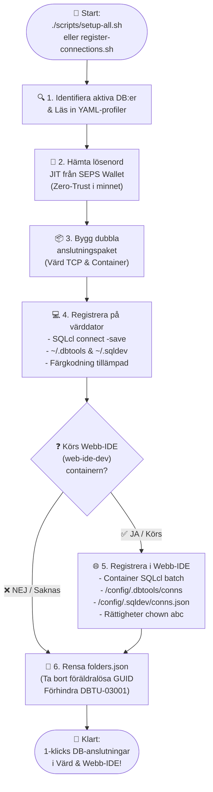

[ 🇬🇧 English ](README.md) | [ 🇪🇪 Eesti ](README.et.md) | [ 🇫🇮 Suomi ](README.fi.md) | [ 🇸🇪 Svenska ](README.sv.md) | [ 🇱🇻 Latviešu ](README.lv.md) | [ 🇱🇹 Lietuvių ](README.lt.md)

# 🔌 Databasanslutningar och konfigurationsguide för VS Code

Denna guide beskriver automatisk och manuell registrering av Oracle-databasanslutningar för **Oracle SQL Developer for VS Code** (både på lokal värddator och i containerbaserad Webb-IDE) samt lösenordsfri hantering via Oracle Wallet (SEPS).

---

## 🔄 Tvånivås automatiserad registrering (host PC & webb-IDE)

Hela plattformen använder den centraliserade anslutningsregistreringsmotorn (`scripts/register-connections.sh`), som skapar och synkroniserar databasanslutningar samtidigt i din **lokala VS Code (Host PC)** och i din **Containerbaserade Webb-IDE (`web-ide-dev`)**:

### 📊 Flödesschema för registreringsprocessen



### CLI-körning:

```bash
./scripts/register-connections.sh
```

- **Värddator (Host PC):** Registrerar anslutningar i `~/.dbtools/connections/` och `~/.sqldev/connections.json` (värdens portar `localhost:1532`, `localhost:1533` osv.).
- **Webb-IDE:** Om `web-ide-dev` är aktiv, skapas anslutningar inuti containern (`db-proxy:1521`, `db-alise:1521` osv.) och lösenord sparas i säkert valv.
- **Oberoende av Ordningsföljd:** Webb-IDE kan startas före eller efter databaserna. Anslutningarna synkroniseras alltid automatiskt.

---

## 📥 Importera anslutningar manuellt i VS Code SQL developer UI

Anslutningar kan importeras direkt via **`connections/sqldev-connections.json`**:

1. Öppna VS Code och navigera till fliken **Oracle SQL Developer** i det vänstra fältet.
2. I panelen **Database Connections**, klicka på **`...`** (Fler åtgärder) eller högerklicka och välj **`Import Connections`**.
3. I filväljaren, markera:
   `connections/sqldev-connections.json`
4. Klicka på **Import**. Alla anslutningar syns omedelbart!

---

## 🔑 Hämta inloggningsuppgifter för utvecklare och administratörer

Om du vill konfigurera anslutningar manuellt i verktyg som DBeaver eller IntelliJ:
* **APEX Admin (INTERNAL):** `./scripts/get-password.sh APEX_ADMIN`
* **Proxy SYS:** `./scripts/get-password.sh DB_PROXY_SYS`
* **Utvecklare (USER_DEVELOPER):** `./scripts/get-password.sh DB_PROXY_DEV`
* **ALISE Business DB SYS:** `./scripts/get-password.sh DB_ALISE_SYS`
* **ALISE Utvecklare:** `./scripts/get-password.sh DB_ALISE_DEV`
* **Analytics Publisher:** `./scripts/get-password.sh DB_PUBLISHER_DEV`

---

## 🔐 Lösenordsfria anslutningar via Oracle Wallet (SEPS)

I lokal utveckling skyddas autentisering med **Oracle Wallet (SEPS)** utan klartextlösenord på disk.

### Konfiguration av värdmiljö:
```bash
export TNS_ADMIN=$(pwd)/config/tns_admin
```

### Snabbanslutning via SQLcl (CLI):
```bash
# Logga in som utvecklare:
sql /@DB_PROXY_DEV

# Logga in som SYSDBA:
sql /@DB_PROXY_SYS as sysdba
```

---

## 🔒 Windows & förtroende för SSL/TLS-certifikat

Om du utvecklar i Windows (WSL2) och vill undvika säkerhetsvarningar:

```cmd
certutil -user -addstore TrustedPeople ssl/cert.crt
```

Konfigurera Podman VM att lita på företagets CA:
```bash
podman machine ssh sudo cp /mnt/c/path/ca.crt /etc/pki/ca-trust/source/anchors/
podman machine ssh sudo update-ca-trust
```
