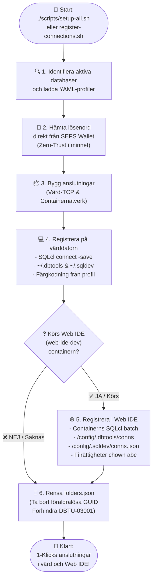

<!-- [ 🇬🇧 English ](README.md) | [ 🇪🇪 Eesti ](README.et.md) | [ 🇫🇮 Suomi ](README.fi.md) | [ 🇸🇪 Svenska ](README.sv.md) | [ 🇱🇻 Latviešu ](README.lv.md) | [ 🇱🇹 Lietuvių ](README.lt.md) -->

# 🔌 Databasanslutningar och VS Code Konfigurationsguide

Denna guide beskriver automatisk och manuell registrering av databasanslutningar för **Oracle SQL Developer for VS Code** (på både lokal värddator och i containeriserad Web IDE) samt lösenordsfri anslutning via Oracle Wallet (SEPS).

---

## 🔄 Automatisk Registrering på Två Nivåer (Host PC & Web IDE)

Hela plattformen använder den centraliserade anslutningsmotorn (`scripts/register-connections.sh`), som skapar och synkroniserar databasanslutningar samtidigt i din **lokala VS Code (Host PC)** och **containeriserade Web IDE (`web-ide-dev`)**:

### 📊 Processdiagram för Anslutningsregistrering



### Körning via CLI:

```bash
./scripts/register-connections.sh
```

- **Host PC:** Registrerar anslutningar i `~/.dbtools/connections/` och `~/.sqldev/connections.json` (portar `localhost:1532`, `localhost:1533` etc.).
- **Web IDE:** När `web-ide-dev` är aktiv skapas anslutningar internt i containern (`db-proxy:1521`, `db-alise:1521` etc.).
- **Ordningsoberoende:** Web IDE kan starta före eller efter databaserna.
