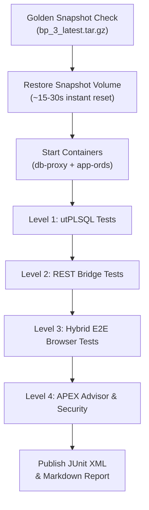

# 🧪 Test Plan: Oracle APEX DevHub Application & CI/CD Pipeline

[ 🇬🇧 English ](apex-devhub-test-plan.md) | [ 🇪🇪 Eesti ](et/apex-devhub-test-plan.md) | [ 🇫🇮 Suomi ](fi/apex-devhub-test-plan.md) | [ 🇸🇪 Svenska ](sv/apex-devhub-test-plan.md) | [ 🇱🇻 Latviešu ](lv/apex-devhub-test-plan.md) | [ 🇱🇹 Lietuvių ](lt/apex-devhub-test-plan.md)

---

## 1. Executive Summary & Objectives

The purpose of this test plan is to establish a rigorous, multi-tiered verification strategy for the **Oracle APEX DevHub Application (App 101)**, its underlying PL/SQL engine (`DEVHUB.DEV_HUB_PKG`), the local REST Documentation Bridge, and the automated SQLcl APEXlang CI/CD pipeline.

### Core Testing Goals:
1. **Functional Integrity:** Ensure 100% feature parity between the static Dev Hub (`docs/dev-hub.html`) and the APEX application across all 6 pages.
2. **Deterministic State Isolation:** Guarantee zero test contamination using ~15–30s Golden Snapshot restores (`bp_3_latest.tar.gz`) before deep regression suites.
3. **Multi-Level Coverage:** Combine database-level utPLSQL tests, REST integration probes, hybrid browser E2E workflows (Playwright + curl session simulation), and APEX Advisor code quality checks.
4. **Zero-Trust Security:** Validate that credentials never leak into HTML DOM, URL parameters, or client cookies, strictly adhering to Oracle Wallet (SEPS) principles.
5. **Continuous Integration:** Provide seamless local offline simulation (`./scripts/test-local-ci.sh`) and GitHub Actions automation (`.github/workflows/deploy-devhub-apexlang.yml`).

---

## 2. Test Pyramid & Scope Matrix

```
                      ┌─────────────────────────┐
                      │ Level 4: Quality/Sec    │  APEX Advisor CLI,
                      │ (APEX Advisor, SSP)     │  Session State Protection
                      ├─────────────────────────┤
                      │ Level 3: Browser E2E    │  Playwright DOM/Mermaid UI
                      │ (Hybrid: Curl + PW)     │  + Fast Curl Session Tester
                      ├─────────────────────────┤
                      │ Level 2: Integration    │  REST Bridge (Port 8089),
                      │ (REST, UTL_HTTP, ORDS)  │  UTL_HTTP Probes, ORDS Pools
                      ├─────────────────────────┤
                      │ Level 1: Unit / DB      │  utPLSQL Package Tests,
                      │ (DEV_HUB_PKG, Tables)   │  Table Constraints & Seeds
                      └─────────────────────────┘
```

| Tier | Component Under Test | Tooling | Execution Frequency | Expected Duration |
| :--- | :--- | :--- | :--- | :--- |
| **Level 1** | `DEVHUB.DEV_HUB_PKG`, Tables, Seeds | **utPLSQL v3** / SQLcl | Pre-commit, CI/CD | ~2–5 seconds |
| **Level 2** | REST Bridge (8089), `UTL_HTTP`, ORDS | **curl**, Python, SQLcl | CI/CD, Post-deploy | ~3–8 seconds |
| **Level 3** | UI Flows, Pages 1–6, Mermaid, Auth | **Playwright** + Bash/curl | Nightly, PR Verification | ~15–30 seconds |
| **Level 4** | APEX Quality, SSP, SQL injection | **APEX Advisor CLI** | PR Verification, CI/CD | ~5–10 seconds |

---

## 3. Detailed Test Levels & Test Cases

### 3.1. Level 1: Database Unit Testing (utPLSQL)
Target: `DEVHUB` schema objects in `FREEPDB1`.

- **TC-DB-01: Schema & Constraints Verification**
  - Verify primary keys, unique constraints, and foreign keys on `DEVHUB_SERVICES`, `DEVHUB_TOPOLOGY`, `DEVHUB_BLUEPRINTS`, `DEVHUB_DOC_INDEX`, `DEVHUB_COMMANDS`, `DEVHUB_BENCHMARKS`, `DEVHUB_CONFIG`.
- **TC-DB-02: `DEV_HUB_PKG.check_single_service` & Status Updates**
  - Verify that probing an active endpoint records `ONLINE`, calculates accurate `response_time_ms`, and properly handles HTTP 303 redirects without following them (preventing ORA-29024 certificate issues).
- **TC-DB-03: `DEV_HUB_PKG.refresh_all_service_statuses` Batch Execution**
  - Execute full sweep of all active services; confirm all status fields update idempotently without deadlocks.
- **TC-DB-04: `DEV_HUB_PKG.get_doc_markdown_rest` Fallback Resilience**
  - When the bridge is reachable: Returns valid markdown starting with document title.
  - When the bridge is offline or invalid doc ID requested: Returns friendly Estonian/English fallback message without throwing unhandled exceptions.
- **TC-DB-05: `DEV_HUB_PKG.sync_benchmarks_from_json` JSON Parsing**
  - Pass valid JSON payload (`metrics/setup_benchmarks.json`); verify `MERGE` into `DEVHUB_BENCHMARKS`. Pass malformed JSON; ensure graceful handling.
- **TC-DB-06: `DEV_HUB_PKG.authenticate_local_dev` Security Boundary**
  - From `localhost` / `127.0.0.1`: Authenticates developer session.
  - From external IP / spoofed host: Rejects with `ORA-20001: Automaatne sisselogimine on lubatud ainult lokaalses DEV keskkonnas`.

---

### 3.2. Level 2: Integration & REST Bridge Testing
Target: Host-to-Container Bridge (`scripts/internal/dev-hub-bridge.py`) on port `8089` and ORDS.

- **TC-INT-01: Bridge Health & Catalog Query**
  - `GET http://localhost:8089/api/health` returns HTTP 200 `{"status": "ok"}`.
  - `GET http://localhost:8089/api/catalog` returns JSON list of all 11 indexed documents.
- **TC-INT-02: 6-Language Markdown Retrieval**
  - Fetch `readme` across all 6 language codes (`en`, `et`, `fi`, `sv`, `lv`, `lt`). Verify correct language headers and markdown content.
- **TC-INT-03: Host Header Routing from Inside Container**
  - Verify `db-proxy` container resolves `http://host.containers.internal:8089` cleanly via Docker/Podman DNS.
- **TC-INT-04: In-Database HTML Conversion via `APEX_MARKDOWN.TO_HTML`**
  - Ensure dynamic PL/SQL execution converts incoming markdown headings, code blocks, lists, and tables into compliant HTML tags.

---

### 3.3. Level 3: Browser & UI End-to-End Testing (Hybrid: Playwright + Curl)
Target: Oracle APEX App 101 on `https://localhost:8448/ords/r/proxy_workspace/devhub/`.

#### Fast Headless Engine (Bash/Curl Session Simulator):
- **TC-E2E-01: Anonymous Access Redirect**
  - Unauthenticated GET to `/devhub/home` returns HTTP 302 redirecting to `/devhub/login?session=...`.
- **TC-E2E-02: 1-Click Developer Login Authentication**
  - Submits login form with developer credentials; validates `ORA_WWV_APP_101` session cookie creation and HTTP 302 redirect to Page 1 (`home`).
- **TC-E2E-03: Page Availability Sweep**
  - Using authenticated session, request pages 1, 2, 3, 4, 5, 6 sequentially; verify HTTP 200 on every page.

#### Deep DOM & Visual Engine (Node.js Playwright):
- **TC-E2E-04: Page 1 (Services & Health Table)**
  - Validate classic report table renders 8 services with colored status badges (`t-Badge--success` for ONLINE, `t-Badge--danger` for OFFLINE).
  - Click "Värskenda staatuseid" (Refresh) button; verify dynamic action refreshes report.
- **TC-E2E-05: Page 2 (Architecture Hybrid View)**
  - Tab 1 (Native APEX Tree + Cards): Verify tree view renders container hierarchy; card grid shows memory and ports.
  - Tab 2 (Mermaid Architecture): Verify Mermaid.js renders SVG diagram inside DOM without syntax errors.
- **TC-E2E-06: Page 3 (Blueprints Explorer)**
  - Select Blueprint from radio group / select list; verify details card dynamically filters to active blueprint.
  - Verify 1-click clipboard copy button puts correct CLI command into clipboard buffer.
- **TC-E2E-07: Page 4 (Dynamic Documentation Reader)**
  - Change language selector between English, Eesti, Suomi, Svenska, Latviešu, Lietuvių; verify markdown content refreshes via AJAX without full page reload.
  - Verify zero CLOBs written to database disk during reading.
- **TC-E2E-08: Page 5 (DevOps Command Center)**
  - Verify categorised command cards (Lifecycle, Snapshots, Passwords, Diagnostics).
- **TC-E2E-09: Page 6 (Benchmarks Dashboard)**
  - Verify setup and restore benchmark cards show historical averages (min, avg, max) loaded dynamically.

---

### 3.4. Level 4: Quality, APEX Advisor & Security Audit
Target: APEX application repository and runtime dictionary.

- **TC-SEC-01: APEX Advisor CLI Execution**
  - Run APEX Advisor over Application 101 via SQLcl / PL/SQL (`APEX_260100.WWV_FLOW_ADVISOR_DEV`).
  - Asserts 0 Errors across:
    - Deprecated attributes or features.
    - Broken page branch links or missing page targets.
    - Missing authorization schemes on protected components.
    - SQL query syntax errors in report regions.
- **TC-SEC-02: Session State Protection (SSP) Audit**
  - Ensure all sensitive page items have `checksum_type` enforced.
  - Validate that only explicitly whitelisted items (`P4_DOC_ID`, `P4_LANG`, `P3_BLUEPRINT_ID`) are unrestricted, each carrying documented justification in `comments:`.
- **TC-SEC-03: Zero-Trust Password Exposure Verification**
  - Inspect full page DOM and network HAR logs; verify zero database passwords or SEPS Wallet master keys appear in client source code.

---

## 4. Test Environment & State Isolation (Golden Snapshots)

To maintain absolute test determinism and prevent "flaky tests" caused by leftover session state or modified tables:



### Isolation Rules:
1. **Pre-Test Restoration:** Heavy regression test runs execute `./scripts/snapshots/restore-golden-snapshots.sh --auto --yes -b 3 --no-rotate` to guarantee an identical byte-for-byte Oracle database state.
2. **Ephemerality:** CI/CD runners use `--rm` containers to ensure immediate cleanup of volatile state and memory buffers upon test completion.

---

## 5. Automation, CI/CD Integration & Reporting

### 5.1. Unified Test Runner CLI (`scripts/test-apex-suite.sh`)
Developers can execute the complete suite locally with a single command:
```bash
# Run complete test suite (Levels 1 to 4):
./scripts/test-apex-suite.sh

# Run specific tier only:
./scripts/test-apex-suite.sh --tier db       # Level 1 (utPLSQL)
./scripts/test-apex-suite.sh --tier rest     # Level 2 (REST Bridge)
./scripts/test-apex-suite.sh --tier e2e      # Level 3 (Browser Playwright/curl)
./scripts/test-apex-suite.sh --tier advisor  # Level 4 (APEX Advisor)

# Fast CI smoke test without browser:
./scripts/test-apex-suite.sh --fast
```

### 5.2. Standard Output Artifacts:
1. **JUnit XML Report:** Persisted to `metrics/junit-apex-devhub.xml` for native consumption by GitHub Actions, GitLab CI, or Jenkins.
2. **Markdown Summary Report:** Persisted to `tests/reports/apex_devhub_test_report.md` for developer inspection.
3. **Execution Benchmark:** Recorded in `metrics/setup_benchmarks.json` and `metrics/setup_benchmarks.env` per platform Rule 1.

---

## 6. Pass/Fail Criteria & Acceptance Gates

A build or pull request is deemed **READY FOR RELEASE** only when:
- ✅ **100% of utPLSQL database tests pass** (0 failures, 0 errors).
- ✅ **100% of REST documentation bridge tests pass** across all 6 languages.
- ✅ **100% of E2E browser flows complete successfully** without JavaScript errors in console.
- ✅ **APEX Advisor returns 0 Errors** and 0 unhandled warnings.
- ✅ **Zero plaintext credentials exist** in generated test artifacts or logs.
- ✅ **Benchmark metrics recorded** within acceptable latency thresholds (sub-100ms service probe, sub-2s page load).
