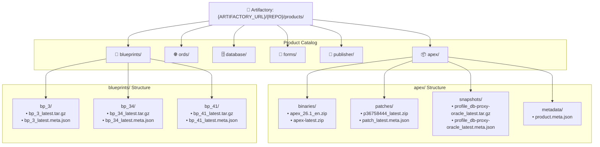

[ 🇬🇧 English ](artifactory-setup.md) | [ 🇪🇪 Eesti ](et/artifactory-setup.md) | [ 🇫🇮 Suomi ](fi/artifactory-setup.md) | [ 🇸🇪 Svenska ](sv/artifactory-setup.md) | [ 🇱🇻 Latviešu ](lv/artifactory-setup.md) | [ 🇱🇹 Lietuvių ](lt/artifactory-setup.md)

# 🏢 Enterprise Artifactory Repository, Unified Product Catalog & Zero-Trust Metadata Guide

In restricted, air-gapped, or corporate enterprise environments, the platform routes all binary archives (APEX, ORDS, Forms, Publisher `.zip`), bundle patches, container images, and Golden Snapshots to an enterprise artifact repository such as **JFrog Artifactory**, **Harbor**, **Sonatype Nexus**, or **GitLab Container Registry**.

---

## 🎯 1. Key Enterprise Benefits & LAN FastPath

1. **🚀 ~15s LAN FastPath Recovery:** Golden Snapshots and OCI container images stream over corporate LAN (100–500 MB/s), reducing provisioning from ~12 minutes to ~15 seconds.
2. **📑 Lightweight `.meta.json` Pre-Validation:** Before downloading gigabytes of archive data, the client queries a tiny `.meta.json` file (< 1 KB) to verify APEX, DB, and middleware versions.
3. **🔒 Zero-Trust Authentication:** JIT token extraction from **Azure Key Vault** (`az keyvault secret show`) or encrypted **Oracle SEPS Wallet** (`cwallet.sso`). No plaintext secrets on disk.
4. **🛡️ 1-to-1 Product-Centric Catalog Symmetry:** Identical logical folder layout across Artifactory and local developer workstations.

---

## 🏗 2. Unified Product-Centric Catalog Hierarchy (1-to-1 Symmetry)

```text
{ARTIFACTORY_URL}/{ARTIFACTORY_REPO}/products/
  │
  ├── apex/                               <-- Oracle APEX
  │     ├── binaries/                     <-- apex_26.1_en.zip, apex-latest.zip
  │     ├── patches/                      <-- p36758444_latest.zip, patch_latest.meta.json
  │     ├── snapshots/                    <-- profile_db-proxy-oracle_latest.tar.gz
  │     └── metadata/                     <-- product.meta.json
  │
  ├── ords/                               <-- Oracle REST Data Services
  │     ├── binaries/                     <-- ords-24.4.1.zip, ords-latest.zip
  │     ├── patches/
  │     └── snapshots/
  │
  ├── database/                           <-- Oracle 23ai Free DB & OCI FastStart
  │     ├── images/                       <-- oracle-free-23ai.tar, oracle-free-apex-26.1.tar
  │     └── snapshots/                    <-- profile_db-proxy-oracle_latest.tar.gz
  │
  ├── forms/                              <-- Oracle Forms 14c
  │     ├── binaries/                     <-- forms-14.1.2.zip, forms-latest.zip
  │     ├── patches/                      <-- p_forms_patch_latest.zip
  │     └── snapshots/                    <-- profile_db-forms_latest.tar.gz
  │
  ├── publisher/                          <-- Oracle Analytics Publisher
  │     ├── binaries/                     <-- publisher-2025.zip
  │     ├── patches/                      <-- p_publisher_patch_latest.zip
  │     └── snapshots/                    <-- profile_db-publisher_latest.tar.gz
  │
  └── blueprints/                         <-- Curated Architecture Blueprints
        ├── bp_3/                         <-- bp_3_latest.tar.gz, bp_3_latest.meta.json
        ├── bp_34/                        <-- bp_34_latest.tar.gz, bp_34_latest.meta.json
        └── bp_41/                        <-- bp_41_latest.tar.gz, bp_41_latest.meta.json
```

---

## 📊 3. Visual Architectural & Process Flow Diagrams

### 3.1 Unified Catalog Tree Diagram (Mermaid)



---

### 3.2 Discovery, .meta.json Pre-Validation & FastPath Flowchart (Mermaid)

```mermaid
flowchart TD
    Start([Launch: setup-all.sh / install-apex.sh / apply-patch.sh]) --> Step1{1. Valid local file in cache?}
    
    Step1 -->|Yes, valid| FastLocal["⚡ Use local cache (binaries/ or golden-snapshots/)"]
    Step1 -->|No / Missing / Outdated| Step2{2. Is ARTIFACTORY_URL configured?}
    
    Step2 -->|No| FallbackPublic["🌐 Download from official public OTN / Clean build"]
    Step2 -->|Yes| StepAuth["Resolve JIT token: Azure Key Vault or SEPS Wallet"]
    
    StepAuth --> FetchMeta["HTTP GET: Fetch ONLY .meta.json (< 1 KB)"]
    FetchMeta --> CheckHTTP{Found in catalog (200 OK)?}
    
    CheckHTTP -->|404 / Missing| FallbackPublic
    CheckHTTP -->|200 OK| ValidateMeta{verify_snapshot_version_match}
    
    ValidateMeta -->|Mismatch: Versions differ| LogMismatch["⚠️ Log Warning: VERSION MISMATCH IN ARTIFACTORY"]
    LogMismatch --> FallbackPublic
    
    ValidateMeta -->|Match: Versions match| DownloadLAN["🚀 Download .zip / .tar.gz at LAN speed (< 10s)"]
    DownloadLAN --> SaveCache["Cache in symmetric local directory"]
    SaveCache --> ExecuteFast["⚡ Execute instant install / restore (~15s)"]
    
    FastLocal --> ExecuteFast
    FallbackPublic --> ExecuteClean["🔄 Execute clean build & compile"]
    
    ExecuteFast --> Done([✅ Environment ready & healthy])
    ExecuteClean --> CheckAutoPublish{ARTIFACTORY_AUTO_PUBLISH=true or --publish?}
    
    CheckAutoPublish -->|Yes| AutoUpload["Publish new artifact + .meta.json to Artifactory"]
    CheckAutoPublish -->|No| Done
    AutoUpload --> Done
```

---

## 🚀 4. Universal CLI Publisher (`./scripts/publish-to-artifactory.sh`)

```bash
# 1. Publish Blueprint 3 Golden Snapshot & generated .meta.json:
./scripts/publish-to-artifactory.sh --product blueprints --blueprint 3

# 2. Publish APEX Patch & companion metadata:
./scripts/publish-to-artifactory.sh --product apex --category patches --file binaries/apex/patches/p36758444_latest.zip

# 3. Publish ORDS standalone binary:
./scripts/publish-to-artifactory.sh --product ords --category binaries --file binaries/ords/ords-latest.zip
```

---

## ⚙️ 5. Configuration Settings (`.env` or `config/repository.env`)

```bash
# ============================================================================
# ENTERPRISE ARTIFACTORY & REPOSITORY CONFIGURATION
# ============================================================================

# 1. Base URL & Repository Key:
ARTIFACTORY_URL="https://artifactory.company.internal/artifactory"
ARTIFACTORY_REPO="oracle-devops-platform"
ARTIFACTORY_USER="jfrog_deployer"

# 2. Azure Key Vault JIT Integration (Optional):
AZURE_KEYVAULT_NAME=""
ARTIFACTORY_SECRET_NAME="artifactory-token"

# 3. Automated CI/CD Publishing:
ARTIFACTORY_AUTO_PUBLISH="false"
```
