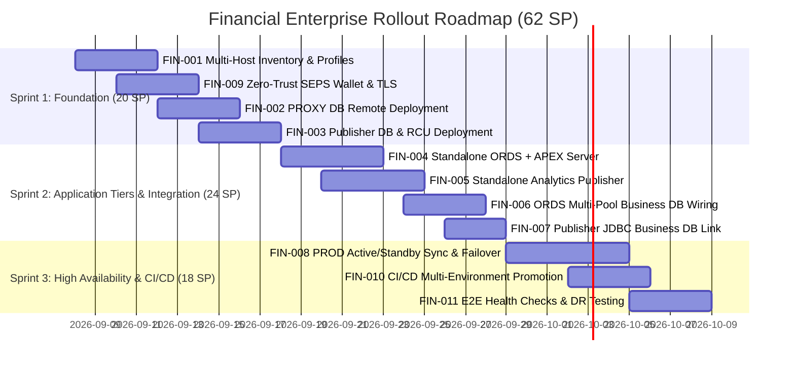

# Financial Enterprise Distributed Backlog (Jira Epics & Stories)

[ 🇬🇧 English ](README.md) | [ 🇪🇪 Eesti ](README.et.md) | [ 🇫🇮 Suomi ](README.fi.md) | [ 🇸🇪 Svenska ](README.sv.md) | [ 🇱🇻 Latviešu ](README.lv.md) | [ 🇱🇹 Lietuvių ](README.lt.md)

This backlog defines the transformation roadmap, technical deliverables, and Jira user stories for deploying the **Oracle DevOps & APEX Platform** across distributed remote Linux environments (**DEV, TEST, PROD**) with **Active/Standby High Availability** and integration with the enterprise core business database.

---

## 📊 Backlog Executive Matrix

- **Total Stories:** 11 User Stories
- **Total Estimation:** **62 Story Points (SP)**
- **Architecture Specification:** [`docs/enterprise-distributed-architecture.md`](../enterprise-distributed-architecture.md)

| Story ID | Title & Deliverable | Tier / Component | Estimation | Priority | Target Env | Status |
|:---|:---|:---|:---:|:---:|:---:|:---:|
| **[FIN-001](FIN-001-multi-host-inventory-and-profile-engine.md)** | Multi-Host Inventory & Environment Profile Engine | Infra / DevOps | **5 SP** | High | DEV, TEST, PROD | Ready |
| **[FIN-002](FIN-002-proxy-db-remote-container-deployment.md)** | Dedicated PROXY DB Remote Container & APEX Engine | DB Tier (Host 3) | **5 SP** | Blocker | DEV, TEST, PROD | Ready |
| **[FIN-003](FIN-003-publisher-db-remote-container-deployment.md)** | Dedicated Publisher DB Remote Container & RCU Schemas | DB Tier (Host 4) | **5 SP** | High | DEV, TEST, PROD | Ready |
| **[FIN-004](FIN-004-standalone-ords-apex-server-deployment.md)** | Standalone ORDS + APEX App Server Deployment | App Tier (Host 1) | **8 SP** | Blocker | DEV, TEST, PROD | Ready |
| **[FIN-005](FIN-005-standalone-analytics-publisher-server-deployment.md)** | Standalone Analytics Publisher Server Deployment | App Tier (Host 2) | **8 SP** | High | DEV, TEST, PROD | Ready |
| **[FIN-006](FIN-006-ords-multi-pool-business-db-wiring.md)** | ORDS Multi-Pool Configuration for Core Business DB | Integration | **5 SP** | High | DEV, TEST, PROD | Ready |
| **[FIN-007](FIN-007-publisher-jdbc-business-db-connection.md)** | Analytics Publisher JDBC Connection to Business DB | Integration | **3 SP** | Medium | DEV, TEST, PROD | Ready |
| **[FIN-008](FIN-008-prod-active-standby-sync-and-failover.md)** | PROD Active/Standby Golden Snapshot Sync & Failover | DR / Availability | **8 SP** | Critical | PROD (DC1/DC2) | Ready |
| **[FIN-009](FIN-009-zero-trust-wallet-and-tls-distribution.md)** | Zero-Trust SEPS Wallet & TLS Distribution Automation | Security / SecOps | **5 SP** | High | DEV, TEST, PROD | Ready |
| **[FIN-010](FIN-010-dev-test-prod-ci-cd-promotion-pipeline.md)** | Multi-Environment Promotion CI/CD Pipeline | CI/CD | **5 SP** | Medium | All Envs | Ready |
| **[FIN-011](FIN-011-e2e-health-check-and-disaster-recovery-testing.md)** | E2E Automated Integration, Health & Failover Verification | QA / Testing | **5 SP** | High | DEV, TEST, PROD | Ready |

---

## 🗺️ Delivery Roadmap & Sprint Plan

---

## 📋 Definition of Done (Global Standard for All Stories)

For any story in this backlog to be marked as **DONE**:
1. **Code & Configuration:** All scripts, compose files, and YAML profiles are fully committed to Git and strictly follow Clean Blueprint (Rule 11) and Shell Portability (Rule 6).
2. **Zero-Trust Security:** No plaintext passwords or sensitive secrets reside on disk (`.env`, `.json`, logs); all credentials are authenticated via Oracle SEPS Wallet (`cwallet.sso`).
3. **Automated Verification:** Automated acceptance test script succeeds with exit code 0 and logs stored under `install_logs/`.
4. **Execution Timing & Benchmarks:** Execution duration is measured with second precision and recorded in `metrics/setup_benchmarks.json` (Rule 1).
5. **Documentation & i18n:** Architecture documentation, operational runbooks, and multi-language mirrors are updated in the same workflow cycle (Rule 2 & Rule 9).
