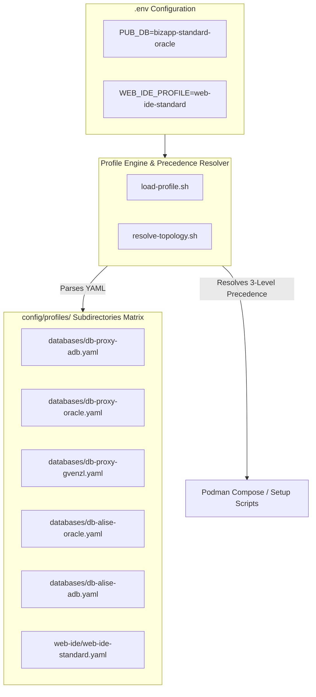
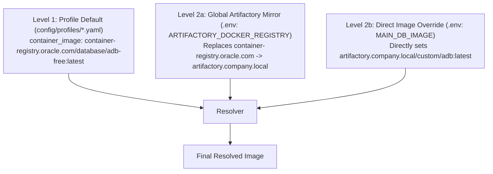
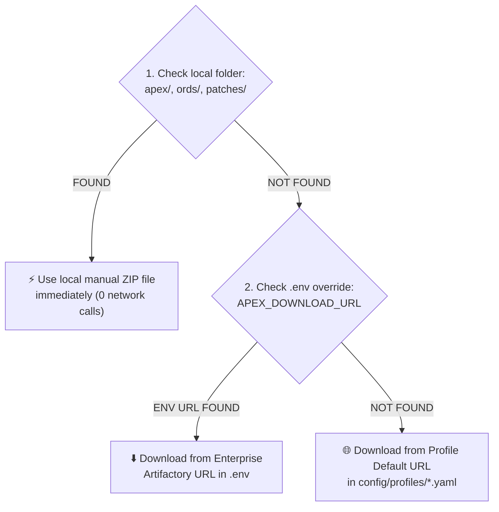
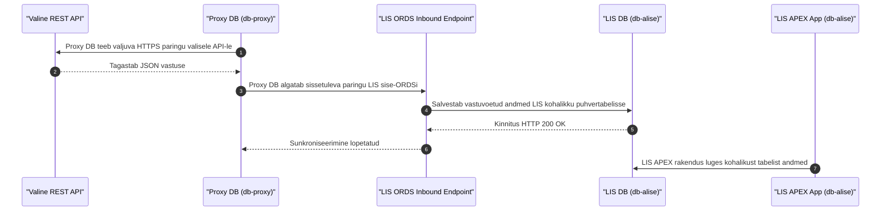

# Dynamic Database Profiles & Topology Manager Guide

This document explains the architecture, usage, and configuration of the **Dynamic YAML Profile Engine** (`config/profiles/databases/*.yaml` and `config/profiles/web-ide/*.yaml`) and **Topology Manager** (`config/topology.yaml` / `resolve-topology.sh`) in `oracle-free-db-in-prod`.

---

## 🏛️ Architecture Overview

The Profile Engine completely decouples container image parameters, DB initialization settings, user roles, ORDS REST configurations, and SEPS Wallet aliases from code scripts into structured YAML definitions.



---

## 🛡️ 3-Level Precedence Hierarchy Specification

To support seamless enterprise mirroring and offline development, container images and component ZIP files follow a strict 3-level resolution hierarchy:

### 1. Container Image Precedence Order



### 2. Component ZIP Precedence Order (`apex_*.zip`, `ords-*.zip`, `p*.zip`)



---

## 📂 Pre-Configured Profile Matrix (`config/profiles/databases/`)

| Profile Filename | Description | Repository | DB Type | Use Case | ORDS | APEX |
| :--- | :--- | :--- | :--- | :--- | :--- | :--- |
| **`db-alise-oracle.yaml`** | Primary Application DB on Official Oracle Free DB 23ai | `container-registry.oracle.com/database/free:latest` | `standard` | Primary App | Yes (8448) | Yes |
| **`db-alise-adb.yaml`** | Primary Application DB on Oracle Autonomous DB | `container-registry.oracle.com/database/adb-free:latest` | `adb` | Primary App | Yes (8443) | No |
| **`db-proxy-oracle.yaml`** | APEX Outbound Proxy DB on Official Oracle Free DB 23ai | `container-registry.oracle.com/database/free:latest` | `standard` | Proxy | Yes (8448) | Yes |
| **`db-proxy-adb.yaml`** | APEX Proxy DB on Oracle Autonomous DB Free | `container-registry.oracle.com/database/adb-free:latest` | `adb` | Proxy | Yes (8443) | Yes |
| **`db-proxy-gvenzl.yaml`** | APEX Proxy DB on Gvenzl 23c Faststart | `gvenzl/oracle-free:23-full-faststart` | `standard` | Proxy | Yes (8448) | Yes |
| **`db-infra-gvenzl.yaml`** | Infrastructure DB for Publisher & Forms (RCU) | `gvenzl/oracle-free:23-slim-faststart` | `standard` | App Infra | No | No |
| **`db-publisher-oracle.yaml`** | Dedicated DB & Analytics Publisher with RCU schemas | `container-registry.oracle.com/database/free:latest` | `standard` | Publisher + ORDS | Yes (8089) | No |
| **`db-publisher-gvenzl.yaml`** | Standalone DB & Analytics Publisher (Pixel Perfect) environment | `gvenzl/oracle-free:23-full-faststart` | `standard` | Publisher Standalone | No | No |
| **`db-cicd.yaml`** | Ephemeral DB for CI/CD Automated Testing | `container-registry.oracle.com/database/free:latest` | `standard` | CI/CD | No | No |

---

## 👤 User Quickstart Guide

### 1. Selecting a Database Profile in `.env`
To set or change the main database profile, edit `.env`:

```bash
# Select the desired profile:
DB_ALISE=db-alise-oracle

# Or select an Autonomous DB profile:
# DB_PROXY=db-proxy-adb
```

### 2. Enterprise Artifactory Mirroring (Restricted Networks)
If your organization requires pulling images from an internal Artifactory repository:

```bash
# Automatically prefix/replace public registries with internal mirror:
ARTIFACTORY_DOCKER_REGISTRY=artifactory.company.local
```

### 3. Manual Local ZIP Caching
If internet access is restricted, place OTN downloaded ZIP files into local directories:
- `apex/apex_24.1.zip`
- `ords/ords-latest.zip`
- `patches/catpatch.sql`

The setup scripts will detect these local files and perform 0 downloads!

### 4. Customizing Database Schemas and User Names (`config/profiles/*.yaml`)
Every database profile specifies its default schemas, database users, roles, and SEPS Wallet connection aliases in its YAML file (`config/profiles/*.yaml`).

To change a schema name (e.g. from `APEX_PROXY_SCHEMA` to `MY_COMPANY_SCHEMA`) or customize developer users:

```yaml
users:
  - username: sys
    role: SYSDBA
    wallet_alias: DB_APEX_PROXY_SYS
    color: "#E74C3C"

  # Custom Schema Name:
  - username: MY_COMPANY_SCHEMA
    role: NORMAL
    wallet_alias: DB_MY_COMPANY_SCHEMA
    color: "#2980B9"

  # Standard Developer User:
  - username: USER_DEVELOPER
    role: NORMAL
    ords_enabled: true
    ords_alias: user_developer
    roles: [DB_DEVELOPER_ROLE]
    wallet_alias: DB_PROXY_DEV
    color: "#F39C12"
```

When `./scripts/setup-all.sh` or `./scripts/internal/create-wallet.sh` runs:
- The database user and schema are created automatically.
- SEPS Wallet stores the credentials under the specified `wallet_alias`.
- VS Code SQL Developer extension registers connection folders using the defined names and colors.
- SQLcl passwordless aliases (`sql /@<wallet_alias>`) are instantly available.

---


## 🌐 Topology Manager & Multi-Instance Port Allocator

When running multiple database instances (e.g. 3 x `proxy-adb-oracle`), `config/topology.yaml` and `scripts/internal/resolve-topology.sh` automatically calculate non-clashing ports:

| Parameter | Base Port | Instance 0 (`db-proxy`) | Instance 1 (`db-finance`) | Instance 2 (`db-hr`) |
| :--- | :--- | :--- | :--- | :--- |
| **DB Listener Port** | `1532` | `1532` | `1533` | `1534` |
| **ORDS HTTPS Port** | `8443` | `8443` | `8444` | `8445` |
| **Container Name** | - | `oracle-db-proxy` | `oracle-db-finance` | `oracle-db-hr` |
| **VS Code Folder** | - | `/MYATP-proxy` | `/MYATP-finance` | `/MYATP-hr` |

---

## 🏆 LIS Primary Enterprise 4-Tier Profile Combination

For the primary enterprise LIS application architecture, `.env` configures 3 distinct profiles:

```bash
# 1. Publisher Metadata DB (db-publisher - Port 1531)
DB_PUBLISHER=publisher-free

# 2. APEX Proxy & Outbound REST DB (db-proxy - Port 1532)
DB_PROXY=proxy-gvenzl

# 3. LIS Business App DB (db-alise - Port 1533)
DB_ALISE=app-free
```

### 🌐 ORDS Multi-Pool Ühendustee ja Konfiguratsioon (app_ords)

Tsentraalne ORDS teenus (`app_ords`) kasuta andmebaaside ühendamiseks ORDS multi-pool XML konfiguratsioonifaile, mis pannakse paigaldusel automaatselt kokku kausta `/etc/ords/config/databases/`:

| URL Marsruut (Prefix) | ORDS Pooli Nimi | Sihtbaas & Port | Suunamise Eesmärk |
| :--- | :--- | :--- | :--- |
| `https://localhost:8448/ords/proxy/` | `default.xml` / `proxy.xml` | `db-proxy:1521/FREEPDB1` | 🛡️ APEX Proxy, Outbound REST ja Azure Entra-ID OIDC SSO |
| `https://localhost:8448/ords/lis/` | `lis.xml` | `db-alise:1521/FREEPDB1` | 🧪 LIS Ärirakendus & PL/SQL loogika (Restricted DB Zone) |
| `https://localhost:8448/ords/pub/` | `pub.xml` | `db-publisher:1521/FREEPDB1` | 🗄️ Analytics Publisher RCU metaandmete hoidla |

---

### ⚡ Konteinerite Käivituskestuse Analüüs (FastStart vs Standard + APEX)

Projekti erinevate andmebaasi profiilide käivituskestuses esineb teadlik vahe vastavalt pildi arhitektuurile ja APEX-i paigaldusele:

| Profiil / Pilt | Käivituskestus | Põhjus & Teostus |
| :--- | :--- | :--- |
| **`db-publisher-gvenzl`** (`gvenzl/oracle-free:23-full-faststart`) | **~5 – 15 sek** | **FastStart:** Andmebaas on pildi sees valmis initsialiseeritud. APEX on välja lülitatud. |
| **`db-alise-oracle` / `db-proxy-oracle`** (`container-registry.oracle.com/database/free:latest`) | **~3 – 6 min** | **Standard DBCA:** Ametlik Oracle pilt teostab esmakordsel käivitamisel `CREATE DATABASE` / DBCA protsessi. |
| **APEX Mootori Paigaldus** | **+ 2 – 4 min** | Sisse lülitatud APEX mootori (`components.apex.enabled=true`) paigaldamisel teostatakse `@apexins.sql` DDL skriptid. |

---

### 🔌 Outbound REST & Inbound Push Sequence Diagram



---

## 🧩 Clean Blueprints & Profile Inter-Relationships (Rule 11)

### 1. Separation of Concerns & Positive References
In the modern platform architecture, architecture blueprints (`config/blueprints/.env.*`) are **pure, high-level declarations**:
- They **only declare positive references** to YAML profiles:
  ```bash
  DB_ALISE=db-alise-oracle
  DB_PROXY=db-proxy-oracle
  ORDS_PROFILE=ords-standard
  PUBLISHER_PROFILE=publisher-standard
  WEB_IDE_PROFILE=web-ide-standard
  ```
- They **never contain negative flags** (e.g. `SKIP_ORDS`, `SKIP_FORMS`), port numbers, or credentials.
- They specify **which container instances are activated**.

### 2. Profile Encapsulation & Inter-Database Relations
100% of configuration details live in YAML profiles (`config/profiles/**/*.yaml`):
- **Container settings:** Images, memory limits, host port bindings (`db_port`, `http_port`).
- **Database internals:** PDB service names (`default_service: FREEPDB1`), tablespaces, user quotas, and least-privilege roles (`DBA_ADMIN`, `DEV`, `APP`, `VIEWER`).
- **Inter-service relationships:** 
  - ORDS connection pools (`databases: [alise, proxy, default]`) automatically map URLs (`/ords/alise/`, `/ords/proxy/`) to specific target database instances.
  - Middleware services (Forms 14c, Analytics Publisher) connect either to a dedicated RCU database or to a shared infrastructure database as declared in the profile.

### 3. Adding Custom Blueprints (1-by-1 Extensibility)
Any developer or AI can add a custom blueprint anytime without touching any core engine scripts:
1. Create a file `config/blueprints/.env.<ID>-<name>`:
   ```bash
   # Custom Blueprint 12: Integrated Developer Stack
   DB_ALISE=db-alise-oracle
   ORDS_PROFILE=ords-standard
   WEB_IDE_PROFILE=web-ide-standard
   ```
2. Run or test immediately:
   ```bash
   ./scripts/setup-all.sh -b 12
   ./scripts/setup-all.sh -b 12 --dry-run
   ```
   The engine automatically resolves the referenced profiles, provisions container instances, calculates ports, and configures the SEPS Wallet.


