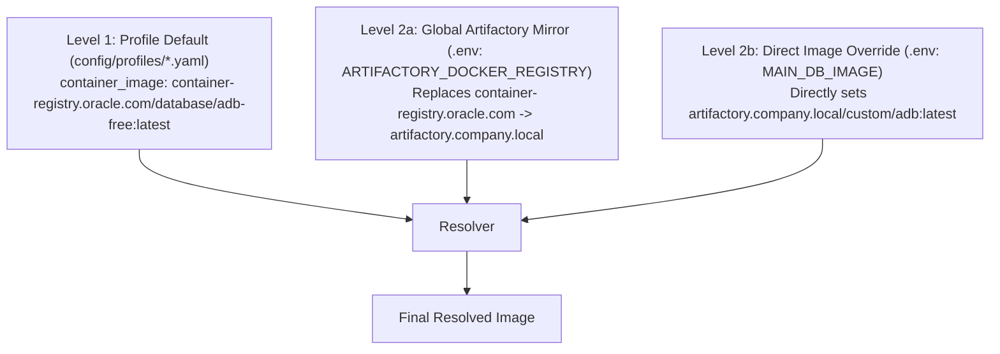
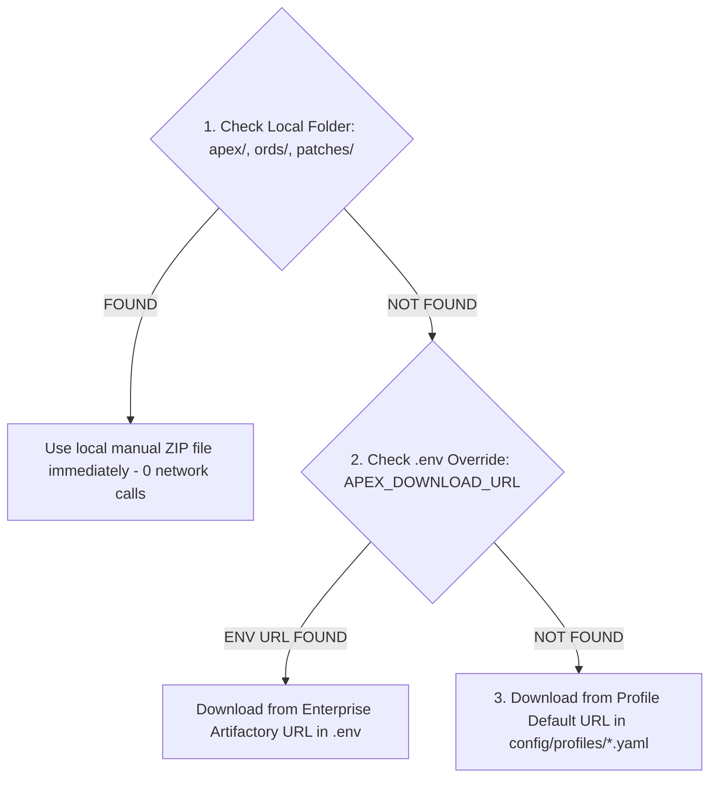

# Dynamic Database Profiles & Topology Manager Guide

This document explains the architecture, usage, and configuration of the **Dynamic YAML Profile Engine** (`config/profiles/databases/*.yaml` and `config/profiles/web-ide/*.yaml`) and **Topology Manager** (`config/topology.yaml` / `resolve-topology.sh`) in `oracle-free-db-in-prod`.

---

## 🏛️ Architecture Overview

The Profile Engine completely decouples container image parameters, DB initialization settings, user roles, ORDS REST configurations, and SEPS Wallet aliases from code scripts into structured YAML definitions.


---

## 🛡️ 3-Level Precedence Hierarchy Specification

To support seamless enterprise mirroring and offline development, container images and component ZIP files follow a strict 3-level resolution hierarchy:

### 1. Container Image Precedence Order



### 2. Component ZIP Precedence Order (`apex_*.zip`, `ords-*.zip`, `p*.zip`)



---

## 📂 Pre-Configured Profile Matrix (`config/profiles/`)

| Profile Filename | Description | Repository | DB Type | Use Case | ORDS | APEX |
| :--- | :--- | :--- | :--- | :--- | :--- | :--- |
| **`app-free.yaml`** | Primary Application DB on Official Oracle Free DB 23ai | `container-registry.oracle.com/database/free:latest` | `standard` | Primary App | Yes (8448) | Yes |
| **`app-adb.yaml`** | Primary Application DB on Oracle Autonomous DB | `container-registry.oracle.com/database/adb-free:latest` | `adb` | Primary App | Yes (8443) | No |
| **`proxy-adb.yaml`** | APEX Proxy DB on Oracle Autonomous DB Free | `container-registry.oracle.com/database/adb-free:latest` | `adb` | Proxy | Yes (8443) | Yes |
| **`proxy-free.yaml`** | APEX Proxy DB on Official Oracle Free DB 23ai | `container-registry.oracle.com/database/free:latest` | `standard` | Proxy | Yes (8448) | Yes |
| **`proxy-gvenzl.yaml`** | APEX Proxy DB on Gvenzl 23c Faststart | `gvenzl/oracle-free:23-full-faststart` | `standard` | Proxy | Yes (8448) | Yes |
| **`proxy-ords-standalone.yaml`** | APEX Proxy DB + Dedicated Standalone ORDS | `container-registry.oracle.com/database/free:latest` | `standard` | Standalone ORDS | Yes (8085) | Yes |
| **`proxy-ords-external.yaml`** | APEX Proxy DB + External Corporate ORDS | `container-registry.oracle.com/database/free:latest` | `standard` | External ORDS | External | Yes |
| **`appinfra.yaml`** | Infrastructure DB for Publisher & Forms (RCU) | `gvenzl/oracle-free:23-slim-faststart` | `standard` | App Infra | No | No |
| **`cicd.yaml`** | Ephemeral DB for CI/CD Automated Testing | `container-registry.oracle.com/database/free:latest` | `standard` | CI/CD | No | No |

---

## 👤 User Quickstart Guide

### 1. Selecting a Database Profile in `.env`
To set or change the main database profile, edit `.env`:

```bash
# Select the desired profile:
PUB_DB=app-free

# Or select an Autonomous DB profile:
# PUB_DB=proxy-adb
```

### 2. Enterprise Artifactory Mirroring (Restricted Networks)
If your organization requires pulling images from an internal Artifactory repository:

```bash
# Automatically prefix/replace public registries with internal mirror:
ARTIFACTORY_DOCKER_REGISTRY=artifactory.company.local
```

### 3. Manual Local ZIP Caching
If internet access is restricted, place OTN downloaded ZIP files into local directories:
- `apex/apex_24.1.zip`
- `ords/ords-latest.zip`
- `patches/catpatch.sql`

The setup scripts will detect these local files and perform 0 downloads!

### 4. Customizing Database Schemas and User Names (`config/profiles/*.yaml`)
Every database profile specifies its default schemas, database users, roles, and SEPS Wallet connection aliases in its YAML file (`config/profiles/*.yaml`).

To change a schema name (e.g. from `APEX_PROXY_SCHEMA` to `MY_COMPANY_SCHEMA`) or customize developer users:

```yaml
users:
  - username: sys
    role: SYSDBA
    wallet_alias: DB_APEX_PROXY_SYS
    color: "#E74C3C"

  # Custom Schema Name:
  - username: MY_COMPANY_SCHEMA
    role: NORMAL
    wallet_alias: DB_MY_COMPANY_SCHEMA
    color: "#2980B9"

  # Custom Developer User:
  - username: ALLANLAHE
    role: NORMAL
    ords_enabled: true
    ords_alias: allanlahe
    roles: [DB_DEVELOPER_ROLE]
    wallet_alias: DB_ALLANLAHE
    color: "#F39C12"
```

When `./scripts/setup-all.sh` or `./scripts/internal/create-wallet.sh` runs:
- The database user and schema are created automatically.
- SEPS Wallet stores the credentials under the specified `wallet_alias`.
- VS Code SQL Developer extension registers connection folders using the defined names and colors.
- SQLcl passwordless aliases (`sql /@<wallet_alias>`) are instantly available.

---


## 🌐 Topology Manager & Multi-Instance Port Allocator

When running multiple database instances (e.g. 3 x `proxy-adb-oracle`), `config/topology.yaml` and `scripts/internal/resolve-topology.sh` automatically calculate non-clashing ports:

| Parameter | Base Port | Instance 0 (`db-proxy`) | Instance 1 (`db-finance`) | Instance 2 (`db-hr`) |
| :--- | :--- | :--- | :--- | :--- |
| **DB Listener Port** | `1532` | `1532` | `1533` | `1534` |
| **ORDS HTTPS Port** | `8443` | `8443` | `8444` | `8445` |
| **Container Name** | - | `oracle-db-proxy` | `oracle-db-finance` | `oracle-db-hr` |
| **VS Code Folder** | - | `/MYATP-proxy` | `/MYATP-finance` | `/MYATP-hr` |
