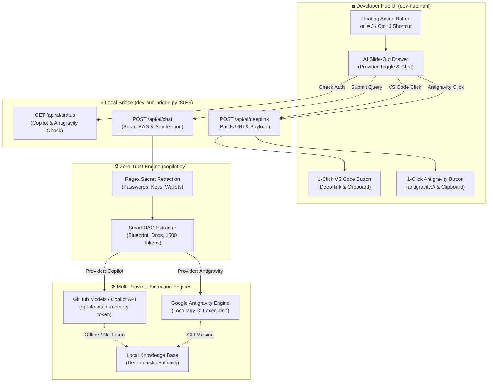

[ 🇬🇧 English ](devhub-copilot-assistant.md) | [ 🇪🇪 Eesti ](et/devhub-copilot-assistant.md) | [ 🇫🇮 Suomi ](fi/devhub-copilot-assistant.md) | [ 🇸🇪 Svenska ](sv/devhub-copilot-assistant.md) | [ 🇱🇻 Latviešu ](lv/devhub-copilot-assistant.md) | [ 🇱🇹 Lietuvių ](lt/devhub-copilot-assistant.md)

# 🤖 Dev Hub Multi-Provider AI Assistant (Copilot + Antigravity) & Zero-Trust RAG Guide

This guide documents the embedded **Multi-Provider AI Assistant** in Dev Hub (`docs/dev-hub.html`), supporting both **GitHub Copilot** and **Google Antigravity**, its Zero-Trust credential security (Rule 5), offline fallback knowledge base, and 1-click export bridges to both VS Code Copilot Chat and Antigravity Desktop / IDE.

---

## 🏛️ 1. Technical Architecture & Data Flow

The assistant features a hybrid dual-provider architecture: accessible across all Dev Hub tabs via keyboard shortcut `⌘J` / `Ctrl+J`, featuring dynamic provider switching between GitHub Copilot and Google Antigravity:

---

## 🔒 2. Zero-Trust Security & Rule 5 Compliance

To uphold enterprise Zero-Trust requirements:
1. **Never Stored on Disk:** Authentication tokens (`gh auth token` or `GITHUB_TOKEN`) and CLI interactions are resolved dynamically in memory without plaintext disk caching.
2. **Dynamic Redaction:** All user queries and documentation snippets pass through `sanitize_text` before leaving the local machine:
   - Database passwords (`password: ...`, `IDENTIFIED BY ...`)
   - SEPS Wallet paths (`cwallet.sso`, `ewallet.p12`)
   - SSH and TLS private keys (`BEGIN PRIVATE KEY`)
   - GitHub Personal Access Tokens (`ghp_*`, `github_pat_*`)

---

## ⌨️ 3. Developer Shortcuts & Multi-Provider Interactions

| Action | Shortcut / Trigger | Description |
| :--- | :--- | :--- |
| **Open / Close Assistant** | `⌘J` (macOS) / `Ctrl+J` (Windows/Linux) | Toggles the slide-out AI drawer from any Dev Hub tab. |
| **Provider Switcher** | Header pills `[ GitHub Copilot | Google Antigravity ]` | Switches between GitHub Copilot and Google Antigravity (persisted in `localStorage`). |
| **Maximize / Restore** | Top-right Maximize button `⛶` | Expands drawer into full-screen split view for code review. |
| **Submit Question** | `Enter` key | Sends prompt to the active AI engine. |
| **Open in VS Code** | Click `Open in VS Code Copilot` | Copies full RAG markdown context to clipboard and launches `vscode://github.copilot/chat`. |
| **Open in Antigravity** | Click `Open in Antigravity` | Copies full RAG markdown context to clipboard and launches `antigravity://chat` (or launches desktop app). |

---

## 🔄 4. 3-Tier Offline Fallback Architecture

If an enterprise machine operates in an air-gapped environment or lacks cloud connectivity:
1. **Tier 1 (Connected):** Queries GitHub Models (`gpt-4o`) or local `agy` CLI with sanitized platform context.
2. **Tier 2 (CLI Fallback):** Queries via authenticated local CLI utilities.
3. **Tier 3 (Zero-Network Offline):** Instant deterministic response extracted from local repository documentation (`docs/`, `.agents/skills/`, and blueprints).
