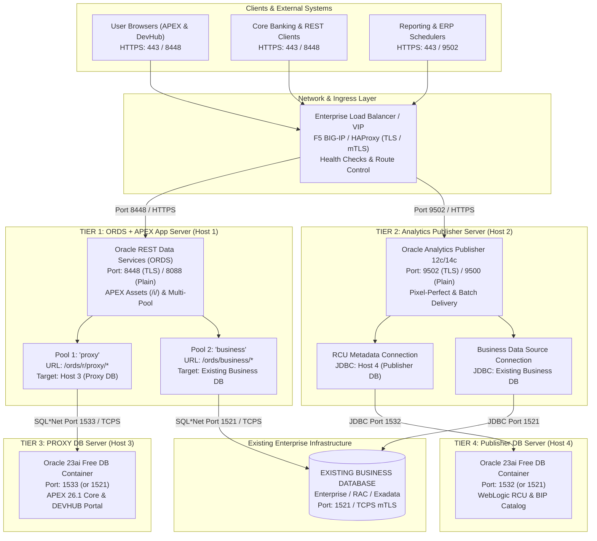
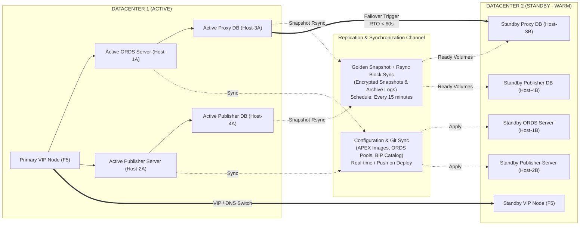

# Enterprise Distributed Multi-Host Architecture Specification

[ 🇬🇧 English ](enterprise-distributed-architecture.md) | [ 🇪🇪 Eesti ](et/enterprise-distributed-architecture.md) | [ 🇫🇮 Suomi ](fi/enterprise-distributed-architecture.md) | [ 🇸🇪 Svenska ](sv/enterprise-distributed-architecture.md) | [ 🇱🇻 Latviešu ](lv/enterprise-distributed-architecture.md) | [ 🇱🇹 Lietuvių ](lt/enterprise-distributed-architecture.md)

---

## 1. Executive Summary & Financial Regulatory Compliance

This document defines the production-grade, highly available, distributed multi-host architecture for deploying the Oracle DevOps & APEX Application Platform within financial institutions and regulated enterprise environments across three distinct deployment lifecycles: **DEV**, **TEST**, and **PROD**.

### Regulatory & Enterprise Invariants
- **Digital Operational Resilience Act (DORA) & EBA Outsourcing Guidelines:** Enforces business continuity through a dual-datacenter **Active / Standby** model delivering **RTO < 60s** (Recovery Time Objective) and **RPO < 15m** (Recovery Point Objective).
- **PCI-DSS & ISO/IEC 27001:** Zero plaintext credentials on disk, mandatory end-to-end TLS 1.3 / mTLS encryption, AES-256 Oracle Secure External Password Store (SEPS) Auto-Login Wallets, rootless Podman container isolation, and granular least-privilege database accounts.
- **Clear Separation of Concerns (4 Tiers):** Eliminates single-point-of-failure and memory contention by distributing the workload onto 4 dedicated server nodes per environment.

---

## 2. Distributed 4-Tier Architecture Topology

Each environment (DEV, TEST, PROD) operates across 4 dedicated virtual or physical Linux hosts (RHEL 9 / Oracle Linux 9):



---

## 3. Production (PROD) Active / Standby Disaster Recovery

In the PROD environment, all 4 tiers are mirrored across two availability zones or datacenters (DC-1 Active vs DC-2 Standby):



### SLA & Recovery Metrics
- **RPO (Recovery Point Objective):** $< 15$ minutes (automated Golden Snapshot synchronization frequency).
- **RTO (Recovery Time Objective):** $< 60$ seconds (automated container launch from pre-staged snapshot).
- **Failover Automation Tool:** `./scripts/dr/failover-standby.sh` handles volume verification, container startup, SEPS Wallet validation, and DNS/VIP cutover.

---

## 4. Network Port & Firewall Matrix

| Source | Destination | Port / Protocol | Service | Description |
|:---|:---|:---|:---|:---|
| Corporate Network / Users | F5 Load Balancer (VIP) | `443/TCP`, `8448/TCP` | HTTPS | APEX Applications, DevHub & Core REST APIs |
| Corporate Network / ERP | F5 Load Balancer (VIP) | `9502/TCP` | HTTPS | Analytics Publisher Web UI & Document Generation API |
| F5 Load Balancer | Server 1 (ORDS) | `8448/TCP` | HTTPS | Reverse proxy traffic to ORDS container |
| F5 Load Balancer | Server 2 (Publisher) | `9502/TCP` | HTTPS | Reverse proxy traffic to Publisher container |
| Server 1 (ORDS) | Server 3 (Proxy DB) | `1533/TCP` | Oracle SQL*Net | APEX engine & DevHub database queries (`proxy` pool) |
| Server 1 (ORDS) | Existing Business DB | `1521/TCP` (or `2484`) | SQL*Net / TCPS | Core banking business REST services (`business` pool) |
| Server 2 (Publisher) | Server 4 (Publisher DB) | `1532/TCP` | Oracle SQL*Net | WebLogic RCU configuration & catalog storage |
| Server 2 (Publisher) | Existing Business DB | `1521/TCP` (or `2484`) | SQL*Net / TCPS | Business data querying for PDF/Excel document rendering |
| Bastion / CI Runner | All Servers (1..4) | `22/TCP` | SSH / SFTP | Automated deployments, Ansible, remote CLI commands |
| Server 3A (Active DB) | Server 3B (Standby DB) | `22/TCP` / `873/TCP` | SSH / rsync | Proxy DB Golden Snapshot volume replication |
| Server 4A (Active DB) | Server 4B (Standby DB) | `22/TCP` / `873/TCP` | SSH / rsync | Publisher DB RCU Golden Snapshot volume replication |

---

## 5. Technical Configuration Specifications

### 5.1. ORDS Multi-Pool Architecture (`/etc/ords/config/`)

#### Global Settings (`/etc/ords/config/global/settings.xml`)
```xml
<?xml version="1.0" encoding="UTF-8"?>
<!DOCTYPE properties SYSTEM "http://java.sun.com/dtd/properties.dtd">
<properties>
  <comment>ORDS Global Configuration - Enterprise Multi-Pool</comment>
  <entry key="standalone.https.port">8448</entry>
  <entry key="standalone.ssl.cert">/etc/ords/certs/tls.crt</entry>
  <entry key="standalone.ssl.cert.key">/etc/ords/certs/tls.key</entry>
  <entry key="standalone.doc.root">/etc/ords/apex_images</entry>
  <entry key="security.maxEntries">10000</entry>
  <entry key="feature.sdw">true</entry>
  <entry key="database.api.enabled">true</entry>
  <entry key="misc.defaultPage">r/proxy/devhub/home</entry>
</properties>
```

#### Proxy Database Pool (`/etc/ords/config/databases/proxy/pool.xml`)
```xml
<?xml version="1.0" encoding="UTF-8"?>
<!DOCTYPE properties SYSTEM "http://java.sun.com/dtd/properties.dtd">
<properties>
  <comment>ORDS Pool for PROXY DB (APEX Engine)</comment>
  <entry key="db.connectionType">customurl</entry>
  <entry key="db.customURL">jdbc:oracle:thin:/@DB_PROXY_REMOTE</entry>
  <entry key="db.wallet.location">/etc/ords/wallet</entry>
  <entry key="db.tnsDirectory">/etc/ords/tns_admin</entry>
  <entry key="jdbc.MinLimit">5</entry>
  <entry key="jdbc.MaxLimit">50</entry>
  <entry key="jdbc.InitialLimit">5</entry>
  <entry key="jdbc.InactivityTimeout">1800</entry>
</properties>
```

#### Existing Business Database Pool (`/etc/ords/config/databases/business/pool.xml`)
```xml
<?xml version="1.0" encoding="UTF-8"?>
<!DOCTYPE properties SYSTEM "http://java.sun.com/dtd/properties.dtd">
<properties>
  <comment>ORDS Pool for Existing Core Business Database</comment>
  <entry key="db.connectionType">customurl</entry>
  <entry key="db.customURL">jdbc:oracle:thin:/@BIZ_DB_REMOTE</entry>
  <entry key="db.wallet.location">/etc/ords/wallet</entry>
  <entry key="db.tnsDirectory">/etc/ords/tns_admin</entry>
  <entry key="jdbc.MinLimit">5</entry>
  <entry key="jdbc.MaxLimit">100</entry>
  <entry key="jdbc.InitialLimit">10</entry>
  <entry key="jdbc.InactivityTimeout">1800</entry>
</properties>
```

---

### 5.2. Zero-Trust Oracle Wallet (SEPS) & Network Aliases (`tnsnames.ora`)

```ini
# /etc/oracle/tns_admin/tnsnames.ora

# 1. Dedicated Proxy DB Server (Host 3)
DB_PROXY_REMOTE =
  (DESCRIPTION =
    (ADDRESS = (PROTOCOL = TCP)(HOST = proxy-db.corp.bank)(PORT = 1533))
    (CONNECT_DATA =
      (SERVER = DEDICATED)
      (SERVICE_NAME = FREEPDB1)
    )
  )

# 2. Dedicated Publisher RCU DB Server (Host 4)
DB_PUBLISHER_REMOTE =
  (DESCRIPTION =
    (ADDRESS = (PROTOCOL = TCP)(HOST = publisher-db.corp.bank)(PORT = 1532))
    (CONNECT_DATA =
      (SERVER = DEDICATED)
      (SERVICE_NAME = FREEPDB1)
    )
  )

# 3. Existing Core Business Database (Enterprise RAC / Cloud ADB)
BIZ_DB_REMOTE =
  (DESCRIPTION =
    (ADDRESS = (PROTOCOL = TCPS)(HOST = bizdb-scan.corp.bank)(PORT = 2484))
    (CONNECT_DATA =
      (SERVER = DEDICATED)
      (SERVICE_NAME = BIZ_PROD.CORP.BANK)
    )
    (SECURITY =
      (SSL_SERVER_CERT_DN = "CN=bizdb-scan.corp.bank,OU=IT,O=Bank,C=EE")
    )
  )
```

---

## 6. Implementation Backlog & Delivery Phases

The transformation roadmap is broken down into **11 Jira Stories (62 Story Points)** tracked under [`docs/backlog/`](backlog/README.md):
- **Phase 1: Foundation & Core Infrastructure** (FIN-001, FIN-002, FIN-003, FIN-009) — 20 SP
- **Phase 2: Application Tier & Business Integration** (FIN-004, FIN-005, FIN-006, FIN-007) — 24 SP
- **Phase 3: High Availability, CI/CD & Production Hardening** (FIN-008, FIN-010, FIN-011) — 18 SP
