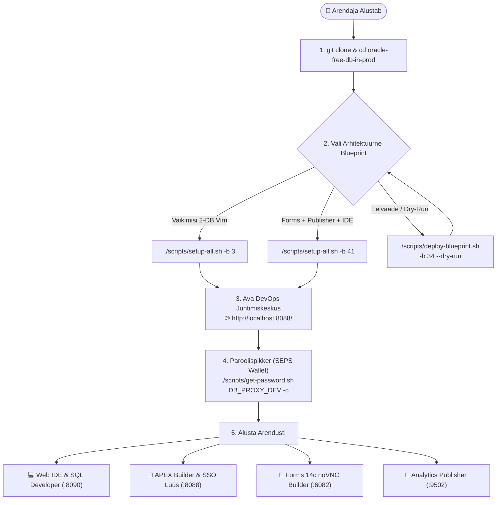
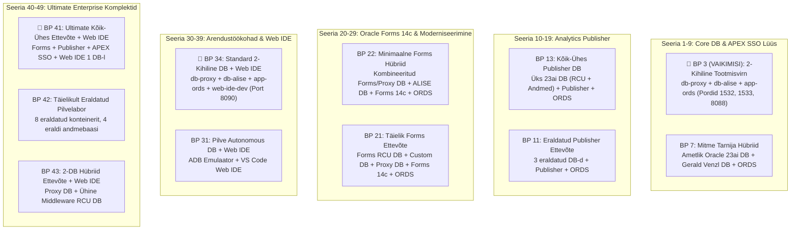

[ 🇬🇧 English ](../../README.md) | [ 🇪🇪 Eesti ](README.md) | [ 🇫🇮 Suomi ](../fi/README.md) | [ 🇸🇪 Svenska ](../sv/README.md) | [ 🇱🇻 Latviešu ](../lv/README.md) | [ 🇱🇹 Lietuvių ](../lt/README.md)

# Oracle DevOps Platvorm (Eesti Juhend)

> **Toodangukõlblik, litsentsitasudeta (0 €) ja 100% paroolivaba (SEPS Wallet) Oracle 23ai, APEX SSO Lüüs, Forms 14c, Publisher ja Web IDE arendus- ning DevOps platvorm.**

---

## ⚡ 60-Sekundi Kiirstart

```bash
# 1. Klooni repositoorium ja liigu kausta
git clone https://github.com/allanlahe/oracle-free-db-in-prod.git && cd oracle-free-db-in-prod

# 2. Käivita vaikimisi 2-kihiline tootmisvirn (Blueprint 3)
./scripts/setup-all.sh -b 3 --lang et

# 3. Vaata paroole, URL-e ja lõikelaua spikrit (või ava Dev Hub aadressil http://localhost:8088/)
./scripts/get-password.sh
```

---

## 🗺️ Uue Arendaja Onboarding Teekond



---

## ⚡ Setup-All 10-Faasiline Elutsükli Arhitektuur

```mermaid
flowchart LR
    P1["1. Kujutiste Tõmbamine"] --> P2["2. ORDS Allalaadimine"]
    P2 --> P3["3. APEX Paketid"]
    P3 --> P4["4. Konteinerite Käivitus"]
    P4 --> P5["5. DB Tervise Ootamine"]
    P5 --> P6["6. APEX Paigaldus"]
    P6 --> P7["7. Skeemid & SEPS Init"]
    P7 --> P8["8. APEX Rakenduste Deploy"]
    P8 --> P9["9. Middleware & Teenused"]
    P9 --> P10["10. Kuldne Hetktõmmis (~15s DR)"]
```



---

## 🌐 Dev Hub (`http://localhost:8088/`) — Ühtne Juhtimiskeskus (*Single Pane of Glass*)

Arendaja ei pea meelde jätma kümneid erinevaid porte. **Dev Hub** toimib ühtse maandumislehena:
- **1-Kliki Teenuste Lingid:** Otsene ligipääs APEX Builderile, Database Actionsile (SDW), Forms 14c teenustele, HTML5 noVNC Forms Builderile ja Analytics Publisherile.
- **1-Kliki Paroolide Kopeerimine:** Üks klikk kopeerib dekrüpteeritud parooli otse lõikelauale (valmis kleepimiseks: `Cmd+V` / `Ctrl+V`).
- **Reaalajas Tervisediagnostika:** Automaatne latentsuskontroll iga 6 sekundi järel.
- **Integreeritud Markdown Dokumentatsiooniluger:** Loe ja otsi juhendeid otse veebibrauseris.
- **Blueprintide Juurutamine ja Haldus:** Käivita, vaheta ja monitoori blueprinte mugavalt veebist või käsuga `./scripts/deploy-blueprint.sh`.

---

## 🔑 Kust Ma Leian Oma Parooli? (SEPS Wallet Spikker)

Kõik paroolid genereeritakse kõrge entroopiaga krüptograafiliselt ja talletatakse turvaliselt **Oracle SEPS (Secure External Password Store) Walletites** ning Podman Secret Store'is.

```bash
# Vaata terviklikku paroolide ja teenuste koondtabelit:
./scripts/get-password.sh

# Kopeeri arendaja parool otse lõikelauale:
./scripts/get-password.sh DB_PROXY_DEV -c

# Kopeeri APEX administraatori parool:
./scripts/get-password.sh DB_PROXY_APEX_ADMIN -c

# Ühendu andmebaasiga SQLcl kaudu ILMA ühegi paroolita:
sql /@DB_PROXY_DEV
```

---

## 🎯 3 Sidusgrupi Vaated ja Platvormi Äriline Kasu

| Sidusgrupp | Peamised Eelised ja Igapäevane Kasutuskogemus | Tehniline Tagatis |
| :--- | :--- | :--- |
| **👤 Lõppkasutaja ja Äripool** | • **Null Klientrakendust:** Kaasaegne HTML5 veebikogemus ja APEX Universal Theme.<br/>• **Ühtne Sisselogimine (SSO):** Üks seanss üle APEXi ja pärand-Forms teenuste.<br/>• **Pixel-Perfect Aruanded:** Automatiseeritud PDF/Excel dokumentide genereerimine. | • ORDS Multi-Pool Lüüs<br/>• APEX Reverse Proxy SSO Formsile<br/>• Analytics Publisher REST API |
| **💻 Arendaja** | • **~15s FastStart Taastumine:** Hetkeline algseisu taastamine Kuldsete Hetktõmmistega.<br/>• **Paroolivaba SQL:** Kohene ühendus `./scripts/sqlcl.sh` ja SEPS Walleti kaudu.<br/>• **Brauseripõhine Web IDE:** Paigaldusvaba VS Code koos Oracle SQL Developeri ja tehisintellektiga. | • Podman FastStart Hetktõmmised<br/>• SEPS Oracle Wallet Automaatsünk<br/>• `code-server` Web IDE Konteiner |
| **🛡️ Auditeerija ja Arhitekt** | • **0 € Litsentsikulu:** Oracle 23ai Free DB toodangus.<br/>• **Null-Usalduse Võrguisolatsioon:** Andmebaas ei ava toor-SQL-i kunagi avalikku võrku.<br/>• **Reguleeritud Täitmine:** EBNF deklaratiivsed lepingud, AST turvaanalüüs ja VPD. | • JSON-Relational Duality<br/>• 2-Kihiline Võrgutopoloogia<br/>• Oracle Virtual Private Database (VPD) |

---

## 🔄 Oracle APEXi ja Forms 14c Integratsiooni Fookus

Käesolevas arhitektuuris on **Oracle APEX 26.1** positsioneeritud eelkõige kui:
1. **Forms Moderniseerimise Sild:** Forms 14c rakenduste järk-järguline moderniseerimine kaasaegseteks veebirakendusteks [Oracle APEXlang DSL](https://docs.oracle.com/en/database/oracle/apex/26.1/apxln/) abil.
2. **Ettevõtte Tasemel SSO Reverse Proxy Formsile:** APEX võtab vastu Azure Entra ID / SAML / OAuth2 autentimise ning vahendab autoriseeritud seansi turvaliselt Oracle Forms 14c-le ilma kalli WebLogic OAM/OIF taristuta.

---

## 📋 11 Kureeritud Arhitektuurset Blueprinti



### 🚀 Blueprintide Juurutamine ja Haldus (`./scripts/deploy-blueprint.sh`)

```bash
# 1. Kontrolli aktiivset blueprinti ja teenuste tervist:
./scripts/deploy-blueprint.sh --status --lang et

# 2. Juuruta Blueprint 3 (VAIKIMISI 2-Kihiline Tootmisvirn):
./scripts/deploy-blueprint.sh -b 3 --lang et

# 3. Juuruta Blueprint 41 (Ultimate Kõik-Ühes Ettevõte):
./scripts/deploy-blueprint.sh -b 41 --lang et

# 4. Simuleeri paigaldust ilma muudatusteta (Dry-Run):
./scripts/deploy-blueprint.sh -b 34 --dry-run

# 5. Kuva 11 blueprinti tabel käsureal:
./scripts/deploy-blueprint.sh --list --lang et
```

---

## 🚀 Kiirkäivituse Spikker (Quickstart CLI)

```bash
# 1. Käivita soovitud blueprint:
./scripts/setup-all.sh -b 3 --lang et

# 2. Vaata paroolide ja teenuste koondtabelit (või kopeeri -c abil):
./scripts/get-password.sh
./scripts/get-password.sh DB_PROXY_DEV -c

# 3. Roteeri paroole turvaliselt (katkestusteta):
./scripts/rotate-password.sh db-proxy dev
./scripts/rotate-password.sh all

# 4. Kontrolli aktiivseid veebiteenuseid ja Walleti ühendusi:
./scripts/check-urls.sh --lang et
./scripts/check-wallet.sh

# 5. Käivita automaatne sisselogimise ja brauseritest:
./scripts/test-browser-login.sh

# 6. Käivita mitmekeelsuse (i18n) kontroll (Reegel 9: EN, ET, FI, SV, LV, LT):
./tests/test-multilingual-support.sh

# 7. Loo või taasta Kuldseid Hetktõmmiseid (~15s taastumine):
./scripts/snapshots/create-golden-snapshots.sh
./scripts/snapshots/restore-golden-snapshots.sh

# 8. Puhasta logid, ajutised failid ja vanad hetktõmmised:
./scripts/clean-logs.sh -y
./scripts/snapshots/clean-golden-snapshots.sh -y

# 9. Lähtesta keskkond puhtale algseisule:
./scripts/reset-all.sh -y
```

---

## 📑 Spetsiifilised Juhendid Kasutajale

- 🚀 **[docs/et/forms-to-apex-migration-guide.md](forms-to-apex-migration-guide.md):** **Oracle Forms $\rightarrow$ APEX Migratsiooni- ja Moderniseerimisjuhend** — Äriline põhjendus, TCO kuluvõrdlus, 5-etapiline automaatne töövoog, PL/SQL äriloogika eraldamine ja [Oracle APEXlang DSL](https://docs.oracle.com/en/database/oracle/apex/26.1/apxln/) Vibe-Coding.
- 📐 **[docs/et/forms-setup.md](forms-setup.md):** Oracle Forms 14c kasutusjuhend — portide kaart (9001/7001/6082), testvormi avamine (`frmservlet?form=test.fmx`), vormide lisamine kausta `forms_apps/`, kompileerimine ja APEX-isse migratsioon.
- 📑 **[docs/et/publisher-setup.md](publisher-setup.md):** Analytics Publisheri kasutusjuhend — port 9502 (`/xmlpserver`), RCU metaandmete baas, `PUBLISHER_READER` Wallet konto, JDBC andmeallikate sidumine ja aruannete tarne.
- 💻 **[docs/et/web-ide-artifactory.md](web-ide-artifactory.md):** Web IDE kasutusjuhend — VS Code laiendused (Oracle SQL Developer, Antigravity AI, GitHub Actions), host-ühenduste reaalajas sünkroonimine ja offline GitHub Actions testimine (`act`).
- 🌐 **[docs/dev-hub.html](../../docs/dev-hub.html):** **Arendaja ja DevOps Juhtimiskeskus (Command Center)** — Kättesaadav aadressil **`http://localhost:8088/`** ja **`https://localhost:8448/`** (ORDS) ning **`http://localhost:6082/vnc.html`** (Forms). Sisaldab reaalajas latentsuse mõõtmist, interaktiivseid Mermaid arhitektuurijooniseid, 11 Blueprinti kataloogi, brauserisisest Markdown dokumentatsiooni lugerit, peidetavat SEPS Wallet paroolide maatriksit ning DevOps kiirkäskude juhtpaneeli 6 keeles.
- 📊 **[config/blueprints/README.et.md](../../config/blueprints/README.et.md):** Kõigi 11 arhitektuurse kavandi detailne tehniline maatriks.
- 📖 **[Oracle APEX 26.1 APEXlang Reference Manual](https://docs.oracle.com/en/database/oracle/apex/26.1/apxln/):** Oracle'i ametlik spetsifikatsioon deklaratiivse `.apx` grammatika, translaatori AST sõlmede ja CLI käskude kohta.
- 📜 **[Ametlik APEXlang EBNF Grammatika (`apexlang.ebnf`)](https://docs.oracle.com/en/database/oracle/apex/26.1/apxln/apexlang.ebnf):** Masinloetav formaalne EBNF spetsifikatsioon tehisintellekti piirangutega dekodeerimiseks (GBNF) ja staatilisteks turvaskänneriteks.

