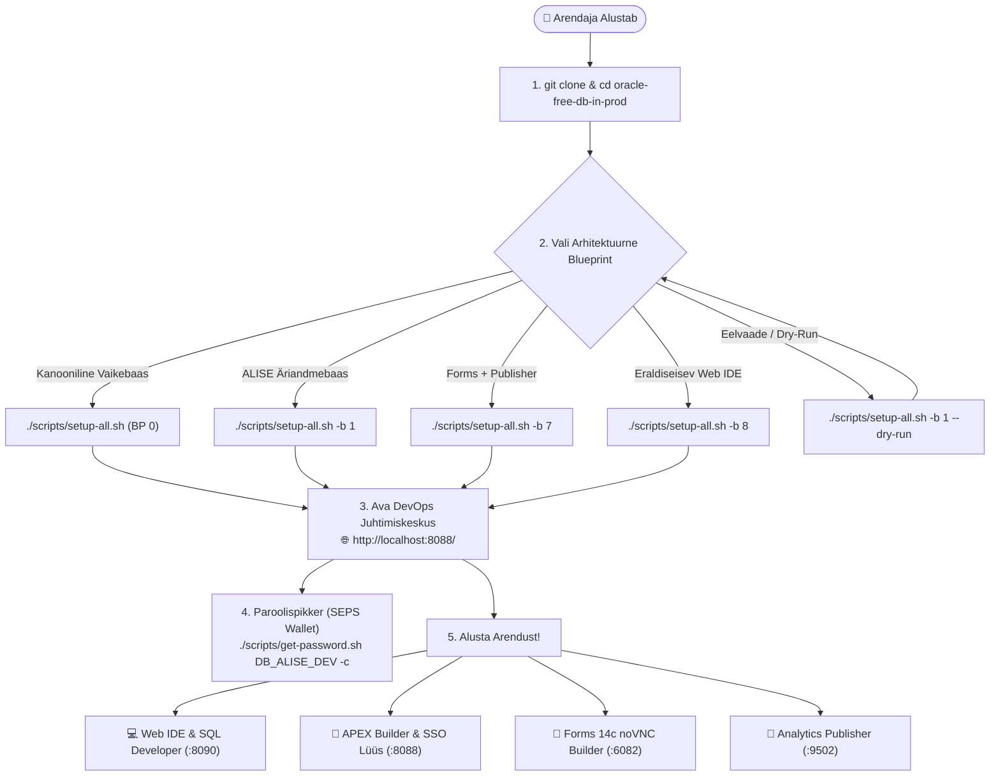
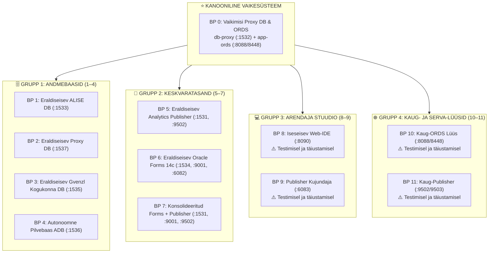

[ 🇬🇧 English ](../../README.md) | [ 🇪🇪 Eesti ](README.md) | [ 🇫🇮 Suomi ](../fi/README.md) | [ 🇸🇪 Svenska ](../sv/README.md) | [ 🇱🇻 Latviešu ](../lv/README.md) | [ 🇱🇹 Lietuvių ](../lt/README.md)

# Oracle DevOps Platvorm (Eesti Juhend)

> **Toodangukõlblik, litsentsitasudeta (0 €) ja 100% paroolivaba (SEPS Wallet) Oracle 23ai, APEX SSO Lüüs, Forms 14c, Publisher ja Web IDE arendus- ning DevOps platvorm.**

---

## ⚡ 60-Sekundi Kiirstart

```bash
# 1. Klooni repositoorium ja liigu kausta
git clone https://github.com/allanlahe/oracle-free-db-in-prod.git && cd oracle-free-db-in-prod

# 2. Käivita kanooniline vaikesüsteem (Blueprint 0: Default Proxy DB & ORDS Gateway)
./scripts/setup-all.sh --lang et

# Või käivita spetsiaalne ärirakenduse andmebaas (Blueprint 1: Standalone ALISE DB)
./scripts/setup-all.sh -b 1 --lang et

# 3. Vaata paroole, URL-e ja lõikelaua spikrit (või ava Dev Hub aadressil http://localhost:8088/)
./scripts/get-password.sh
```

> [!TIP]
> **Windowsi Giti Seadistus (Reegel 13):**
> Enne Windowsis kloonimist seadista Git toetama pikki failiteid ja kaitsma NTFS failisüsteemi:
> ```powershell
> git config --global core.protectNTFS true
> git config --global core.longpaths true
> git config --global core.autocrlf input
> ```

---

## 🗺️ Uue Arendaja Onboarding Teekond



---

## 🏗️ Arhitektuuri Blueprintid (12 Kanoonilist Moodulit)

Oracle Free DB in Prod organiseerib oma arhitektuuri **12 kanoonilisse modulaarsesse blueprinti (0 .. 11)**, mis jagunevad nelja ettevõtte taseme kihti:



---

## 🧩 Puhas Blueprintide & YAML Profiilide Arhitektuur (Reegel 11)

Täieliku modulaarsuse ja kõvakodeeringute vältimiseks kehtib järgmine arhitektuur:

1. **Ülipuhtad Blueprintid (`config/blueprints/.env.*`):**
   - Blueprintid deklareerivad **ainult positiivseid viiteid vajaminevatele profiilidele**:
     ```bash
     DB_ALISE=db-alise-oracle
     ORDS_PROFILE=ords-standard
     WEB_IDE_PROFILE=web-ide-standard
     ```
   - Blueprint ei sisalda kunagi porte, paroole ega negatiivseid `SKIP_*` muutujaid.
   - Blueprint määrab, *millised konteinerid luuakse*.

2. **Kogu konfiguratsioon YAML Profiilides (`config/profiles/**/*.yaml`):**
   - 100% domeenispetsiifikast asub YAML profiilides:
     - Konteineri tõmmised, mälulimiidid, host-pordid (`db_port`, `http_port`).
     - PDB vaiketeenused (`default_service: FREEPDB1`).
     - Tabeliruumid, kvoodid, rollid ja kasutajad.
     - **Andmebaaside seosed:** ORDS basseinide seosed ja mitme andmebaasi ristühendused deklareeritakse YAML profiilides.

3. **Kasutaja laiendatavus: Uute blueprintide lisamine 1-haaval:**
   - Kasutaja või AI saab lisada uue blueprinti igal ajal, luues faili:
     ```bash
     config/blueprints/.env.<ID>-<kohandatud-nimi>
     ```
   - Orkestreerija (`setup-all.sh`, `deploy-blueprint.sh` ja Dev-Hub) tuvastab uue blueprinti automaatselt ilma koodimuudatusteta!

---

## 🌐 Dev Hub (`http://localhost:8088/`) — Asünkroonne Juhtimiskeskus (Reegel 12)

Dev Hub toimib tervikliku juhtpaneelina teenuste ja blueprintide haldamiseks:

- **Asünkroonne tööde haldus:** Paigalduse, aktiveerimise ja taaskäivituse operatsioonid käivitatakse taustal (`ACTIVE_TASKS`) läbi `dev-hub-bridge.py`.
- **Null brauseri katkestust (Timeout):** 300-sekundiline brauseri AbortController viga on täielikult elimineeritud.
- **Reaalajas terminali logi:** Logifaili viimased read (`/api/task/status?task=...`) voogedastatakse otse modaalaknasse.
- **Mitmetasemelised olekud:**
  - ⏳ **`status-installing` (Pulseeriv merevaikukollane):** Paigaldus või uuestiehitus aktiivselt töös.
  - 🟡 **`status-init` (Kollane):** Konteiner töötab, andmebaas initsialiseerub.
  - 🟢 **`status-online` (Roheline):** Andmebaas terve, SEPS Wallet ühendatud ja veebilingid vastavad.
- **Edasilükatud `.active_blueprint` lukk:** Salvestatakse kettale rangelt alles pärast 100% verifitseerimise õnnestumist.
- **1-Kliki Parooli Kopeerimine:** Paroolid dekrüpteeritakse vajaduspõhiselt otse mälus Oracle SEPS Walletist.
- **ORDS Nutivärava Paneel:** Reaalajas ülevaade keskse ORDS konteineri tervisest, dünaamilistest ühenduste poolidest, reageerimisajast (ms) ja 1-kliki sünkroonimisest.
- **Automaattestimise Keskus & Kvaliteedivärav (🧪 Testimine):** Interaktiivne testikomplektide käivitaja (Unit, Integration, Live Platform, i18n Pariteet, Failinimede Portatiivsus), sisseehitatud reaalajas terminalivoog (ilma blokeerivate hüpikakendeta), Markdown testiaruannete kahepaaniline lugeja, koodikaetuse sirvija ja püsiv käivituste ajalugu. Vaata [docs/et/testing-framework-and-devhub.md](testing-framework-and-devhub.md).

---

## 🌐 ORDS Nutivärav ja Autonoomne Mikroregistraator (Variant 3)

Platvorm lahendab mitme blueprinti vahelised pordikonfliktid ja mitmekordsed ORDS konteinerid läbi **Nutivärava ja Autonoomse Mikroregistraatori mustri**:

- **Keskne Tuumvärav:** Üksainus `app-ords` konteiner töötab portidel 8088 (HTTP) ja 8448 (HTTPS), teenindades kõiki aktiivseid andmebaase.
- **Autonoomne Mikroregistraator:** Iga andmebaas omab oma ühenduste pooli konfiguratsiooni (`config/ords/proxy/databases/<pool_name>/pool.xml`). Andmebaasi käivitamisel registreeritakse tema pool automaatselt ORDS-i.
- **Virtuaalsed Teenuselipikud (`ords/<pool>`):** Blueprintid deklareerivad virtuaalsed märgid (nt `ords/proxy`, `ords/alise`, `ords/proxy_standalone`). Dev Hub hindab valmisolekut nii konteineri kui ka HTTP vastuse latentsuse alusel.
- **Poolide Halduse Käsurida (CLI):**
  ```bash
  # Kontrolli aktiivseid poole, sihtbaase ja latentsust:
  ./scripts/internal/manage-ords-pools.sh status

  # Väljasta masinloetav JSON monitooringu ja bridge jaoks:
  ./scripts/internal/manage-ords-pools.sh status json

  # Sünkrooni poolid töötavate andmebaasi konteineritega:
  ./scripts/internal/manage-ords-pools.sh sync
  ```

---

## 🔑 Kus On Minu Parool? (SEPS Wallet Spikker)

Kõik credentials-andmed genereeritakse krüptograafiliselt ja talletatakse turvaliselt **Oracle SEPS Auto-Login Walletis** ja Podman Secret Store'is.

```bash
# Vaata täielikku kredentsiaalide tabelit:
./scripts/get-password.sh

# Kopeeri arendaja parool otse lõikelauale:
./scripts/get-password.sh DB_ALISE_DEV -c

# Ühendu andmebaasiga SQLcl kaudu ILMA parooli sisestamata:
sql /@DB_ALISE_DEV
```

---

## ⚡ Kiirendatud ~15s Taastamine & Automaatne Versioonikontroll

Oracle Free DB in Prod sisaldab **kuldsnapshottide mootorit**, mis vähendab taaskäivituse aega **~6–8 minutilt ~15 sekundile**:

```bash
# Taasta baastaseme kuldsnapshot ~15-30 sekundiga:
./scripts/snapshots/restore-golden-snapshots.sh --force
```

---

## 🚀 Kiirkäskude Spikker

```bash
# 1. Käivita kanooniline vaike-blueprint (BP 0) või konkreetne blueprint:
./scripts/setup-all.sh --lang et
./scripts/setup-all.sh -b 1 --lang et
./scripts/setup-all.sh -b 7 --lang et

# 2. Vaata kredentsiaale ja kopeeri parool (-c):
./scripts/get-password.sh
./scripts/get-password.sh DB_ALISE_DEV -c

# 3. Kontrolli veebiteenuste aadresse ja Walleti ühendusi:
./scripts/check-urls.sh
./scripts/check-wallet.sh

# 4. Käivita automaatne brauseri logimistest:
./scripts/test-browser-login.sh

# 5. Käivita mitmekeelsuse kontrolltest (Reegel 9: EN, ET, FI, SV, LV, LT):
./tests/test-multilingual-support.sh

# 6. Kuldsnapshottide elutsükkel (~15s taastus vs täisrebuild):
./scripts/snapshots/create-golden-snapshots.sh
./scripts/snapshots/restore-golden-snapshots.sh --force
./scripts/reset-all.sh -y && ./scripts/setup-all.sh -y

# 7. Puhasta logid ja vanad snapshotid:
./scripts/clean-logs.sh --older-than-hours=20 -y
./scripts/clean-logs.sh -y
./scripts/snapshots/clean-golden-snapshots.sh -y

# 8. Kontrolli failinimede platvormiülest ühilduvust (Reegel 13):
./tests/unit/test-filename-portability.sh
```

---

## 🧭 Oracle APEX DevHub Rakendus & APEXlang (TO-BE Teekaart)

> [!NOTE]
> **TO-BE Teekaart:** Lisaks iseseisvale HTML Dev Hubile (`docs/dev-hub.html`) on tulevikus plaanis täielikult deklaratiivne andmebaasisisene **Oracle APEX rakendus (App 101: DevHub)** [Oracle APEXlang DSL](https://docs.oracle.com/en/database/oracle/apex/26.1/apxln/) baasil kaustas [`applications/`](../../applications/README.md). Kogu baastaristu, APEXlang kompilaatorid ja tarneahelad on ette valmistatud:

- **Zero-Footprint DB Dokumendid:** Dokumentatsiooni ei dubleerita andmebaasi tabelitesse CLOB-idena, vaid kerge lokaalne REST sild (`scripts/internal/dev-hub-bridge.py` pordil 8089) loeb tõlgitud Markdowni otse Gitist.
- **Automatiseeritud CI/CD:** GitHub Actions töövoog [`.github/workflows/deploy-devhub-apexlang.yml`](../../.github/workflows/deploy-devhub-apexlang.yml) koos kohaliku offline emulatsiooniga `./scripts/test-local-ci.sh deploy-devhub-apexlang.yml --dry-run`.
- **Testkomplekt:** Käivita `./tests/unit/test-apex-devhub.sh` testi ettevalmistuse kontrollimiseks.

---

## 📑 Spetsiaalsed Juhendid

- 🛡️ **[docs/security.md](../../docs/security.md) | [docs/et/security.md](security.md):** **Turvalisuse & SSO Arhitektuuri Juhend** — Zero-Trust paroolide haldus, Azure Entra-ID SSO ja 5-astmeline TLS.
- 🏗️ **[docs/db-profiles-and-topology.md](../../docs/db-profiles-and-topology.md):** **Andmebaasi Profiilide ja Topoloogia Juhend** — Puhtad blueprintid, YAML profiilid ja dünaamilised pordid.
- 🚀 **[docs/forms-to-apex-migration-guide.md](../../docs/forms-to-apex-migration-guide.md):** Oracle Forms to APEX Moderniseerimine ja Migratsioon.
- 📐 **[docs/forms-setup.md](../../docs/forms-setup.md):** Oracle Forms 14c Juhend.
- 📑 **[docs/publisher-setup.md](../../docs/publisher-setup.md):** Analytics Publisher Juhend.
- 💻 **[docs/web-ide-artifactory.md](../../docs/web-ide-artifactory.md):** Web IDE Juhend.
- 🌐 **[docs/ords-profiles-lifecycle.md](../../docs/ords-profiles-lifecycle.md):** ORDS Profiilide ja Elutsükli Juhend.
- ☁️ **[docs/remote-multicloud-setup-guide.md](../../docs/remote-multicloud-setup-guide.md):** Kaug-Hübriidpilve Paigalduse Juhend.
- 🌐 **[docs/dev-hub.html](../../docs/dev-hub.html):** Arendaja ja DevOps Juhtimiskeskus 6 keeles.
- 📊 **[config/blueprints/README.md](../../config/blueprints/README.md):** 12 kanoonilise blueprinti täismaatriks.
