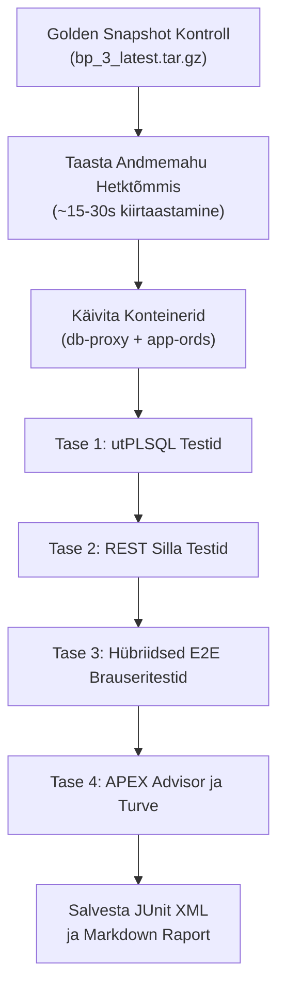

# 🧪 Testimisplaan: Oracle APEX DevHub Rakendus ja CI/CD Konveier

[ 🇬🇧 English ](../apex-devhub-test-plan.md) | [ 🇪🇪 Eesti ](apex-devhub-test-plan.md) | [ 🇫🇮 Suomi ](../fi/apex-devhub-test-plan.md) | [ 🇸🇪 Svenska ](../sv/apex-devhub-test-plan.md) | [ 🇱🇻 Latviešu ](../lv/apex-devhub-test-plan.md) | [ 🇱🇹 Lietuvių ](../lt/apex-devhub-test-plan.md)

---

## 1. Ülevaade ja Eesmärgid

Käesoleva testimisplaani eesmärk on kehtestada range, mitmetasandiline verifitseerimisstrateegia **Oracle APEX DevHub rakendusele (Rakendus 101)**, selle PL/SQL mootorile (`DEVHUB.DEV_HUB_PKG`), lokaalsele REST dokumentatsioonisillale ning automatiseeritud SQLcl APEXlang CI/CD konveierile.

### Peamised Testimiseesmärgid:
1. **Funktsionaalne Vastavus:** Tagada 100% funktsionaalsuse samaväärsus senise staatilise Dev Hubiga (`docs/dev-hub.html`) kõigi 6 lehe lõikes.
2. **Deterministlik Andmete Isolatsioon:** Välistada testide omavaheline saastumine, kasutades ~15–30s Golden Snapshot taastamist (`bp_3_latest.tar.gz`) enne mahukate regressioonitestide käivitamist.
3. **Mitmetasandiline Kaetus:** Kombineerida andmebaasitaseme utPLSQL testid, REST integratsioonikontrollid, hübriidsed brauseri E2E töövood (Playwright + curl sessioonide simulaator) ja APEX Advisor koodikvaliteedi audit.
4. **Zero-Trust Turvalisus:** Tõestada, et autentimisandmed ei leki kunagi HTML DOM-i, URL-i parameetritesse ega küpsistesse, järgides rangelt Oracle SEPS Wallet printsiipe.
5. **Pidevintegratsioon (CI/CD):** Tagada sujuv kohalik offline simuleerimine (`./scripts/test-local-ci.sh`) ja automatiseeritud GitHub Actions töövoog (`.github/workflows/deploy-devhub-apexlang.yml`).

---

## 2. Testipüramiid ja Skoobimaatriks

```
                      ┌─────────────────────────┐
                      │ Tase 4: Kvaliteet/Turve │  APEX Advisor CLI,
                      │ (APEX Advisor, SSP)     │  Session State Protection
                      ├─────────────────────────┤
                      │ Tase 3: Brauseri E2E    │  Playwright DOM/Mermaid UI
                      │ (Hübriid: Curl + PW)    │  + Kiire Curl sessioonitest
                      ├─────────────────────────┤
                      │ Tase 2: Integratsioon   │  REST Sild (Port 8089),
                      │ (REST, UTL_HTTP, ORDS)  │  UTL_HTTP Päringud, ORDS
                      ├─────────────────────────┤
                      │ Tase 1: Ühik / DB       │  utPLSQL Paketi Testid,
                      │ (DEV_HUB_PKG, Tabelid)  │  Tabelite Kitsendused
                      └─────────────────────────┘
```

| Tase | Testitav Komponent | Tööriistad | Käivitussagedus | Oodatav Kestus |
| :--- | :--- | :--- | :--- | :--- |
| **Tase 1** | `DEVHUB.DEV_HUB_PKG`, Tabelid, Seeme | **utPLSQL v3** / SQLcl | Iga commit, CI/CD | ~2–5 sekundit |
| **Tase 2** | REST Sild (8089), `UTL_HTTP`, ORDS | **curl**, Python, SQLcl | CI/CD, Paigalduse järel | ~3–8 sekundit |
| **Tase 3** | Kasutajavood, Lehed 1–6, Mermaid | **Playwright** + Bash/curl | Igaöine, PR kontroll | ~15–30 sekundit |
| **Tase 4** | APEX Kvaliteet, SSP, SQL-süstid | **APEX Advisor CLI** | PR kontroll, CI/CD | ~5–10 sekundit |

---

## 3. Testitasemed ja Testijuhtumid

### 3.1. Tase 1: Andmebaasi Ühiktestimine (utPLSQL)
Sihtmärk: `DEVHUB` skeemi objektid `FREEPDB1` konteineris.

- **TC-DB-01: Skeemi ja Kitsenduste Kontroll**
  - Primaarvõtmete, unikaalsuskitsenduste ja seoste kontroll tabelitel `DEVHUB_SERVICES`, `DEVHUB_TOPOLOGY`, `DEVHUB_BLUEPRINTS`, `DEVHUB_DOC_INDEX`, `DEVHUB_COMMANDS`, `DEVHUB_BENCHMARKS`, `DEVHUB_CONFIG`.
- **TC-DB-02: `DEV_HUB_PKG.check_single_service` ja Staatuste Uuendamine**
  - Aktiivse otspunkti pärimisel salvestatakse `ONLINE`, arvutatakse täpne `response_time_ms` ning käsitletakse HTTP 303 ümbersuunamisi ilma sertifikaadiveata (ORA-29024 vältimine).
- **TC-DB-03: `DEV_HUB_PKG.refresh_all_service_statuses` Hulgikontroll**
  - Kõigi aktiivsete teenuste järjestikune pärimine; kinnitus, et kõik väljad uuenevad idempotentselt ilma lukustusteta.
- **TC-DB-04: `DEV_HUB_PKG.get_doc_markdown_rest` Tõrketaluvus**
  - Kui sild töötab: tagastatakse korrektne pealkirjaga Markdown.
  - Kui sild on maas või küsitakse tundmatut ID-d: tagastatakse viisakas teade ilma käsitlemata erindita.
- **TC-DB-05: `DEV_HUB_PKG.sync_benchmarks_from_json` JSON Parsimine**
  - Korrektse JSON-i puhul lisatakse/uuendatakse (`MERGE`) andmed tabelis `DEVHUB_BENCHMARKS`. Vigase JSON-i puhul erind summutatakse turvaliselt.
- **TC-DB-06: `DEV_HUB_PKG.authenticate_local_dev` Turvapiirang**
  - `localhost` / `127.0.0.1` puhul: lubab sisselogimise.
  - Välise IP või võltsitud hosti puhul: viskab vea `ORA-20001: Automaatne sisselogimine on lubatud ainult lokaalses DEV keskkonnas`.

---

### 3.2. Tase 2: Integratsiooni ja REST Silla Testimine
Sihtmärk: Hosti ja konteineri vaheline REST dokumentatsioonisild (`scripts/internal/dev-hub-bridge.py`) pordil `8089` ja ORDS.

- **TC-INT-01: Silla Tervis ja Kataloogipäring**
  - `GET http://localhost:8089/api/health` tagastab HTTP 200 `{"status": "ok"}`.
  - `GET http://localhost:8089/api/catalog` tagastab kõigi 11 dokumentatsiooni faili nimekirja.
- **TC-INT-02: 6 Keeles Markdowni Lugemine**
  - Faili `readme` lugemine 6 keelekoodiga (`en`, `et`, `fi`, `sv`, `lv`, `lt`). Keeleliste päiste ja sisu verifitseerimine.
- **TC-INT-03: Konteinerisisene Nime- ja Pordilahendus**
  - Kontroll, et `db-proxy` lahendab edukalt hosti nime `http://host.containers.internal:8089`.
- **TC-INT-04: Andmebaasisisese HTML Konverteerimise Töökindlus**
  - Kinnitada, et sissetulev Markdown teisendatakse APEX-i vahenditega korrektseteks HTML märgenditeks.

---

### 3.3. Tase 3: Brauseri ja UI End-to-End Testimine (Hübriid: Playwright + Curl)
Sihtmärk: Oracle APEX Rakendus 101 aadressil `https://localhost:8448/ords/r/proxy_workspace/devhub/`.

#### Kiire Headless Mootor (Bash/Curl Sessioonide Simulaator):
- **TC-E2E-01: Autentimata Päringu Suunamine**
  - Päring `/devhub/home` suunab koodiga HTTP 302 lehele `/devhub/login?session=...`.
- **TC-E2E-02: 1-Kliki Arendaja Sisselogimine**
  - Sisselogimisvormi esitamine arendaja kontoga; valideeritakse `ORA_WWV_APP_101` küpsise loomine ja suunamine lehele 1 (`home`).
- **TC-E2E-03: Kõigi Lehtede Kättesaadavus**
  - Autenditud sessiooniga päritakse lehti 1, 2, 3, 4, 5, 6; kinnitatakse vastuskood HTTP 200.

#### DOM ja Visuaalne Mootor (Node.js Playwright):
- **TC-E2E-04: Leht 1 (Teenuste ja Tervise Tabel)**
  - Tuvastada 8 teenuse staatusemärgid (`ONLINE` roheline, `OFFLINE` punane). Värskenduse nupu vajutamisel uueneb aruanne dünaamiliselt.
- **TC-E2E-05: Leht 2 (Arhitektuuri Hübriidvaade)**
  - Tab 1 (Natiivne APEX Puu + Kaardid): Puuvaade ja konteinerite kaardid.
  - Tab 2 (Mermaid Arhitektuur): Mermaid.js renderdab DOM-i korrektse SVG diagrammi ilma süntaksivigadeta.
- **TC-E2E-06: Leht 3 (Blueprintide Sirvija)**
  - Valides Blueprinti raadionupu/rippmenüü kaudu, filtreeritakse detailvaate kaart dünaamiliselt. 1-kliki kopeerimisnupp kopeerib CLI käsu lõikelauale.
- **TC-E2E-07: Leht 4 (Dünaamiline Dokumentatsiooni Luger)**
  - Keele vahetamine (English, Eesti, Suomi, Svenska, Latviešu, Lietuvių) uuendab sisu AJAX päringuga ilma lehe täieliku taaslaadimiseta. Andmebaasi kettale ei teki CLOB-e.
- **TC-E2E-08: Leht 5 (DevOps Käsukeskus)**
  - Kategooriate kaupa paigutatud käsureakaartide kuvamine (Elutsükkel, Hetktõmmised, Paroolid, Diagnostika).
- **TC-E2E-09: Leht 6 (Jõudluse ja Mõõdikute Töölaud)**
  - Paigalduse ja taastamise live-mõõdikud kuvavad ajaloolisi keskmisi (min, avg, max).

---

### 3.4. Tase 4: Kvaliteedi, APEX Advisori ja Turvalisuse Audit
Sihtmärk: APEX rakenduse koodibaas ja metaandmete sõnastik.

- **TC-SEC-01: APEX Advisor CLI Käivitamine**
  - APEX Advisori käivitamine Rakendusele 101 läbi SQLcl / PL/SQL (`APEX_260100.WWV_FLOW_ADVISOR_DEV`).
  - Nõue: 0 kriitilist viga järgmistes kategooriates:
    - Aegunud atribuudid või komponendid.
    - Katkised leheharud või puuduvad sihtlehed.
    - Puuduvad autoriseerimisskeemid kaitstud komponentidel.
    - SQL süntaksivead aruannete regioonides.
- **TC-SEC-02: Session State Protection (SSP) Audit**
  - Veenduda, et kõigil tundlikel lehe väljadel on kehtestatud kontrollsummad. Whitelistitud elementidel (`P4_DOC_ID`, `P4_LANG`, `P3_BLUEPRINT_ID`) on nõuetekohane põhjendus kommentaaris.
- **TC-SEC-03: Zero-Trust Paroolide Lekke Kontroll**
  - Veenduda, et DOM-is, URL-ides ega võrgulogides ei esine andmebaasi ega Walleti paroole.

---

## 4. Testikeskkond ja Andmete Isolatsioon (Golden Snapshotid)

Testide absoluutse determinismi tagamiseks ja "ebastabiilsete testide" (flaky tests) vältimiseks:



### Isolatsioonireeglid:
1. **Testieelne Taastamine:** Enne mahukaid teste käivitatakse `./scripts/snapshots/restore-golden-snapshots.sh --auto --yes -b 3 --no-rotate`, tagades 100% puhta algseisu.
2. **Efemeersus:** CI/CD konteinerid käivitatakse `--rm` lipuga, hävitades ajutised puhvrid ja mälu kohe pärast testi lõppu.

---

## 5. Automatiseerimine, CI/CD ja Raporteerimine

### 5.1. Ühendatud Testikäivitaja CLI (`scripts/test-apex-suite.sh`)
```bash
# Käivita täielik testikomplekt (Tasemed 1 kuni 4):
./scripts/test-apex-suite.sh

# Käivita ainult konkreetne tase:
./scripts/test-apex-suite.sh --tier db       # Tase 1 (utPLSQL)
./scripts/test-apex-suite.sh --tier rest     # Tase 2 (REST Sild)
./scripts/test-apex-suite.sh --tier e2e      # Tase 3 (Playwright/curl)
./scripts/test-apex-suite.sh --tier advisor  # Tase 4 (APEX Advisor)

# Kiire CI suitsutest ilma graafilise brauserita:
./scripts/test-apex-suite.sh --fast
```

### 5.2. Väljundraportid:
1. **JUnit XML Raport:** Salvestatakse asukohta `metrics/junit-apex-devhub.xml` CI/CD tööriistade tarbeks.
2. **Markdown Koondraport:** Salvestatakse asukohta `tests/reports/apex_devhub_test_report.md`.
3. **Kestuse Mõõdikud:** Salvestatakse failidesse `metrics/setup_benchmarks.json` ja `metrics/setup_benchmarks.env` (Reegel 1).

---

## 6. Läbimiskriteeriumid ja Heakskiidu Väravad

Tarkvaraversioon loetakse toodangukõlblikuks ainult siis, kui:
- ✅ **100% utPLSQL testidest õnnestuvad** (0 viga, 0 kukkumist).
- ✅ **100% REST dokumentatsioonisilla testidest õnnestuvad** kõigis 6 keeles.
- ✅ **100% E2E brauseri voogudest läbitakse edukalt** ilma JavaScripti vigadeta.
- ✅ **APEX Advisor tagastab 0 Viga**.
- ✅ **Testiartefaktides ega logides ei leidu paroole** (Zero-Trust).
- ✅ **Jõudlusmõõdikud jäävad seatud piiridesse** (teenuse kontroll < 100 ms, lehe laadimine < 2 s).
