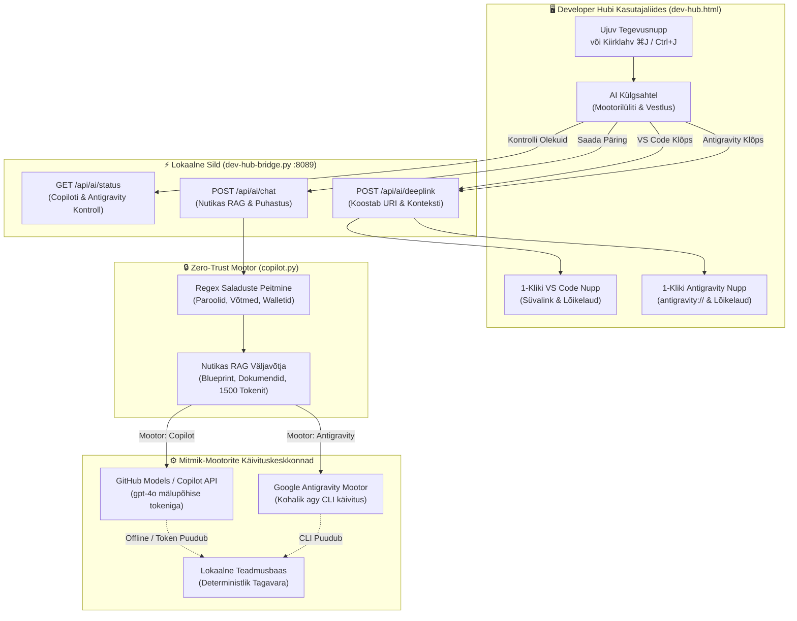

[ 🇬🇧 English ](../devhub-copilot-assistant.md) | [ 🇪🇪 Eesti ](devhub-copilot-assistant.md) | [ 🇫🇮 Suomi ](../fi/devhub-copilot-assistant.md) | [ 🇸🇪 Svenska ](../sv/devhub-copilot-assistant.md) | [ 🇱🇻 Latviešu ](../lv/devhub-copilot-assistant.md) | [ 🇱🇹 Lietuvių ](../lt/devhub-copilot-assistant.md)

# 🤖 Dev Hub mitmik-mootoriga AI assistent (Copilot + Antigravity) ja Zero-Trust RAG juhend

Käesolev juhend dokumenteerib Developer Hubi (`docs/dev-hub.html`) integreeritud **mitmik-mootoriga AI assistendi**, mis toetab nii **GitHub Copilotit** kui ka **Google Antigravityt**, selle Reegel 5 Zero-Trust turvakontrolle, võrguühenduseta (offline) lokaalset teadmusbaasi ning 1-klikiga eksporti nii VS Code Copilot Chati kui ka Antigravity töölauarakendusse.

---

## 🏛️ 1. Tehniline arhitektuur ja andmevoog

Assistent kasutab hübriidset mitmik-mootori arhitektuuri: kättesaadav igalt Dev Hubi vahekaardilt kiirklahviga `⌘J` / `Ctrl+J`, võimaldades mugavat teenusepakkuja vahetust GitHub Copiloti ja Google Antigravity vahel:

---

## 🔒 2. Zero-Trust turvalisus ja Reegel 5 täitmine

Et tagada ettevõtte rangetele turvanõuetele vastavus:
1. **Ei salvestata kettale:** Autentimistokenid ja käsurea interaktsioonid toimuvad mälupõhiselt ilma kettale salvestamata.
2. **Dünaamiline redigeerimine:** Kõik kasutaja päringud ja platvormi dokumentatsiooni väljavõtted läbivad funktsiooni `sanitize_text`:
   - Andmebaasi paroolid (`password: ...`, `IDENTIFIED BY ...`)
   - SEPS Walleti asukohad (`cwallet.sso`, `ewallet.p12`)
   - SSH ja TLS privaatvõtmed (`BEGIN PRIVATE KEY`)
   - GitHubi isiklikud pääsuload (`ghp_*`, `github_pat_*`)

---

## ⌨️ 3. Arendaja kiirklahvid ja võimalused

| Toiming | Kiirklahv / Käivitaja | Kirjeldus |
| :--- | :--- | :--- |
| **Ava / Sule Assistent** | `⌘J` (macOS) / `Ctrl+J` (Windows/Linux) | Avab või sulgeb AI sahtli mistahes Dev Hubi vahekaardilt. |
| **Mootori vahetamine** | Päise nupud `[ GitHub Copilot | Google Antigravity ]` | Lülitab aktiivse mootori (valik salvestub `localStorage`'is). |
| **Täisekraan / Taasta** | Ülal paremal nupp `⛶` | Laiendab sahtli täisekraanile koodi mugavamaks vaatlemiseks. |
| **Küsimuse saatmine** | `Enter` klahv | Edastab päringu valitud AI mootorile. |
| **Ava VS Code'is** | Klõps nupul `Ava VS Code Copilotis` | Kopeerib täieliku RAG konteksti lõikelauale ja avab `vscode://github.copilot/chat`. |
| **Ava Antigravitys** | Klõps nupul `Ava Antigravitys` | Kopeerib täieliku RAG konteksti lõikelauale ja avab `antigravity://chat` (või käivitab töölauarakenduse). |

---

## 🔄 4. 3-Tasemeline võrguühenduseta tagavarasüsteem

Kui arendaja arvutil puudub internetiühendus:
1. **Tase 1 (Ühendatud):** Pöördub GitHub Models (`gpt-4o`) poole või käivitab kohaliku `agy` CLI.
2. **Tase 2 (CLI Tagavara):** Kasutab lokaalseid CLI abivahendeid.
3. **Tase 3 (Lokaalne Offline):** Genereerib kohese deterministliku vastuse repo dokumentatsiooni põhjal.
